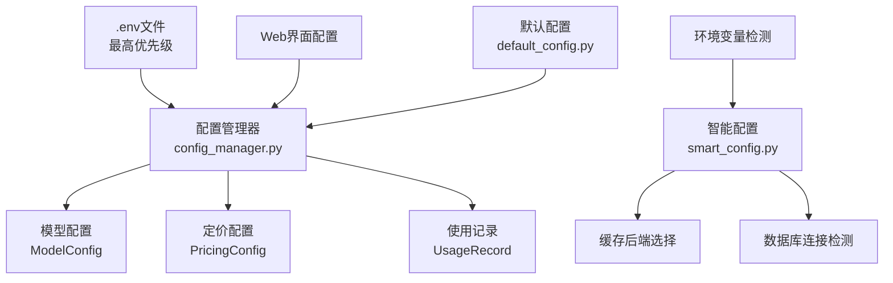
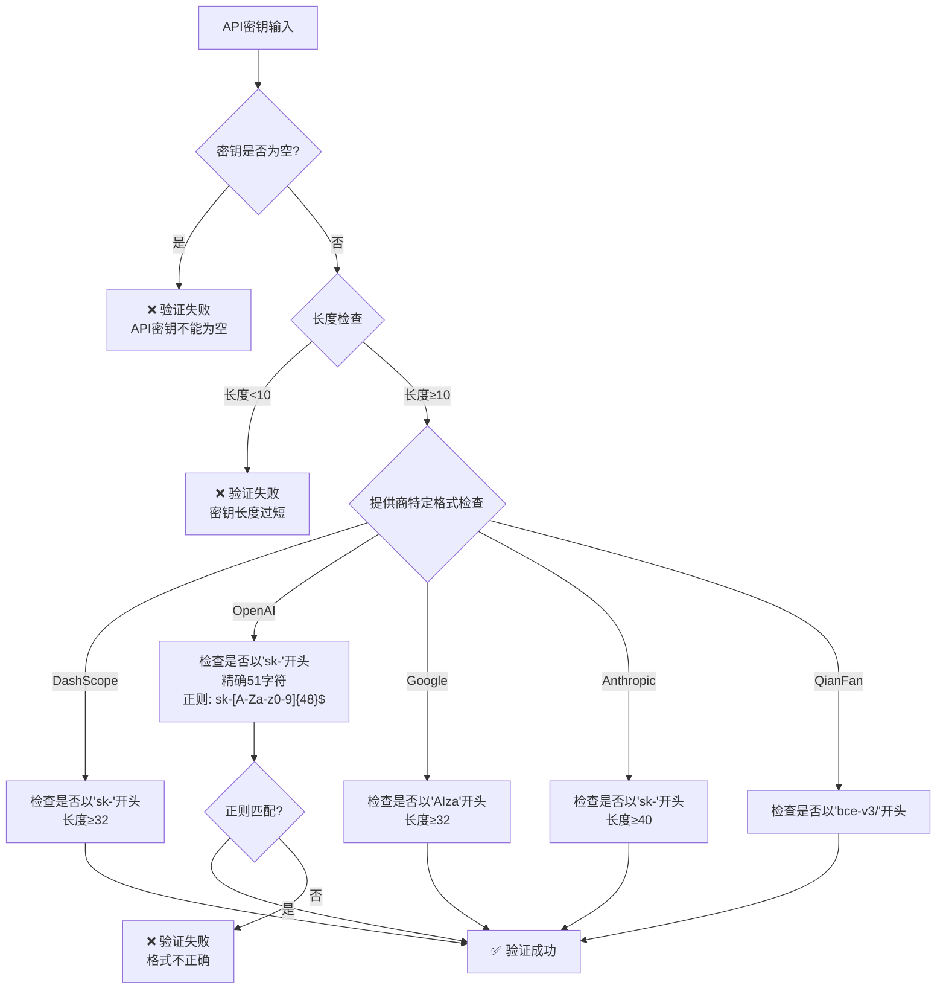
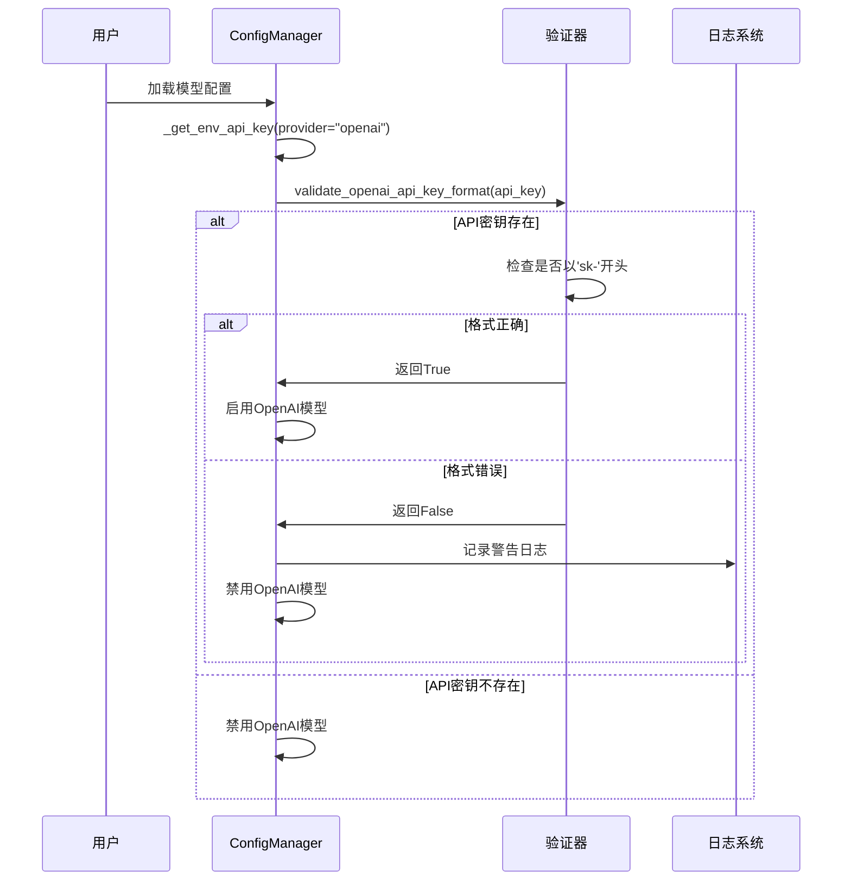
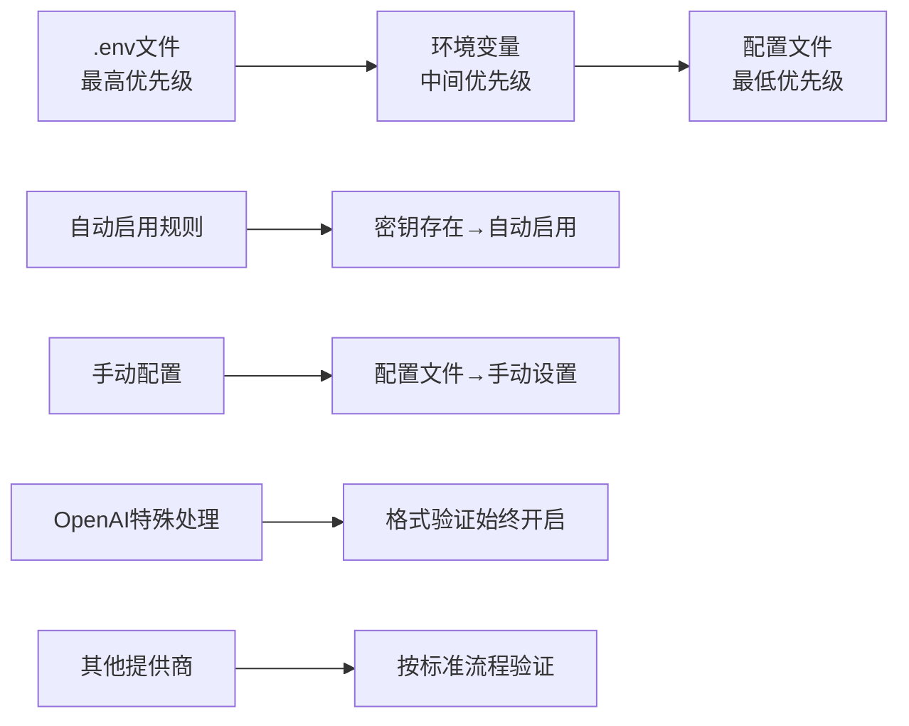
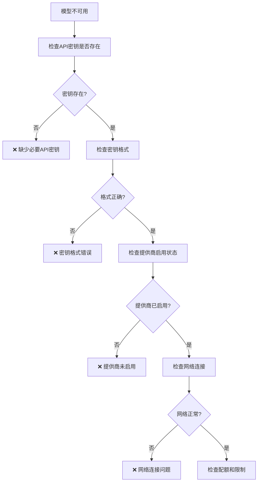

# LLM API密钥配置问题故障排除指南

<cite>
**本文档引用的文件**
- [config_manager.py](file://tradingagents/config/config_manager.py)
- [smart_config.py](file://scripts/validation/smart_config.py)
- [default_config.py](file://tradingagents/default_config.py)
- [api_checker.py](file://web/utils/api_checker.py)
- [sidebar.py](file://web/components/sidebar.py)
- [env_utils.py](file://tradingagents/config/env_utils.py)
- [demo_dashscope.py](file://examples/dashscope_examples/demo_dashscope.py)
- [main.py](file://cli/main.py)
</cite>

## 目录
1. [简介](#简介)
2. [API密钥配置架构](#api密钥配置架构)
3. [支持的LLM提供商及密钥格式](#支持的llm提供商及密钥格式)
4. [密钥验证机制](#密钥验证机制)
5. [配置优先级与加载顺序](#配置优先级与加载顺序)
6. [常见问题诊断](#常见问题诊断)
7. [故障排除步骤](#故障排除步骤)
8. [最佳实践建议](#最佳实践建议)
9. [监控与维护](#监控与维护)

## 简介

TradingAgents框架支持多个LLM提供商，包括OpenAI、DashScope（阿里百炼）、Google AI、Anthropic等。正确的API密钥配置是系统正常运行的关键。本指南将帮助您解决API密钥配置过程中遇到的各种问题。

## API密钥配置架构

### 配置层次结构



**图表来源**
- [config_manager.py](file://tradingagents/config/config_manager.py#L1-L50)
- [smart_config.py](file://scripts/validation/smart_config.py#L1-L50)

### 核心配置组件

系统采用分层配置架构，包含以下核心组件：

- **ModelConfig**: 定义每个模型的配置信息
- **PricingConfig**: 管理不同模型的定价信息
- **UsageRecord**: 跟踪API使用情况和成本
- **ConfigManager**: 主配置管理器

**章节来源**
- [config_manager.py](file://tradingagents/config/config_manager.py#L30-L50)

## 支持的LLM提供商及密钥格式

### 支持的提供商列表

| 提供商 | 环境变量 | 密钥格式要求 | 特殊说明 |
|--------|----------|--------------|----------|
| 阿里百炼 (DashScope) | `DASHSCOPE_API_KEY` | 以`sk-`开头，长度≥32 | 推荐使用 |
| OpenAI | `OPENAI_API_KEY` | 以`sk-`开头，精确51字符 | 需要国外API |
| Google AI | `GOOGLE_API_KEY` | 以`AIza`开头，长度≥32 | 需要国外API |
| Anthropic | `ANTHROPIC_API_KEY` | 以`sk-`开头，长度≥40 | 需要国外API |
| DeepSeek | `DEEPSEEK_API_KEY` | 以`sk-`开头，长度≥32 | 国产大模型 |
| 文心一言 (千帆) | `QIANFAN_API_KEY` | 以`bce-v3/`开头 | OpenAI兼容 |

### 密钥格式验证规则



**图表来源**
- [api_checker.py](file://web/utils/api_checker.py#L82-L132)
- [config_manager.py](file://tradingagents/config/config_manager.py#L105-L143)

**章节来源**
- [api_checker.py](file://web/utils/api_checker.py#L82-L132)
- [sidebar.py](file://web/components/sidebar.py#L972-L992)

## 密钥验证机制

### OpenAI密钥验证详解

系统对OpenAI密钥实施严格的格式验证：



**图表来源**
- [config_manager.py](file://tradingagents/config/config_manager.py#L105-L143)

### 验证规则详解

1. **非空检查**: 确保密钥不为空
2. **前缀验证**: 检查是否以正确前缀开头
3. **长度验证**: 验证密钥长度是否符合要求
4. **格式验证**: 使用正则表达式验证完整格式

**章节来源**
- [config_manager.py](file://tradingagents/config/config_manager.py#L105-L143)

## 配置优先级与加载顺序

### 配置加载优先级



**图表来源**
- [config_manager.py](file://tradingagents/config/config_manager.py#L290-L312)

### 优先级规则详解

1. **最高优先级**: `.env`文件中的环境变量
2. **中等优先级**: Web界面配置
3. **最低优先级**: 配置文件中的默认设置

### 自动启用机制

当`.env`文件中存在有效的API密钥时，系统会自动启用相应的模型：

- **密钥存在**: 自动启用模型
- **密钥无效**: 禁用模型并记录警告
- **OpenAI特殊**: 即使密钥有效，仍需在配置中明确启用

**章节来源**
- [config_manager.py](file://tradingagents/config/config_manager.py#L290-L312)

## 常见问题诊断

### API密钥无效问题

#### 问题症状
- 模型无法使用
- 出现认证错误
- 请求被拒绝

#### 诊断步骤



**图表来源**
- [config_manager.py](file://tradingagents/config/config_manager.py#L632-L649)

### 密钥格式错误

#### 常见格式错误类型

| 错误类型 | 症状 | 解决方案 |
|----------|------|----------|
| 前缀错误 | "API密钥应以'sk-'开头" | 检查密钥前缀是否正确 |
| 长度错误 | "OpenAI密钥应为51字符" | 验证密钥长度 |
| 字符错误 | 正则匹配失败 | 检查是否有非法字符 |
| 空白字符 | 验证失败 | 移除前后空白 |

### 模型无法启用问题

#### 启用状态检查

系统提供了详细的配置状态检查功能：

```python
# OpenAI配置状态检查
openai_status = config_manager.get_openai_config_status()
print(f"API密钥存在: {openai_status['api_key_present']}")
print(f"格式正确: {openai_status['api_key_valid_format']}")
print(f"已启用: {openai_status['enabled']}")
print(f"模型可用: {openai_status['models_available']}")
```

**章节来源**
- [config_manager.py](file://tradingagents/config/config_manager.py#L632-L649)

## 故障排除步骤

### 第一步：检查API密钥配置

#### 1.1 验证环境变量

```bash
# 检查各提供商API密钥
echo "DASHSCOPE_API_KEY: $DASHSCOPE_API_KEY"
echo "OPENAI_API_KEY: $OPENAI_API_KEY"
echo "GOOGLE_API_KEY: $GOOGLE_API_KEY"
echo "ANTHROPIC_API_KEY: $ANTHROPIC_API_KEY"
echo "FINNHUB_API_KEY: $FINNHUB_API_KEY"
```

#### 1.2 检查.env文件

```python
# 检查.env文件状态
env_status = config_manager.get_env_config_status()
print(f".env文件存在: {env_status['env_file_exists']}")
print(f"API密钥配置状态: {env_status['api_keys']}")
```

**章节来源**
- [config_manager.py](file://tradingagents/config/config_manager.py#L478-L496)

### 第二步：验证密钥格式

#### 2.1 使用内置验证器

```python
# OpenAI密钥验证
from tradingagents.config.config_manager import ConfigManager
cm = ConfigManager()

# 验证OpenAI密钥格式
api_key = os.getenv("OPENAI_API_KEY")
is_valid = cm.validate_openai_api_key_format(api_key)
print(f"OpenAI密钥格式验证: {'✓ 正确' if is_valid else '✗ 错误'}")
```

#### 2.2 格式检查清单

- [ ] 以正确前缀开头（sk-, AIza, bce-v3/）
- [ ] 长度符合要求
- [ ] 无非法字符
- [ ] 无前后空白

### 第三步：检查提供商启用状态

#### 3.1 OpenAI启用状态

```python
# 检查OpenAI是否启用
is_enabled = config_manager.is_openai_enabled()
print(f"OpenAI已启用: {is_enabled}")

# 检查配置状态
status = config_manager.get_openai_config_status()
print(f"API密钥预览: {status['api_key_preview']}")
print(f"格式正确: {status['api_key_valid_format']}")
print(f"模型可用: {status['models_available']}")
```

#### 3.2 其他提供商检查

```python
# 检查其他提供商状态
providers = ['dashscope', 'google', 'anthropic']
for provider in providers:
    key = os.getenv(f"{provider.upper()}_API_KEY")
    enabled = config_manager.is_provider_enabled(provider)
    print(f"{provider}: {'✓ 已配置' if key else '✗ 未配置'}, 启用: {enabled}")
```

**章节来源**
- [config_manager.py](file://tradingagents/config/config_manager.py#L632-L649)

### 第四步：网络连接测试

#### 4.1 基础连接检查

```python
# 检查网络连通性
import requests

def test_api_connection(url, headers=None):
    try:
        response = requests.get(url, headers=headers, timeout=10)
        return response.status_code == 200
    except Exception as e:
        print(f"连接失败: {e}")
        return False

# 测试OpenAI连接
headers = {"Authorization": f"Bearer {os.getenv('OPENAI_API_KEY')}"}
connected = test_api_connection("https://api.openai.com/v1/models", headers)
print(f"OpenAI连接测试: {'✓ 成功' if connected else '✗ 失败'}")
```

### 第五步：查看详细日志

#### 5.1 启用详细日志

```python
import logging
logging.getLogger('tradingagents').setLevel(logging.DEBUG)

# 重新加载配置以触发详细日志
from tradingagents.config.config_manager import config_manager
models = config_manager.load_models()
```

#### 5.2 关键日志信息

- API密钥加载过程
- 格式验证结果
- 模型启用状态
- 错误和警告信息

**章节来源**
- [config_manager.py](file://tradingagents/config/config_manager.py#L290-L312)

## 最佳实践建议

### 密钥管理最佳实践

#### 1. 环境变量优先

```bash
# 推荐使用环境变量而非配置文件
export DASHSCOPE_API_KEY="sk-your-api-key-here"
export OPENAI_API_KEY="sk-your-api-key-here"
export GOOGLE_API_KEY="AIza-your-api-key-here"
```

#### 2. 安全存储

- 使用`.env`文件而非硬编码
- 避免将密钥提交到版本控制系统
- 定期轮换API密钥

#### 3. 配置验证

```python
# 启动时验证配置
def validate_config():
    required_keys = ['DASHSCOPE_API_KEY', 'FINNHUB_API_KEY']
    missing = [key for key in required_keys if not os.getenv(key)]
    
    if missing:
        raise ValueError(f"缺少必要API密钥: {', '.join(missing)}")
    
    # 验证OpenAI密钥格式
    openai_key = os.getenv('OPENAI_API_KEY')
    if openai_key and not ConfigManager().validate_openai_api_key_format(openai_key):
        raise ValueError("OpenAI API密钥格式不正确")
```

### 监控和告警

#### 1. 成本监控

```python
# 设置成本告警阈值
config_manager.set_cost_alert_threshold(100.0)

# 检查今日成本
stats = config_manager.get_usage_statistics(1)
today_cost = stats['total_cost']
print(f"今日成本: ¥{today_cost:.2f}")
```

#### 2. 使用统计

```python
# 获取详细使用统计
stats = config_manager.get_usage_statistics(30)  # 过去30天
print(f"总请求次数: {stats['total_requests']}")
print(f"总成本: ¥{stats['total_cost']:.2f}")
print(f"按提供商统计: {stats['provider_stats']}")
```

**章节来源**
- [config_manager.py](file://tradingagents/config/config_manager.py#L600-L650)

## 监控与维护

### 定期健康检查

#### 1. API密钥状态检查

```python
def health_check():
    """执行系统健康检查"""
    print("=== TradingAgents API密钥健康检查 ===")
    
    # 检查必需API密钥
    required_keys = ['DASHSCOPE_API_KEY', 'FINNHUB_API_KEY']
    for key in required_keys:
        value = os.getenv(key)
        status = "✅ 已配置" if value else "❌ 未配置"
        print(f"{key}: {status}")
    
    # 检查可选API密钥
    optional_keys = ['OPENAI_API_KEY', 'GOOGLE_API_KEY']
    for key in optional_keys:
        value = os.getenv(key)
        if value:
            print(f"{key}: ✅ 已配置")
        else:
            print(f"{key}: ⚠️ 未配置（可选）")
    
    # 检查OpenAI格式
    openai_key = os.getenv('OPENAI_API_KEY')
    if openai_key:
        is_valid = ConfigManager().validate_openai_api_key_format(openai_key)
        print(f"OpenAI密钥格式: {'✅ 正确' if is_valid else '❌ 错误'}")
    
    print("=== 检查完成 ===")
```

#### 2. 自动化监控

```python
# 定期检查脚本
import schedule
import time

def scheduled_health_check():
    try:
        health_check()
    except Exception as e:
        logger.error(f"健康检查失败: {e}")

# 每小时执行一次
schedule.every(1).hour.do(scheduled_health_check)

while True:
    schedule.run_pending()
    time.sleep(60)
```

### 故障恢复机制

#### 1. 降级策略

当主要提供商不可用时，系统支持降级到备用提供商：

```python
# 智能配置系统自动处理降级
from scripts.validation.smart_config import get_smart_config

config = get_smart_config()
print(f"当前缓存后端: {config.get_cache_backend()}")
print(f"MongoDB可用: {config.is_mongodb_available()}")
print(f"Redis可用: {config.is_redis_available()}")
```

#### 2. 自动重试

```python
def safe_api_call(provider, model, messages, max_retries=3):
    """安全的API调用，包含重试机制"""
    for attempt in range(max_retries):
        try:
            return call_llm(provider, model, messages)
        except Exception as e:
            logger.warning(f"API调用失败 (尝试 {attempt + 1}/{max_retries}): {e}")
            if attempt == max_retries - 1:
                # 最后一次尝试，使用备用提供商
                if provider != 'dashscope':
                    logger.info("切换到备用提供商 DashScope")
                    return call_llm('dashscope', model, messages)
                raise
            time.sleep(2 ** attempt)  # 指数退避
```

**章节来源**
- [smart_config.py](file://scripts/validation/smart_config.py#L237-L288)

## 结论

通过本指南，您应该能够：

1. **正确配置**所有支持的LLM提供商的API密钥
2. **诊断**常见的配置问题
3. **解决**密钥格式和验证相关的问题
4. **优化**配置管理流程
5. **建立**监控和维护机制

记住定期检查API密钥状态，确保系统的持续稳定运行。如果遇到无法解决的问题，请参考详细的日志信息或联系技术支持。