# 数据目录配置问题故障排除指南

<cite>
**本文档引用的文件**
- [utils/data_config.py](file://utils/data_config.py)
- [tradingagents/config/config_manager.py](file://tradingagents/config/config_manager.py)
- [scripts/setup/migrate_env_to_config.py](file://scripts/setup/migrate_env_to_config.py)
- [scripts/unified_data_manager.py](file://scripts/unified_data_manager.py)
- [tradingagents/dataflows/config.py](file://tradingagents/dataflows/config.py)
- [examples/data_dir_config_demo.py](file://examples/data_dir_config_demo.py)
- [cli/main.py](file://cli/main.py)
- [tests/test_data_config_cli.py](file://tests/test_data_config_cli.py)
</cite>

## 目录
1. [概述](#概述)
2. [数据目录配置架构](#数据目录配置架构)
3. [配置优先级和动态更新机制](#配置优先级和动态更新机制)
4. [常见问题及解决方案](#常见问题及解决方案)
5. [环境变量迁移工具](#环境变量迁移工具)
6. [目录权限和路径验证](#目录权限和路径验证)
7. [故障排除流程](#故障排除流程)
8. [最佳实践建议](#最佳实践建议)

## 概述

TradingAgents-CN项目采用多层次的数据目录配置系统，支持灵活的路径管理和优先级控制。该系统通过配置管理器、环境变量、以及统一的数据目录管理器协同工作，确保数据存储的可靠性和可维护性。

### 核心组件概览

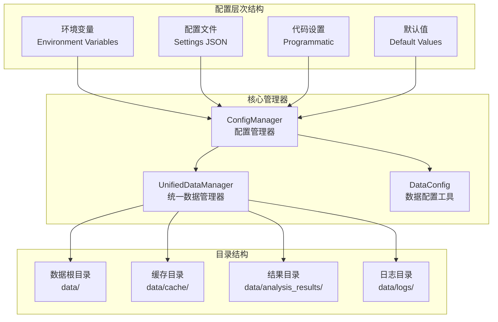
```mermaid
graph TB
subgraph "配置层次结构"
ENV[环境变量<br/>Environment Variables]
CONFIG[配置文件<br/>Settings JSON]
CODE[代码设置<br/>Programmatic]
DEFAULT[默认值<br/>Default Values]
end
subgraph "核心管理器"
CM[ConfigManager<br/>配置管理器]
UDM[UnifiedDataManager<br/>统一数据管理器]
DC[DataConfig<br/>数据配置工具]
end
subgraph "目录结构"
DATA_ROOT[数据根目录<br/>data/]
CACHE[缓存目录<br/>data/cache/]
RESULTS[结果目录<br/>data/analysis_results/]
LOGS[日志目录<br/>data/logs/]
end
ENV --> CM
CONFIG --> CM
CODE --> CM
DEFAULT --> CM
CM --> UDM
CM --> DC
UDM --> DATA_ROOT
UDM --> CACHE
UDM --> RESULTS
UDM --> LOGS
```

**图表来源**
- [tradingagents/config/config_manager.py](file://tradingagents/config/config_manager.py#L1-L50)
- [scripts/unified_data_manager.py](file://scripts/unified_data_manager.py#L1-L100)

## 数据目录配置架构

### 配置管理器 (ConfigManager)

配置管理器是数据目录配置的核心组件，负责管理API密钥、模型配置、以及系统设置。

#### 主要功能特性

| 功能模块 | 描述 | 配置项 |
|---------|------|--------|
| **数据目录管理** | 管理主要数据存储路径 | `data_dir`, `cache_dir`, `results_dir` |
| **环境变量集成** | 优先读取环境变量配置 | `TRADINGAGENTS_DATA_DIR`, `TRADINGAGENTS_CACHE_DIR` |
| **自动目录创建** | 启动时自动创建必要目录 | `auto_create_dirs` |
| **配置持久化** | 将配置保存到JSON文件 | `settings.json` |
| **优先级处理** | 环境变量 > 代码设置 > 配置文件 > 默认值 |

#### 配置文件结构

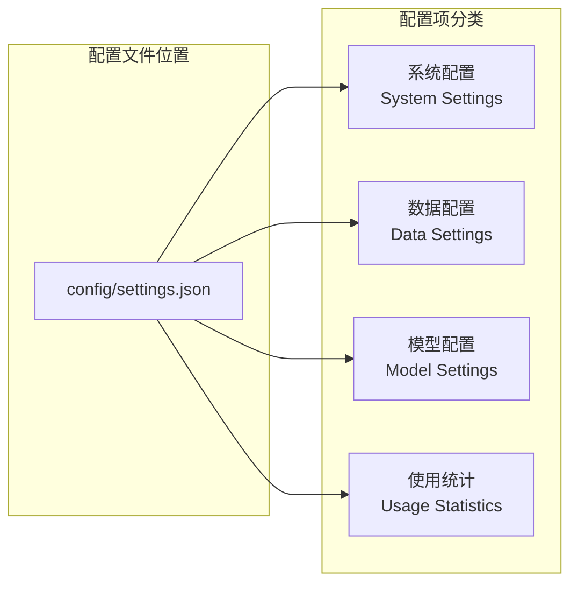
```mermaid
graph LR
subgraph "配置文件位置"
SETTINGS[config/settings.json]
end
subgraph "配置项分类"
SYSTEM[系统配置<br/>System Settings]
DATA[数据配置<br/>Data Settings]
MODELS[模型配置<br/>Model Settings]
USAGE[使用统计<br/>Usage Statistics]
end
SETTINGS --> SYSTEM
SETTINGS --> DATA
SETTINGS --> MODELS
SETTINGS --> USAGE
```

**节来源**
- [tradingagents/config/config_manager.py](file://tradingagents/config/config_manager.py#L100-L200)

### 统一数据目录管理器 (UnifiedDataManager)

统一数据目录管理器提供了标准化的数据目录访问接口，支持多种配置方式和自动验证。

#### 目录结构映射

| 目录键名 | 默认路径 | 环境变量 | 用途描述 |
|---------|---------|---------|----------|
| `data_root` | `data/` | `TRADINGAGENTS_DATA_DIR` | 数据根目录 |
| `cache` | `data/cache/` | `TRADINGAGENTS_CACHE_DIR` | 缓存数据存储 |
| `analysis_results` | `data/analysis_results/` | `TRADINGAGENTS_RESULTS_DIR` | 分析结果存储 |
| `logs` | `data/logs/` | `TRADINGAGENTS_LOGS_DIR` | 应用程序日志 |
| `sessions` | `data/sessions/` | `TRADINGAGENTS_SESSIONS_DIR` | 会话数据 |
| `config` | `data/config/` | `TRADINGAGENTS_CONFIG_DIR` | 配置文件存储 |
| `temp` | `data/temp/` | `TRADINGAGENTS_TEMP_DIR` | 临时文件存储 |

**节来源**
- [scripts/unified_data_manager.py](file://scripts/unified_data_manager.py#L30-L80)

## 配置优先级和动态更新机制

### 优先级顺序

数据目录配置遵循严格的优先级顺序，确保灵活性和一致性：

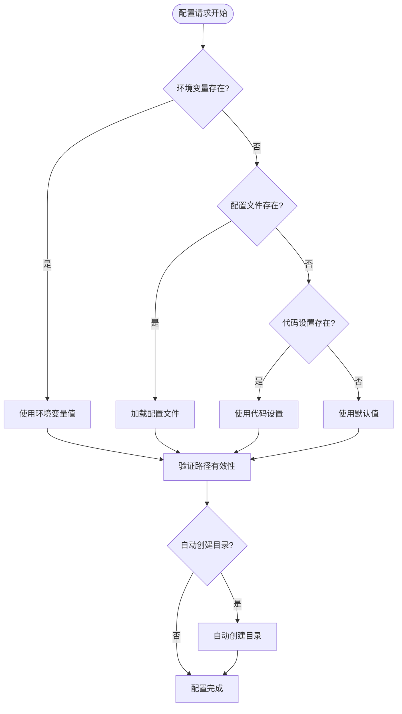
```mermaid
flowchart TD
START([配置请求开始]) --> ENV_CHECK{环境变量存在?}
ENV_CHECK --> |是| USE_ENV[使用环境变量值]
ENV_CHECK --> |否| CONFIG_CHECK{配置文件存在?}
CONFIG_CHECK --> |是| LOAD_CONFIG[加载配置文件]
CONFIG_CHECK --> |否| CODE_CHECK{代码设置存在?}
CODE_CHECK --> |是| USE_CODE[使用代码设置]
CODE_CHECK --> |否| USE_DEFAULT[使用默认值]
USE_ENV --> VALIDATE_PATH[验证路径有效性]
LOAD_CONFIG --> VALIDATE_PATH
USE_CODE --> VALIDATE_PATH
USE_DEFAULT --> VALIDATE_PATH
VALIDATE_PATH --> CREATE_DIRS{自动创建目录?}
CREATE_DIRS --> |是| AUTO_CREATE[自动创建目录]
CREATE_DIRS --> |否| COMPLETE[配置完成]
AUTO_CREATE --> COMPLETE
```

**图表来源**
- [tradingagents/config/config_manager.py](file://tradingagents/config/config_manager.py#L500-L600)
- [scripts/unified_data_manager.py](file://scripts/unified_data_manager.py#L80-L126)

### 动态更新机制

系统支持运行时动态更新数据目录配置，无需重启应用程序。

#### 实现原理

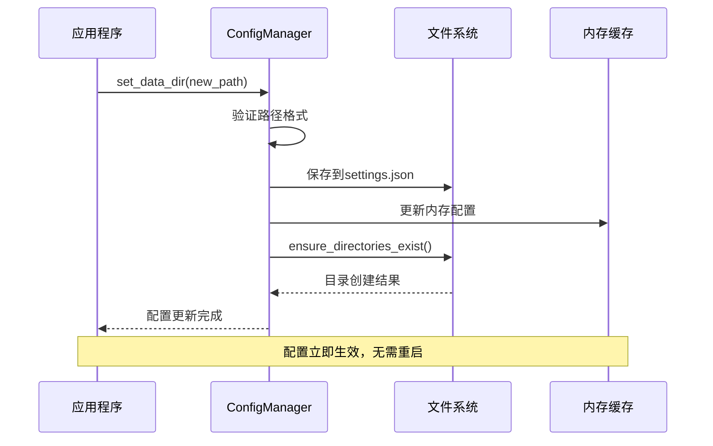
```mermaid
sequenceDiagram
participant App as 应用程序
participant CM as ConfigManager
participant FS as 文件系统
participant Cache as 内存缓存
App->>CM : set_data_dir(new_path)
CM->>CM : 验证路径格式
CM->>FS : 保存到settings.json
CM->>Cache : 更新内存配置
CM->>FS : ensure_directories_exist()
FS-->>CM : 目录创建结果
CM-->>App : 配置更新完成
Note over App,Cache : 配置立即生效，无需重启
```

**图表来源**
- [tradingagents/config/config_manager.py](file://tradingagents/config/config_manager.py#L650-L700)

**节来源**
- [tradingagents/config/config_manager.py](file://tradingagents/config/config_manager.py#L650-L726)

## 常见问题及解决方案

### 问题1：数据目录路径不生效

#### 症状表现
- 应用程序使用默认路径而非自定义路径
- 目录创建失败或权限不足
- 配置更改后不生效

#### 诊断步骤

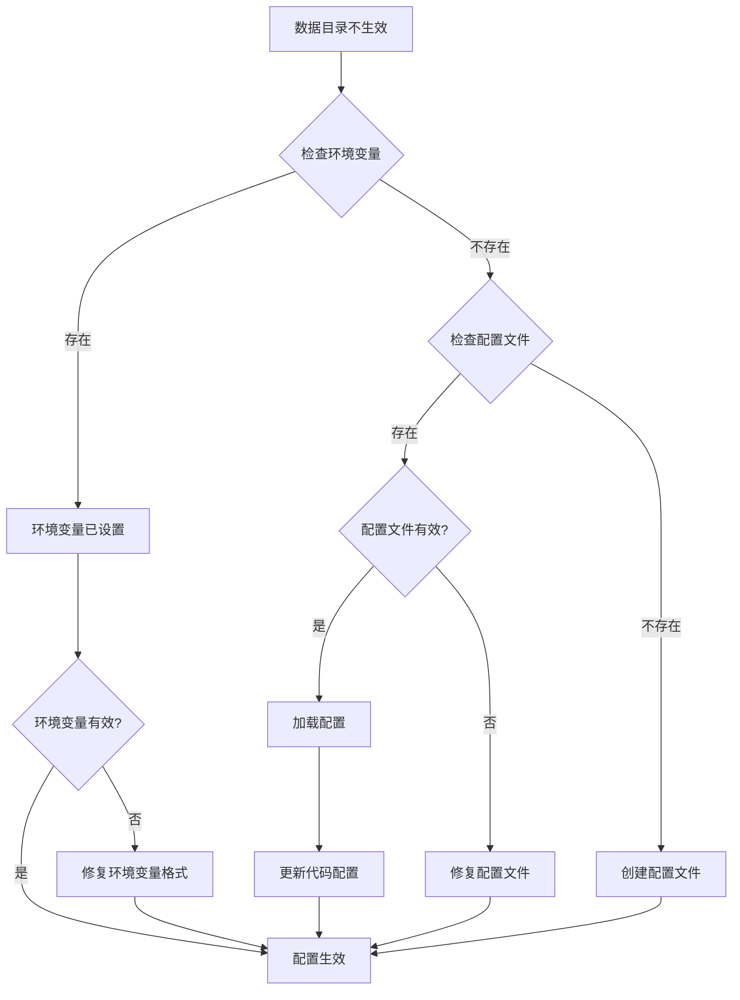
```mermaid
flowchart TD
PROBLEM[数据目录不生效] --> CHECK_ENV{检查环境变量}
CHECK_ENV --> |存在| ENV_SET[环境变量已设置]
CHECK_ENV --> |不存在| CHECK_CONFIG{检查配置文件}
ENV_SET --> ENV_VALID{环境变量有效?}
ENV_VALID --> |是| SUCCESS[配置生效]
ENV_VALID --> |否| FIX_ENV[修复环境变量格式]
CHECK_CONFIG --> |存在| CONFIG_VALID{配置文件有效?}
CHECK_CONFIG --> |不存在| CREATE_CONFIG[创建配置文件]
CONFIG_VALID --> |是| LOAD_CONFIG[加载配置]
CONFIG_VALID --> |否| FIX_CONFIG[修复配置文件]
LOAD_CONFIG --> UPDATE_CODE[更新代码配置]
UPDATE_CODE --> SUCCESS
FIX_ENV --> SUCCESS
FIX_CONFIG --> SUCCESS
CREATE_CONFIG --> SUCCESS
```

#### 解决方案

1. **检查环境变量格式**
   ```bash
   # 正确格式示例
   export TRADINGAGENTS_DATA_DIR="/absolute/path/to/data"
   # 或
   export TRADINGAGENTS_DATA_DIR="./relative/path"
   ```

2. **验证配置文件完整性**
   ```bash
   # 检查配置文件是否存在
   ls -la config/settings.json
   
   # 验证JSON格式
   python -m json.tool config/settings.json
   ```

3. **强制刷新配置**
   ```python
   from tradingagents.config.config_manager import config_manager
   # 强制重新加载配置
   settings = config_manager.load_settings()
   ```

**节来源**
- [examples/data_dir_config_demo.py](file://examples/data_dir_config_demo.py#L101-L135)

### 问题2：缓存目录创建失败

#### 症状表现
- 缓存文件无法保存
- 权限拒绝错误
- 目录不存在异常

#### 故障排除矩阵

| 问题类型 | 可能原因 | 解决方法 | 验证步骤 |
|---------|---------|---------|----------|
| **权限问题** | 用户无写入权限 | 更改目录权限或所有权 | `ls -ld /path/to/cache` |
| **路径无效** | 路径不存在或不可访问 | 提供绝对路径 | `mkdir -p /path/to/cache` |
| **磁盘空间** | 磁盘空间不足 | 清理磁盘空间 | `df -h /path/to/cache` |
| **符号链接** | 路径包含无效符号链接 | 检查并修复链接 | `ls -la /path/to/cache` |

#### 解决策略

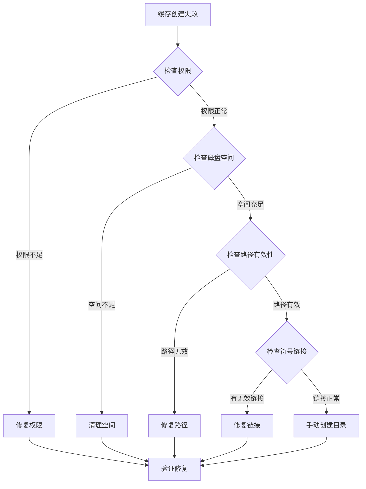
```mermaid
flowchart TD
CACHE_FAIL[缓存创建失败] --> CHECK_PERM{检查权限}
CHECK_PERM --> |权限不足| FIX_PERM[修复权限]
CHECK_PERM --> |权限正常| CHECK_SPACE{检查磁盘空间}
CHECK_SPACE --> |空间不足| CLEAN_SPACE[清理空间]
CHECK_SPACE --> |空间充足| CHECK_PATH{检查路径有效性}
CHECK_PATH --> |路径无效| FIX_PATH[修复路径]
CHECK_PATH --> |路径有效| CHECK_SYMLINK{检查符号链接}
CHECK_SYMLINK --> |有无效链接| FIX_SYMLINK[修复链接]
CHECK_SYMLINK --> |链接正常| MANUAL_CREATE[手动创建目录]
FIX_PERM --> VERIFY[验证修复]
CLEAN_SPACE --> VERIFY
FIX_PATH --> VERIFY
FIX_SYMLINK --> VERIFY
MANUAL_CREATE --> VERIFY
```

**节来源**
- [tradingagents/config/config_manager.py](file://tradingagents/config/config_manager.py#L680-L726)

### 问题3：结果文件保存位置错误

#### 症状表现
- 分析结果保存到错误目录
- 结果文件丢失或无法访问
- Web界面显示结果路径错误

#### 诊断流程

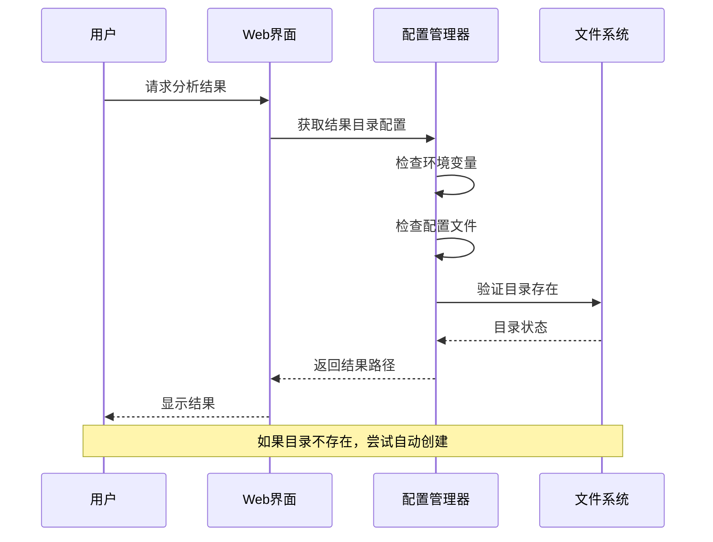
```mermaid
sequenceDiagram
participant User as 用户
participant WebUI as Web界面
participant Config as 配置管理器
participant FileSystem as 文件系统
User->>WebUI : 请求分析结果
WebUI->>Config : 获取结果目录配置
Config->>Config : 检查环境变量
Config->>Config : 检查配置文件
Config->>FileSystem : 验证目录存在
FileSystem-->>Config : 目录状态
Config-->>WebUI : 返回结果路径
WebUI-->>User : 显示结果
Note over User,FileSystem : 如果目录不存在，尝试自动创建
```

**图表来源**
- [cli/main.py](file://cli/main.py#L1830-L1863)

#### 解决方案

1. **手动设置结果目录**
   ```python
   from tradingagents.config.config_manager import config_manager
   config_manager.set_data_dir("/correct/results/path")
   ```

2. **检查目录权限**
   ```bash
   # 检查目录权限
   ls -la /path/to/results
   
   # 修复权限
   chmod -R 755 /path/to/results
   chown -R $USER:$USER /path/to/results
   ```

3. **验证环境变量**
   ```bash
   echo $TRADINGAGENTS_RESULTS_DIR
   ```

**节来源**
- [examples/data_dir_config_demo.py](file://examples/data_dir_config_demo.py#L137-L178)

## 环境变量迁移工具

### migrate_env_to_config.py 工具

该工具专门用于将传统的 `.env` 文件配置迁移到新的 JSON 配置系统中。

#### 迁移流程

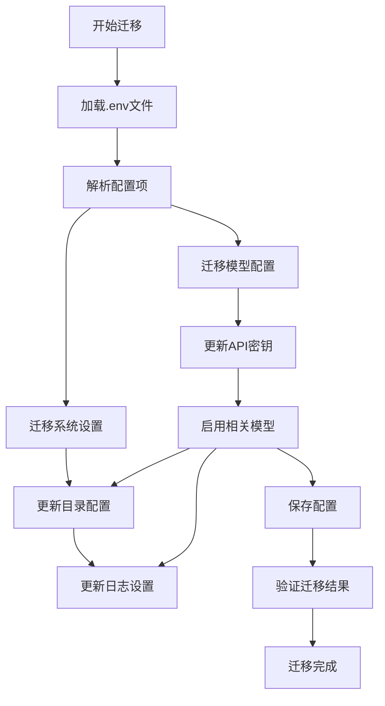
```mermaid
flowchart TD
START[开始迁移] --> LOAD_ENV[加载.env文件]
LOAD_ENV --> PARSE_CONFIG[解析配置项]
PARSE_CONFIG --> MIGRATE_MODELS[迁移模型配置]
PARSE_CONFIG --> MIGRATE_SYSTEM[迁移系统设置]
MIGRATE_MODELS --> UPDATE_KEYS[更新API密钥]
UPDATE_KEYS --> ENABLE_MODELS[启用相关模型]
MIGRATE_SYSTEM --> UPDATE_DIRS[更新目录配置]
UPDATE_DIRS --> UPDATE_LOGS[更新日志设置]
ENABLE_MODELS --> SAVE_CONFIG[保存配置]
ENABLE_MODELS --> UPDATE_DIRS
ENABLE_MODELS --> UPDATE_LOGS
SAVE_CONFIG --> VERIFY[验证迁移结果]
VERIFY --> COMPLETE[迁移完成]
```

**图表来源**
- [scripts/setup/migrate_env_to_config.py](file://scripts/setup/migrate_env_to_config.py#L20-L80)

#### 支持的迁移项目

| 配置类别 | .env变量 | JSON配置项 | 迁移状态 |
|---------|---------|-----------|----------|
| **API密钥** | `DASHSCOPE_API_KEY` | `models[].api_key` | ✅ 自动迁移 |
| **API密钥** | `OPENAI_API_KEY` | `models[].api_key` | ✅ 自动迁移 |
| **API密钥** | `GOOGLE_API_KEY` | `models[].api_key` | ✅ 自动迁移 |
| **目录配置** | `TRADINGAGENTS_RESULTS_DIR` | `results_dir` | ✅ 自动迁移 |
| **日志配置** | `TRADINGAGENTS_LOG_LEVEL` | `log_level` | ✅ 自动迁移 |
| **Reddit配置** | `REDDIT_CLIENT_ID` | `reddit_client_id` | ✅ 自动迁移 |

#### 使用方法

```bash
# 执行迁移
python scripts/setup/migrate_env_to_config.py

# 查看迁移状态
python scripts/setup/migrate_env_to_config.py --verbose
```

**节来源**
- [scripts/setup/migrate_env_to_config.py](file://scripts/setup/migrate_env_to_config.py#L1-L177)

### 迁移验证

迁移完成后，系统会自动验证配置的有效性：

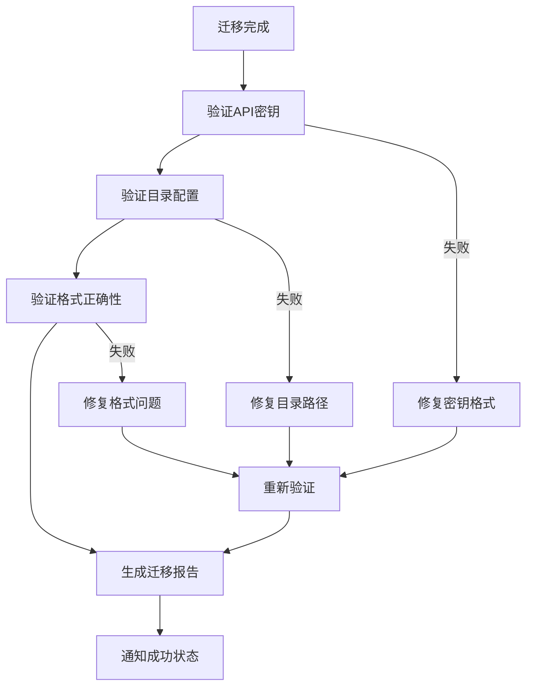
```mermaid
flowchart TD
MIGRATION_COMPLETE[迁移完成] --> VALIDATE_KEYS[验证API密钥]
VALIDATE_KEYS --> VALIDATE_DIRS[验证目录配置]
VALIDATE_DIRS --> VALIDATE_FORMATS[验证格式正确性]
VALIDATE_FORMATS --> GENERATE_REPORT[生成迁移报告]
GENERATE_REPORT --> NOTIFY_SUCCESS[通知成功状态]
VALIDATE_KEYS --> |失败| FIX_KEYS[修复密钥格式]
VALIDATE_DIRS --> |失败| FIX_DIRS[修复目录路径]
VALIDATE_FORMATS --> |失败| FIX_FORMATS[修复格式问题]
FIX_KEYS --> REVALIDATE[重新验证]
FIX_DIRS --> REVALIDATE
FIX_FORMATS --> REVALIDATE
REVALIDATE --> GENERATE_REPORT
```

**节来源**
- [scripts/setup/migrate_env_to_config.py](file://scripts/setup/migrate_env_to_config.py#L100-L150)

## 目录权限和路径验证

### 权限检查机制

系统内置了多层权限检查机制，确保数据目录的安全性和可访问性。

#### 权限验证流程

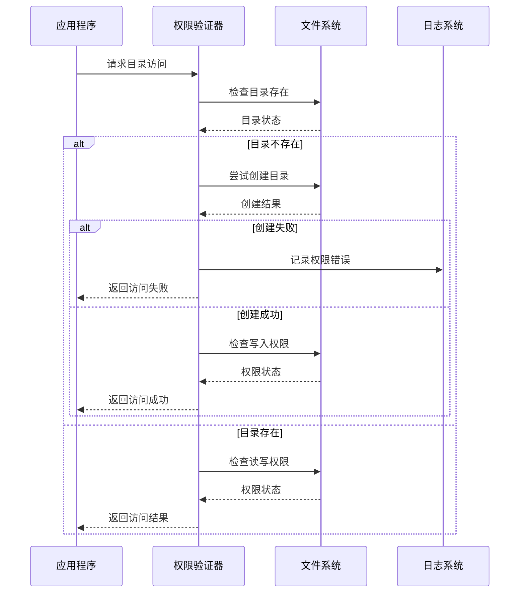
```mermaid
sequenceDiagram
participant App as 应用程序
participant Validator as 权限验证器
participant FileSystem as 文件系统
participant Logger as 日志系统
App->>Validator : 请求目录访问
Validator->>FileSystem : 检查目录存在
FileSystem-->>Validator : 目录状态
alt 目录不存在
Validator->>FileSystem : 尝试创建目录
FileSystem-->>Validator : 创建结果
alt 创建失败
Validator->>Logger : 记录权限错误
Validator-->>App : 返回访问失败
else 创建成功
Validator->>FileSystem : 检查写入权限
FileSystem-->>Validator : 权限状态
Validator-->>App : 返回访问成功
end
else 目录存在
Validator->>FileSystem : 检查读写权限
FileSystem-->>Validator : 权限状态
Validator-->>App : 返回访问结果
end
```

**图表来源**
- [scripts/unified_data_manager.py](file://scripts/unified_data_manager.py#L124-L168)

### 路径格式验证

#### 支持的路径格式

| 路径类型 | 示例 | 验证规则 | 优先级 |
|---------|------|---------|--------|
| **绝对路径** | `/home/user/data` | 必须以 `/` 开头 | 最高 |
| **相对路径** | `./data` | 相对于项目根目录 | 中等 |
| **用户路径** | `~/data` | 展开为用户主目录 | 中等 |
| **环境变量** | `$HOME/data` | 展开环境变量 | 最低 |

#### 验证规则实现

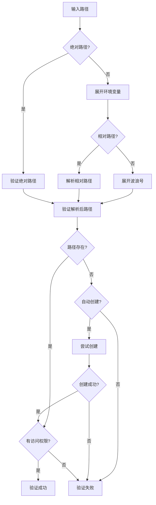
```mermaid
flowchart TD
PATH_INPUT[输入路径] --> CHECK_ABS{绝对路径?}
CHECK_ABS --> |是| VALIDATE_ABS[验证绝对路径]
CHECK_ABS --> |否| EXPAND_VARS[展开环境变量]
EXPAND_VARS --> CHECK_REL{相对路径?}
CHECK_REL --> |是| RESOLVE_REL[解析相对路径]
CHECK_REL --> |否| EXPAND_TILDE[展开波浪号]
EXPAND_TILDE --> VALIDATE_RESOLVED[验证解析后路径]
RESOLVE_REL --> VALIDATE_RESOLVED
VALIDATE_ABS --> VALIDATE_RESOLVED
VALIDATE_RESOLVED --> CHECK_EXISTS{路径存在?}
CHECK_EXISTS --> |否| CREATE_IF_NEEDED{自动创建?}
CHECK_EXISTS --> |是| CHECK_ACCESS{有访问权限?}
CREATE_IF_NEEDED --> |是| ATTEMPT_CREATE[尝试创建]
CREATE_IF_NEEDED --> |否| FAIL[验证失败]
ATTEMPT_CREATE --> CHECK_CREATED{创建成功?}
CHECK_CREATED --> |是| CHECK_ACCESS
CHECK_CREATED --> |否| FAIL
CHECK_ACCESS --> |是| SUCCESS[验证成功]
CHECK_ACCESS --> |否| FAIL
```

**图表来源**
- [scripts/unified_data_manager.py](file://scripts/unified_data_manager.py#L80-L126)

**节来源**
- [scripts/unified_data_manager.py](file://scripts/unified_data_manager.py#L169-L200)

### 目录结构验证

#### 验证工具使用

系统提供了专门的目录结构验证工具：

```bash
# 验证目录结构
python scripts/unified_data_manager.py --validate

# 创建所有目录
python scripts/unified_data_manager.py --create

# 显示配置摘要
python scripts/unified_data_manager.py --show-config

# 显示完整目录结构
python scripts/unified_data_manager.py --show-structure
```

#### 验证结果解读

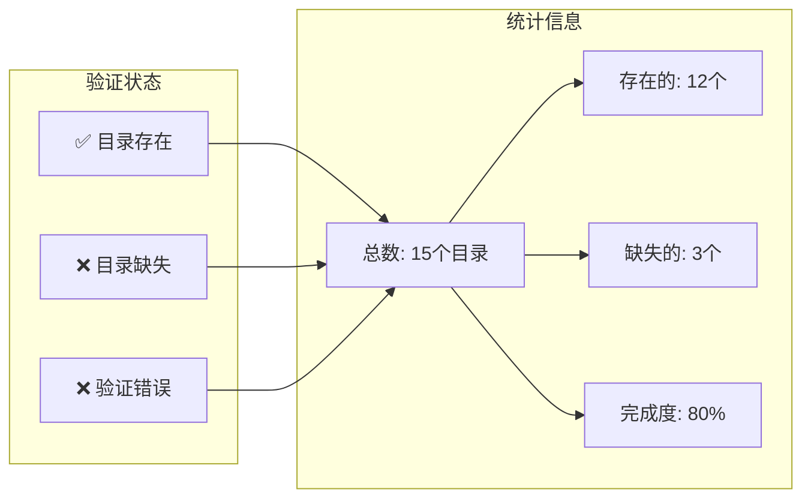
```mermaid
graph LR
subgraph "验证状态"
SUCCESS[✅ 目录存在]
FAILURE[❌ 目录缺失]
ERROR[❌ 验证错误]
end
subgraph "统计信息"
TOTAL[总数: 15个目录]
EXISTING[存在的: 12个]
MISSING[缺失的: 3个]
PERCENTAGE[完成度: 80%]
end
SUCCESS --> TOTAL
FAILURE --> TOTAL
ERROR --> TOTAL
TOTAL --> EXISTING
TOTAL --> MISSING
TOTAL --> PERCENTAGE
```

**节来源**
- [scripts/unified_data_manager.py](file://scripts/unified_data_manager.py#L253-L288)

## 故障排除流程

### 系统化故障排除方法

为了系统化地解决数据目录配置问题，我们推荐以下分步排除流程：

#### 第一阶段：配置检查

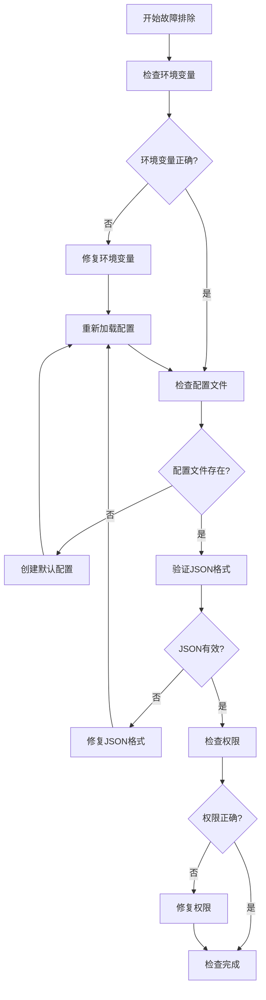
```mermaid
flowchart TD
START[开始故障排除] --> CHECK_ENV_VAR[检查环境变量]
CHECK_ENV_VAR --> ENV_OK{环境变量正确?}
ENV_OK --> |否| FIX_ENV[修复环境变量]
ENV_OK --> |是| CHECK_CONFIG_FILE[检查配置文件]
FIX_ENV --> RELOAD_CONFIG[重新加载配置]
RELOAD_CONFIG --> CHECK_CONFIG_FILE
CHECK_CONFIG_FILE --> FILE_EXISTS{配置文件存在?}
FILE_EXISTS --> |否| CREATE_DEFAULT[创建默认配置]
FILE_EXISTS --> |是| VALIDATE_JSON[验证JSON格式]
CREATE_DEFAULT --> RELOAD_CONFIG
VALIDATE_JSON --> JSON_OK{JSON有效?}
JSON_OK --> |否| FIX_JSON[修复JSON格式]
JSON_OK --> |是| CHECK_PERMISSIONS[检查权限]
FIX_JSON --> RELOAD_CONFIG
CHECK_PERMISSIONS --> PERMISSIONS_OK{权限正确?}
PERMISSIONS_OK --> |否| FIX_PERMISSIONS[修复权限]
PERMISSIONS_OK --> |是| COMPLETE[检查完成]
FIX_PERMISSIONS --> COMPLETE
```

#### 第二阶段：功能验证

一旦配置检查通过，需要验证各项功能是否正常工作：

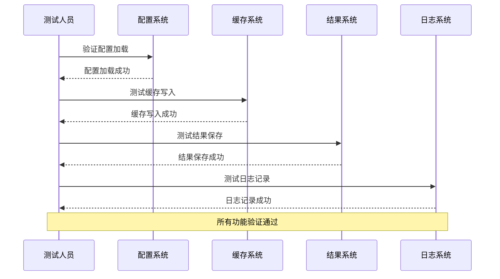
```mermaid
sequenceDiagram
participant Tester as 测试人员
participant Config as 配置系统
participant Cache as 缓存系统
participant Results as 结果系统
participant Logs as 日志系统
Tester->>Config : 验证配置加载
Config-->>Tester : 配置加载成功
Tester->>Cache : 测试缓存写入
Cache-->>Tester : 缓存写入成功
Tester->>Results : 测试结果保存
Results-->>Tester : 结果保存成功
Tester->>Logs : 测试日志记录
Logs-->>Tester : 日志记录成功
Note over Tester,Logs : 所有功能验证通过
```

**图表来源**
- [tests/test_data_config_cli.py](file://tests/test_data_config_cli.py#L56-L124)

### 常见错误模式

#### 错误模式识别

| 错误类型 | 症状描述 | 可能原因 | 解决步骤 |
|---------|---------|---------|----------|
| **配置加载失败** | 应用启动时提示配置错误 | JSON格式错误或文件损坏 | 检查JSON语法，恢复默认配置 |
| **权限拒绝** | 无法创建或写入目录 | 用户权限不足或SELinux限制 | 修改目录权限或SELinux策略 |
| **路径解析失败** | 目录路径显示为null | 环境变量未正确设置 | 检查环境变量值和格式 |
| **磁盘空间不足** | 缓存写入失败 | 磁盘空间耗尽 | 清理磁盘空间或更换存储位置 |

#### 自动诊断工具

系统提供了自动诊断功能，可以快速定位问题：

```bash
# 运行全面诊断
python -m tradingagents.utils.diagnose_empty_data

# 检查数据目录状态
python utils/data_config.py
```

**节来源**
- [utils/data_config.py](file://utils/data_config.py#L200-L262)

## 最佳实践建议

### 配置管理最佳实践

#### 1. 环境变量配置

```bash
# 生产环境配置
export TRADINGAGENTS_DATA_DIR="/opt/tradingagents/data"
export TRADINGAGENTS_CACHE_DIR="/opt/tradingagents/cache"
export TRADINGAGENTS_RESULTS_DIR="/opt/tradingagents/results"

# 开发环境配置
export TRADINGAGENTS_DATA_DIR="./dev_data"
export TRADINGAGENTS_CACHE_DIR="./dev_cache"
export TRADINGAGENTS_RESULTS_DIR="./dev_results"
```

#### 2. 目录权限设置

```bash
# 推荐的权限设置
chmod 755 /path/to/tradingagents
chmod 775 /path/to/data
chmod 775 /path/to/cache
chmod 775 /path/to/results

# 设置正确的所有者
chown -R tradingagent:tradinggroup /path/to/tradingagents
```

#### 3. 配置备份策略

```bash
# 定期备份配置
cp config/settings.json config/settings.json.bak.$(date +%Y%m%d_%H%M%S)

# 监控配置文件变化
inotifywait -m config/ -e modify,create,delete
```

### 性能优化建议

#### 缓存目录优化

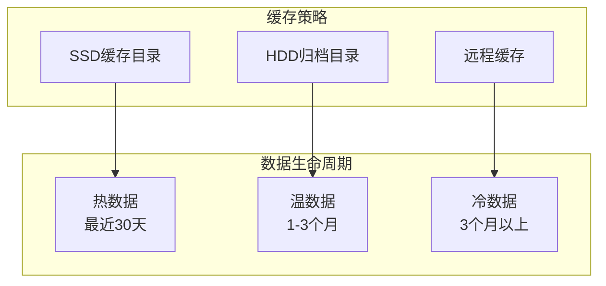
```mermaid
graph TB
subgraph "缓存策略"
SSD_CACHE[SSD缓存目录]
HDD_ARCHIVE[HDD归档目录]
REMOTE_CACHE[远程缓存]
end
subgraph "数据生命周期"
HOT_DATA[热数据<br/>最近30天]
WARM_DATA[温数据<br/>1-3个月]
COLD_DATA[冷数据<br/>3个月以上]
end
SSD_CACHE --> HOT_DATA
HDD_ARCHIVE --> WARM_DATA
REMOTE_CACHE --> COLD_DATA
```

#### 目录监控和维护

| 监控项目 | 检查频率 | 告警阈值 | 维护措施 |
|---------|---------|---------|----------|
| **磁盘空间** | 每小时 | >80% | 清理旧数据 |
| **目录权限** | 每天 | 发生变更 | 恢复权限 |
| **配置文件** | 每周 | 修改时间 | 备份配置 |
| **日志大小** | 每天 | >1GB | 压缩历史日志 |

### 故障预防措施

#### 预防性检查清单

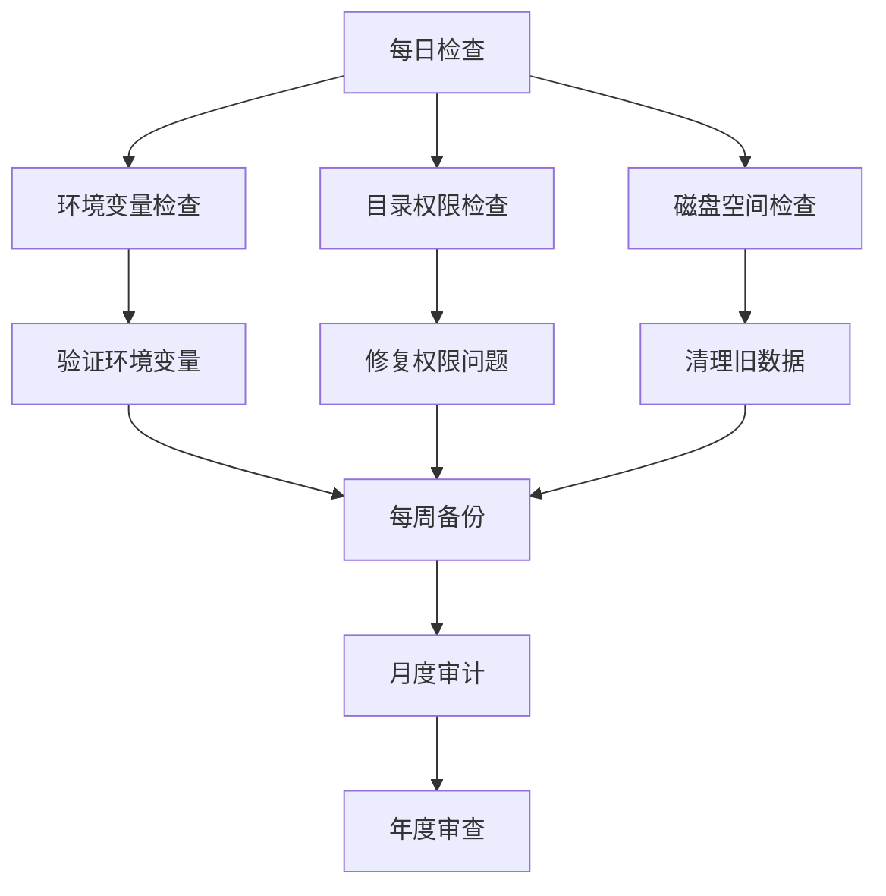
```mermaid
flowchart TD
DAILY_CHECK[每日检查] --> ENV_VAR_CHECK[环境变量检查]
DAILY_CHECK --> DIR_PERM_CHECK[目录权限检查]
DAILY_CHECK --> SPACE_CHECK[磁盘空间检查]
ENV_VAR_CHECK --> VALIDATE_ENV[验证环境变量]
DIR_PERM_CHECK --> FIX_PERMS[修复权限问题]
SPACE_CHECK --> CLEANUP_OLD[清理旧数据]
VALIDATE_ENV --> WEEKLY_BACKUP[每周备份]
FIX_PERMS --> WEEKLY_BACKUP
CLEANUP_OLD --> WEEKLY_BACKUP
WEEKLY_BACKUP --> MONTHLY_AUDIT[月度审计]
MONTHLY_AUDIT --> ANNUAL_REVIEW[年度审查]
```

#### 应急响应预案

1. **配置文件损坏**
   - 立即从备份恢复
   - 使用默认配置启动
   - 重新配置关键参数

2. **目录权限问题**
   - 临时使用root权限
   - 修复权限后切换回普通用户
   - 监控权限变更

3. **磁盘空间不足**
   - 立即清理临时文件
   - 移动旧数据到归档存储
   - 扩展磁盘容量

通过遵循这些最佳实践和故障排除指南，可以确保TradingAgents-CN项目的数据目录配置稳定可靠，避免常见的配置问题和性能瓶颈。