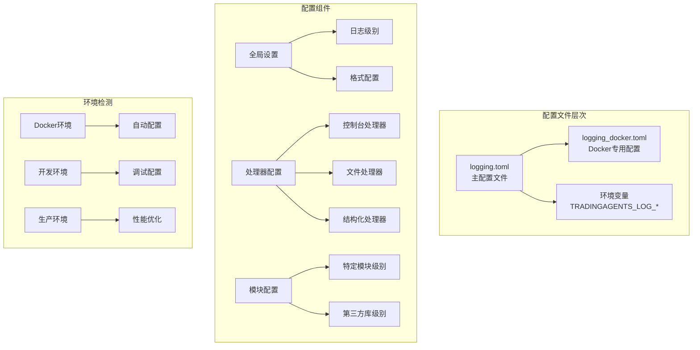
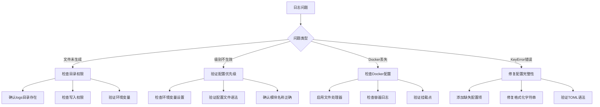
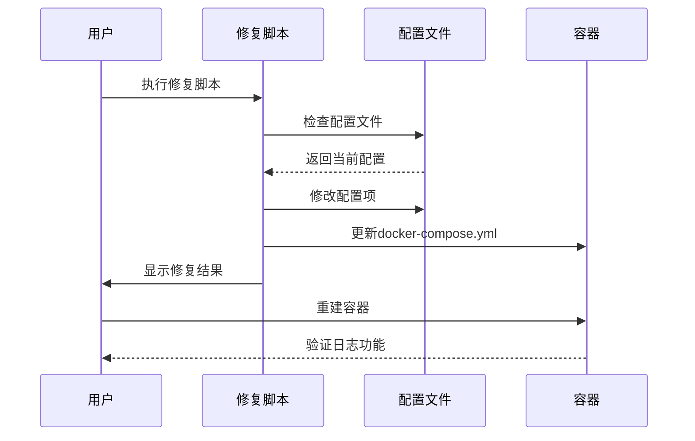
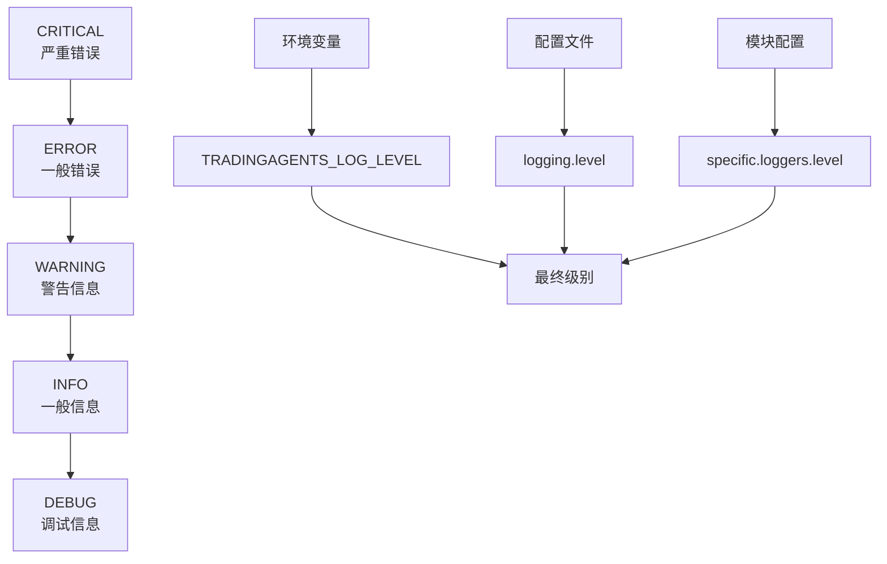
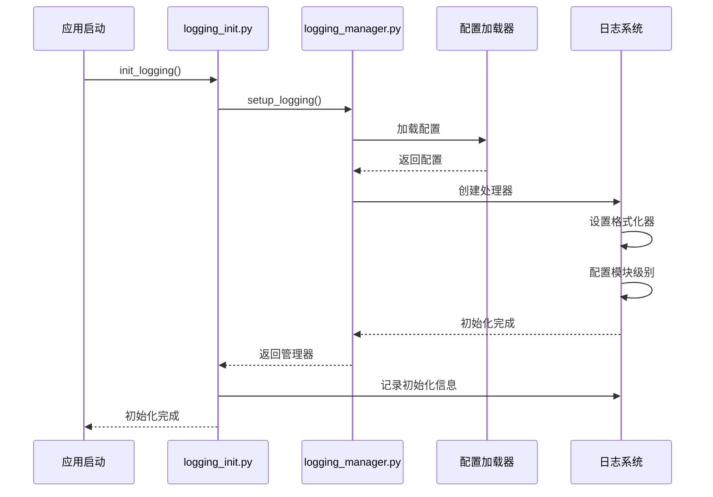
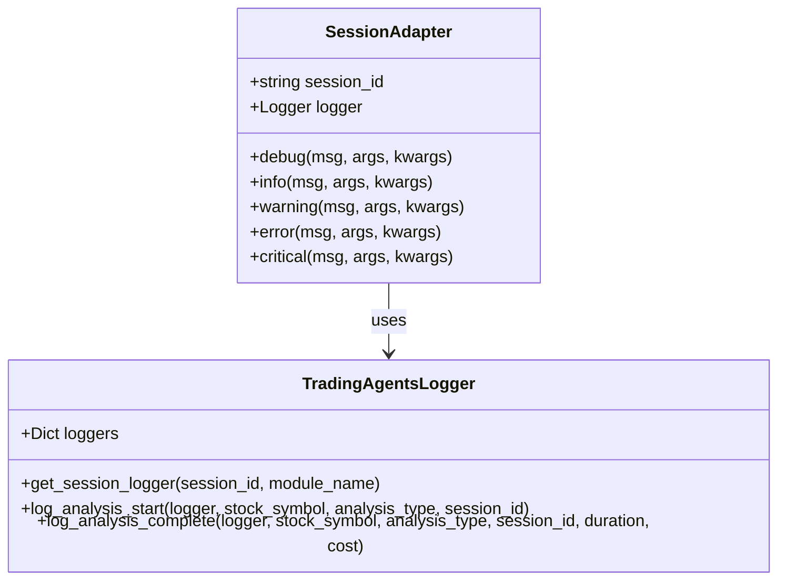
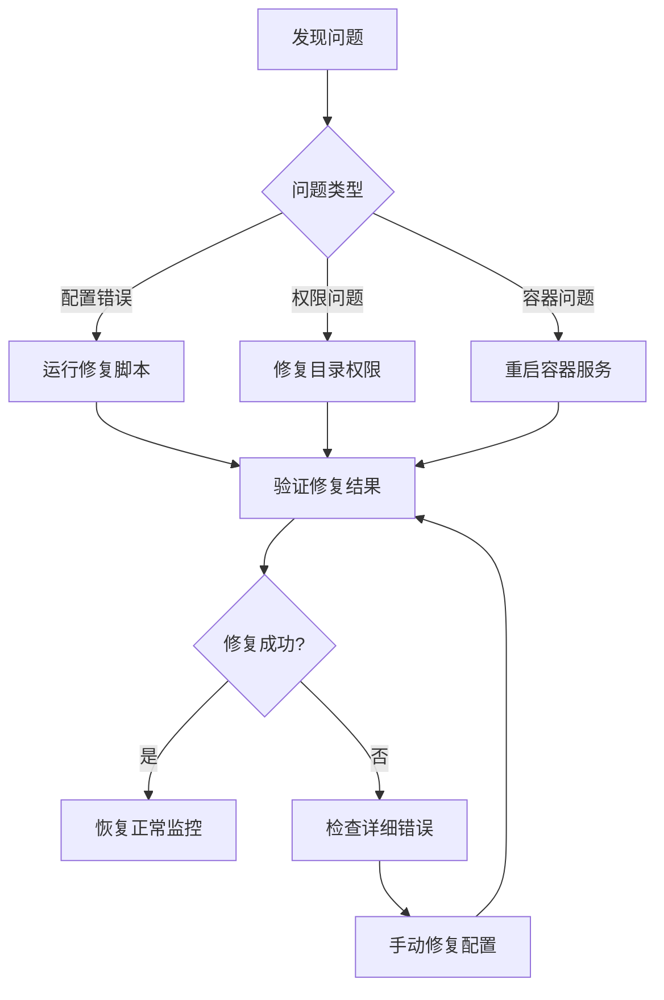

# 日志配置问题故障排除指南

<cite>
**本文档中引用的文件**
- [config/logging.toml](file://config/logging.toml)
- [config/logging_docker.toml](file://config/logging_docker.toml)
- [scripts/fix_logging_config_error.py](file://scripts/fix_logging_config_error.py)
- [scripts/fix_docker_logging.py](file://scripts/fix_docker_logging.py)
- [scripts/test_docker_logging.py](file://scripts/test_docker_logging.py)
- [scripts/verify_docker_logs.py](file://scripts/verify_docker_logs.py)
- [tradingagents/utils/logging_init.py](file://tradingagents/utils/logging_init.py)
- [tradingagents/utils/logging_manager.py](file://tradingagents/utils/logging_manager.py)
- [scripts/view_logs.py](file://scripts/view_logs.py)
</cite>

## 目录
1. [概述](#概述)
2. [日志配置架构](#日志配置架构)
3. [常见问题诊断](#常见问题诊断)
4. [Docker环境日志配置](#docker环境日志配置)
5. [日志级别配置](#日志级别配置)
6. [配置文件完整性验证](#配置文件完整性验证)
7. [日志初始化流程](#日志初始化流程)
8. [故障排除工具](#故障排除工具)
9. [最佳实践建议](#最佳实践建议)
10. [总结](#总结)

## 概述

TradingAgents-CN项目采用统一的日志管理系统，支持多种环境配置（开发、生产、Docker）。本指南旨在帮助用户解决日志配置相关问题，包括日志文件未生成、日志级别不生效、Docker环境下日志丢失等常见问题。

### 核心特性
- **多环境支持**：开发、生产、Docker环境独立配置
- **灵活格式**：支持控制台、文件、结构化日志格式
- **模块化管理**：按模块设置不同的日志级别
- **自动检测**：智能识别Docker环境并调整配置

## 日志配置架构

### 配置文件结构



**图表来源**
- [config/logging.toml](file://config/logging.toml#L1-L111)
- [config/logging_docker.toml](file://config/logging_docker.toml#L1-L100)

### 配置优先级

系统按照以下优先级加载配置：
1. **环境变量** (`TRADINGAGENTS_LOG_LEVEL`, `TRADINGAGENTS_LOG_DIR`)
2. **Docker配置** (`config/logging_docker.toml`)
3. **主配置** (`config/logging.toml`)
4. **默认配置**

**章节来源**
- [tradingagents/utils/logging_manager.py](file://tradingagents/utils/logging_manager.py#L130-L161)

## 常见问题诊断

### 问题分类与解决方案



### 具体问题列表

| 问题描述 | 可能原因 | 解决方案 |
|---------|---------|---------|
| 日志文件未生成 | 目录不存在或权限不足 | 创建logs目录并设置写入权限 |
| 日志级别不生效 | 配置优先级冲突 | 检查环境变量和配置文件 |
| Docker容器无日志 | stdout_only=true | 修改配置启用文件日志 |
| KeyError: 'file' | 配置文件格式不完整 | 使用修复脚本或手动添加配置 |
| 日志重复输出 | 多个处理器同时启用 | 调整处理器配置 |

## Docker环境日志配置

### Docker配置差异

Docker环境与普通环境的主要区别：

| 配置项 | 普通环境 | Docker环境 | 修复后 |
|-------|---------|-----------|--------|
| stdout_only | false | true | false |
| disable_file_logging | false | true | false |
| 文件处理器 | 启用 | 禁用 | 启用 |
| 日志目录 | ./logs | /app/logs | /app/logs |
| 彩色输出 | true | false | false |

### Docker配置修复流程



**图表来源**
- [scripts/fix_docker_logging.py](file://scripts/fix_docker_logging.py#L10-L45)
- [scripts/fix_logging_config_error.py](file://scripts/fix_logging_config_error.py#L10-L45)

### Docker环境配置示例

**修复前的问题配置：**
```toml
[logging.docker]
stdout_only = true
disable_file_logging = true
```

**修复后的配置：**
```toml
[logging.docker]
stdout_only = false
disable_file_logging = false
```

**章节来源**
- [config/logging_docker.toml](file://config/logging_docker.toml#L65-L70)
- [scripts/fix_docker_logging.py](file://scripts/fix_docker_logging.py#L15-L45)

## 日志级别配置

### 级别优先级体系



### 级别配置策略

| 环境 | 推荐级别 | 说明 |
|------|---------|------|
| 开发环境 | DEBUG | 详细调试信息 |
| 测试环境 | INFO | 关键操作信息 |
| 生产环境 | INFO/WARNING | 重要事件和警告 |
| Docker环境 | INFO | 平衡信息量和性能 |

### 环境变量配置

```bash
# 设置全局日志级别
export TRADINGAGENTS_LOG_LEVEL=DEBUG

# 设置日志目录
export TRADINGAGENTS_LOG_DIR=/app/logs

# Docker环境标识
export DOCKER_CONTAINER=true
```

**章节来源**
- [tradingagents/utils/logging_manager.py](file://tradingagents/utils/logging_manager.py#L88-L128)

## 配置文件完整性验证

### 验证检查清单

使用内置的配置验证工具：

```bash
# 运行配置验证
python scripts/fix_logging_config_error.py

# 或者直接测试
python scripts/test_docker_logging.py
```

### 关键配置项验证

| 配置项 | 必需性 | 验证方法 |
|-------|-------|---------|
| `[logging.format.console]` | 必需 | 检查格式字符串语法 |
| `[logging.format.file]` | 必需 | 验证模块、函数名格式 |
| `[logging.handlers.file.enabled]` | 必需 | 确认处理器启用状态 |
| `[logging.handlers.file.directory]` | 必需 | 验证目录路径存在 |
| `[logging.docker.enabled]` | Docker环境 | 检测容器环境 |

### 自动修复功能

修复脚本自动执行以下修复：

1. **添加缺失的格式配置**
2. **启用文件处理器**
3. **修正Docker配置**
4. **验证TOML语法**

**章节来源**
- [scripts/fix_logging_config_error.py](file://scripts/fix_logging_config_error.py#L10-L72)

## 日志初始化流程

### 初始化序列图



**图表来源**
- [tradingagents/utils/logging_init.py](file://tradingagents/utils/logging_init.py#L15-L43)
- [tradingagents/utils/logging_manager.py](file://tradingagents/utils/logging_manager.py#L60-L196)

### 多模块日志分离机制

系统支持按模块分离日志：

```python
# Web模块日志
web_logger = setup_web_logging()

# 分析模块日志（带会话ID）
analysis_logger = setup_analysis_logging("session-123")

# 数据流模块日志
dataflow_logger = setup_dataflow_logging()

# LLM适配器模块日志
llm_logger = setup_llm_logging()
```

### 会话日志管理



**图表来源**
- [tradingagents/utils/logging_init.py](file://tradingagents/utils/logging_init.py#L45-L87)

**章节来源**
- [tradingagents/utils/logging_init.py](file://tradingagents/utils/logging_init.py#L141-L164)

## 故障排除工具

### 日志查看工具

提供专门的日志查看和分析工具：

```bash
# 启动日志查看工具
python scripts/view_logs.py

# 功能选项：
# 1. 显示所有日志文件
# 2. 查看日志文件内容
# 3. 实时跟踪日志
# 4. 搜索日志内容
# 5. 查看Docker日志
```

### Docker日志验证工具

```bash
# 验证Docker日志功能
python scripts/verify_docker_logs.py

# 自动检查：
# - 容器状态
# - 日志生成
# - 本地和容器内日志
# - Docker标准输出
```

### 测试脚本

```bash
# 测试Docker环境日志
docker exec TradingAgents-web python test_docker_logging.py

# 检查容器日志
docker-compose logs -f web
```

**章节来源**
- [scripts/view_logs.py](file://scripts/view_logs.py#L1-L227)
- [scripts/verify_docker_logs.py](file://scripts/verify_docker_logs.py#L1-L241)

## 最佳实践建议

### 配置管理最佳实践

1. **环境隔离**
   - 开发环境使用DEBUG级别
   - 生产环境使用INFO级别
   - Docker环境根据需求调整

2. **目录管理**
   ```bash
   # 创建必要的日志目录
   mkdir -p logs
   chmod 755 logs
   
   # Docker环境
   mkdir -p /app/logs
   chmod 777 /app/logs  # 确保容器可写
   ```

3. **权限设置**
   ```bash
   # 检查目录权限
   ls -la logs/
   
   # 设置正确权限
   chown -R $(whoami):$(whoami) logs/
   chmod -R 755 logs/
   ```

### 监控和维护

1. **定期检查**
   - 每天检查日志文件大小
   - 监控磁盘空间使用
   - 验证日志轮转功能

2. **性能优化**
   - 生产环境启用结构化日志
   - 合理设置日志轮转参数
   - 使用异步日志记录

3. **安全考虑**
   - 屏蔽敏感信息
   - 限制日志文件访问权限
   - 定期备份重要日志

### 故障恢复流程



## 总结

TradingAgents-CN的日志系统提供了完整的多环境支持和灵活的配置选项。通过本指南提供的故障排除方法和工具，用户可以：

1. **快速定位问题**：使用诊断工具识别具体问题类型
2. **自动修复配置**：利用修复脚本解决常见配置问题
3. **验证功能**：通过测试工具确认修复效果
4. **预防问题**：遵循最佳实践避免常见错误

### 关键要点回顾

- **配置优先级**：环境变量 > Docker配置 > 主配置 > 默认值
- **Docker特殊性**：需要启用文件处理器才能生成日志文件
- **完整性验证**：确保所有必需配置项都正确设置
- **工具支持**：充分利用提供的自动化工具简化故障排除

### 下一步行动

1. 运行 `python scripts/fix_logging_config_error.py` 自动修复配置
2. 使用 `python scripts/verify_docker_logs.py` 验证修复效果
3. 检查 `logs/` 目录下是否生成日志文件
4. 如仍有问题，参考详细的故障排除步骤

通过遵循本指南的方法和建议，用户应该能够成功解决大部分日志配置相关问题，并建立稳定可靠的日志监控体系。