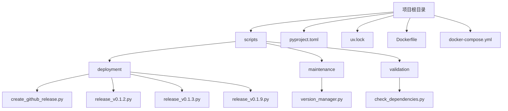
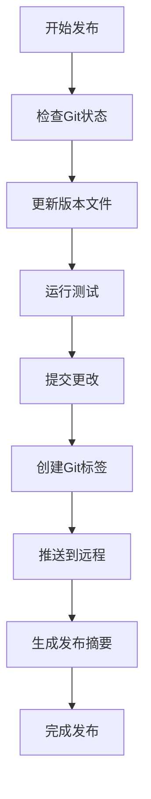
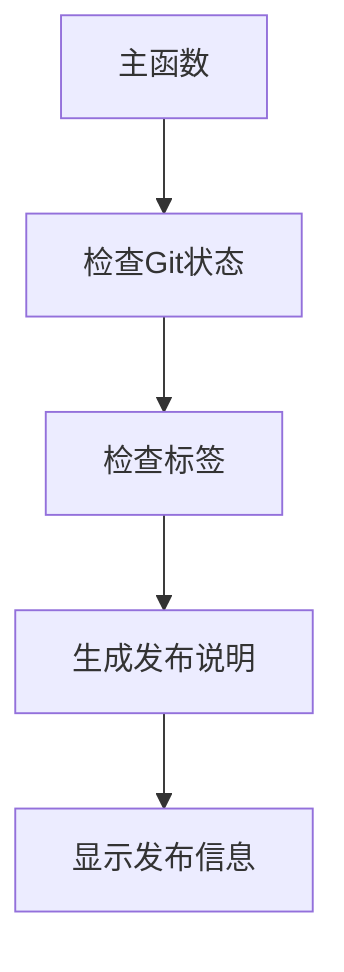
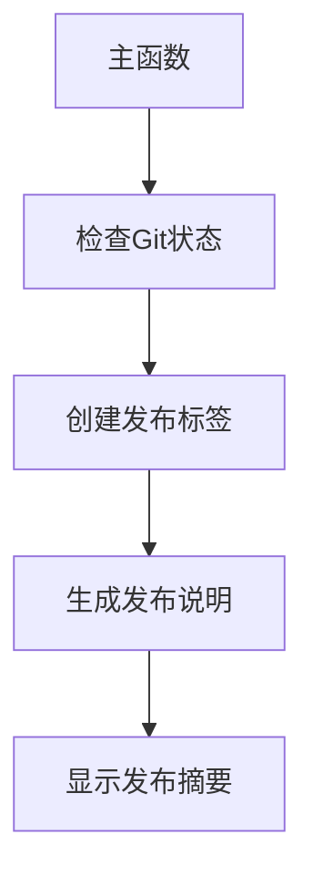
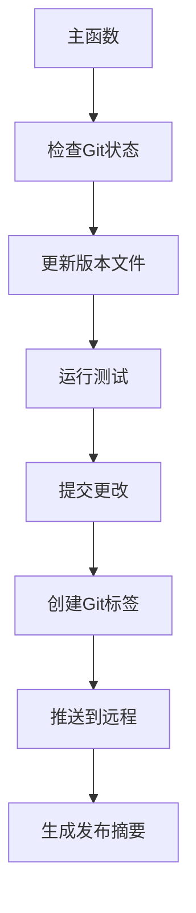
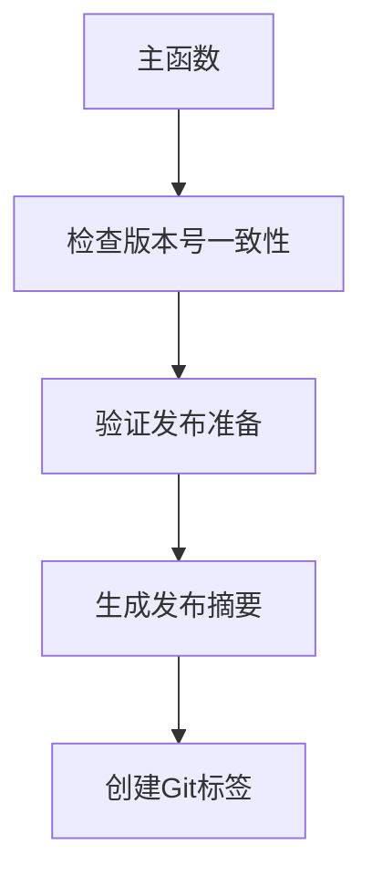
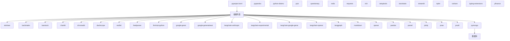

# 版本发布管理

<cite>
**本文档引用的文件**  
- [create_github_release.py](file://scripts/deployment/create_github_release.py)
- [release_v0.1.2.py](file://scripts/deployment/release_v0.1.2.py)
- [release_v0.1.3.py](file://scripts/deployment/release_v0.1.3.py)
- [release_v0.1.9.py](file://scripts/deployment/release_v0.1.9.py)
- [version_manager.py](file://scripts/maintenance/version_manager.py)
- [pyproject.toml](file://pyproject.toml)
- [uv.lock](file://uv.lock)
- [Dockerfile](file://Dockerfile)
- [docker-compose.yml](file://docker-compose.yml)
</cite>

## 目录

1. [引言](#引言)
2. [项目结构](#项目结构)
3. [核心发布脚本](#核心发布脚本)
4. [版本发布流程](#版本发布流程)
5. [详细组件分析](#详细组件分析)
6. [依赖分析](#依赖分析)
7. [性能考虑](#性能考虑)
8. [故障排除指南](#故障排除指南)
9. [结论](#结论)

## 引言
本文档详细说明了TradingAgents-CN项目的版本发布管理流程。文档涵盖了从开发到生产的完整发布流程，重点介绍了使用`create_github_release.py`脚本自动化创建GitHub Release的步骤，包括版本号管理、变更日志生成和资产上传。文档还解释了各版本发布脚本（如`release_v0.1.2.py`等）的功能和执行流程，以及如何与`pyproject.toml`和`uv.lock`中的依赖版本保持同步。此外，文档提供了版本兼容性测试、发布前验证检查清单和回滚策略，并涵盖了Docker镜像标签管理、发布分支策略和持续集成/持续部署（CI/CD）的最佳实践。

## 项目结构

**图源**  
- [create_github_release.py](file://scripts/deployment/create_github_release.py)
- [release_v0.1.2.py](file://scripts/deployment/release_v0.1.2.py)
- [release_v0.1.3.py](file://scripts/deployment/release_v0.1.3.py)
- [release_v0.1.9.py](file://scripts/deployment/release_v0.1.9.py)
- [version_manager.py](file://scripts/maintenance/version_manager.py)
- [pyproject.toml](file://pyproject.toml)
- [uv.lock](file://uv.lock)
- [Dockerfile](file://Dockerfile)
- [docker-compose.yml](file://docker-compose.yml)

**节源**  
- [scripts/deployment](file://scripts/deployment)
- [scripts/maintenance](file://scripts/maintenance)
- [scripts/validation](file://scripts/validation)

## 核心发布脚本

本文档分析了多个核心发布脚本，包括`create_github_release.py`、`release_v0.1.2.py`、`release_v0.1.3.py`和`release_v0.1.9.py`。这些脚本共同构成了TradingAgents-CN项目的版本发布管理体系。`create_github_release.py`脚本负责自动化创建GitHub Release，而各个`release_vX.X.X.py`脚本则针对特定版本的发布流程进行了定制化处理。`version_manager.py`脚本提供了版本管理的通用功能，如版本号递增、Git标签创建和变更日志更新。

**节源**  
- [create_github_release.py](file://scripts/deployment/create_github_release.py)
- [release_v0.1.2.py](file://scripts/deployment/release_v0.1.2.py)
- [release_v0.1.3.py](file://scripts/deployment/release_v0.1.3.py)
- [release_v0.1.9.py](file://scripts/deployment/release_v0.1.9.py)
- [version_manager.py](file://scripts/maintenance/version_manager.py)

## 版本发布流程

**图源**  
- [release_v0.1.3.py](file://scripts/deployment/release_v0.1.3.py)
- [version_manager.py](file://scripts/maintenance/version_manager.py)

**节源**  
- [release_v0.1.3.py](file://scripts/deployment/release_v0.1.3.py)
- [version_manager.py](file://scripts/maintenance/version_manager.py)

## 详细组件分析

### create_github_release.py 分析

`create_github_release.py`脚本是自动化创建GitHub Release的核心工具。该脚本首先检查是否在正确的分支上，然后检查是否有未推送的提交，接着检查标签是否存在。如果所有检查都通过，脚本会生成发布说明并保存到文件中，最后显示GitHub Release创建指南。

**图源**  
- [create_github_release.py](file://scripts/deployment/create_github_release.py)

**节源**  
- [create_github_release.py](file://scripts/deployment/create_github_release.py)

### release_v0.1.2.py 分析

`release_v0.1.2.py`脚本是针对v0.1.2版本的发布脚本。该脚本首先检查Git状态，然后创建发布标签，接着生成发布说明，最后显示发布摘要。该脚本的执行流程相对简单，主要关注于版本标签的创建和发布说明的生成。

**图源**  
- [release_v0.1.2.py](file://scripts/deployment/release_v0.1.2.py)

**节源**  
- [release_v0.1.2.py](file://scripts/deployment/release_v0.1.2.py)

### release_v0.1.3.py 分析

`release_v0.1.3.py`脚本是针对v0.1.3版本的发布脚本。该脚本的执行流程更加复杂，包括检查Git状态、更新版本文件、运行测试、提交更改、创建Git标签、推送到远程和生成发布摘要。该脚本还包含了用户交互功能，如询问是否继续发布。

**图源**  
- [release_v0.1.3.py](file://scripts/deployment/release_v0.1.3.py)

**节源**  
- [release_v0.1.3.py](file://scripts/deployment/release_v0.1.3.py)

### release_v0.1.9.py 分析

`release_v0.1.9.py`脚本是针对v0.1.9版本的发布脚本。该脚本的主要功能是检查版本号一致性、验证发布准备、生成发布摘要和创建Git标签。该脚本还包含了详细的发布亮点和用户体验提升的描述。

**图源**  
- [release_v0.1.9.py](file://scripts/deployment/release_v0.1.9.py)

**节源**  
- [release_v0.1.9.py](file://scripts/deployment/release_v0.1.9.py)

## 依赖分析

**图源**  
- [pyproject.toml](file://pyproject.toml)

**节源**  
- [pyproject.toml](file://pyproject.toml)
- [uv.lock](file://uv.lock)

## 性能考虑

在版本发布过程中，性能是一个重要的考虑因素。发布脚本需要在合理的时间内完成所有操作，包括检查Git状态、更新版本文件、运行测试、提交更改、创建Git标签、推送到远程和生成发布摘要。为了提高性能，可以考虑并行执行一些独立的操作，如同时检查Git状态和更新版本文件。此外，还可以优化测试套件，只运行与发布相关的测试，以减少测试时间。

## 故障排除指南

在版本发布过程中可能会遇到各种问题，如Git状态检查失败、标签创建失败、测试失败等。为了帮助用户解决这些问题，以下是一些常见的故障排除步骤：

1. **Git状态检查失败**：确保在正确的分支上，并且没有未提交的更改。
2. **标签创建失败**：检查标签是否已存在，如果存在则删除现有标签并重新创建。
3. **测试失败**：检查测试日志以确定失败原因，并根据需要修复代码或配置。
4. **推送失败**：检查网络连接，并确保有权限推送到远程仓库。

**节源**  
- [create_github_release.py](file://scripts/deployment/create_github_release.py)
- [release_v0.1.2.py](file://scripts/deployment/release_v0.1.2.py)
- [release_v0.1.3.py](file://scripts/deployment/release_v0.1.3.py)
- [release_v0.1.9.py](file://scripts/deployment/release_v0.1.9.py)

## 结论

本文档详细说明了TradingAgents-CN项目的版本发布管理流程。通过使用`create_github_release.py`脚本和各个`release_vX.X.X.py`脚本，可以实现自动化创建GitHub Release，包括版本号管理、变更日志生成和资产上传。通过与`pyproject.toml`和`uv.lock`中的依赖版本保持同步，可以确保发布的版本具有一致的依赖关系。此外，通过版本兼容性测试、发布前验证检查清单和回滚策略，可以确保发布的版本稳定可靠。最后，通过Docker镜像标签管理、发布分支策略和持续集成/持续部署（CI/CD）的最佳实践，可以实现高效的版本发布和管理。