# 健康检查监控

<cite>
**本文档引用的文件**
- [docker-compose.yml](file://docker-compose.yml)
- [Dockerfile](file://Dockerfile)
- [scripts/docker/README.md](file://scripts/docker/README.md)
- [scripts/debug_docker.sh](file://scripts/debug_docker.sh)
- [scripts/verify_docker_logs.py](file://scripts/verify_docker_logs.py)
- [scripts/mongo-init.js](file://scripts/mongo-init.js)
</cite>

## 目录
1. [简介](#简介)
2. [项目结构](#项目结构)
3. [核心组件](#核心组件)
4. [架构概述](#架构概述)
5. [详细组件分析](#详细组件分析)
6. [依赖分析](#依赖分析)
7. [性能考虑](#性能考虑)
8. [故障排除指南](#故障排除指南)
9. [结论](#结论)

## 简介
本文档详细说明了在Docker环境下Web应用、MongoDB和Redis服务的健康检查配置。文档解释了docker-compose.yml中healthcheck指令的配置参数，包括test命令、interval、timeout、retries等设置。提供了各服务健康检查的具体实现方法：Web应用通过HTTP GET请求检查/health端点，MongoDB通过mongo --eval执行数据库连接测试，Redis通过redis-cli ping命令验证服务可用性。包含健康检查失败时的诊断步骤和恢复策略，以及如何通过docker inspect命令查看服务健康状态。

## 项目结构
本项目采用模块化结构，主要包含web应用、tradingagents核心模块、配置文件、脚本工具等。Docker相关配置集中在根目录的docker-compose.yml文件中，健康检查配置也在此文件中定义。

```mermaid
graph TD
A[项目根目录] --> B[docker-compose.yml]
A --> C[Dockerfile]
A --> D[web]
A --> E[tradingagents]
A --> F[scripts]
A --> G[config]
B --> H[Web服务健康检查]
B --> I[MongoDB健康检查]
B --> J[Redis健康检查]
F --> K[调试脚本]
F --> L[验证脚本]
```



**Diagram sources**
- [docker-compose.yml](file://docker-compose.yml#L1-L158)
- [scripts/docker/README.md](file://scripts/docker/README.md#L1-L29)

**Section sources**
- [docker-compose.yml](file://docker-compose.yml#L1-L158)
- [scripts/docker/README.md](file://scripts/docker/README.md#L1-L29)

## 核心组件
本项目的核心组件包括基于Streamlit的Web应用、MongoDB数据库和Redis缓存服务。这些组件通过Docker Compose进行编排和管理，每个服务都配置了详细的健康检查机制，确保系统稳定运行。

**Section sources**
- [docker-compose.yml](file://docker-compose.yml#L1-L158)
- [Dockerfile](file://Dockerfile#L1-L58)

## 架构概述
系统采用微服务架构，由Web应用、MongoDB数据库和Redis缓存组成。Web应用作为前端界面，MongoDB用于持久化存储，Redis提供高速缓存。所有服务通过Docker Compose统一管理，通过自定义网络tradingagents-network进行通信。


**Diagram sources**
- [docker-compose.yml](file://docker-compose.yml#L1-L158)

## 详细组件分析

### Web应用健康检查分析
Web应用服务配置了基于HTTP请求的健康检查，通过访问特定端点来验证服务的可用性。


**Diagram sources**
- [docker-compose.yml](file://docker-compose.yml#L47-L58)

**Section sources**
- [docker-compose.yml](file://docker-compose.yml#L47-L58)

### MongoDB健康检查分析
MongoDB服务配置了基于数据库命令的健康检查，通过执行ping命令来验证数据库的连接性和响应能力。

```mermaid
flowchart TD
Start([健康检查开始]) --> Execute["执行: echo 'db.runCommand(\"ping\").ok' | mongo localhost:27017/test --quiet"]
Execute --> CheckResult{"返回结果是否为1?"}
CheckResult --> |是| Success[健康状态: 正常]
CheckResult --> |否| Fail[健康状态: 异常]
Success --> End([健康检查结束])
Fail --> End
```

**Diagram sources**
- [docker-compose.yml](file://docker-compose.yml#L78-L87)
- [scripts/mongo-init.js](file://scripts/mongo-init.js#L1-L46)

**Section sources**
- [docker-compose.yml](file://docker-compose.yml#L78-L87)
- [scripts/mongo-init.js](file://scripts/mongo-init.js#L1-L46)

### Redis健康检查分析
Redis服务配置了基于redis-cli命令的健康检查，通过递增ping键的值来验证服务的读写能力。


**Diagram sources**
- [docker-compose.yml](file://docker-compose.yml#L97-L106)

**Section sources**
- [docker-compose.yml](file://docker-compose.yml#L97-L106)

## 依赖分析
各服务之间存在明确的依赖关系，Web应用依赖于MongoDB和Redis服务，管理界面依赖于相应的数据库服务。


**Diagram sources**
- [docker-compose.yml](file://docker-compose.yml#L1-L158)

**Section sources**
- [docker-compose.yml](file://docker-compose.yml#L1-L158)

## 性能考虑
健康检查配置需要平衡监控频率和系统负载。当前配置采用30秒间隔，10秒超时，既保证了及时发现故障，又避免了过于频繁的检查对系统造成额外负担。start_period设置为30-60秒，为服务启动预留了足够时间，避免了启动过程中的误判。

## 故障排除指南
当健康检查失败时，可按照以下步骤进行诊断和恢复：

1. **查看服务状态**: 使用`docker-compose ps`命令查看各服务状态
2. **检查日志信息**: 使用`docker-compose logs [服务名]`查看详细日志
3. **手动测试连接**: 对于数据库服务，可使用相应客户端工具手动测试连接
4. **检查网络配置**: 确认服务间网络通信正常
5. **验证配置文件**: 检查环境变量和配置文件是否正确


**Diagram sources**
- [scripts/debug_docker.sh](file://scripts/debug_docker.sh#L1-L46)
- [scripts/verify_docker_logs.py](file://scripts/verify_docker_logs.py#L1-L242)

**Section sources**
- [scripts/debug_docker.sh](file://scripts/debug_docker.sh#L1-L46)
- [scripts/verify_docker_logs.py](file://scripts/verify_docker_logs.py#L1-L242)

## 结论
本项目通过docker-compose.yml中的healthcheck指令实现了对Web应用、MongoDB和Redis服务的全面健康监控。配置合理，能够有效检测服务状态，为系统的稳定运行提供了保障。当健康检查失败时，可通过提供的诊断步骤快速定位和解决问题，确保服务的高可用性。