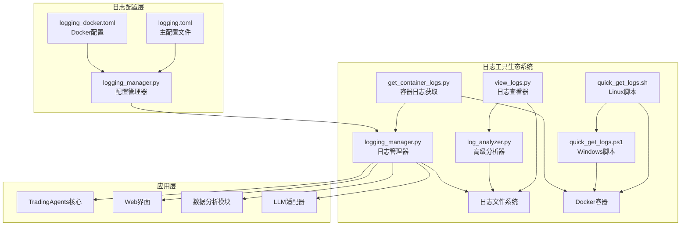
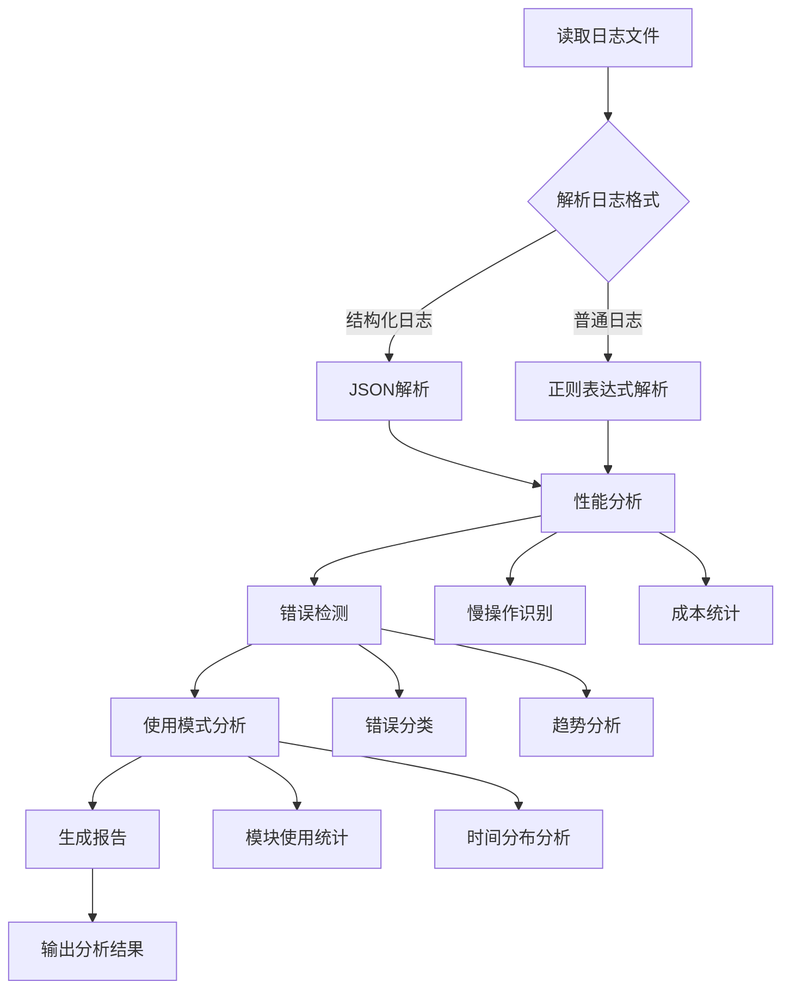
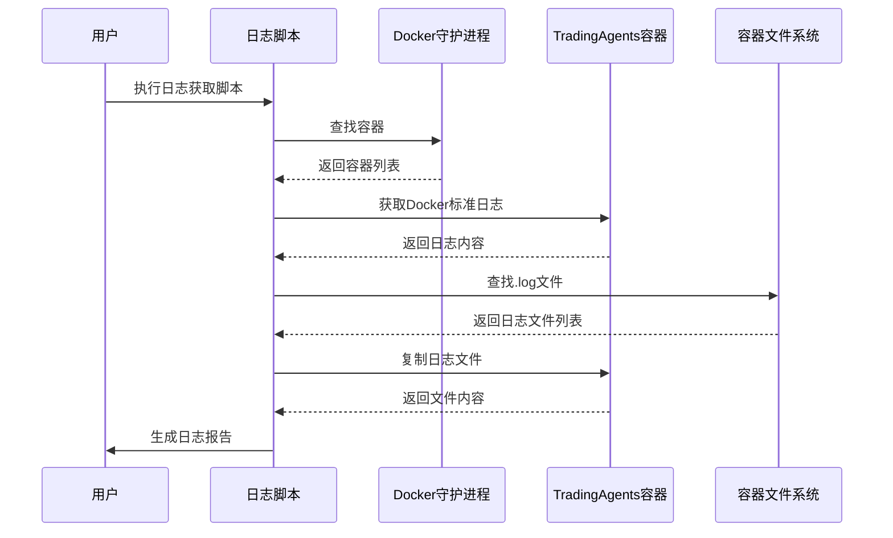

# 日志分析工具

<cite>
**本文档中引用的文件**
- [view_logs.py](file://scripts/view_logs.py)
- [log_analyzer.py](file://scripts/log_analyzer.py)
- [quick_get_logs.sh](file://scripts/quick_get_logs.sh)
- [quick_get_logs.ps1](file://scripts/quick_get_logs.ps1)
- [get_container_logs.py](file://scripts/get_container_logs.py)
- [logging.toml](file://config/logging.toml)
- [logging_docker.toml](file://config/logging_docker.toml)
- [logging_manager.py](file://tradingagents/utils/logging_manager.py)
- [logging_init.py](file://tradingagents/utils/logging_init.py)
- [test_docker_logging.py](file://scripts/test_docker_logging.py)
</cite>

## 目录
1. [简介](#简介)
2. [系统架构概览](#系统架构概览)
3. [核心工具详解](#核心工具详解)
4. [日志配置管理](#日志配置管理)
5. [高级分析功能](#高级分析功能)
6. [Docker环境支持](#docker环境支持)
7. [常见使用场景](#常见使用场景)
8. [故障排除指南](#故障排除指南)
9. [最佳实践建议](#最佳实践建议)

## 简介

TradingAgents-CN 提供了一套完整的日志分析工具链，帮助开发者和运维人员高效地查看、分析和诊断系统运行状态。这些工具涵盖了从简单的日志查看到复杂的性能分析等多个层面，为系统的稳定运行提供了强有力的支持。

### 主要特性

- **多维度日志查看**：支持按级别、模块、关键词等多种方式过滤和查看日志
- **实时监控**：提供实时日志跟踪功能，及时发现系统异常
- **智能分析**：自动识别错误模式、性能瓶颈和使用趋势
- **Docker友好**：专门针对Docker容器环境优化的日志获取和分析工具
- **结构化支持**：同时支持传统文本日志和结构化JSON日志

## 系统架构概览



**图表来源**
- [view_logs.py](file://scripts/view_logs.py#L1-L228)
- [log_analyzer.py](file://scripts/log_analyzer.py#L1-L373)
- [logging_manager.py](file://tradingagents/utils/logging_manager.py#L1-L373)

## 核心工具详解

### view_logs.py - 综合日志查看器

view_logs.py 是一个功能强大的日志查看和分析工具，提供了直观的交互界面来浏览和分析系统日志。

#### 主要功能

1. **日志文件管理**
   - 自动扫描并显示所有可用的日志文件
   - 按修改时间排序，优先显示最新文件
   - 显示文件大小和详细信息

2. **多维度查看模式**
   - **完整内容查看**：显示整个日志文件内容
   - **分页查看**：只显示最后N行，便于关注最新内容
   - **实时跟踪**：持续监控新产生的日志行

3. **智能搜索功能**
   - 支持关键词搜索，高亮显示匹配项
   - 智能忽略大小写，提高搜索效率
   - 显示匹配位置和上下文

4. **Docker集成**
   - 提供Docker日志查看指导
   - 支持直接运行Docker日志命令

#### 使用示例

```bash
# 启动日志查看器
python scripts/view_logs.py

# 选择操作：
# 1. 显示所有日志文件
# 2. 查看日志文件内容
# 3. 实时跟踪日志
# 4. 搜索日志内容
# 5. 查看Docker日志
```

**章节来源**
- [view_logs.py](file://scripts/view_logs.py#L1-L228)

### log_analyzer.py - 高级分析工具

log_analyzer.py 是一个专业的日志分析工具，能够自动识别和分析日志中的关键信息，提供深入的性能和错误分析。

#### 核心分析能力

1. **性能分析**
   - 自动识别慢操作（超过5秒的操作）
   - 统计平均分析时间和完成次数
   - 分析Token使用和API成本

2. **错误检测**
   - 自动分类错误类型（API错误、网络错误、数据库错误等）
   - 统计错误频率和趋势
   - 提供最近错误的详细信息

3. **使用模式分析**
   - 按日、按小时统计使用量
   - 分析活跃模块和分析类型
   - 识别使用高峰时段

4. **智能报告生成**
   - 自动生成详细的分析报告
   - 提供优化建议和改进建议
   - 支持多种输出格式（文本、JSON）

#### 分析流程图



**图表来源**
- [log_analyzer.py](file://scripts/log_analyzer.py#L21-L373)

**章节来源**
- [log_analyzer.py](file://scripts/log_analyzer.py#L1-L373)

## 日志配置管理

### 配置文件结构

TradingAgents-CN 提供了灵活的日志配置系统，支持不同的部署环境和使用需求。

#### 主配置文件 (logging.toml)

主要配置文件包含了完整的日志系统设置：

- **全局日志级别**：控制整体日志输出的详细程度
- **格式配置**：定义控制台和文件日志的输出格式
- **处理器配置**：设置不同类型的日志处理器
- **模块特定配置**：为不同模块设置独立的日志级别

#### Docker专用配置 (logging_docker.toml)

专门为Docker环境优化的配置文件：

- **容器化优化**：针对Docker容器的特殊需求进行了调整
- **文件系统兼容**：正确配置了Docker环境中的文件路径
- **性能调优**：优化了Docker环境下的日志性能

### 配置特性

| 配置项 | 主配置 | Docker配置 | 说明 |
|--------|--------|------------|------|
| 控制台输出 | ✅ 彩色显示 | ✅ 禁用彩色 | 开发环境启用彩色增强可读性 |
| 文件日志 | ✅ 启用 | ✅ 启用 | 生产环境建议启用文件日志 |
| 结构化日志 | ❌ 默认关闭 | ✅ 启用 | JSON格式便于机器解析 |
| 日志轮转 | ✅ 10MB/5个备份 | ✅ 100MB/5个备份 | Docker环境使用更大文件 |
| Docker模式 | ❌ 禁用 | ✅ 启用 | 自动检测Docker环境 |

**章节来源**
- [logging.toml](file://config/logging.toml#L1-L111)
- [logging_docker.toml](file://config/logging_docker.toml#L1-L100)

## 高级分析功能

### 性能监控分析

log_analyzer.py 提供了深入的性能监控功能：

#### 慢操作识别
- 自动检测执行时间超过阈值的操作
- 识别影响用户体验的关键性能瓶颈
- 提供详细的性能指标和趋势分析

#### 成本分析
- 统计不同LLM提供商的成本使用情况
- 分析Token使用效率
- 识别高成本操作模式

#### 响应时间分析
- 计算平均分析完成时间
- 识别响应时间异常的操作
- 提供性能优化建议

### 错误模式识别

系统能够自动识别和分类常见的错误模式：

#### 错误分类体系
- **API错误**：第三方服务调用失败
- **网络错误**：连接超时、网络不稳定
- **数据库错误**：数据访问异常
- **PDF导出错误**：文档生成失败
- **其他错误**：未分类的一般性错误

#### 错误趋势分析
- 统计错误发生频率
- 识别错误发生的规律性
- 提供错误预防建议

### 使用模式分析

#### 模块使用统计
- 识别最活跃的系统模块
- 分析模块间的依赖关系
- 识别潜在的模块性能问题

#### 时间分布分析
- 按小时统计使用量
- 识别使用高峰时段
- 分析用户行为模式

**章节来源**
- [log_analyzer.py](file://scripts/log_analyzer.py#L60-L373)

## Docker环境支持

### Docker日志获取工具

TradingAgents-CN 提供了专门的Docker日志获取工具，简化了容器环境中日志收集的过程。

#### 跨平台支持

1. **Linux环境**：quick_get_logs.sh 脚本
   ```bash
   ./scripts/quick_get_logs.sh
   ```

2. **Windows环境**：quick_get_logs.ps1 脚本
   ```powershell
   powershell -ExecutionPolicy Bypass -File scripts\quick_get_logs.ps1
   ```

#### 自动化功能



**图表来源**
- [quick_get_logs.sh](file://scripts/quick_get_logs.sh#L1-L117)
- [quick_get_logs.ps1](file://scripts/quick_get_logs.ps1#L1-L141)

#### 功能特性

1. **智能容器识别**
   - 自动检测多种可能的容器名称
   - 提供手动选择选项
   - 显示当前运行的容器列表

2. **全面的日志收集**
   - 获取Docker标准日志
   - 复制容器内的日志文件
   - 检查应用目录结构
   - 分析环境配置

3. **自动化处理**
   - 自动生成时间戳文件名
   - 自动计算文件大小和行数
   - 提供详细的进度信息

### 容器日志管理

get_container_logs.py 提供了更精细的容器日志管理功能：

#### 核心功能
- **文件系统探索**：自动查找容器内的日志文件
- **文件信息检查**：显示文件大小、修改时间等信息
- **内容预览**：安全地预览日志文件内容
- **批量复制**：支持一次性复制多个日志文件

**章节来源**
- [quick_get_logs.sh](file://scripts/quick_get_logs.sh#L1-L117)
- [quick_get_logs.ps1](file://scripts/quick_get_logs.ps1#L1-L141)
- [get_container_logs.py](file://scripts/get_container_logs.py#L1-L274)

## 常见使用场景

### 场景一：查找特定股票代码的分析日志

**目标**：快速定位某个特定股票的分析日志

**步骤**：
1. 启动日志查看器
2. 选择实时跟踪功能
3. 在另一个终端窗口运行分析
4. 观察实时日志输出

**命令示例**：
```bash
# 方式1：使用view_logs.py
python scripts/view_logs.py

# 方式2：直接搜索关键词
python scripts/view_logs.py --search "AAPL"
```

### 场景二：追踪LLM调用错误

**目标**：识别和分析LLM API调用中的错误

**分析步骤**：
1. 使用log_analyzer.py分析日志
2. 关注错误分类统计
3. 检查API调用相关的错误模式
4. 分析Token使用成本

**命令示例**：
```bash
# 分析日志并生成报告
python scripts/log_analyzer.py logs/tradingagents.log --output error_report.txt

# 查看特定错误类型的统计
grep -i "api.*error\|llm.*error" logs/tradingagents.log | wc -l
```

### 场景三：分析长时间运行的操作

**目标**：识别系统中的性能瓶颈

**分析方法**：
1. 启用性能监控日志
2. 运行系统一段时间
3. 使用log_analyzer.py分析慢操作
4. 识别高频的慢操作

**配置要求**：
```toml
[logging.performance]
log_slow_operations = true
slow_threshold_seconds = 5.0
```

### 场景四：监控系统使用趋势

**目标**：了解系统的使用模式和增长趋势

**分析内容**：
- 按日统计使用量
- 分析模块使用频率
- 识别使用高峰时段

**命令示例**：
```bash
# 分析使用模式
python scripts/log_analyzer.py logs/tradingagents.log --usage

# 查看最近的使用统计
tail -100 logs/tradingagents.log | grep "分析完成" | wc -l
```

### 场景五：Docker环境故障排查

**目标**：在Docker环境中快速获取和分析日志

**步骤**：
1. 使用Docker日志脚本获取日志
2. 检查Docker标准日志
3. 分析容器内的日志文件
4. 对比不同来源的日志信息

**命令示例**：
```bash
# Linux环境
./scripts/quick_get_logs.sh

# Windows环境
powershell -ExecutionPolicy Bypass -File scripts\quick_get_logs.ps1

# 手动分析获取的日志
python scripts/log_analyzer.py docker_logs_*.log
```

## 故障排除指南

### 常见问题及解决方案

#### 问题1：日志文件为空或未生成

**症状**：查看日志文件时发现内容为空

**可能原因**：
- 日志级别设置过高，导致没有输出
- 文件权限问题
- 日志配置错误

**解决方案**：
```bash
# 检查日志配置
cat config/logging.toml | grep -i level

# 检查文件权限
ls -la logs/

# 临时提高日志级别
export TRADINGAGENTS_LOG_LEVEL=DEBUG
python main.py
```

#### 问题2：Docker日志获取失败

**症状**：Docker日志脚本无法找到容器或获取日志

**解决方案**：
1. 确认容器正在运行
2. 手动指定容器名称
3. 检查Docker权限

```bash
# 检查容器状态
docker ps

# 手动指定容器名称
./scripts/quick_get_logs.sh

# 检查Docker权限
docker info
```

#### 问题3：日志分析结果不准确

**症状**：log_analyzer.py的分析结果与实际情况不符

**可能原因**：
- 日志格式不匹配
- 时间戳解析错误
- 结构化日志配置问题

**解决方案**：
```bash
# 检查日志格式配置
cat config/logging.toml | grep -A 5 "\[logging.format\]"

# 测试日志解析
python -c "
import json
with open('logs/tradingagents.log', 'r') as f:
    for line in f:
        if line.strip().startswith('{'):
            try:
                print(json.loads(line))
            except:
                print('JSON解析失败:', line[:100])
"
```

#### 问题4：性能分析阈值不合适

**症状**：慢操作识别过于宽松或严格

**解决方案**：
```toml
# 修改性能监控配置
[logging.performance]
slow_threshold_seconds = 10.0  # 调整阈值
log_slow_operations = true
```

### 调试技巧

#### 1. 启用详细日志
```bash
# 设置开发环境
export TRADINGAGENTS_LOG_LEVEL=DEBUG
export TRADINGAGENTS_ENV=development
python main.py
```

#### 2. 测试日志功能
```bash
# 测试Docker日志
python scripts/test_docker_logging.py

# 测试日志配置
python -c "
from tradingagents.utils.logging_init import init_logging
init_logging()
print('日志系统初始化完成')
"
```

#### 3. 验证日志格式
```bash
# 检查日志格式是否正确
grep -E "^\d{4}-\d{2}-\d{2} \d{2}:\d{2}:\d{2}," logs/tradingagents.log | head -5
```

**章节来源**
- [test_docker_logging.py](file://scripts/test_docker_logging.py#L1-L64)
- [logging_init.py](file://tradingagents/utils/logging_init.py#L1-L166)

## 最佳实践建议

### 日志配置最佳实践

#### 1. 环境区分配置
- **开发环境**：启用详细日志，包含调试信息
- **测试环境**：平衡性能和信息量
- **生产环境**：优化性能，重点关注错误和性能指标

#### 2. 日志级别管理
```toml
# 开发环境配置
[logging]
level = "DEBUG"

[logging.loggers]
tradingagents = { level = "DEBUG" }
web = { level = "DEBUG" }
dataflows = { level = "DEBUG" }

# 生产环境配置
[logging]
level = "INFO"

[logging.loggers]
tradingagents = { level = "INFO" }
web = { level = "INFO" }
dataflows = { level = "WARNING" }
```

#### 3. 日志轮转策略
```toml
[logging.handlers.file]
max_size = "100MB"      # 生产环境使用大文件
backup_count = 10       # 保留更多历史文件
```

### 日志分析最佳实践

#### 1. 定期分析
- 每日检查错误统计
- 每周分析性能趋势
- 每月评估使用模式

#### 2. 关键指标监控
- 错误率：< 1%
- 平均响应时间：< 5秒
- API成本：< 预算限制

#### 3. 自动化监控
```bash
# 创建监控脚本
#!/bin/bash
python scripts/log_analyzer.py logs/tradingagents.log \
    --output reports/daily_report_$(date +%Y%m%d).txt \
    --format text
```

### Docker环境最佳实践

#### 1. 容器配置
```yaml
# docker-compose.yml
services:
  tradingagents:
    image: tradingagents:latest
    volumes:
      - ./logs:/app/logs
    environment:
      - DOCKER_CONTAINER=true
      - TRADINGAGENTS_LOG_DIR=/app/logs
```

#### 2. 日志收集策略
- 定期备份重要日志文件
- 监控磁盘空间使用
- 设置合理的日志保留期限

#### 3. 性能优化
```bash
# 优化Docker日志性能
echo '{"log-driver": "json-file", "log-opts": {"max-size": "100m", "max-file": "3"}}' \
    > /etc/docker/daemon.json
```

### 团队协作建议

#### 1. 日志标准
- 统一日志格式和命名规范
- 建立错误代码和描述标准
- 制定日志审查流程

#### 2. 文档维护
- 记录常见问题的解决方案
- 维护日志分析检查清单
- 建立知识库共享机制

#### 3. 培训计划
- 定期培训团队成员使用日志工具
- 分享最佳实践和经验
- 建立问题反馈和改进机制

通过合理使用这些日志分析工具和遵循最佳实践，可以显著提高系统的可观测性和运维效率，确保TradingAgents-CN系统的稳定可靠运行。