# 日志监控

<cite>
**本文档中引用的文件**
- [config/logging.toml](file://config/logging.toml)
- [config/logging_docker.toml](file://config/logging_docker.toml)
- [tradingagents/utils/logging_init.py](file://tradingagents/utils/logging_init.py)
- [tradingagents/utils/logging_manager.py](file://tradingagents/utils/logging_manager.py)
- [tradingagents/utils/tool_logging.py](file://tradingagents/utils/tool_logging.py)
- [web/utils/user_activity_logger.py](file://web/utils/user_activity_logger.py)
- [scripts/test_docker_logging.py](file://scripts/test_docker_logging.py)
- [scripts/log_analyzer.py](file://scripts/log_analyzer.py)
- [examples/simple_analysis_demo.py](file://examples/simple_analysis_demo.py)
</cite>

## 目录
1. [简介](#简介)
2. [系统架构概览](#系统架构概览)
3. [配置文件详解](#配置文件详解)
4. [日志处理器机制](#日志处理器机制)
5. [多维度日志监控](#多维度日志监控)
6. [性能监控日志](#性能监控日志)
7. [安全日志监控](#安全日志监控)
8. [业务日志监控](#业务日志监控)
9. [日志级别与异常识别](#日志级别与异常识别)
10. [结构化JSON日志](#结构化json日志)
11. [日志分析工具](#日志分析工具)
12. [故障排除指南](#故障排除指南)
13. [最佳实践](#最佳实践)

## 简介

TradingAgents-CN采用了一套完整的多维度日志监控系统，支持开发、生产和Docker三种环境的差异化配置。该系统提供了灵活的日志级别控制、强大的轮转机制、详细的性能监控、全面的安全审计和丰富的业务洞察功能。

## 系统架构概览

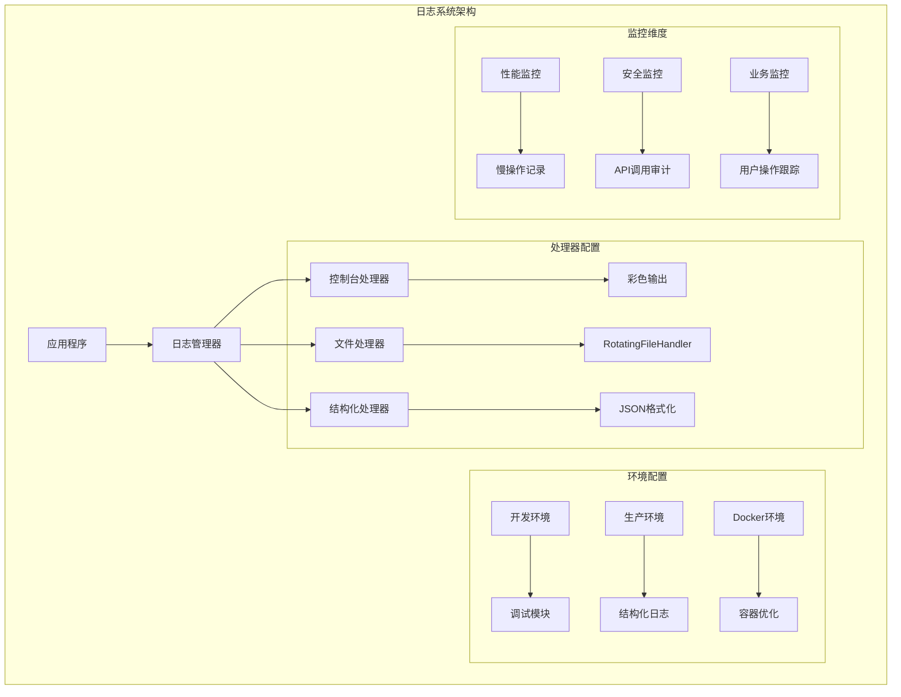

**图表来源**
- [tradingagents/utils/logging_manager.py](file://tradingagents/utils/logging_manager.py#L1-L50)
- [config/logging.toml](file://config/logging.toml#L1-L30)

## 配置文件详解

### 开发环境配置

开发环境专注于调试和问题诊断，提供详细的模块级日志：

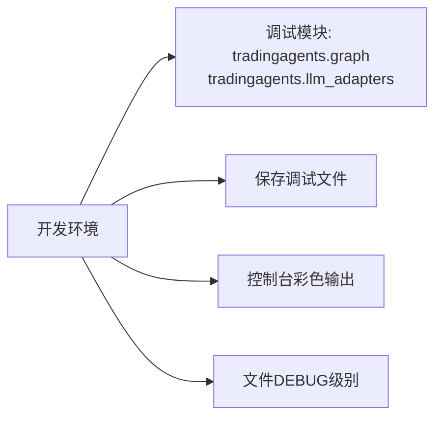

**图表来源**
- [config/logging.toml](file://config/logging.toml#L70-L75)

### 生产环境配置

生产环境强调性能和可维护性，采用结构化日志：

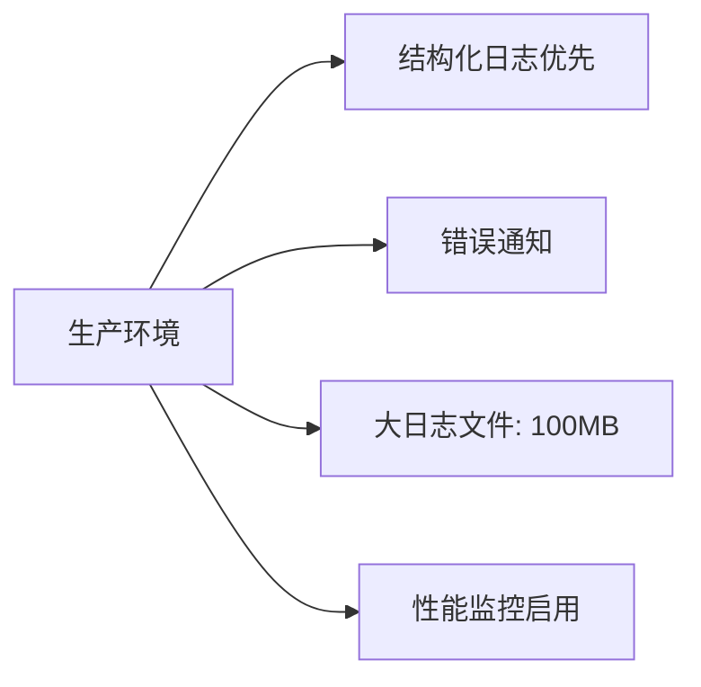

**图表来源**
- [config/logging.toml](file://config/logging.toml#L76-L82)

### Docker环境配置

Docker环境针对容器化部署进行了优化：

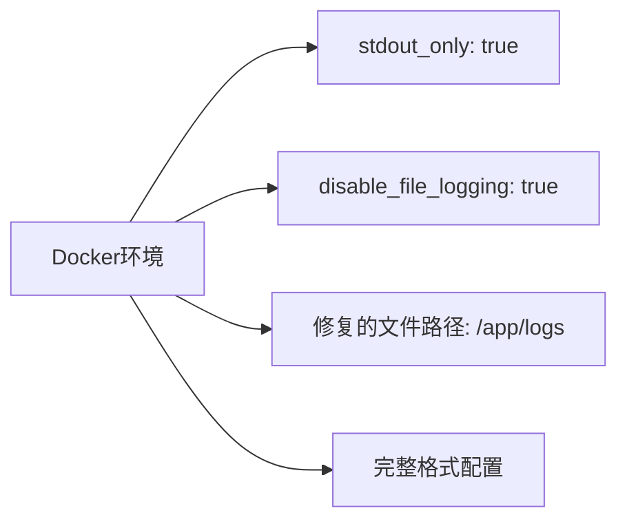

**图表来源**
- [config/logging_docker.toml](file://config/logging_docker.toml#L70-L75)

**章节来源**
- [config/logging.toml](file://config/logging.toml#L1-L111)
- [config/logging_docker.toml](file://config/logging_docker.toml#L1-L100)

## 日志处理器机制

### RotatingFileHandler轮转机制

系统使用Python标准库的RotatingFileHandler实现日志轮转：

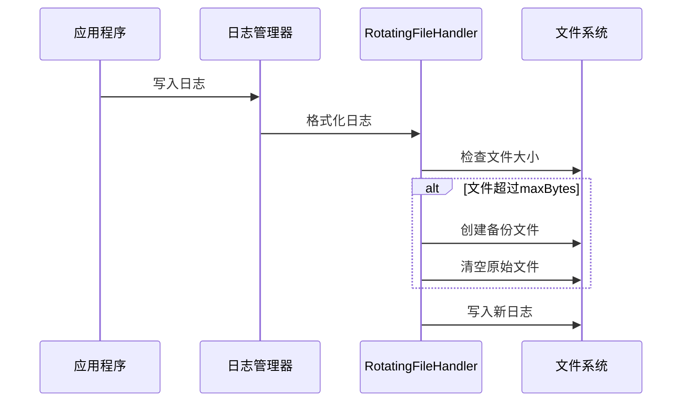

**图表来源**
- [tradingagents/utils/logging_manager.py](file://tradingagents/utils/logging_manager.py#L226-L240)

### 参数配置详解

| 参数 | 开发环境 | 生产环境 | Docker环境 | 说明 |
|------|----------|----------|------------|------|
| maxBytes | 10MB | 100MB | 100MB | 单个日志文件最大大小 |
| backupCount | 5 | 5 | 5 | 保留的备份文件数量 |
| directory | ./logs | ./logs | /app/logs | 日志存储目录 |

**章节来源**
- [tradingagents/utils/logging_manager.py](file://tradingagents/utils/logging_manager.py#L226-L260)

## 多维度日志监控

### 日志格式配置

系统提供三种日志格式，满足不同场景需求：

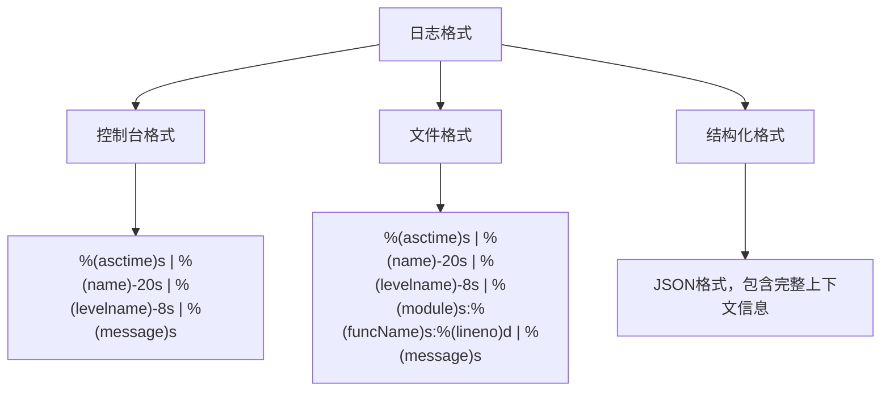

**图表来源**
- [config/logging.toml](file://config/logging.toml#L8-L10)

### 特定模块配置

系统为不同模块设置了专门的日志级别：

| 模块类别 | 推荐级别 | 说明 |
|----------|----------|------|
| tradingagents | INFO | 主应用模块 |
| web | INFO | Web界面模块 |
| dataflows | INFO | 数据流处理 |
| llm_adapters | INFO | LLM适配器 |
| streamlit | WARNING | 减少噪声 |
| urllib3 | WARNING | HTTP请求日志 |
| requests | WARNING | 请求库日志 |

**章节来源**
- [config/logging.toml](file://config/logging.toml#L40-L65)

## 性能监控日志

### 慢操作检测机制

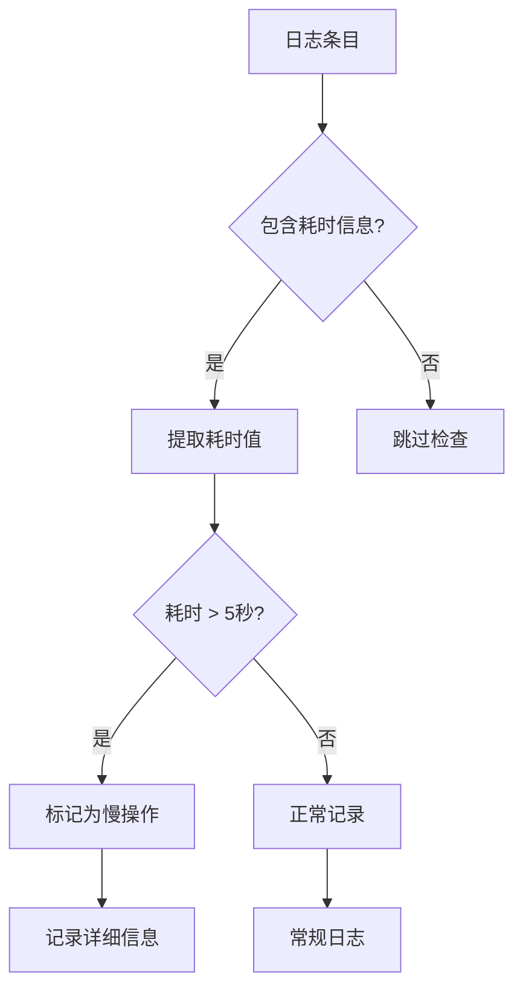

**图表来源**
- [scripts/log_analyzer.py](file://scripts/log_analyzer.py#L100-L130)

### 性能监控配置

| 配置项 | 开发环境 | 生产环境 | Docker环境 | 说明 |
|--------|----------|----------|------------|------|
| enabled | true | true | true | 性能监控开关 |
| log_slow_operations | true | true | true | 慢操作记录 |
| slow_threshold_seconds | 5.0 | 10.0 | 10.0 | 慢操作阈值(秒) |
| log_memory_usage | false | false | false | 内存使用记录 |

**章节来源**
- [config/logging.toml](file://config/logging.toml#L83-L89)

## 安全日志监控

### API调用审计

系统自动记录所有API调用的关键信息：

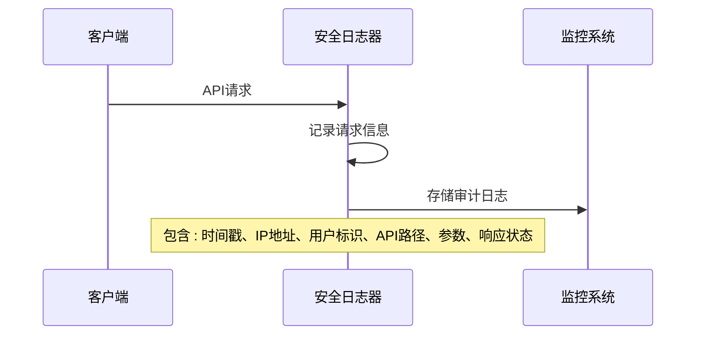

**图表来源**
- [tradingagents/utils/tool_logging.py](file://tradingagents/utils/tool_logging.py#L150-L200)

### Token使用监控

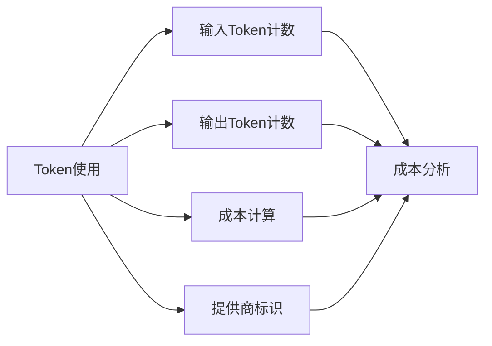

**图表来源**
- [tradingagents/utils/tool_logging.py](file://tradingagents/utils/tool_logging.py#L350-L380)

### 敏感数据保护

| 功能 | 开发环境 | 生产环境 | Docker环境 | 说明 |
|------|----------|----------|------------|------|
| mask_sensitive_data | true | true | true | 屏蔽敏感数据 |
| API调用记录 | 启用 | 启用 | 启用 | 完整审计轨迹 |
| Token使用追踪 | 启用 | 启用 | 启用 | 成本和使用分析 |

**章节来源**
- [config/logging.toml](file://config/logging.toml#L90-L96)

## 业务日志监控

### 用户操作跟踪

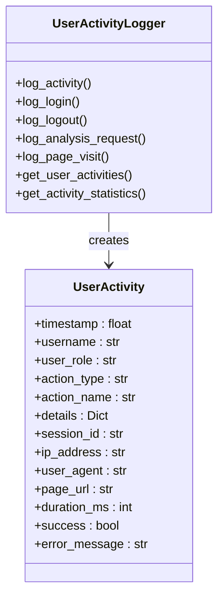

**图表来源**
- [web/utils/user_activity_logger.py](file://web/utils/user_activity_logger.py#L20-L40)

### 分析事件记录

系统自动记录所有分析相关的操作：

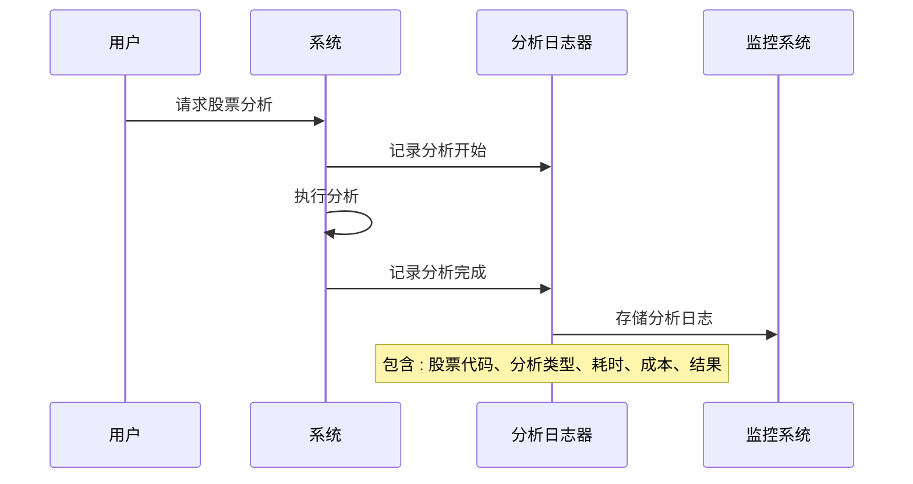

**图表来源**
- [tradingagents/utils/logging_manager.py](file://tradingagents/utils/logging_manager.py#L350-L410)

### 业务监控配置

| 监控类型 | 开启状态 | 记录内容 | 用途 |
|----------|----------|----------|------|
| log_analysis_events | true | 分析开始/完成 | 性能分析 |
| log_user_actions | true | 用户操作 | 行为分析 |
| log_export_events | true | 数据导出 | 合规审计 |

**章节来源**
- [config/logging.toml](file://config/logging.toml#L97-L103)

## 日志级别与异常识别

### 日志级别层次

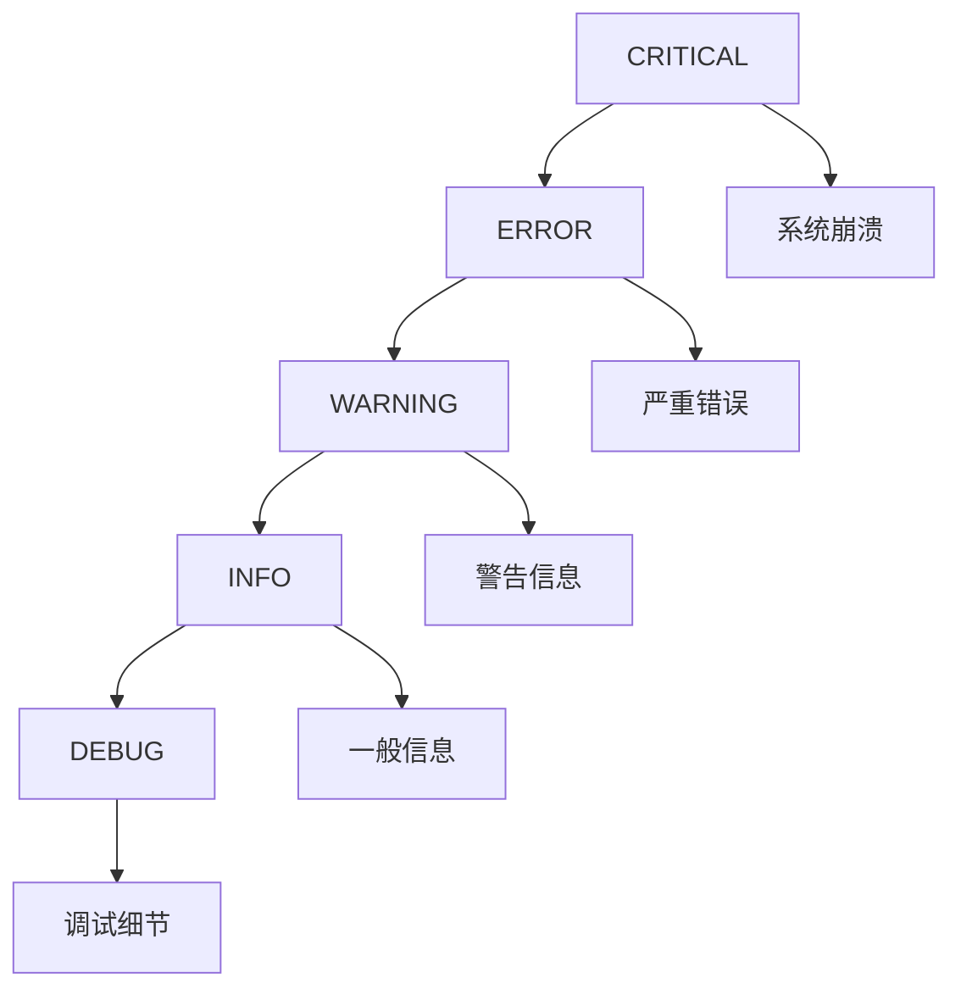

### 异常识别方法

| 级别 | 标识符 | 识别方法 | 响应措施 |
|------|--------|----------|----------|
| ERROR | ❌ | 错误日志数量 | 立即排查 |
| WARNING | ⚠️ | 警告日志数量 | 定期检查 |
| INFO | ℹ️ | 信息日志分布 | 监控趋势 |
| DEBUG | 🔍 | 调试日志内容 | 问题定位 |

### 常见异常模式

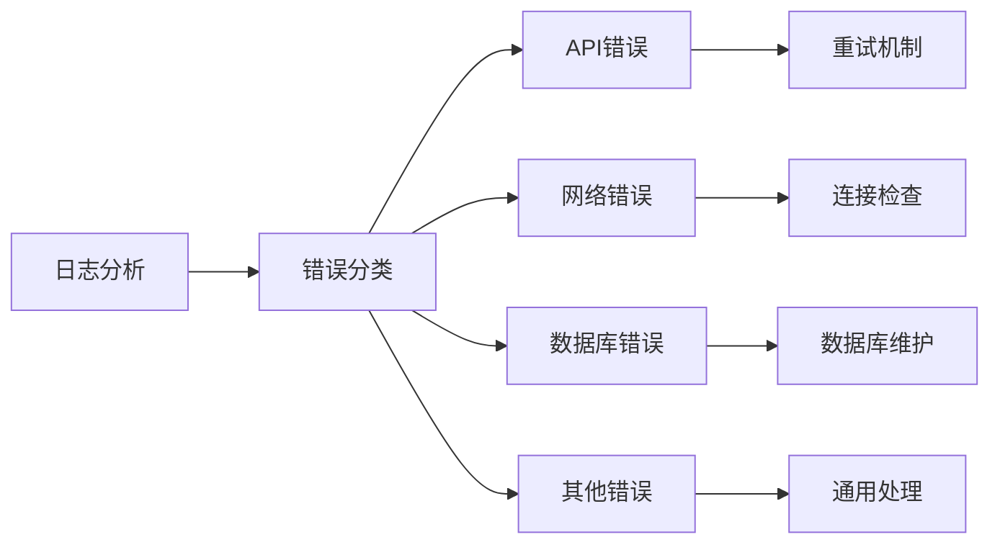

**图表来源**
- [scripts/log_analyzer.py](file://scripts/log_analyzer.py#L167-L198)

**章节来源**
- [scripts/log_analyzer.py](file://scripts/log_analyzer.py#L131-L198)

## 结构化JSON日志

### JSON格式优势

结构化日志提供了以下优势：

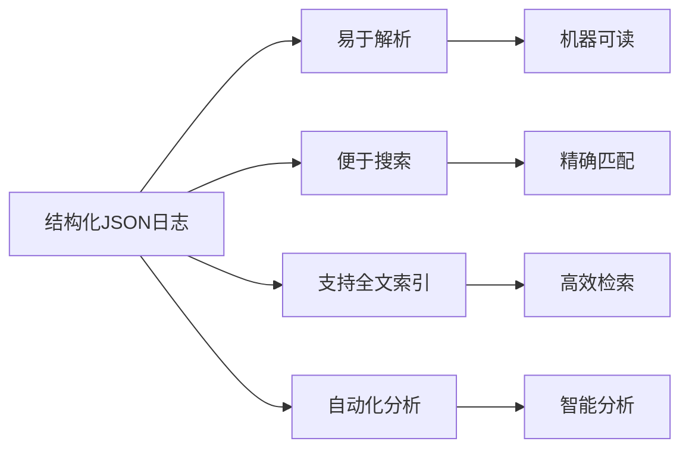

### JSON日志格式

```json
{
  "timestamp": "2024-01-15T10:30:45.123456",
  "level": "INFO",
  "logger": "tools",
  "message": "工具调用完成",
  "module": "tool_logging",
  "function": "wrapper",
  "line": 50,
  "session_id": "session_1234567890",
  "tool_name": "stock_analysis",
  "duration": 2.345,
  "event_type": "tool_call_success"
}
```

### 结构化日志配置

| 配置项 | 开发环境 | 生产环境 | Docker环境 | 说明 |
|--------|----------|----------|------------|------|
| enabled | false | true | true | 结构化日志开关 |
| level | INFO | INFO | INFO | 日志级别 |
| directory | ./logs | ./logs | /app/logs | 存储目录 |
| backupCount | 3 | 3 | 3 | 备份文件数 |

**章节来源**
- [tradingagents/utils/logging_manager.py](file://tradingagents/utils/logging_manager.py#L261-L280)
- [config/logging.toml](file://config/logging.toml#L25-L30)

## 日志分析工具

### LogAnalyzer功能

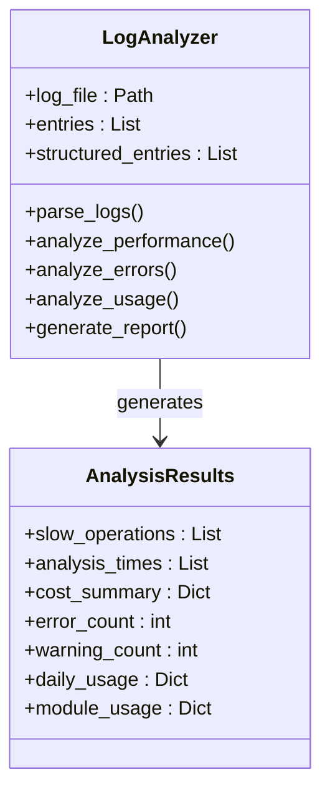

**图表来源**
- [scripts/log_analyzer.py](file://scripts/log_analyzer.py#L21-L50)

### 分析报告生成

系统自动生成详细的日志分析报告：

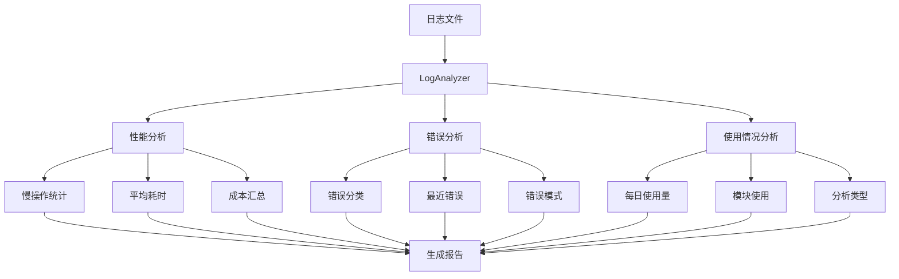

**图表来源**
- [scripts/log_analyzer.py](file://scripts/log_analyzer.py#L300-L372)

**章节来源**
- [scripts/log_analyzer.py](file://scripts/log_analyzer.py#L1-L373)

## 故障排除指南

### 常见问题及解决方案

| 问题类型 | 症状 | 可能原因 | 解决方案 |
|----------|------|----------|----------|
| 日志文件缺失 | 无日志输出 | 目录权限问题 | 检查logs目录权限 |
| Docker日志错误 | KeyError: 'file' | 配置文件不完整 | 使用logging_docker.toml |
| 性能问题 | 日志写入缓慢 | 文件过大 | 调整maxBytes参数 |
| 结构化日志异常 | JSON解析错误 | 编码问题 | 检查UTF-8编码 |

### 调试步骤

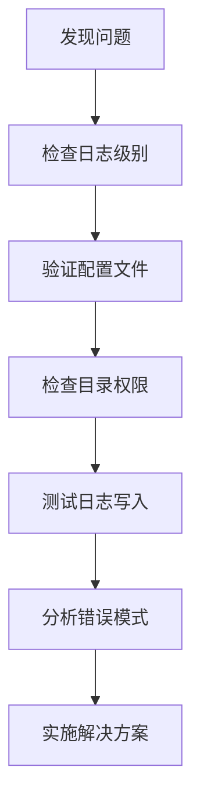

**章节来源**
- [scripts/test_docker_logging.py](file://scripts/test_docker_logging.py#L1-L64)

## 最佳实践

### 日志配置建议

1. **开发环境**
   - 启用详细日志记录
   - 使用彩色输出提高可读性
   - 保存调试文件便于问题追踪

2. **生产环境**
   - 启用结构化日志
   - 设置适当的日志级别
   - 配置合理的轮转参数

3. **Docker环境**
   - 使用容器优化配置
   - 确保正确的文件路径
   - 验证日志输出配置

### 监控策略

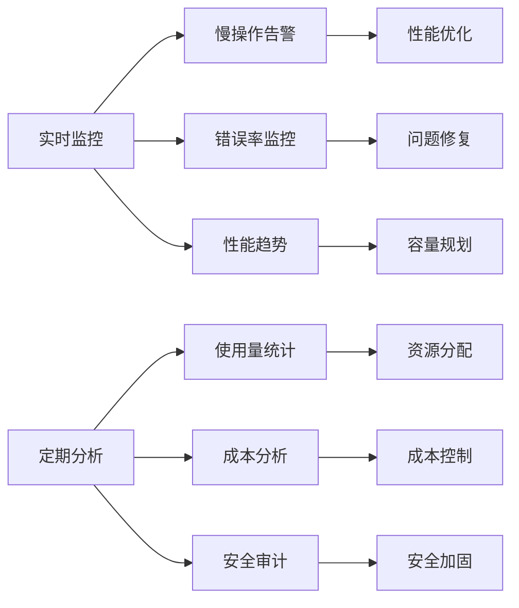

### 性能优化建议

1. **日志级别优化**
   - 生产环境使用INFO级别
   - 避免DEBUG级别的高频使用
   - 合理设置第三方库日志级别

2. **轮转策略优化**
   - 根据存储空间调整backupCount
   - 定期清理过期日志文件
   - 监控磁盘使用情况

3. **结构化日志使用**
   - 在需要自动化分析的场景启用
   - 平衡存储成本和分析价值
   - 考虑日志压缩存储

**章节来源**
- [tradingagents/utils/logging_init.py](file://tradingagents/utils/logging_init.py#L1-L166)
- [tradingagents/utils/tool_logging.py](file://tradingagents/utils/tool_logging.py#L1-L424)