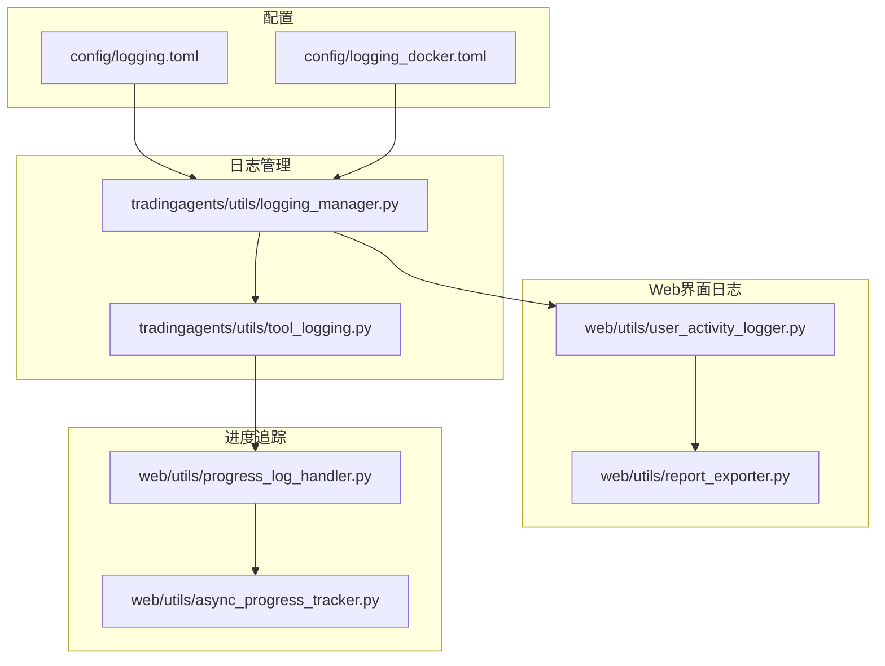
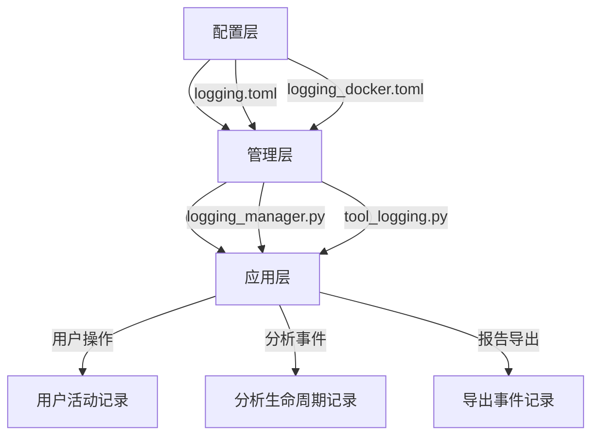
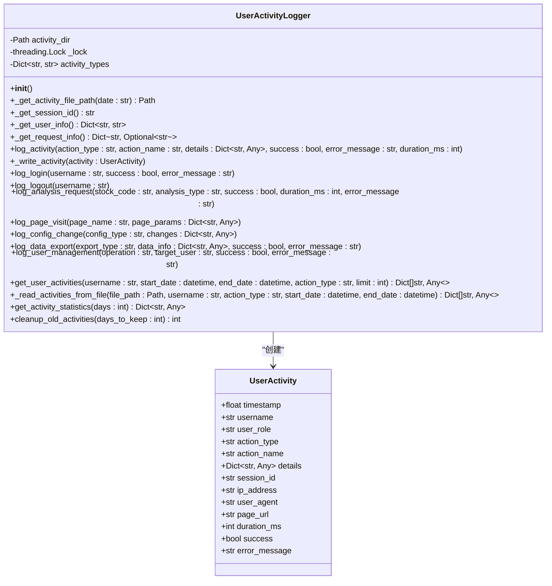
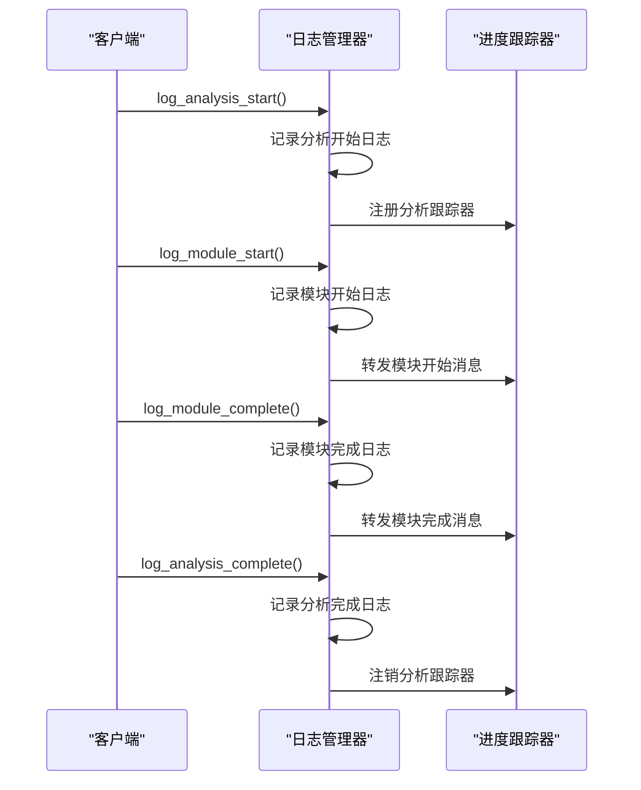
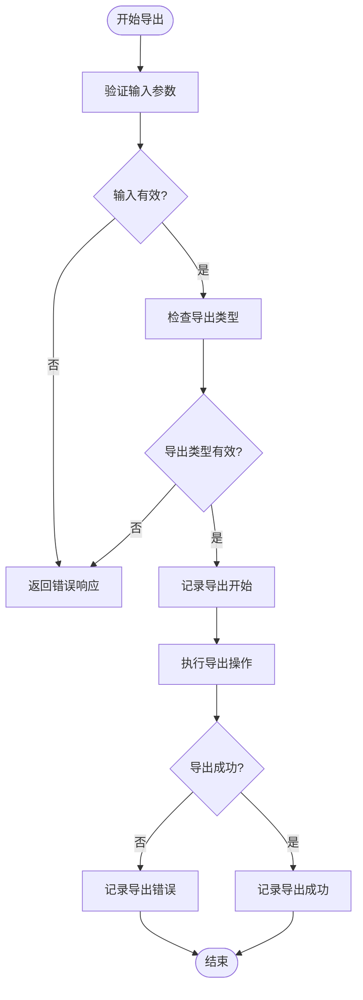
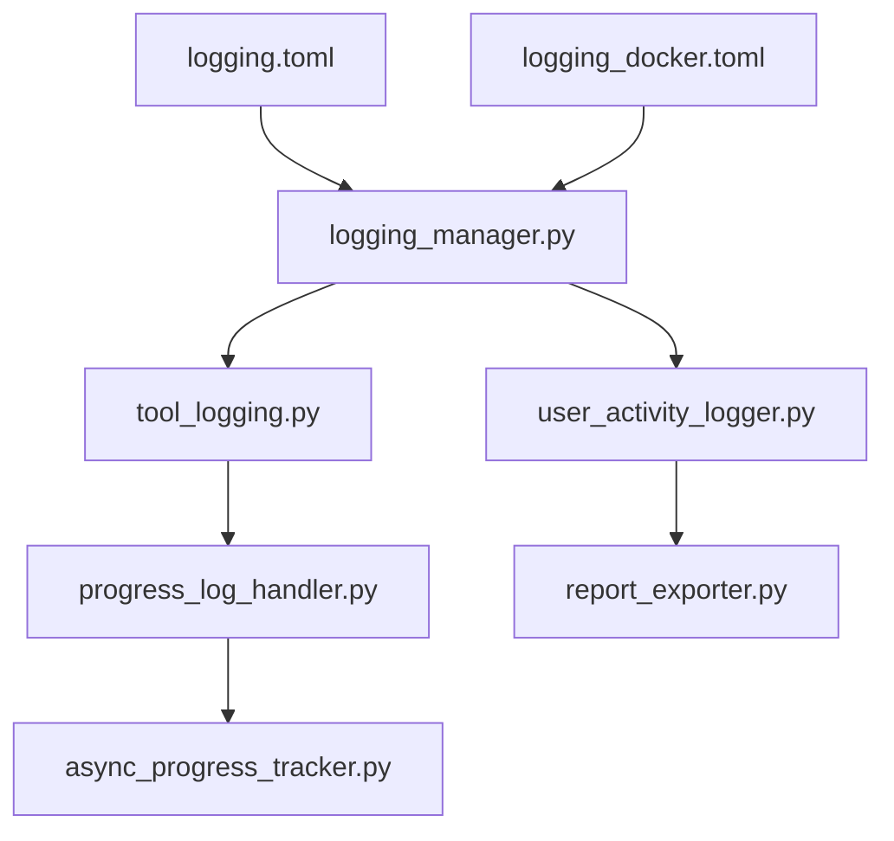

# 业务日志

<cite>
**本文档引用的文件**
- [logging.toml](file://config/logging.toml)
- [logging_docker.toml](file://config/logging_docker.toml)
- [logging_manager.py](file://tradingagents/utils/logging_manager.py)
- [user_activity_logger.py](file://web/utils/user_activity_logger.py)
- [report_exporter.py](file://web/utils/report_exporter.py)
- [tool_logging.py](file://tradingagents/utils/tool_logging.py)
- [progress_log_handler.py](file://web/utils/progress_log_handler.py)
</cite>

## 目录
1. [简介](#简介)
2. [项目结构](#项目结构)
3. [核心组件](#核心组件)
4. [架构概述](#架构概述)
5. [详细组件分析](#详细组件分析)
6. [依赖分析](#依赖分析)
7. [性能考虑](#性能考虑)
8. [故障排除指南](#故障排除指南)
9. [结论](#结论)
10. [附录](#附录)（如有必要）

## 简介
本文档详细解释了TradingAgents-CN项目中业务日志的记录方式，包括用户操作、分析事件和报告导出事件的记录机制。文档说明了`log_user_actions`、`log_analysis_events`和`log_export_events`配置项的作用，结合`logging_manager.py`中的`log_analysis_start`、`log_analysis_complete`等方法，展示如何记录完整的分析生命周期。文档阐述了业务日志在用户行为分析、操作审计和系统追踪中的关键作用，提供了通过`session_id`关联用户会话日志的示例，并说明了如何利用业务日志进行使用统计和故障排查。

## 项目结构
项目中的业务日志功能主要分布在配置文件和工具模块中。配置文件定义了日志的启用状态和记录级别，而工具模块则提供了具体的日志记录方法。

**图表来源**
- [logging.toml](file://config/logging.toml)
- [logging_docker.toml](file://config/logging_docker.toml)
- [logging_manager.py](file://tradingagents/utils/logging_manager.py)
- [tool_logging.py](file://tradingagents/utils/tool_logging.py)
- [user_activity_logger.py](file://web/utils/user_activity_logger.py)
- [report_exporter.py](file://web/utils/report_exporter.py)
- [progress_log_handler.py](file://web/utils/progress_log_handler.py)
- [async_progress_tracker.py](file://web/utils/async_progress_tracker.py)

**章节来源**
- [config/logging.toml](file://config/logging.toml)
- [config/logging_docker.toml](file://config/logging_docker.toml)
- [tradingagents/utils/logging_manager.py](file://tradingagents/utils/logging_manager.py)

## 核心组件
业务日志的核心组件包括日志配置文件、日志管理器、用户活动记录器和工具日志装饰器。这些组件共同协作，实现了对用户操作、分析事件和报告导出事件的全面记录。

**章节来源**
- [logging.toml](file://config/logging.toml)
- [logging_manager.py](file://tradingagents/utils/logging_manager.py)
- [user_activity_logger.py](file://web/utils/user_activity_logger.py)
- [tool_logging.py](file://tradingagents/utils/tool_logging.py)

## 架构概述
业务日志的架构分为配置层、管理层和应用层。配置层定义了哪些类型的日志需要被记录，管理层提供了统一的日志记录接口，应用层则在具体的业务逻辑中调用这些接口来记录日志。

**图表来源**
- [logging.toml](file://config/logging.toml)
- [logging_docker.toml](file://config/logging_docker.toml)
- [logging_manager.py](file://tradingagents/utils/logging_manager.py)
- [tool_logging.py](file://tradingagents/utils/tool_logging.py)

## 详细组件分析
### 用户操作记录
用户操作记录通过`user_activity_logger.py`模块实现，该模块提供了记录用户登录、页面访问、分析请求、配置更改和数据导出等操作的方法。

**图表来源**
- [user_activity_logger.py](file://web/utils/user_activity_logger.py#L1-L413)

**章节来源**
- [user_activity_logger.py](file://web/utils/user_activity_logger.py#L1-L413)

### 分析事件记录
分析事件记录通过`logging_manager.py`中的`TradingAgentsLogger`类实现，该类提供了记录分析开始、完成、模块开始、模块完成和模块错误的方法。

**图表来源**
- [logging_manager.py](file://tradingagents/utils/logging_manager.py#L1-L411)
- [progress_log_handler.py](file://web/utils/progress_log_handler.py#L1-L113)

**章节来源**
- [logging_manager.py](file://tradingagents/utils/logging_manager.py#L1-L411)
- [progress_log_handler.py](file://web/utils/progress_log_handler.py#L1-L113)

### 报告导出事件记录
报告导出事件记录通过`user_activity_logger.py`中的`log_data_export`方法实现，该方法记录了数据导出的类型、信息、成功状态和错误信息。

**图表来源**
- [user_activity_logger.py](file://web/utils/user_activity_logger.py#L207-L244)
- [report_exporter.py](file://web/utils/report_exporter.py#L1-L799)

**章节来源**
- [user_activity_logger.py](file://web/utils/user_activity_logger.py#L207-L244)
- [report_exporter.py](file://web/utils/report_exporter.py#L1-L799)

## 依赖分析
业务日志系统依赖于多个组件，包括日志配置文件、日志管理器、用户活动记录器和进度跟踪器。这些组件之间的依赖关系确保了日志记录的一致性和完整性。

**图表来源**
- [logging.toml](file://config/logging.toml)
- [logging_docker.toml](file://config/logging_docker.toml)
- [logging_manager.py](file://tradingagents/utils/logging_manager.py)
- [tool_logging.py](file://tradingagents/utils/tool_logging.py)
- [user_activity_logger.py](file://web/utils/user_activity_logger.py)
- [report_exporter.py](file://web/utils/report_exporter.py)
- [progress_log_handler.py](file://web/utils/progress_log_handler.py)
- [async_progress_tracker.py](file://web/utils/async_progress_tracker.py)

**章节来源**
- [config/logging.toml](file://config/logging.toml)
- [config/logging_docker.toml](file://config/logging_docker.toml)
- [tradingagents/utils/logging_manager.py](file://tradingagents/utils/logging_manager.py)
- [tradingagents/utils/tool_logging.py](file://tradingagents/utils/tool_logging.py)
- [web/utils/user_activity_logger.py](file://web/utils/user_activity_logger.py)
- [web/utils/report_exporter.py](file://web/utils/report_exporter.py)
- [web/utils/progress_log_handler.py](file://web/utils/progress_log_handler.py)
- [web/utils/async_progress_tracker.py](file://web/utils/async_progress_tracker.py)

## 性能考虑
业务日志系统在设计时考虑了性能因素，通过异步日志记录、日志轮转和日志级别控制来减少对系统性能的影响。日志配置文件中的`slow_threshold_seconds`参数可以用来记录慢操作，帮助识别性能瓶颈。

**章节来源**
- [logging.toml](file://config/logging.toml)
- [logging_manager.py](file://tradingagents/utils/logging_manager.py)

## 故障排除指南
业务日志系统提供了丰富的日志信息，可以帮助快速定位和解决故障。通过分析日志中的错误信息、堆栈跟踪和性能数据，可以有效地进行故障排查。

**章节来源**
- [logging_manager.py](file://tradingagents/utils/logging_manager.py)
- [user_activity_logger.py](file://web/utils/user_activity_logger.py)
- [tool_logging.py](file://tradingagents/utils/tool_logging.py)

## 结论
业务日志系统在TradingAgents-CN项目中扮演着至关重要的角色，它不仅记录了用户操作、分析事件和报告导出事件，还为用户行为分析、操作审计和系统追踪提供了坚实的基础。通过合理的配置和使用，业务日志系统可以显著提高系统的可维护性和可靠性。