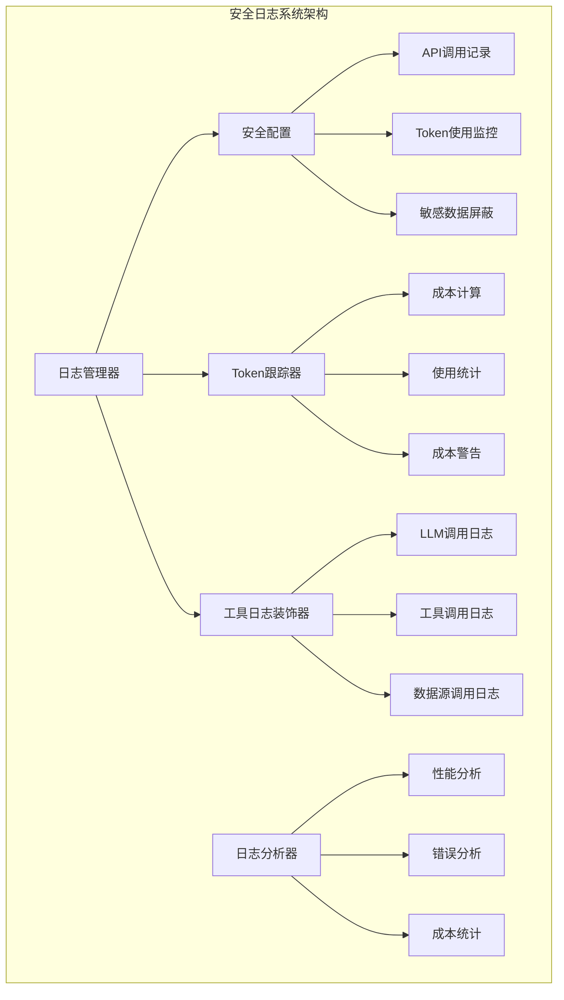
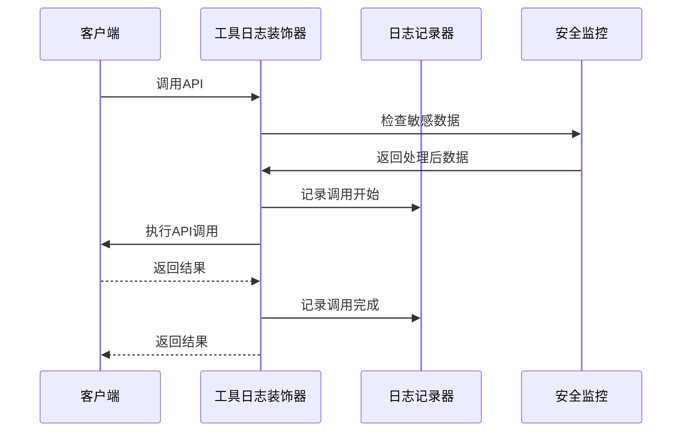
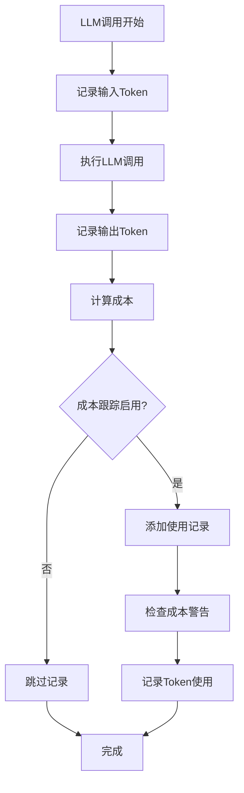
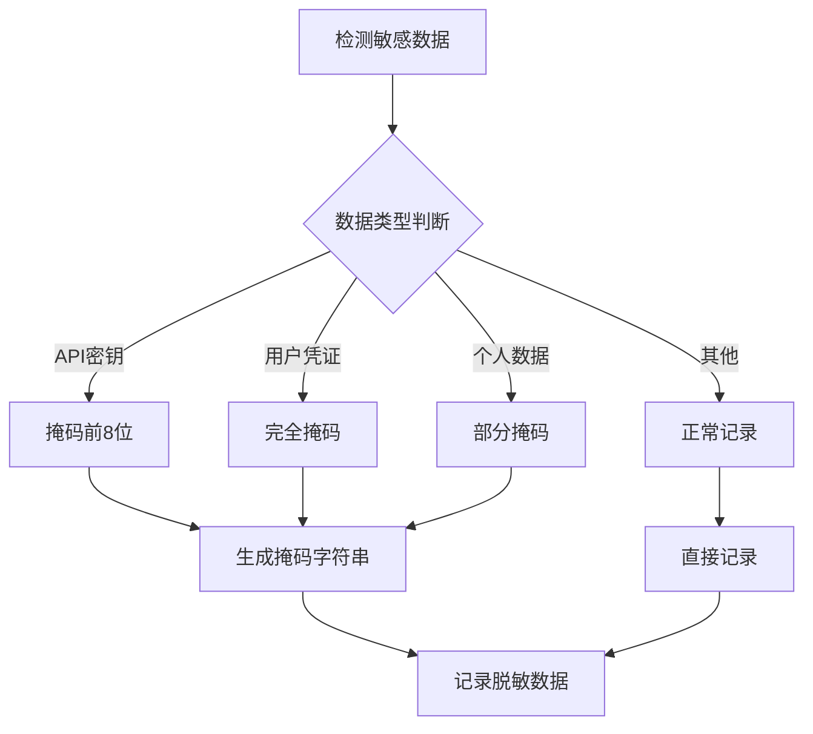
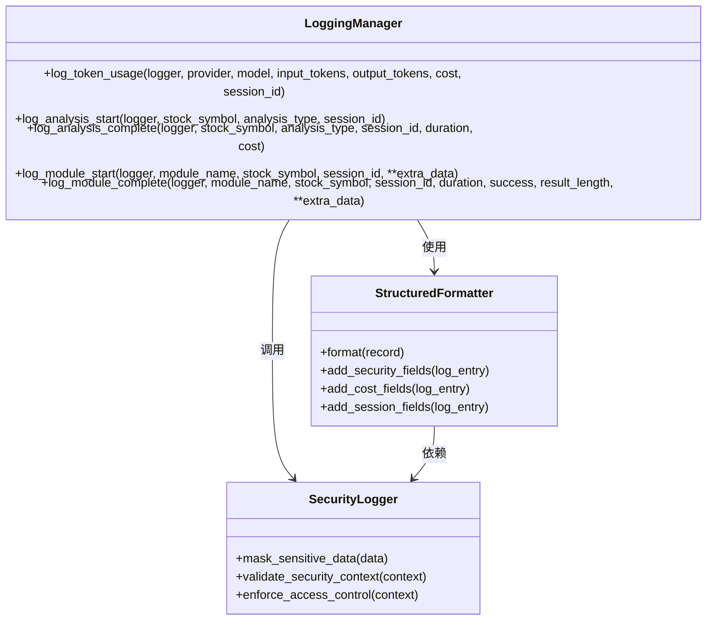
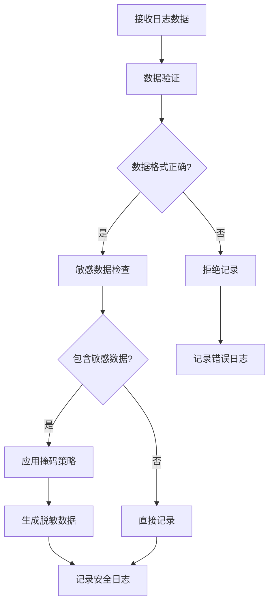
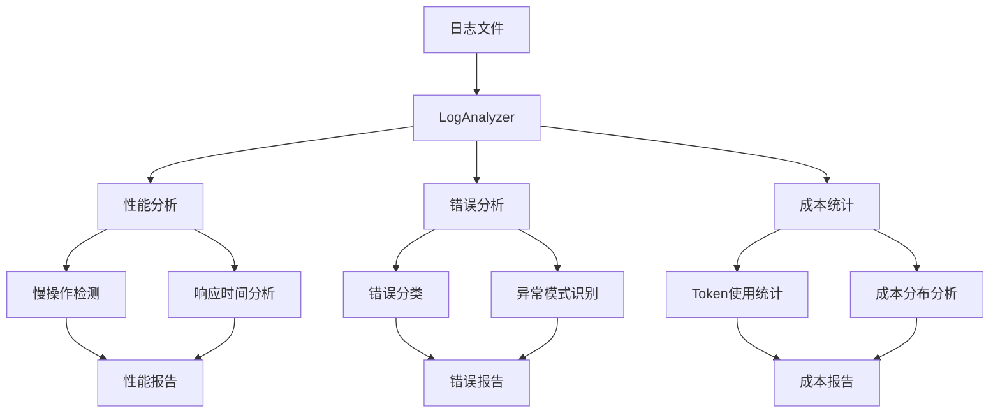

# 安全日志

<cite>
**本文档中引用的文件**
- [logging_manager.py](file://tradingagents/utils/logging_manager.py)
- [logging.toml](file://config/logging.toml)
- [logging_docker.toml](file://config/logging_docker.toml)
- [config_manager.py](file://tradingagents/config/config_manager.py)
- [tool_logging.py](file://tradingagents/utils/tool_logging.py)
- [token_tracking_demo.py](file://examples/token_tracking_demo.py)
- [deepseek_adapter.py](file://tradingagents/llm_adapters/deepseek_adapter.py)
- [openai_compatible_base.py](file://tradingagents/llm_adapters/openai_compatible_base.py)
- [log_analyzer.py](file://scripts/log_analyzer.py)
- [api_checker.py](file://web/utils/api_checker.py)
</cite>

## 目录
1. [简介](#简介)
2. [安全日志架构概览](#安全日志架构概览)
3. [API调用记录功能](#api调用记录功能)
4. [Token用量追踪机制](#token用量追踪机制)
5. [敏感数据屏蔽功能](#敏感数据屏蔽功能)
6. [安全相关数据的结构化记录](#安全相关数据的结构化记录)
7. [配置示例与最佳实践](#配置示例与最佳实践)
8. [日志输出样例](#日志输出样例)
9. [监控与分析工具](#监控与分析工具)
10. [故障排除指南](#故障排除指南)

## 简介

TradingAgents-CN的安全日志系统是一个全面的监控和审计框架，专门设计用于保护用户隐私、监控API使用情况以及跟踪LLM成本。该系统通过三个核心配置项实现了多层次的安全保障：`log_api_calls`、`log_token_usage`和`mask_sensitive_data`。

安全日志系统不仅提供了实时的监控能力，还具备强大的数据分析功能，能够帮助开发者和运维人员深入了解系统的使用模式，识别潜在的安全风险，并优化资源分配。

## 安全日志架构概览

安全日志系统采用模块化设计，集成了多个关键组件来提供全面的安全监控能力。



**图表来源**
- [logging_manager.py](file://tradingagents/utils/logging_manager.py#L1-L411)
- [config_manager.py](file://tradingagents/config/config_manager.py#L652-L726)
- [tool_logging.py](file://tradingagents/utils/tool_logging.py#L1-L424)

**章节来源**
- [logging_manager.py](file://tradingagents/utils/logging_manager.py#L1-L411)
- [logging.toml](file://config/logging.toml#L71-L109)

## API调用记录功能

### 启用API调用记录

API调用记录功能通过`log_api_calls`配置项控制，该配置位于安全日志部分：

```toml
[logging.security]
enabled = true
log_api_calls = true  # 启用API调用记录
log_token_usage = true  # 记录Token使用
mask_sensitive_data = true  # 屏蔽敏感数据
```

### 实现原理

API调用记录通过装饰器模式实现，自动捕获所有API调用的详细信息：



**图表来源**
- [tool_logging.py](file://tradingagents/utils/tool_logging.py#L20-L100)
- [logging_manager.py](file://tradingagents/utils/logging_manager.py#L250-L350)

### 记录内容

API调用记录包含以下关键信息：
- 调用时间戳
- API提供商标识
- 请求参数摘要
- 响应状态码
- 执行耗时
- 用户会话标识

**章节来源**
- [tool_logging.py](file://tradingagents/utils/tool_logging.py#L20-L150)
- [logging.toml](file://config/logging.toml#L95-L102)

## Token用量追踪机制

### 配置启用

Token用量追踪通过`log_token_usage`配置项启用：

```toml
[logging.security]
enabled = true
log_api_calls = true
log_token_usage = true  # 启用Token使用记录
mask_sensitive_data = true
```

### 跟踪机制

Token跟踪器负责监控所有LLM调用的Token使用情况：



**图表来源**
- [config_manager.py](file://tradingagents/config/config_manager.py#L652-L690)
- [deepseek_adapter.py](file://tradingagents/llm_adapters/deepseek_adapter.py#L126-L150)

### 成本计算与监控

Token跟踪器提供以下功能：

| 功能 | 描述 | 配置项 |
|------|------|--------|
| 实时跟踪 | 自动记录每次LLM调用的Token使用 | `enable_cost_tracking` |
| 成本估算 | 根据Token数量估算使用成本 | `pricing_config` |
| 成本警告 | 当日成本超过阈值时发出警告 | `cost_alert_threshold` |
| 会话统计 | 跟踪特定会话的Token使用情况 | `session_id` |

### 调用方式

Token使用可以通过多种方式记录：

1. **自动记录**：LLM适配器自动记录Token使用
2. **手动记录**：通过`log_token_usage`方法手动记录
3. **批量记录**：通过配置管理器批量处理使用记录

**章节来源**
- [config_manager.py](file://tradingagents/config/config_manager.py#L652-L726)
- [deepseek_adapter.py](file://tradingagents/llm_adapters/deepseek_adapter.py#L126-L150)
- [token_tracking_demo.py](file://examples/token_tracking_demo.py#L242-L283)

## 敏感数据屏蔽功能

### 屏蔽机制

敏感数据屏蔽通过`mask_sensitive_data`配置项启用，该功能确保API密钥、用户凭据等敏感信息不会出现在日志中：

```toml
[logging.security]
enabled = true
log_api_calls = true
log_token_usage = true
mask_sensitive_data = true  # 启用敏感数据屏蔽
```

### 屏蔽策略

系统采用智能识别和掩码策略：



**图表来源**
- [api_checker.py](file://web/utils/api_checker.py#L0-L80)
- [logging_manager.py](file://tradingagents/utils/logging_manager.py#L250-L350)

### 支持的敏感数据类型

| 数据类型 | 掩码策略 | 示例 |
|----------|----------|------|
| API密钥 | 掩码前8位，显示后4位 | `sk-abcde...xyz123` |
| 用户密码 | 完全掩码 | `******` |
| 邮箱地址 | 掩码中间字符 | `u***@domain.com` |
| 手机号码 | 掩码中间数字 | `138****5678` |
| 身份证号 | 掩码中间数字 | `110101****1234` |

### 隐私保护价值

敏感数据屏蔽功能提供了以下安全价值：

1. **合规性保障**：符合GDPR等数据保护法规要求
2. **风险降低**：防止敏感信息泄露
3. **审计支持**：提供可审计的脱敏日志
4. **用户体验**：保护用户隐私，增强信任

**章节来源**
- [api_checker.py](file://web/utils/api_checker.py#L0-L80)
- [logging_manager.py](file://tradingagents/utils/logging_manager.py#L250-L350)

## 安全相关数据的结构化记录

### Extra字段传递机制

Logging Manager通过`extra`字段机制实现安全相关数据的结构化记录：



**图表来源**
- [logging_manager.py](file://tradingagents/utils/logging_manager.py#L250-L411)

### 结构化数据字段

安全日志包含以下结构化字段：

| 字段名 | 类型 | 描述 | 示例 |
|--------|------|------|------|
| `event_type` | string | 事件类型标识 | `"token_usage"` |
| `provider` | string | LLM提供商 | `"dashscope"` |
| `model` | string | 模型名称 | `"qwen-turbo"` |
| `tokens` | object | Token使用详情 | `{"input": 1000, "output": 500}` |
| `cost` | float | 使用成本 | `0.0025` |
| `session_id` | string | 会话标识符 | `"session_20241201_123456"` |
| `timestamp` | string | ISO格式时间戳 | `"2024-12-01T12:34:56.789Z"` |
| `stock_symbol` | string | 股票代码 | `"AAPL"` |
| `analysis_type` | string | 分析类型 | `"fundamental_analysis"` |

### 数据验证与过滤

系统在记录安全数据时实施严格的数据验证：



**图表来源**
- [logging_manager.py](file://tradingagents/utils/logging_manager.py#L40-L90)

**章节来源**
- [logging_manager.py](file://tradingagents/utils/logging_manager.py#L250-L411)

## 配置示例与最佳实践

### 开发环境配置

```toml
# config/logging.toml
[logging.security]
enabled = true
log_api_calls = true
log_token_usage = true
mask_sensitive_data = true

[logging.performance]
log_slow_operations = true
slow_threshold_seconds = 5.0

[logging.business]
log_analysis_events = true
log_user_actions = true
```

### 生产环境配置

```toml
# config/logging_docker.toml
[logging.security]
enabled = true
log_api_calls = true
log_token_usage = true
mask_sensitive_data = true

[logging.production]
structured_only = true
error_notification = true
max_log_size = "100MB"

[logging.performance]
log_slow_operations = true
slow_threshold_seconds = 10.0
```

### 环境变量配置

```bash
# 启用安全日志
export TRADINGAGENTS_SECURITY_LOGGING=true
export LOG_API_CALLS=true
export LOG_TOKEN_USAGE=true
export MASK_SENSITIVE_DATA=true

# 成本监控配置
export ENABLE_COST_TRACKING=true
export COST_ALERT_THRESHOLD=100.0
```

### 最佳实践建议

1. **分级配置**：根据环境差异配置不同的安全级别
2. **定期审查**：定期检查日志配置的有效性
3. **权限控制**：限制对日志文件的访问权限
4. **备份策略**：建立日志文件的备份和归档策略
5. **监控告警**：设置成本和异常使用的监控告警

**章节来源**
- [logging.toml](file://config/logging.toml#L71-L109)
- [logging_docker.toml](file://config/logging_docker.toml#L76-L98)

## 日志输出样例

### Token使用记录示例

```
2024-12-01 12:34:56.789 | INFO     | tools | 📊 Token使用 - dashscope/qwen-turbo: 输入=1000, 输出=500, 成本=¥0.0025
{
    "timestamp": "2024-12-01T12:34:56.789Z",
    "level": "INFO",
    "logger": "tools",
    "message": "📊 Token使用 - dashscope/qwen-turbo: 输入=1000, 输出=500, 成本=¥0.0025",
    "module": "tool_logging",
    "function": "log_token_usage",
    "line": 250,
    "provider": "dashscope",
    "model": "qwen-turbo",
    "tokens": {
        "input": 1000,
        "output": 500
    },
    "cost": 0.0025,
    "session_id": "session_20241201_123456",
    "event_type": "token_usage"
}
```

### API调用记录示例

```
2024-12-01 12:34:57.123 | INFO     | tools | 🔧 [工具调用] stock_analysis - 开始
{
    "timestamp": "2024-12-01T12:34:57.123Z",
    "level": "INFO",
    "logger": "tools",
    "message": "🔧 [工具调用] stock_analysis - 开始",
    "module": "tool_logging",
    "function": "log_tool_call",
    "line": 30,
    "tool_name": "stock_analysis",
    "event_type": "tool_call_start",
    "timestamp": "2024-12-01T12:34:57.123Z",
    "args_info": {
        "args": ["AAPL"],
        "kwargs": {
            "analysis_type": "fundamental"
        }
    }
}
```

### 敏感数据屏蔽示例

```
# 原始API密钥
DASHSCOPE_API_KEY=sk-abcde1234567890abcdef1234567890

# 日志中的显示
DASHSCOPE_API_KEY=sk-abcd...7890
```

### 成本警告示例

```
2024-12-01 12:35:00.000 | WARNING  | tools | ⚠️ 成本警告: 今日成本已达到 ¥125.50, 超过阈值 ¥100.00
{
    "timestamp": "2024-12-01T12:35:00.000Z",
    "level": "WARNING",
    "logger": "tools",
    "message": "⚠️ 成本警告: 今日成本已达到 ¥125.50, 超过阈值 ¥100.00",
    "module": "token_tracker",
    "function": "_check_cost_alert",
    "line": 680,
    "cost": 125.50,
    "threshold": 100.0,
    "event_type": "cost_alert"
}
```

**章节来源**
- [tool_logging.py](file://tradingagents/utils/tool_logging.py#L20-L100)
- [logging_manager.py](file://tradingagents/utils/logging_manager.py#L350-L411)

## 监控与分析工具

### 日志分析器

系统提供了专门的日志分析工具来监控安全日志：



**图表来源**
- [log_analyzer.py](file://scripts/log_analyzer.py#L20-L100)

### 关键监控指标

| 指标类别 | 具体指标 | 监控目的 |
|----------|----------|----------|
| API使用 | 调用频率、成功率、响应时间 | 监控API健康状况 |
| Token消耗 | 输入Token、输出Token、总成本 | 控制LLM使用成本 |
| 安全事件 | 敏感数据访问、异常行为 | 识别安全威胁 |
| 系统性能 | 慢操作、内存使用、错误率 | 确保系统稳定性 |

### 报告生成

系统能够生成多种类型的报告：

1. **实时监控报告**：显示当前系统状态
2. **历史趋势报告**：分析长期使用模式
3. **异常检测报告**：识别潜在问题
4. **成本分析报告**：优化资源使用

**章节来源**
- [log_analyzer.py](file://scripts/log_analyzer.py#L20-L200)

## 故障排除指南

### 常见问题及解决方案

#### 1. 安全日志未启用

**症状**：安全相关日志不记录或缺失

**排查步骤**：
```python
# 检查配置
from tradingagents.utils.logging_manager import get_logger_manager
logger_manager = get_logger_manager()
security_config = logger_manager.config.get('security', {})

print(f"安全日志启用: {security_config.get('enabled', False)}")
print(f"API调用记录: {security_config.get('log_api_calls', False)}")
print(f"Token使用记录: {security_config.get('log_token_usage', False)}")
print(f"敏感数据屏蔽: {security_config.get('mask_sensitive_data', False)}")
```

**解决方案**：
- 确认配置文件中安全日志部分已启用
- 检查环境变量设置
- 验证日志级别配置

#### 2. Token使用统计不准确

**症状**：Token使用量与预期不符

**排查步骤**：
```python
# 检查Token跟踪器状态
from tradingagents.config.config_manager import token_tracker

# 验证成本跟踪配置
settings = token_tracker.config_manager.load_settings()
print(f"成本跟踪启用: {settings.get('enable_cost_tracking', True)}")
print(f"成本阈值: {settings.get('cost_alert_threshold', 100.0)}")

# 检查最近的使用记录
records = token_tracker.config_manager.load_usage_records()
print(f"最近记录数量: {len(records)}")
```

**解决方案**：
- 确认LLM适配器正确集成Token跟踪
- 检查成本计算公式配置
- 验证会话ID的一致性

#### 3. 敏感数据未正确屏蔽

**症状**：敏感信息出现在日志中

**排查步骤**：
```python
# 测试敏感数据屏蔽
from tradingagents.utils.api_checker import check_api_keys

# 检查API密钥验证
api_status = check_api_keys()
for key, info in api_status['details'].items():
    if info['configured']:
        print(f"{key}: {info['display']} (已配置)")
    else:
        print(f"{key}: 未配置")
```

**解决方案**：
- 检查`mask_sensitive_data`配置
- 验证数据过滤规则
- 确认日志格式化器正确应用

### 性能优化建议

1. **日志轮转配置**：合理设置日志文件大小和保留策略
2. **异步写入**：对于高并发场景，考虑异步日志写入
3. **采样策略**：对高频操作实施日志采样
4. **压缩存储**：启用日志文件压缩以节省存储空间

### 安全加固措施

1. **访问控制**：限制日志文件的读取权限
2. **传输加密**：在分布式环境中加密日志传输
3. **完整性校验**：实施日志完整性验证机制
4. **审计跟踪**：记录对日志系统的访问和修改

**章节来源**
- [log_analyzer.py](file://scripts/log_analyzer.py#L150-L200)
- [api_checker.py](file://web/utils/api_checker.py#L0-L80)

## 总结

TradingAgents-CN的安全日志系统提供了全面的监控和保护能力，通过`log_api_calls`、`log_token_usage`和`mask_sensitive_data`三个核心配置项，实现了API调用监控、Token使用追踪和敏感数据保护的有机结合。

该系统不仅满足了企业级的安全合规要求，还提供了丰富的数据分析功能，帮助开发者和运维人员更好地理解系统使用模式，优化资源配置，并及时发现潜在的安全风险。

通过合理的配置和持续的监控，安全日志系统将成为TradingAgents-CN稳定运行的重要保障，为用户提供可靠、安全的服务体验。