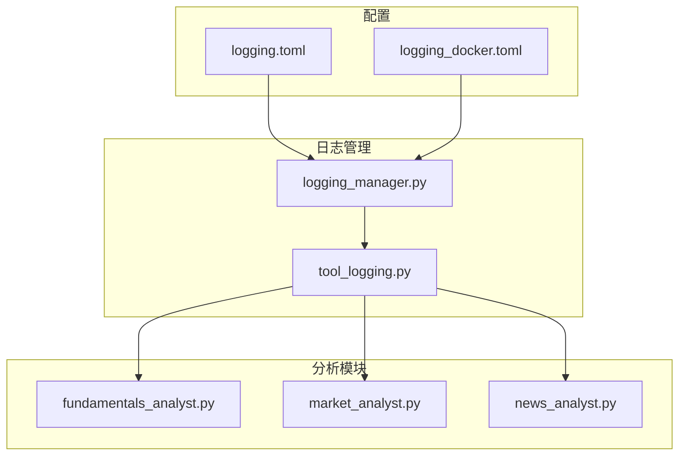
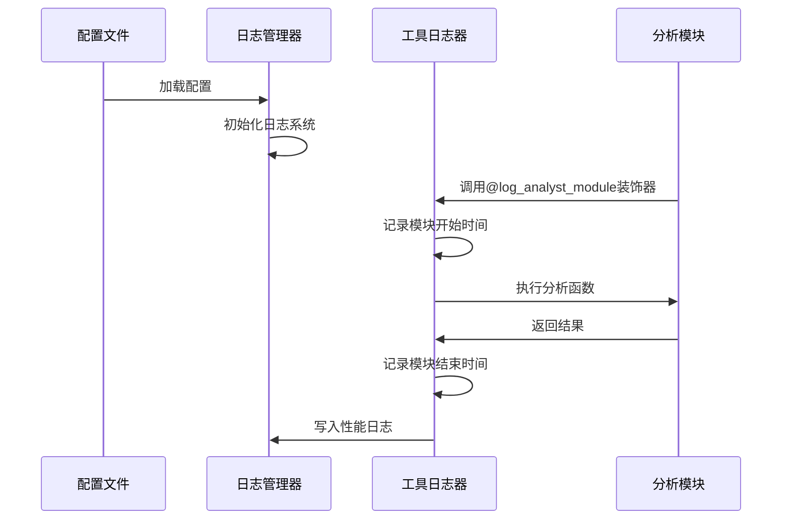
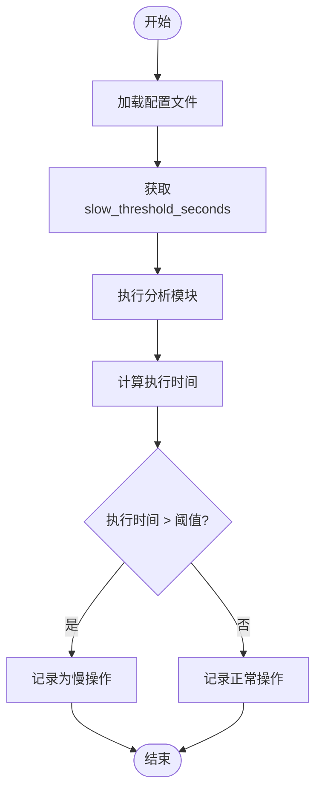
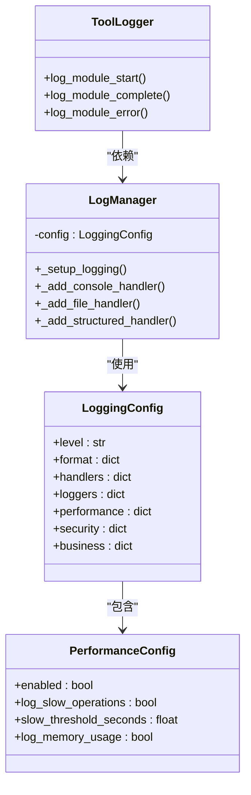
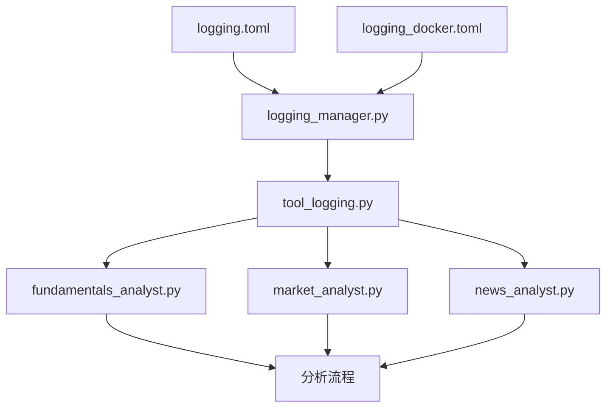

# 性能日志

<cite>
**本文档引用的文件**
- [logging.toml](file://config/logging.toml)
- [logging_docker.toml](file://config/logging_docker.toml)
- [logging_manager.py](file://tradingagents/utils/logging_manager.py)
- [tool_logging.py](file://tradingagents/utils/tool_logging.py)
- [fundamentals_analyst.py](file://tradingagents/agents/analysts/fundamentals_analyst.py)
</cite>

## 目录
1. [简介](#简介)
2. [项目结构](#项目结构)
3. [核心组件](#核心组件)
4. [架构概述](#架构概述)
5. [详细组件分析](#详细组件分析)
6. [依赖分析](#依赖分析)
7. [性能考虑](#性能考虑)
8. [故障排除指南](#故障排除指南)
9. [结论](#结论)
10. [附录](#附录)（如有必要）

## 简介
本文档详细说明了交易代理系统中的性能日志功能，重点介绍慢操作监控机制和内存使用记录功能的实现原理。文档解释了如何通过配置文件启用或调整阈值，描述了`log_module_start`和`log_module_complete`方法在记录模块执行耗时方面的应用，并提供了实际代码示例。此外，还说明了性能日志在识别系统瓶颈、优化分析流程中的应用场景，以及如何通过日志级别控制性能数据的详细程度。

## 项目结构
该项目采用模块化设计，主要分为CLI、配置、数据流、代理、API、工具和Web界面等部分。性能日志功能主要集中在`tradingagents/utils`目录下的`logging_manager.py`和`tool_logging.py`文件中，通过配置文件进行参数控制。



**图示来源**
- [logging.toml](file://config/logging.toml)
- [logging_docker.toml](file://config/logging_docker.toml)
- [logging_manager.py](file://tradingagents/utils/logging_manager.py)
- [tool_logging.py](file://tradingagents/utils/tool_logging.py)

**本节来源**
- [config](file://config)
- [tradingagents/utils](file://tradingagents/utils)

## 核心组件
性能日志系统的核心组件包括配置管理、日志记录器和装饰器。`logging_manager.py`负责加载配置并初始化日志系统，`tool_logging.py`提供了用于记录模块执行时间的装饰器，而`logging.toml`和`logging_docker.toml`则定义了各种日志参数。

**本节来源**
- [logging_manager.py](file://tradingagents/utils/logging_manager.py#L1-L411)
- [tool_logging.py](file://tradingagents/utils/tool_logging.py#L1-L424)
- [logging.toml](file://config/logging.toml#L1-L111)

## 架构概述
性能日志系统的架构基于配置驱动的设计模式。系统首先从配置文件中读取日志参数，然后根据这些参数初始化日志记录器。当分析模块执行时，装饰器会自动记录开始和结束时间，并将相关信息写入日志文件。



**图示来源**
- [logging_manager.py](file://tradingagents/utils/logging_manager.py#L1-L411)
- [tool_logging.py](file://tradingagents/utils/tool_logging.py#L1-L424)

## 详细组件分析
### 慢操作监控机制分析
慢操作监控机制通过`logging.toml`文件中的`slow_threshold_seconds`参数进行配置，默认值为5秒。当某个操作的执行时间超过此阈值时，系统会将其记录为慢操作。



**图示来源**
- [logging.toml](file://config/logging.toml#L86-L87)
- [logging_manager.py](file://tradingagents/utils/logging_manager.py#L163-L196)

#### 内存使用记录功能分析
内存使用记录功能由`log_memory_usage`参数控制，该参数在配置文件中默认设置为`false`。当启用此功能时，系统会在日志中记录每个模块执行前后的内存使用情况。



**图示来源**
- [logging.toml](file://config/logging.toml#L88)
- [logging_manager.py](file://tradingagents/utils/logging_manager.py#L42-L88)

#### 模块执行耗时记录分析
`log_module_start`和`log_module_complete`方法用于记录模块的执行耗时。这些方法通过装饰器`@log_analyst_module`自动调用，无需在每个分析模块中手动添加日志代码。

```python
# 示例：在fundamentals_analyst.py中使用装饰器
@log_analyst_module("fundamentals")
def fundamentals_analyst_node(state):
    # 分析逻辑
    pass
```

**本节来源**
- [logging_manager.py](file://tradingagents/utils/logging_manager.py#L300-L352)
- [tool_logging.py](file://tradingagents/utils/tool_logging.py#L334-L422)
- [fundamentals_analyst.py](file://tradingagents/agents/analysts/fundamentals_analyst.py#L1-L401)

## 依赖分析
性能日志系统依赖于多个组件，包括配置文件、日志管理器和分析模块。这些组件之间的依赖关系确保了日志功能的正确性和一致性。



**图示来源**
- [logging.toml](file://config/logging.toml)
- [logging_docker.toml](file://config/logging_docker.toml)
- [logging_manager.py](file://tradingagents/utils/logging_manager.py)
- [tool_logging.py](file://tradingagents/utils/tool_logging.py)

## 性能考虑
性能日志系统在设计时考虑了多个方面，包括日志级别的控制、配置的灵活性和对系统性能的影响。通过将`slow_threshold_seconds`设置为5秒，系统能够有效识别潜在的性能瓶颈，而不会产生过多的日志数据。

## 故障排除指南
当性能日志功能出现问题时，可以检查以下几点：
1. 确认`logging.toml`文件中的配置是否正确。
2. 检查日志文件目录是否存在且可写。
3. 验证`log_module_start`和`log_module_complete`方法是否被正确调用。
4. 确保装饰器`@log_analyst_module`已正确应用到分析模块。

**本节来源**
- [logging_manager.py](file://tradingagents/utils/logging_manager.py#L163-L196)
- [tool_logging.py](file://tradingagents/utils/tool_logging.py#L334-L422)

## 结论
本文档详细介绍了交易代理系统中的性能日志功能，包括慢操作监控机制、内存使用记录功能和模块执行耗时记录方法。通过合理的配置和使用，这些功能可以帮助开发者识别系统瓶颈，优化分析流程，并提高系统的整体性能。

## 附录
### 配置文件示例
```toml
[logging.performance]
enabled = true
log_slow_operations = true
slow_threshold_seconds = 5.0
log_memory_usage = false
```

### 日志级别说明
- DEBUG：详细信息，用于调试
- INFO：一般信息，用于跟踪系统状态
- WARNING：警告信息，表示潜在问题
- ERROR：错误信息，表示发生了错误
- CRITICAL：严重错误，表示系统可能无法继续运行