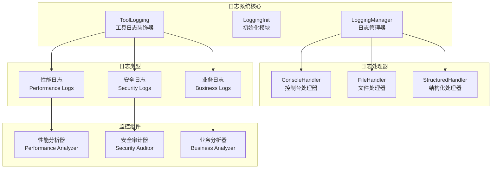
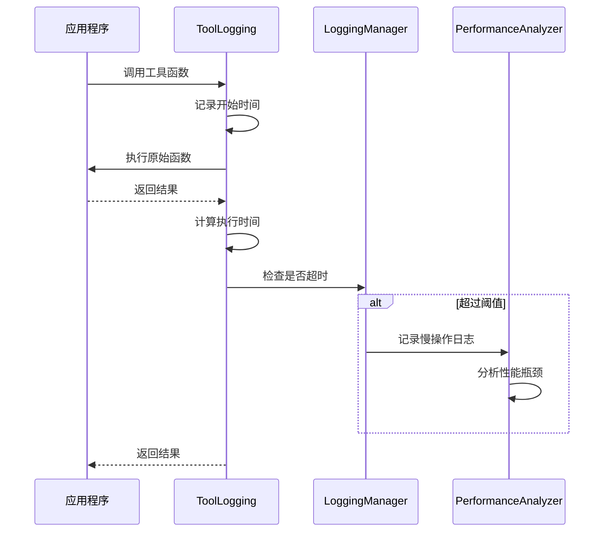
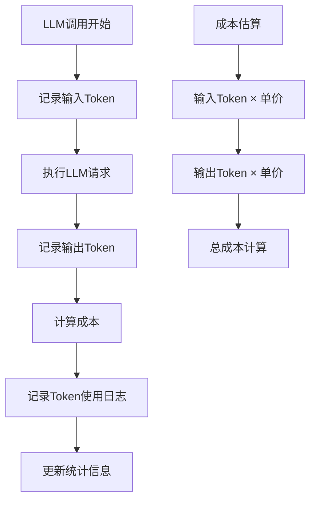
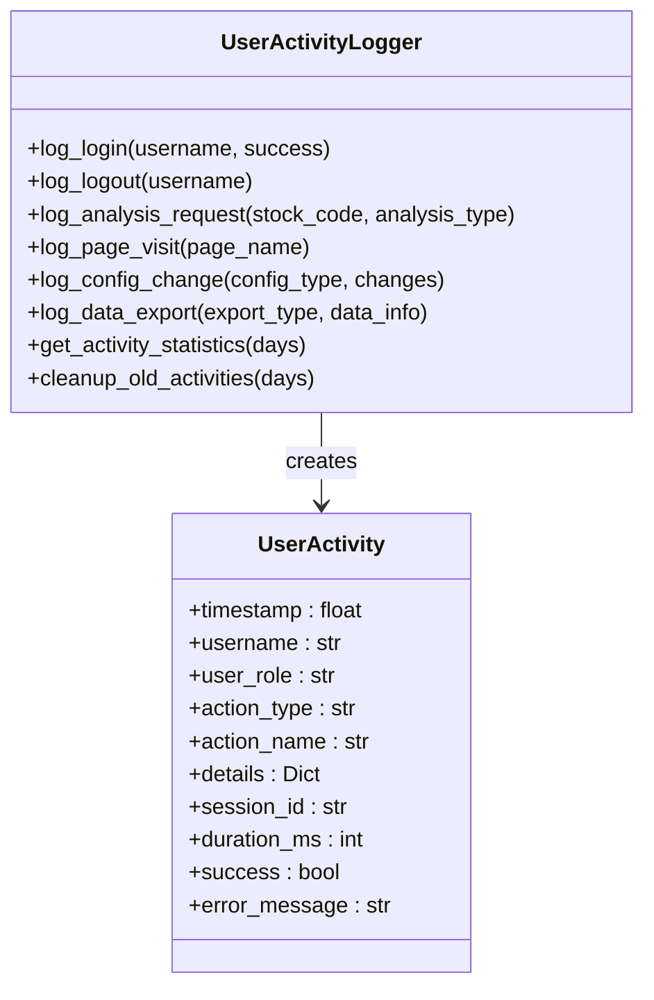
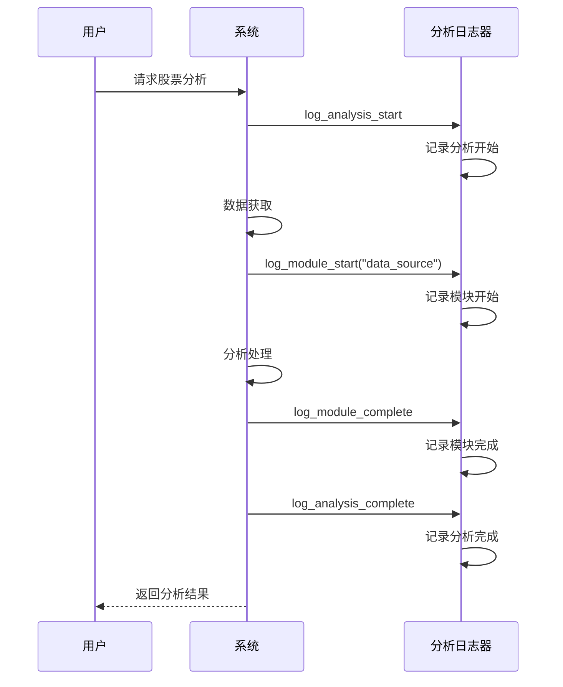
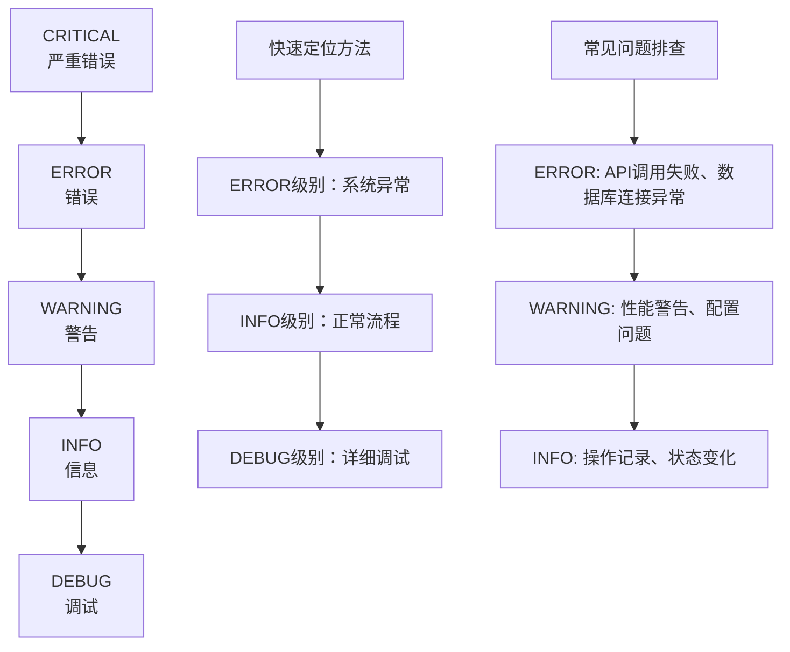
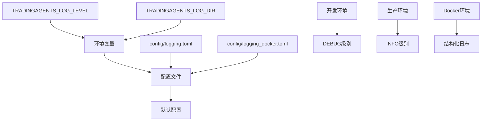
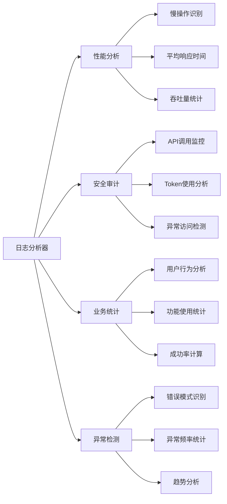

# 日志类型与监控

<cite>
**本文档中引用的文件**
- [config/logging.toml](file://config/logging.toml)
- [config/logging_docker.toml](file://config/logging_docker.toml)
- [tradingagents/utils/logging_init.py](file://tradingagents/utils/logging_init.py)
- [tradingagents/utils/logging_manager.py](file://tradingagents/utils/logging_manager.py)
- [tradingagents/utils/tool_logging.py](file://tradingagents/utils/tool_logging.py)
- [web/utils/user_activity_logger.py](file://web/utils/user_activity_logger.py)
- [examples/token_tracking_demo.py](file://examples/token_tracking_demo.py)
- [scripts/demo_user_activity.py](file://scripts/demo_user_activity.py)
- [scripts/log_analyzer.py](file://scripts/log_analyzer.py)
</cite>

## 目录
1. [简介](#简介)
2. [日志系统架构](#日志系统架构)
3. [性能日志](#性能日志)
4. [安全日志](#安全日志)
5. [业务日志](#业务日志)
6. [日志级别与异常定位](#日志级别与异常定位)
7. [日志配置管理](#日志配置管理)
8. [监控与分析工具](#监控与分析工具)
9. [最佳实践](#最佳实践)
10. [故障排除指南](#故障排除指南)

## 简介

TradingAgents-CN采用统一的日志管理系统，支持三种核心日志类型：性能日志、安全日志和业务日志。该系统提供了全面的监控能力，帮助开发者和运维人员快速定位问题、优化性能、保障安全和分析用户行为。

## 日志系统架构



**图表来源**
- [tradingagents/utils/logging_manager.py](file://tradingagents/utils/logging_manager.py#L1-L50)
- [tradingagents/utils/logging_init.py](file://tradingagents/utils/logging_init.py#L1-L30)

**章节来源**
- [tradingagents/utils/logging_manager.py](file://tradingagents/utils/logging_manager.py#L1-L100)
- [tradingagents/utils/logging_init.py](file://tradingagents/utils/logging_init.py#L1-L50)

## 性能日志

### 慢操作监控机制

系统实现了智能的慢操作监控机制，能够自动识别和记录执行时间超过阈值的操作。

#### 配置参数

| 参数名称 | 默认值 | 描述 | 环境差异 |
|---------|--------|------|----------|
| `log_slow_operations` | `true` | 是否启用慢操作记录 | 生产环境：true |
| `slow_threshold_seconds` | `5.0` | 慢操作阈值（秒） | 开发环境：5.0秒<br/>生产环境：10.0秒 |
| `log_memory_usage` | `false` | 是否记录内存使用情况 | 通用：false |

#### 实现原理



**图表来源**
- [tradingagents/utils/tool_logging.py](file://tradingagents/utils/tool_logging.py#L15-L80)
- [scripts/log_analyzer.py](file://scripts/log_analyzer.py#L100-L130)

### 内存使用监控

虽然默认情况下内存使用记录处于关闭状态，但可以通过配置启用：

```toml
[logging.performance]
log_memory_usage = true  # 启用内存使用监控
```

启用后，系统会在关键操作点记录内存使用情况，帮助识别内存泄漏和优化内存使用。

**章节来源**
- [config/logging.toml](file://config/logging.toml#L82-L88)
- [config/logging_docker.toml](file://config/logging_docker.toml#L78-L82)

## 安全日志

### API调用记录

系统自动记录所有外部API调用，包括请求和响应信息。

#### 记录内容

| 记录项 | 描述 | 示例 |
|--------|------|------|
| `data_source` | 数据源名称 | "tushare", "yfinance", "finnhub" |
| `symbol` | 股票代码 | "AAPL", "000001", "600519" |
| `duration` | 请求耗时 | 2.45秒 |
| `success` | 请求状态 | true/false |
| `data_size` | 响应数据大小 | 1024字节 |

### Token用量追踪

系统提供精确的Token使用追踪功能，支持多种LLM提供商。

#### 配置启用

```toml
[logging.security]
log_token_usage = true
```

#### 追踪指标



**图表来源**
- [examples/token_tracking_demo.py](file://examples/token_tracking_demo.py#L100-L150)

### 敏感数据屏蔽

系统自动屏蔽敏感数据，保护用户隐私和系统安全。

#### 屏蔽规则

| 敏感类型 | 屏蔽方式 | 示例 |
|----------|----------|------|
| API密钥 | 截断显示 | `sk-...abc123` |
| 用户密码 | 完全隐藏 | `******` |
| 银行卡号 | 部分隐藏 | `6222 **** **** 1234` |
| 个人邮箱 | 部分隐藏 | `u***@example.com` |

#### 配置启用

```toml
[logging.security]
mask_sensitive_data = true
```

**章节来源**
- [config/logging.toml](file://config/logging.toml#L89-L95)
- [config/logging_docker.toml](file://config/logging_docker.toml#L83-L87)

## 业务日志

### 用户操作记录

系统记录用户的各类操作行为，用于用户行为分析和审计。

#### 记录类型



**图表来源**
- [web/utils/user_activity_logger.py](file://web/utils/user_activity_logger.py#L25-L100)

#### 活动类型分类

| 活动类型 | 描述 | 示例 |
|----------|------|------|
| `auth` | 认证相关 | 登录、登出、密码修改 |
| `analysis` | 股票分析 | 股票查询、分析请求 |
| `config` | 配置管理 | 模型设置、偏好调整 |
| `navigation` | 页面导航 | 页面访问、菜单点击 |
| `data_export` | 数据导出 | 报告下载、数据导出 |
| `user_management` | 用户管理 | 用户创建、权限变更 |
| `system` | 系统操作 | 系统维护、配置更新 |

### 分析事件记录

系统详细记录股票分析过程中的各个阶段。

#### 记录内容



**图表来源**
- [tradingagents/utils/logging_manager.py](file://tradingagents/utils/logging_manager.py#L291-L352)

### 报告导出事件

系统记录所有数据导出和报告生成事件。

#### 导出类型

| 导出类型 | 描述 | 记录内容 |
|----------|------|----------|
| `analysis_results` | 分析结果 | 股票代码、导出格式、文件大小 |
| `user_data` | 用户数据 | 用户ID、数据类型、导出范围 |
| `system_logs` | 系统日志 | 日志级别、时间范围、文件大小 |
| `statistics` | 统计数据 | 统计类型、时间范围、数据量 |

**章节来源**
- [config/logging.toml](file://config/logging.toml#L96-L102)
- [config/logging_docker.toml](file://config/logging_docker.toml#L88-L94)

## 日志级别与异常定位

### 日志级别层次

系统采用标准的五级日志级别，每级都有明确的用途：



### 异常定位技巧

#### 1. 系统异常快速定位

```bash
# 查找错误日志
grep -n "ERROR" ./logs/tradingagents.log | tail -20

# 查找异常堆栈信息
grep -A 5 -B 5 "Traceback" ./logs/tradingagents.log

# 查找特定模块错误
grep -n "module_error" ./logs/tradingagents_structured.log
```

#### 2. 性能问题诊断

```bash
# 查找慢操作
grep "slow_operation" ./logs/tradingagents_structured.log | wc -l

# 分析执行时间分布
python scripts/log_analyzer.py --analyze-performance ./logs/
```

#### 3. 安全事件追踪

```bash
# 查找可疑API调用
grep "api_calls" ./logs/tradingagents_structured.log | grep -i "error\|failed"

# 分析Token使用异常
grep "token_usage" ./logs/tradingagents_structured.log | awk '{print $NF}' | sort -n
```

**章节来源**
- [scripts/log_analyzer.py](file://scripts/log_analyzer.py#L100-L150)

## 日志配置管理

### 配置文件结构

系统支持多层次的日志配置，适应不同的运行环境。

#### 配置优先级



#### 环境配置

| 环境 | 日志级别 | 文件大小限制 | 特殊配置 |
|------|----------|--------------|----------|
| 开发环境 | DEBUG | 无限制 | 详细模块日志 |
| 测试环境 | INFO | 10MB | 彩色输出 |
| 生产环境 | INFO | 100MB | 结构化日志 |
| Docker环境 | INFO | 100MB | stdout_only |

### 动态配置更新

系统支持运行时动态调整日志配置：

```python
# 更新日志级别
logger_manager = get_logger_manager()
logger_manager.update_log_level("tradingagents", "DEBUG")

# 动态启用性能监控
config = logger_manager.config
config['performance']['enabled'] = True
config['performance']['slow_threshold_seconds'] = 3.0
```

**章节来源**
- [config/logging.toml](file://config/logging.toml#L1-L111)
- [config/logging_docker.toml](file://config/logging_docker.toml#L1-L100)

## 监控与分析工具

### 日志分析器

系统内置了强大的日志分析工具，支持多种维度的分析。

#### 分析功能



#### 使用示例

```bash
# 性能分析
python scripts/log_analyzer.py --analyze-performance ./logs/

# 安全审计
python scripts/log_analyzer.py --audit-security ./logs/

# 业务统计
python scripts/log_analyzer.py --analyze-business ./logs/
```

### 实时监控

系统提供实时监控功能，支持Web界面查看：

#### 监控指标

| 指标类别 | 监控项目 | 阈值建议 |
|----------|----------|----------|
| 性能指标 | 响应时间 | < 5秒 |
| 性能指标 | 错误率 | < 1% |
| 安全指标 | 异常访问 | < 10次/小时 |
| 安全指标 | Token消耗 | < ¥100/小时 |
| 业务指标 | 用户活跃度 | > 50% |

**章节来源**
- [scripts/log_analyzer.py](file://scripts/log_analyzer.py#L300-L350)

## 最佳实践

### 日志编写规范

#### 1. 日志消息格式

```python
# 推荐格式
logger.info("✅ 操作成功 - 描述信息", extra={
    'event_type': 'operation_success',
    'operation': 'stock_analysis',
    'stock_code': 'AAPL',
    'duration': 2.5
})

# 避免格式
logger.info("操作成功")  # 缺少上下文信息
```

#### 2. 异常处理

```python
try:
    # 业务逻辑
    result = risky_operation()
except Exception as e:
    logger.error(f"❌ 操作失败: {str(e)}", extra={
        'event_type': 'operation_failed',
        'operation': 'stock_analysis',
        'error_type': type(e).__name__
    }, exc_info=True)
```

### 性能优化建议

#### 1. 日志级别优化

```python
# 开发环境
logger.setLevel(logging.DEBUG)

# 生产环境
logger.setLevel(logging.INFO)
```

#### 2. 异步日志记录

```python
# 使用异步处理器
async_handler = AsyncLogHandler()
logger.addHandler(async_handler)
```

#### 3. 日志轮转配置

```toml
[logging.handlers.file]
max_size = "50MB"
backup_count = 10
```

### 安全注意事项

#### 1. 敏感信息保护

```python
# 自动屏蔽敏感数据
logger.info("用户登录成功", extra={
    'username': 'user@example.com',  # 自动屏蔽
    'password_hash': 'hashed_password'  # 自动屏蔽
})
```

#### 2. 日志文件权限

```bash
# 设置适当的文件权限
chmod 640 ./logs/tradingagents.log
chown loguser:loggroup ./logs/
```

## 故障排除指南

### 常见问题及解决方案

#### 1. 日志文件过大

**症状**: 日志文件占用过多磁盘空间

**解决方案**:
```toml
[logging.handlers.file]
max_size = "10MB"  # 减小单个文件大小
backup_count = 5   # 保留较少备份文件
```

#### 2. 日志丢失

**症状**: 部分日志记录丢失

**解决方案**:
```python
# 检查文件权限
import os
log_dir = "./logs"
if not os.access(log_dir, os.W_OK):
    os.chmod(log_dir, 0o755)
```

#### 3. 性能影响

**症状**: 应用性能下降

**解决方案**:
```toml
[logging.performance]
log_slow_operations = false  # 临时关闭慢操作监控
```

#### 4. Docker环境问题

**症状**: 日志输出异常

**解决方案**:
```toml
[logging.docker]
stdout_only = false
disable_file_logging = false
```

### 调试工具

#### 1. 日志验证

```bash
# 验证日志格式
python -c "
import json
with open('./logs/tradingagents_structured.log', 'r') as f:
    for line in f:
        try:
            json.loads(line.strip())
        except:
            print('Invalid JSON:', line)
"
```

#### 2. 性能测试

```bash
# 测试日志写入性能
time python -c "
import logging
logger = logging.getLogger('test')
for i in range(10000):
    logger.info(f'Test message {i}')
"
```

**章节来源**
- [tradingagents/utils/logging_manager.py](file://tradingagents/utils/logging_manager.py#L200-L250)

## 总结

TradingAgents-CN的日志系统提供了全面的监控能力，通过性能日志、安全日志和业务日志的有机结合，为系统运维、安全审计和用户行为分析提供了强有力的支持。合理配置和使用这些日志功能，能够显著提升系统的可观测性和可维护性。