# 日志轮转机制

<cite>
**本文档中引用的文件**
- [config/logging.toml](file://config/logging.toml)
- [config/logging_docker.toml](file://config/logging_docker.toml)
- [tradingagents/utils/logging_manager.py](file://tradingagents/utils/logging_manager.py)
- [tradingagents/utils/logging_init.py](file://tradingagents/utils/logging_init.py)
- [scripts/ensure_logs_dir.py](file://scripts/ensure_logs_dir.py)
- [scripts/simple_log_test.py](file://scripts/simple_log_test.py)
- [scripts/test_docker_logging.py](file://scripts/test_docker_logging.py)
- [scripts/view_logs.py](file://scripts/view_logs.py)
- [scripts/init-directories.sh](file://scripts/init-directories.sh)
</cite>

## 目录
1. [概述](#概述)
2. [RotatingFileHandler核心配置](#rotatingfilehandler核心配置)
3. [环境差异配置](#环境差异配置)
4. [日志轮转触发机制](#日志轮转触发机制)
5. [文件命名模式](#文件命名模式)
6. [磁盘空间管理](#磁盘空间管理)
7. [性能监控与优化](#性能监控与优化)
8. [故障排除指南](#故障排除指南)
9. [最佳实践建议](#最佳实践建议)

## 概述

TradingAgents-CN项目采用Python标准库的`RotatingFileHandler`实现高效的日志轮转机制。该机制通过动态文件大小控制和历史文件管理，确保日志系统的可持续性和可维护性。

### 核心特性

- **智能轮转**：基于文件大小的自动轮转触发
- **历史保留**：多级历史文件管理策略
- **环境适配**：开发、Docker、生产环境差异化配置
- **性能优化**：结构化日志支持和内存友好设计

## RotatingFileHandler核心配置

### 基础配置参数

系统使用两个关键参数控制日志轮转行为：

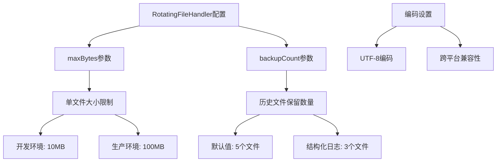

**图表来源**
- [tradingagents/utils/logging_manager.py](file://tradingagents/utils/logging_manager.py#L226-L260)

### 参数详解

#### maxBytes参数的实际效果

| 环境类型 | 默认值 | 实际字节数 | 效果说明 |
|---------|--------|-----------|----------|
| 开发环境 | "10MB" | 10,485,760 字节 | 较小文件便于快速分析 |
| 生产环境 | "100MB" | 104,857,600 字节 | 大文件减少轮转频率 |
| 结构化日志 | "10MB" | 10,485,760 字节 | 独立的轮转策略 |

#### backupCount参数的实际效果

| 文件类型 | 默认保留数量 | 最大文件数量 | 历史文件命名规则 |
|---------|-------------|-------------|-----------------|
| 主日志文件 | 5 | 6个文件 | tradingagents.log, tradingagents.log.1, tradingagents.log.2, ... |
| 结构化日志 | 3 | 4个文件 | tradingagents_structured.log, tradingagents_structured.log.1, tradingagents_structured.log.2 |
| 错误日志 | 3 | 4个文件 | tradingagents_error.log, tradingagents_error.log.1, tradingagents_error.log.2 |

**章节来源**
- [tradingagents/utils/logging_manager.py](file://tradingagents/utils/logging_manager.py#L226-L260)
- [config/logging.toml](file://config/logging.toml#L25-L30)

## 环境差异配置

### 开发环境配置

开发环境采用保守的轮转策略，便于快速调试和问题定位：

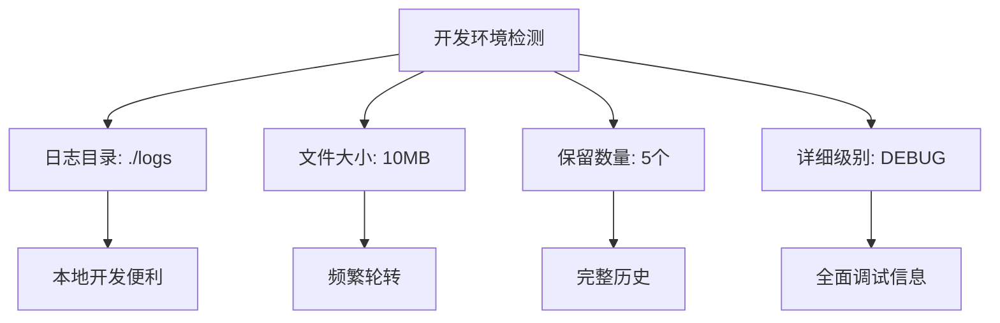

**图表来源**
- [config/logging.toml](file://config/logging.toml#L25-L30)

### Docker环境配置

Docker环境采用优化的配置策略，适应容器化部署需求：

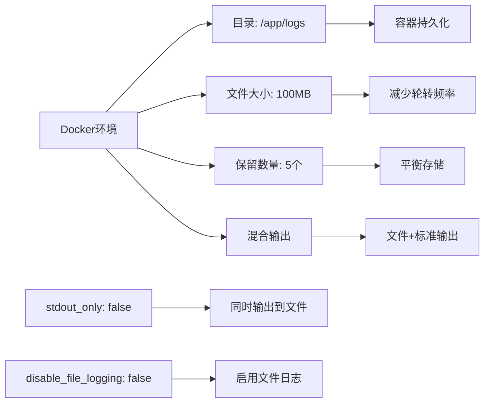

**图表来源**
- [config/logging_docker.toml](file://config/logging_docker.toml#L18-L25)

### 生产环境配置

生产环境配置强调稳定性和性能：

| 配置项 | 开发环境 | Docker环境 | 生产环境 |
|-------|----------|------------|----------|
| 文件大小 | 10MB | 100MB | 100MB |
| 保留数量 | 5个 | 5个 | 5个 |
| 日志级别 | DEBUG | DEBUG | INFO |
| 结构化日志 | 可选 | 启用 | 可选 |
| 错误通知 | 否 | 是 | 是 |

**章节来源**
- [config/logging.toml](file://config/logging.toml#L70-L85)
- [config/logging_docker.toml](file://config/logging_docker.toml#L70-L85)

## 日志轮转触发机制

### 触发条件分析

RotatingFileHandler的轮转触发遵循以下逻辑：

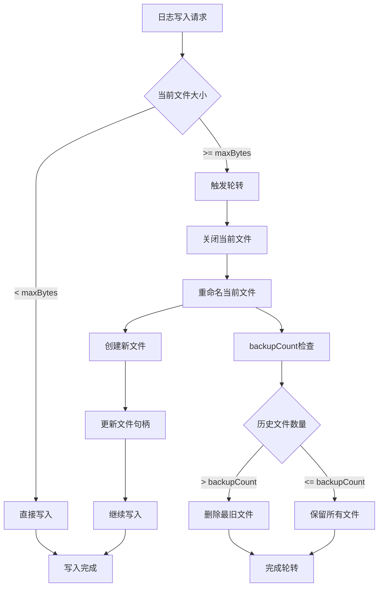

**图表来源**
- [tradingagents/utils/logging_manager.py](file://tradingagents/utils/logging_manager.py#L228-L240)

### 轮转时机计算

系统在每次日志写入时检查文件大小，确保精确控制：

```python
# 轮转检查逻辑（概念性描述）
if current_file_size + new_log_size >= max_bytes:
    trigger_rotation()
```

这种设计确保：
- **精确控制**：文件大小严格控制在maxBytes以内
- **平滑过渡**：新文件从零开始，避免截断问题
- **原子操作**：轮转过程中的数据一致性保证

**章节来源**
- [tradingagents/utils/logging_manager.py](file://tradingagents/utils/logging_manager.py#L228-L240)

## 文件命名模式

### 标准命名规则

系统采用标准化的文件命名模式：

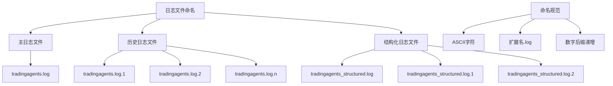

**图表来源**
- [scripts/ensure_logs_dir.py](file://scripts/ensure_logs_dir.py#L51-L105)

### 文件扩展名规则

| 文件类型 | 命名模式 | 示例 | 说明 |
|---------|---------|------|------|
| 主日志 | tradingagents.log | tradingagents.log | 当前活跃日志 |
| 历史日志 | tradingagents.log.N | tradingagents.log.1 | N为递增序号 |
| 结构化日志 | tradingagents_structured.log | tradingagents_structured.log | JSON格式日志 |
| 错误日志 | tradingagents_error.log | tradingagents_error.log | 错误专用日志 |

### 文件组织结构

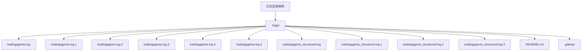

**图表来源**
- [scripts/init-directories.sh](file://scripts/init-directories.sh#L201-L256)

**章节来源**
- [scripts/ensure_logs_dir.py](file://scripts/ensure_logs_dir.py#L51-L105)
- [scripts/init-directories.sh](file://scripts/init-directories.sh#L201-L256)

## 磁盘空间管理

### 存储容量规划

系统采用分层存储管理策略：

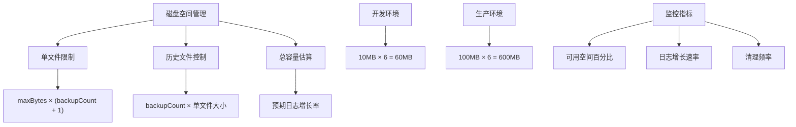

**图表来源**
- [config/logging.toml](file://config/logging.toml#L25-L30)

### 空间使用计算

| 环境 | 单文件大小 | 历史文件数 | 总存储需求 | 建议最小磁盘空间 |
|------|-----------|-----------|-----------|-----------------|
| 开发环境 | 10MB | 5个 | 60MB | 100MB |
| 生产环境 | 100MB | 5个 | 600MB | 1GB |
| Docker环境 | 100MB | 5个 | 600MB | 1GB |

### 自动清理机制

系统通过以下机制确保磁盘空间：

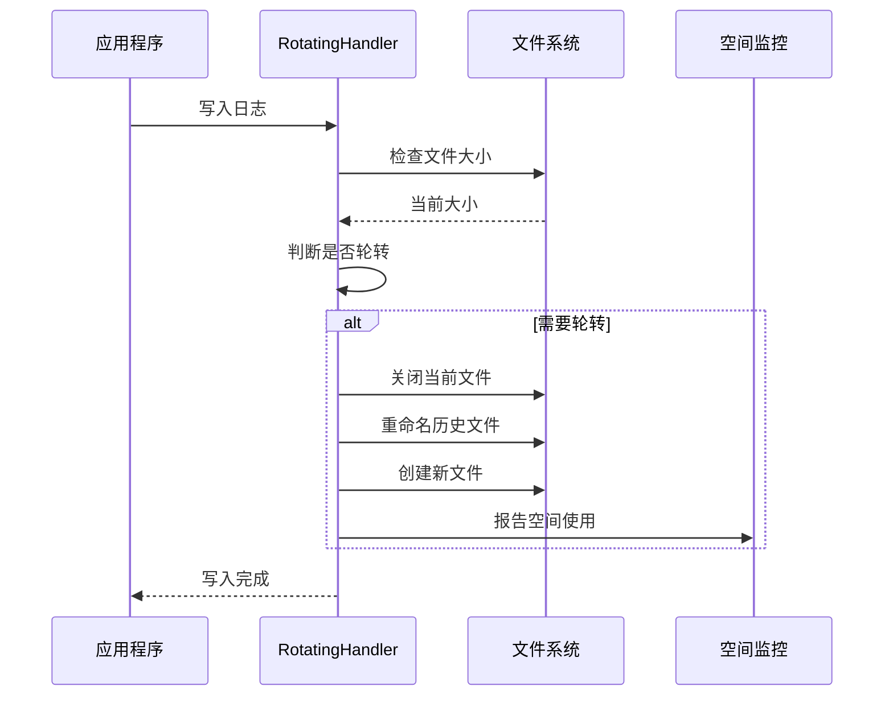

**图表来源**
- [tradingagents/utils/logging_manager.py](file://tradingagents/utils/logging_manager.py#L228-L240)

### 监控建议

为了确保系统稳定运行，建议实施以下监控措施：

1. **定期检查**：每日检查日志目录大小
2. **阈值告警**：设置磁盘使用率告警阈值
3. **自动清理**：配置定期清理过期日志
4. **备份策略**：重要日志定期备份到远程存储

**章节来源**
- [scripts/view_logs.py](file://scripts/view_logs.py#L90-L120)

## 性能监控与优化

### 性能指标监控

系统内置多种性能监控机制：

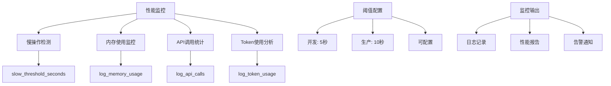

**图表来源**
- [config/logging_docker.toml](file://config/logging_docker.toml#L76-L85)

### 性能优化策略

| 优化方面 | 策略 | 实施方法 | 效果 |
|---------|------|---------|------|
| 写入性能 | 异步写入 | 日志缓冲区 | 减少I/O阻塞 |
| 存储效率 | 结构化日志 | JSON格式 | 更紧凑存储 |
| 查询速度 | 文件分割 | 按功能分类 | 快速定位 |
| 清理效率 | 自动轮转 | 定时清理 | 避免手动干预 |

### 大文件影响分析

大型日志文件可能对系统性能产生以下影响：

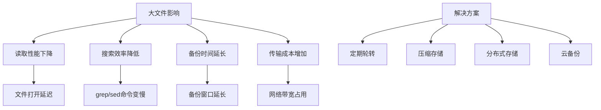

**章节来源**
- [config/logging_docker.toml](file://config/logging_docker.toml#L76-L85)

## 故障排除指南

### 常见问题诊断

#### 日志文件未生成

**症状**：日志目录为空或文件不存在

**排查步骤**：
1. 检查日志目录权限
2. 验证配置文件设置
3. 确认应用启动状态
4. 检查磁盘空间

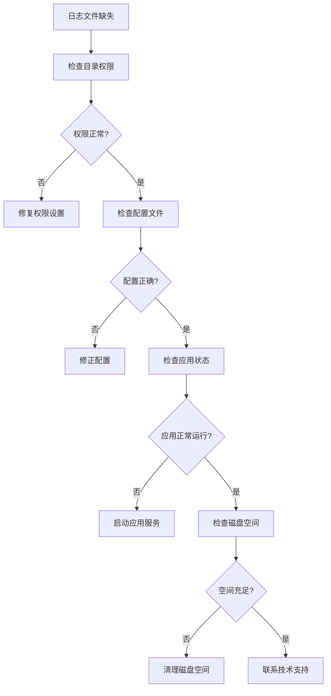

**图表来源**
- [scripts/ensure_logs_dir.py](file://scripts/ensure_logs_dir.py#L51-L105)

#### 轮转功能失效

**症状**：日志文件持续增长超过限制

**解决方案**：
1. 验证RotatingFileHandler配置
2. 检查文件句柄是否正确关闭
3. 确认编码设置正确
4. 检查系统时间同步

#### Docker环境问题

**症状**：容器内日志无法持久化

**解决方法**：
```bash
# 检查挂载点
docker inspect TradingAgents-web | grep Mounts

# 验证权限
docker exec TradingAgents-web ls -la /app/logs

# 重启服务
docker-compose restart web
```

### 调试工具使用

系统提供了多种调试工具：

| 工具 | 功能 | 使用场景 |
|------|------|----------|
| view_logs.py | 日志查看和搜索 | 日常问题排查 |
| test_docker_logging.py | Docker环境测试 | 容器化部署验证 |
| log_analyzer.py | 日志分析报告 | 性能和错误分析 |
| simple_log_test.py | 基础功能测试 | 配置验证 |

**章节来源**
- [scripts/view_logs.py](file://scripts/view_logs.py#L1-L50)
- [scripts/test_docker_logging.py](file://scripts/test_docker_logging.py#L1-L50)

## 最佳实践建议

### 配置最佳实践

#### 环境配置建议

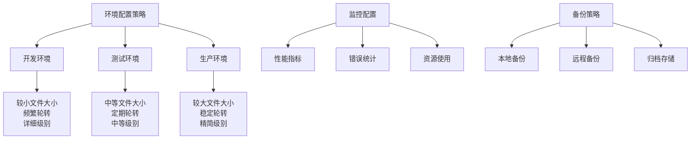

#### 性能优化建议

1. **合理设置阈值**：根据应用负载调整maxBytes和backupCount
2. **定期维护**：建立日志清理和归档流程
3. **监控告警**：设置磁盘空间和性能指标告警
4. **备份策略**：重要日志定期备份到安全存储

### 运维建议

#### 日常运维检查清单

- [ ] 检查日志目录空间使用率
- [ ] 验证轮转功能正常工作
- [ ] 确认配置文件无误
- [ ] 检查应用启动日志
- [ ] 验证错误日志无异常

#### 故障恢复流程

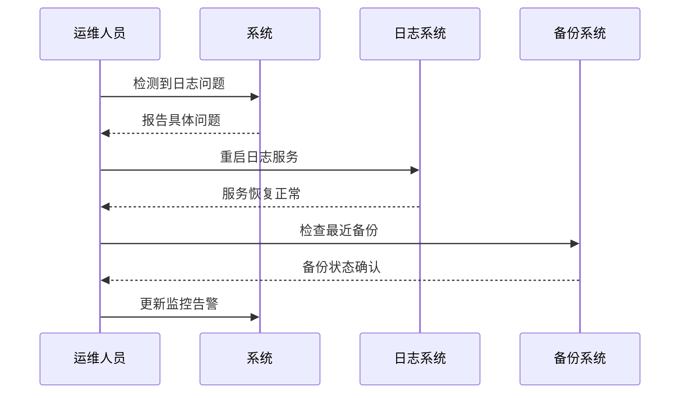

### 安全考虑

#### 敏感信息保护

系统内置多种安全机制：

- **数据脱敏**：自动屏蔽敏感信息
- **访问控制**：限制日志文件访问权限
- **加密存储**：重要日志文件加密保存
- **审计追踪**：记录日志访问和修改

#### 合规性要求

确保日志系统符合相关法规要求：

- **数据保留期限**：根据业务需求设置保留时间
- **访问日志记录**：记录所有日志访问操作
- **数据完整性**：确保日志文件不被篡改
- **备份完整性**：验证备份数据的完整性

**章节来源**
- [config/logging.toml](file://config/logging.toml#L85-L110)
- [scripts/view_logs.py](file://scripts/view_logs.py#L1-L227)