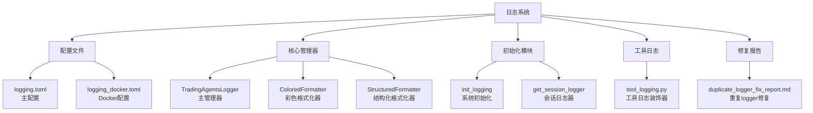
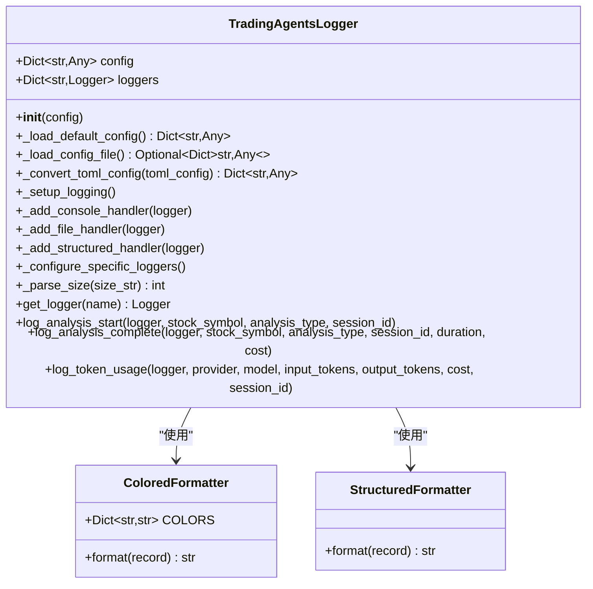
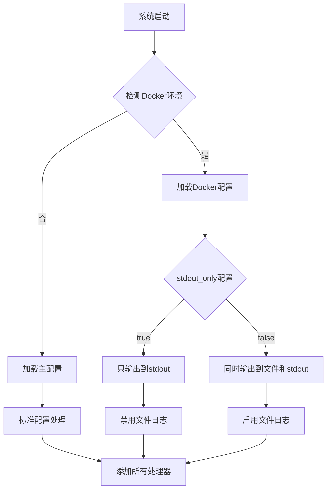
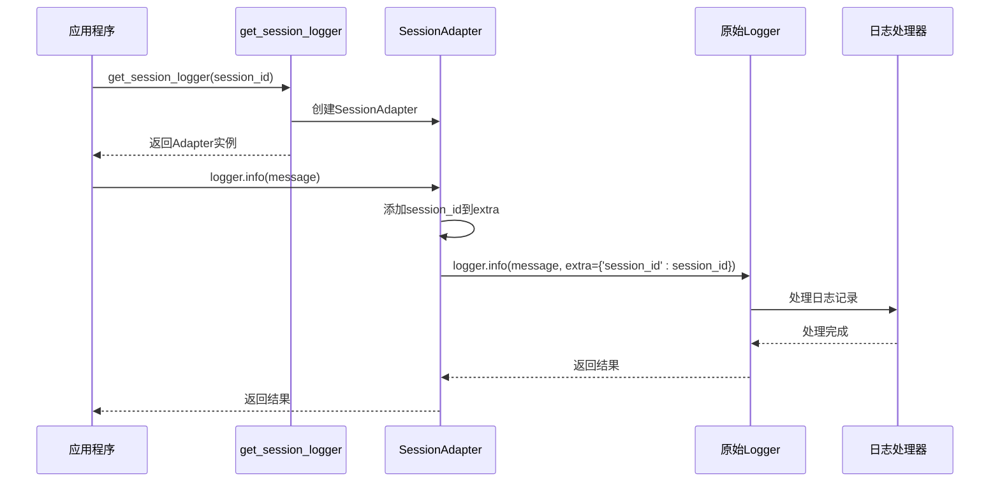
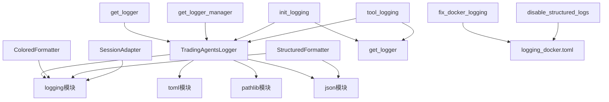

# 日志处理器管理

<cite>
**本文档中引用的文件**
- [config/logging.toml](file://config/logging.toml)
- [config/logging_docker.toml](file://config/logging_docker.toml)
- [tradingagents/utils/logging_manager.py](file://tradingagents/utils/logging_manager.py)
- [tradingagents/utils/logging_init.py](file://tradingagents/utils/logging_init.py)
- [tradingagents/utils/tool_logging.py](file://tradingagents/utils/tool_logging.py)
- [reports/duplicate_logger_fix_report.md](file://reports/duplicate_logger_fix_report.md)
- [scripts/fix_docker_logging.py](file://scripts/fix_docker_logging.py)
- [scripts/disable_structured_logs.py](file://scripts/disable_structured_logs.py)
- [examples/simple_analysis_demo.py](file://examples/simple_analysis_demo.py)
</cite>

## 目录
1. [简介](#简介)
2. [项目结构](#项目结构)
3. [核心组件](#核心组件)
4. [架构概览](#架构概览)
5. [详细组件分析](#详细组件分析)
6. [依赖关系分析](#依赖关系分析)
7. [性能考虑](#性能考虑)
8. [故障排除指南](#故障排除指南)
9. [结论](#结论)

## 简介

TradingAgents-CN项目采用统一的日志管理系统，提供了灵活且强大的日志处理能力。该系统支持多种日志处理器（控制台、文件、结构化日志），能够根据不同环境（开发、生产、Docker）自动调整配置，并解决了重复logger定义等历史问题。

## 项目结构

日志系统的文件组织结构如下：



**图表来源**
- [config/logging.toml](file://config/logging.toml#L1-L111)
- [config/logging_docker.toml](file://config/logging_docker.toml#L1-L100)
- [tradingagents/utils/logging_manager.py](file://tradingagents/utils/logging_manager.py#L1-L411)

**章节来源**
- [config/logging.toml](file://config/logging.toml#L1-L111)
- [config/logging_docker.toml](file://config/logging_docker.toml#L1-L100)
- [tradingagents/utils/logging_manager.py](file://tradingagents/utils/logging_manager.py#L1-L411)

## 核心组件

### 日志处理器类型

系统支持三种主要的日志处理器：

1. **控制台处理器 (Console Handler)**：用于终端输出
2. **文件处理器 (File Handler)**：用于持久化存储
3. **结构化处理器 (Structured Handler)**：用于JSON格式输出

### 配置参数详解

#### handlers.console 控制台处理器

| 参数 | 类型 | 默认值 | 说明 |
|------|------|--------|------|
| enabled | boolean | true | 是否启用控制台输出 |
| colored | boolean | true | 是否启用彩色输出 |
| level | string | "INFO" | 日志级别 |

**colored属性作用**：
- `colored=true`：启用ANSI颜色代码，使日志在终端中具有颜色区分
- `colored=false`：禁用颜色，输出纯文本格式
- 仅在`sys.stdout.isatty()`为True时生效（即终端支持）

**level属性作用**：
- DEBUG：记录详细的调试信息
- INFO：记录一般信息性消息
- WARNING：记录警告信息
- ERROR：记录错误信息
- CRITICAL：记录严重错误信息

#### handlers.file 文件处理器

| 参数 | 类型 | 默认值 | 说明 |
|------|------|--------|------|
| enabled | boolean | true | 是否启用文件输出 |
| level | string | "DEBUG" | 日志级别 |
| max_size | string | "10MB" | 单个日志文件最大大小 |
| backup_count | integer | 5 | 保留的备份文件数量 |
| directory | string | "./logs" | 日志文件存储目录 |

**日志轮转机制**：
- 使用`RotatingFileHandler`实现日志轮转
- 当日志文件达到`max_size`时自动轮转
- 最多保留`backup_count`个备份文件
- 自动清理超出数量的旧文件

#### handlers.structured 结构化处理器

| 参数 | 类型 | 默认值 | 说明 |
|------|------|--------|------|
| enabled | boolean | false | 是否启用结构化输出 |
| level | string | "INFO" | 日志级别 |
| directory | string | "./logs" | 日志文件存储目录 |

**JSON输出机制**：
- 输出格式为JSON对象
- 包含时间戳、级别、记录器名称、消息等基本信息
- 支持扩展字段：session_id、analysis_type、stock_symbol、cost、tokens等

**章节来源**
- [config/logging.toml](file://config/logging.toml#L10-L35)
- [config/logging_docker.toml](file://config/logging_docker.toml#L10-L35)
- [tradingagents/utils/logging_manager.py](file://tradingagents/utils/logging_manager.py#L19-L41)

## 架构概览

```mermaid
graph TB
subgraph "配置层"
A[logging.toml<br/>主配置]
B[logging_docker.toml<br/>Docker配置]
C[环境变量<br/>TRADINGAGENTS_LOG_*]
end
subgraph "管理层"
D[TradingAgentsLogger<br/>主管理器]
E[配置加载器<br/>_load_config_file]
F[环境检测<br/>_detect_docker]
end
subgraph "处理器层"
G[控制台处理器<br/>_add_console_handler]
H[文件处理器<br/>_add_file_handler]
I[结构化处理器<br/>_add_structured_handler]
end
subgraph "格式化层"
J[ColoredFormatter<br/>彩色格式化器]
K[StructuredFormatter<br/>结构化格式化器]
L[标准Formatter<br/>普通格式化器]
end
subgraph "应用层"
M[get_logger<br/>便捷函数]
N[SessionAdapter<br/>会话适配器]
O[工具日志装饰器<br/>@log_tool_call]
end
A --> E
B --> E
C --> E
E --> D
F --> D
D --> G
D --> H
D --> I
G --> J
G --> L
H --> L
I --> K
D --> M
M --> N
O --> M
```

**图表来源**
- [tradingagents/utils/logging_manager.py](file://tradingagents/utils/logging_manager.py#L140-L200)
- [tradingagents/utils/logging_init.py](file://tradingagents/utils/logging_init.py#L15-L45)

## 详细组件分析

### TradingAgentsLogger 主管理器



**图表来源**
- [tradingagents/utils/logging_manager.py](file://tradingagents/utils/logging_manager.py#L60-L120)
- [tradingagents/utils/logging_manager.py](file://tradingagents/utils/logging_manager.py#L19-L41)

#### 配置加载机制

系统优先级顺序：
1. Docker环境配置 (`logging_docker.toml`)
2. 主配置文件 (`logging.toml`)
3. 环境变量配置
4. 默认配置

#### Docker环境特殊处理



**图表来源**
- [tradingagents/utils/logging_manager.py](file://tradingagents/utils/logging_manager.py#L160-L195)
- [config/logging_docker.toml](file://config/logging_docker.toml#L70-L75)

**章节来源**
- [tradingagents/utils/logging_manager.py](file://tradingagents/utils/logging_manager.py#L60-L200)

### 会话日志器 SessionAdapter



**图表来源**
- [tradingagents/utils/logging_init.py](file://tradingagents/utils/logging_init.py#L43-L85)

**章节来源**
- [tradingagents/utils/logging_init.py](file://tradingagents/utils/logging_init.py#L43-L85)

### 工具日志装饰器

系统提供了丰富的工具日志装饰器：

#### log_tool_call 装饰器
- 记录工具调用开始和结束
- 自动计算执行时间
- 可配置参数和结果记录

#### log_data_source_call 装饰器  
- 专门用于数据源调用
- 自动提取股票代码
- 区分成功和失败状态

#### log_llm_call 装饰器
- 专门用于LLM调用
- 记录提供商和模型信息
- 统一的LLM调用日志格式

**章节来源**
- [tradingagents/utils/tool_logging.py](file://tradingagents/utils/tool_logging.py#L15-L150)

## 依赖关系分析



**图表来源**
- [tradingagents/utils/logging_manager.py](file://tradingagents/utils/logging_manager.py#L1-L20)
- [tradingagents/utils/logging_init.py](file://tradingagents/utils/logging_init.py#L1-L15)

**章节来源**
- [tradingagents/utils/logging_manager.py](file://tradingagents/utils/logging_manager.py#L1-L20)
- [tradingagents/utils/logging_init.py](file://tradingagents/utils/logging_init.py#L1-L15)

## 性能考虑

### 日志级别优化
- DEBUG级别日志仅在开发环境启用
- 生产环境默认使用INFO级别
- 结构化日志处理器默认关闭，减少I/O开销

### 文件轮转优化
- 使用`RotatingFileHandler`避免大文件
- 自动清理旧文件，控制磁盘空间使用
- 异步写入机制减少阻塞

### 内存管理
- 使用单例模式管理全局日志器
- 按需创建日志器实例
- 及时释放不再使用的日志器

## 故障排除指南

### 重复Logger问题

根据[重复Logger修复报告](file://reports/duplicate_logger_fix_report.md)，系统曾存在大量重复Logger定义的问题。

**解决方案**：
1. 使用统一的`get_logger()`函数
2. 避免在每个文件中重复定义Logger
3. 使用命名空间区分不同模块的Logger

**修复示例**：
```python
# 修复前：重复定义
logger = get_logger('default')
logger = get_logger('default')

# 修复后：统一管理
logger = get_logger('specific_module_name')
```

### Docker环境日志配置

**常见问题**：
- `KeyError: 'file'`错误
- 日志输出到stdout但文件为空

**解决方案**：
1. 使用`fix_docker_logging.py`脚本修复配置
2. 确保`stdout_only = false`和`disable_file_logging = false`
3. 验证日志目录权限

### 结构化日志启用

**启用步骤**：
1. 编辑`config/logging_docker.toml`
2. 将`[logging.handlers.structured].enabled = true`
3. 重启服务或重新构建Docker镜像

**章节来源**
- [reports/duplicate_logger_fix_report.md](file://reports/duplicate_logger_fix_report.md#L1-L50)
- [scripts/fix_docker_logging.py](file://scripts/fix_docker_logging.py#L1-L45)
- [scripts/disable_structured_logs.py](file://scripts/disable_structured_logs.py#L1-L37)

## 结论

TradingAgents-CN的日志处理器管理系统提供了以下核心优势：

1. **统一配置管理**：通过TOML配置文件集中管理所有日志设置
2. **环境自适应**：自动检测Docker环境并调整配置
3. **多格式支持**：支持控制台、文件和结构化JSON输出
4. **性能优化**：智能的文件轮转和异步处理机制
5. **开发友好**：丰富的工具日志装饰器简化开发工作

该系统不仅满足了当前的业务需求，还为未来的扩展提供了良好的架构基础。通过合理的配置管理和错误处理机制，确保了系统的稳定性和可维护性。