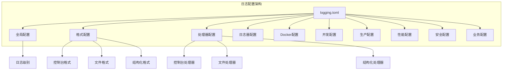

# 日志格式配置

<cite>
**本文档中引用的文件**
- [config/logging.toml](file://config/logging.toml)
- [config/logging_docker.toml](file://config/logging_docker.toml)
- [tradingagents/utils/logging_manager.py](file://tradingagents/utils/logging_manager.py)
- [tradingagents/utils/logging_init.py](file://tradingagents/utils/logging_init.py)
- [scripts/fix_docker_logging.py](file://scripts/fix_docker_logging.py)
- [scripts/test_docker_logging.py](file://scripts/test_docker_logging.py)
- [examples/cli_demo.py](file://examples/cli_demo.py)
- [web/run_web.py](file://web/run_web.py)
- [tradingagents/graph/trading_graph.py](file://tradingagents/graph/trading_graph.py)
</cite>

## 目录
1. [概述](#概述)
2. [日志格式类型](#日志格式类型)
3. [配置文件详解](#配置文件详解)
4. [格式字符串字段说明](#格式字符串字段说明)
5. [环境差异配置](#环境差异配置)
6. [自定义格式示例](#自定义格式示例)
7. [最佳实践](#最佳实践)
8. [故障排除](#故障排除)

## 概述

TradingAgents-CN采用统一的日志管理系统，支持三种主要的日志格式：控制台格式（Console）、文件格式（File）和结构化格式（Structured JSON）。该系统根据不同的运行环境自动调整配置，确保在开发、Docker和生产环境中都能获得最佳的日志体验。

### 核心特性

- **多格式支持**：同时支持控制台、文件和结构化日志输出
- **环境感知**：自动检测Docker环境并调整配置
- **灵活配置**：通过TOML配置文件实现集中式管理
- **性能优化**：支持日志轮转和大小限制
- **安全考虑**：内置敏感数据屏蔽机制

## 日志格式类型

### 1. 控制台格式（Console）

控制台格式专为开发调试设计，注重可读性和实时反馈。

**特点：**
- 彩色输出（仅限终端支持）
- 简洁的格式，便于快速阅读
- 适合开发环境和交互式使用

**适用场景：**
- 开发调试阶段
- 本地测试和演示
- 需要实时日志反馈的场景

### 2. 文件格式（File）

文件格式包含完整的上下文信息，适合长期存储和分析。

**特点：**
- 包含模块名、函数名和行号
- 详细的上下文信息
- 支持日志轮转和备份

**适用场景：**
- 生产环境部署
- 长期日志存储
- 故障排查和审计

### 3. 结构化格式（Structured JSON）

结构化格式采用JSON格式，便于自动化处理和分析。

**特点：**
- 标准化的数据格式
- 易于解析和查询
- 支持复杂数据结构

**适用场景：**
- 日志收集系统集成
- 监控和告警系统
- 数据分析和报表生成

## 配置文件详解

### 主配置文件（logging.toml）

主配置文件位于`config/logging.toml`，包含完整的日志配置选项。



**图表来源**
- [config/logging.toml](file://config/logging.toml#L1-L111)

### Docker专用配置（logging_docker.toml）

Docker配置文件针对容器环境进行了优化。

**关键差异：**
- 禁用彩色输出
- 增加日志文件大小限制
- 优化格式字符串
- 支持容器内日志收集

**图表来源**
- [config/logging_docker.toml](file://config/logging_docker.toml#L1-L100)

**章节来源**
- [config/logging.toml](file://config/logging.toml#L1-L111)
- [config/logging_docker.toml](file://config/logging_docker.toml#L1-L100)

## 格式字符串字段说明

### 控制台格式字段

| 字段 | 描述 | 示例 |
|------|------|------|
| `%(asctime)s` | 时间戳 | `2024-01-15 10:30:45,123` |
| `%(name)s` | 日志器名称 | `tradingagents.init` |
| `%(levelname)s` | 日志级别 | `INFO`, `DEBUG`, `ERROR` |
| `%(message)s` | 日志消息 | `TradingAgents-CN 日志系统初始化完成` |

### 文件格式字段

| 字段 | 描述 | 示例 |
|------|------|------|
| `%(module)s` | 模块名 | `logging_manager` |
| `%(funcName)s` | 函数名 | `init_logging` |
| `%(lineno)d` | 行号 | `45` |
| `%(name)s` | 日志器名称 | `tradingagents.init` |
| `%(levelname)s` | 日志级别 | `INFO` |
| `%(message)s` | 日志消息 | `日志系统初始化完成` |

### 结构化格式字段

结构化格式生成JSON对象，包含以下核心字段：

| 字段 | 类型 | 描述 |
|------|------|------|
| `timestamp` | string | ISO 8601时间戳 |
| `level` | string | 日志级别 |
| `logger` | string | 日志器名称 |
| `message` | string | 日志消息 |
| `module` | string | 模块名 |
| `function` | string | 函数名 |
| `line` | integer | 行号 |
| `session_id` | string | 会话标识（可选） |
| `analysis_type` | string | 分析类型（可选） |
| `stock_symbol` | string | 股票代码（可选） |

**章节来源**
- [tradingagents/utils/logging_manager.py](file://tradingagents/utils/logging_manager.py#L93-L94)
- [tradingagents/utils/logging_manager.py](file://tradingagents/utils/logging_manager.py#L25-L40)

## 环境差异配置

### 开发环境配置

开发环境专注于调试便利性和实时反馈：

```toml
[logging.development]
enabled = true
debug_modules = ["tradingagents.graph", "tradingagents.llm_adapters"]
save_debug_files = true
```

**特点：**
- 启用彩色输出
- 详细的模块调试信息
- 保存调试文件
- 较低的日志级别

### Docker环境配置

Docker环境针对容器化部署进行了优化：

```toml
[logging.docker]
enabled = true
stdout_only = false
disable_file_logging = false
```

**特点：**
- 禁用彩色输出
- 支持文件和标准输出
- 优化的日志轮转策略
- 适应容器日志收集系统

### 生产环境配置

生产环境强调性能和安全性：

```toml
[logging.production]
enabled = true
structured_only = true
error_notification = true
max_log_size = "100MB"
```

**特点：**
- 仅使用结构化日志
- 错误通知机制
- 大容量日志文件
- 高性能配置

**章节来源**
- [config/logging.toml](file://config/logging.toml#L75-L95)
- [config/logging_docker.toml](file://config/logging_docker.toml#L75-L85)

## 自定义格式示例

### 基础自定义格式

```toml
[logging.format]
console = "%(asctime)s | %(levelname)-8s | %(name)s | %(message)s"
file = "%(asctime)s | %(name)-20s | %(levelname)-8s | %(module)s:%(funcName)s:%(lineno)d | %(message)s"
structured = "json"
```

### 高级自定义格式

```toml
[logging.format]
# 带有进程ID和线程ID的格式
console = "%(asctime)s | %(process)d | %(thread)d | %(levelname)-8s | %(name)s | %(message)s"
file = "%(asctime)s | %(process)d | %(thread)d | %(levelname)-8s | %(name)-20s | %(module)s:%(funcName)s:%(lineno)d | %(message)s"

# 包含用户会话信息的格式
console = "%(asctime)s | %(levelname)-8s | %(name)s | Session:%(session_id)s | %(message)s"
file = "%(asctime)s | %(levelname)-8s | %(name)-20s | Module:%(module)s | Session:%(session_id)s | %(message)s"
```

### 监控专用格式

```toml
[logging.format]
# 性能监控格式
console = "%(asctime)s | %(levelname)-8s | %(name)s | Duration:%(duration).2fs | Cost:%(cost).4f | %(message)s"
file = "%(asctime)s | %(levelname)-8s | %(name)-20s | Module:%(module)s | Duration:%(duration).2fs | Cost:%(cost).4f | %(message)s"

# 业务指标格式
console = "%(asctime)s | %(levelname)-8s | %(name)s | Event:%(event_type)s | Symbol:%(stock_symbol)s | %(message)s"
file = "%(asctime)s | %(levelname)-8s | %(name)-20s | Module:%(module)s | Event:%(event_type)s | Symbol:%(stock_symbol)s | %(message)s"
```

## 最佳实践

### 1. 格式选择指南

**开发阶段：**
- 使用控制台格式获得最佳可读性
- 启用彩色输出提高调试效率
- 包含详细上下文信息

**测试阶段：**
- 使用文件格式确保日志完整性
- 配置适当的日志级别
- 启用结构化格式便于自动化测试

**生产环境：**
- 优先使用结构化格式
- 配置合理的日志轮转策略
- 启用错误通知机制

### 2. 性能优化建议

**日志级别配置：**
```toml
[logging.loggers]
# 开发环境
[logging.loggers.development]
level = "DEBUG"

# 生产环境
[logging.loggers.production]
level = "INFO"
```

**日志轮转配置：**
```toml
[logging.handlers.file]
max_size = "50MB"
backup_count = 10
```

### 3. 安全考虑

**敏感数据保护：**
```toml
[logging.security]
mask_sensitive_data = true
```

**日志内容过滤：**
- 避免记录密码和API密钥
- 使用日志级别区分信息敏感度
- 实施日志访问控制

### 4. 监控集成

**Prometheus集成格式：**
```toml
console = "%(asctime)s | %(levelname)-8s | %(name)s | metric=%(metric_name)s value=%(metric_value).2f | %(message)s"
```

**ELK Stack集成格式：**
```toml
structured = "json"
```

**章节来源**
- [tradingagents/utils/logging_manager.py](file://tradingagents/utils/logging_manager.py#L100-L150)
- [config/logging.toml](file://config/logging.toml#L95-L111)

## 故障排除

### 常见问题及解决方案

#### 1. Docker环境日志问题

**问题：** Docker容器中没有生成日志文件

**解决方案：**
```bash
# 检查Docker配置
docker exec TradingAgents-web cat /app/config/logging_docker.toml

# 验证日志目录权限
docker exec TradingAgents-web ls -la /app/logs/

# 重新构建并启动容器
docker-compose build
docker-compose up -d
```

#### 2. 日志格式不一致

**问题：** 不同环境下的日志格式不一致

**解决方案：**
```python
# 检查环境变量
import os
print(f"DOCKER_CONTAINER: {os.getenv('DOCKER_CONTAINER')}")

# 验证配置加载
from tradingagents.utils.logging_init import get_logger_manager
manager = get_logger_manager()
print(f"当前配置: {manager.config}")
```

#### 3. 日志文件过大

**问题：** 日志文件占用过多磁盘空间

**解决方案：**
```toml
# 调整日志轮转配置
[logging.handlers.file]
max_size = "10MB"
backup_count = 3
```

#### 4. 结构化日志解析问题

**问题：** 结构化日志无法被外部系统正确解析

**解决方案：**
```python
# 验证JSON格式
import json
with open('logs/tradingagents_structured.log', 'r') as f:
    for line in f:
        try:
            json.loads(line.strip())
        except json.JSONDecodeError as e:
            print(f"无效JSON: {e}")
```

### 调试工具

#### 日志测试脚本

系统提供了专门的日志测试工具来验证配置：

```bash
# 测试Docker环境日志
docker exec TradingAgents-web python test_docker_logging.py

# 测试本地日志配置
python scripts/simple_log_test.py
```

#### 日志分析工具

```bash
# 分析日志文件
python scripts/log_analyzer.py logs/tradingagents.log
```

**章节来源**
- [scripts/test_docker_logging.py](file://scripts/test_docker_logging.py#L1-L64)
- [scripts/fix_docker_logging.py](file://scripts/fix_docker_logging.py#L1-L270)

## 总结

TradingAgents-CN的日志格式配置系统提供了灵活而强大的日志管理能力。通过合理配置三种格式类型，开发者可以根据不同的使用场景选择最适合的日志输出方式。系统自动适应不同的运行环境，确保在开发、测试和生产环境中都能获得最佳的日志体验。

关键要点：
- 控制台格式适合开发调试
- 文件格式提供完整上下文信息
- 结构化格式便于自动化处理
- 环境感知配置简化部署流程
- 自定义格式支持特定监控需求

通过遵循本文档的最佳实践和故障排除指南，可以充分发挥日志系统的价值，提升开发效率和系统可观测性。