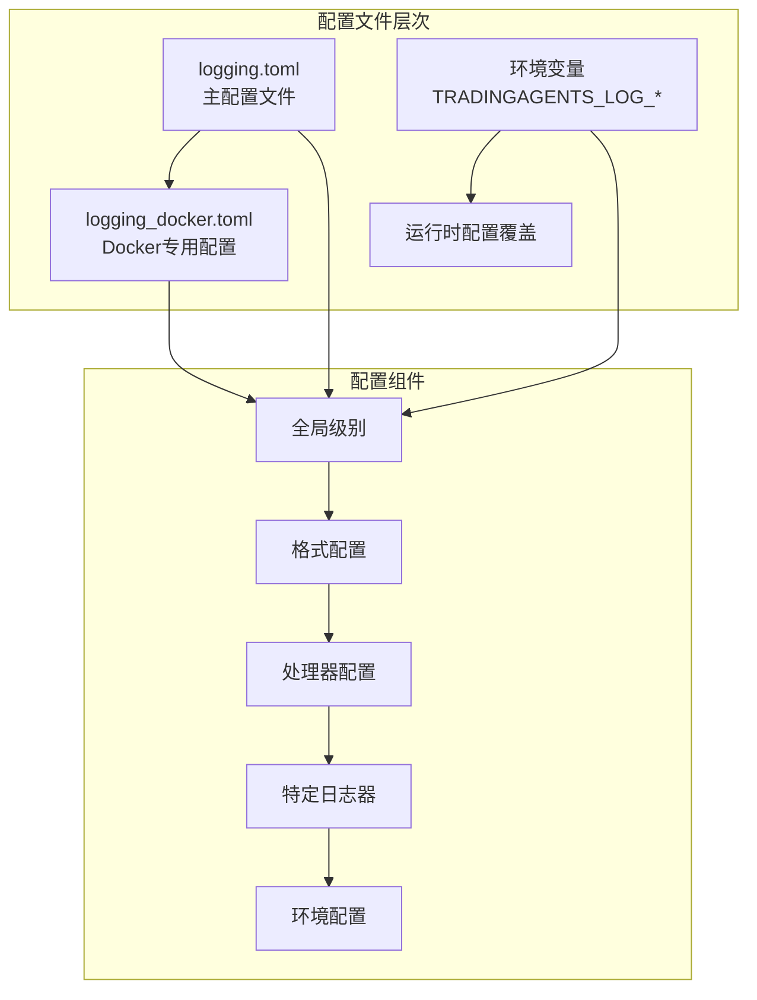
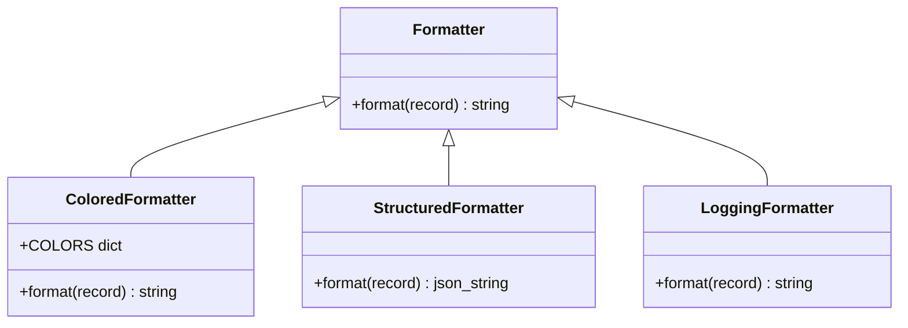
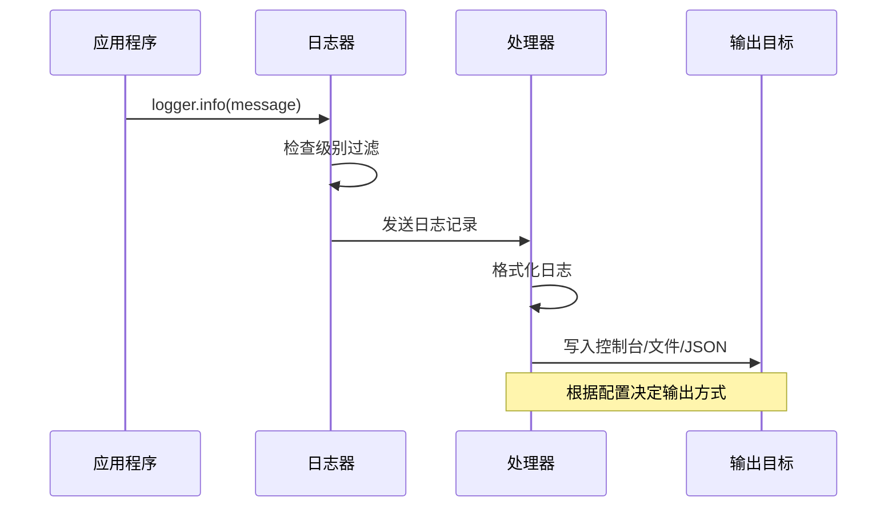
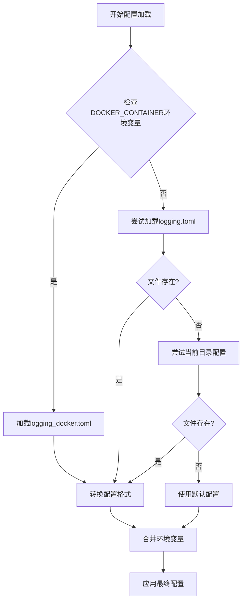
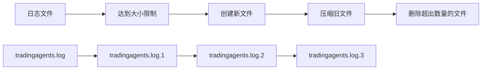

# 日志配置管理

<cite>
**本文档中引用的文件**
- [config/logging.toml](file://config/logging.toml)
- [config/logging_docker.toml](file://config/logging_docker.toml)
- [tradingagents/utils/logging_manager.py](file://tradingagents/utils/logging_manager.py)
- [tradingagents/utils/logging_init.py](file://tradingagents/utils/logging_init.py)
- [scripts/test_docker_logging.py](file://scripts/test_docker_logging.py)
- [scripts/fix_docker_logging.py](file://scripts/fix_docker_logging.py)
- [scripts/fix_logging_config_error.py](file://scripts/fix_logging_config_error.py)
- [examples/config_management_demo.py](file://examples/config_management_demo.py)
</cite>

## 目录
1. [简介](#简介)
2. [配置文件结构](#配置文件结构)
3. [全局日志级别配置](#全局日志级别配置)
4. [格式配置详解](#格式配置详解)
5. [处理器配置](#处理器配置)
6. [特定日志器配置](#特定日志器配置)
7. [环境配置差异](#环境配置差异)
8. [配置优先级](#配置优先级)
9. [高级功能特性](#高级功能特性)
10. [故障排除指南](#故障排除指南)

## 简介

TradingAgents-CN采用统一的日志管理系统，支持多种环境配置和灵活的日志级别控制。系统基于Python标准库logging模块构建，提供了丰富的配置选项，包括控制台输出、文件轮转、结构化JSON日志等高级功能。

### 核心特性

- **多环境支持**：开发、生产、Docker环境的差异化配置
- **多种输出格式**：控制台彩色输出、文件轮转、结构化JSON
- **细粒度控制**：全局级别、模块级别、特定日志器级别
- **性能监控**：慢操作检测、内存使用跟踪
- **安全审计**：API调用记录、Token使用监控

## 配置文件结构

系统使用TOML格式的配置文件，支持主配置文件和Docker专用配置文件。



**图表来源**
- [config/logging.toml](file://config/logging.toml#L1-L111)
- [config/logging_docker.toml](file://config/logging_docker.toml#L1-L100)

### 配置文件位置

| 配置文件 | 用途 | 优先级 |
|---------|------|--------|
| `config/logging.toml` | 主应用配置 | 中等 |
| `config/logging_docker.toml` | Docker环境专用配置 | 最高 |
| `./logging.toml` | 当前目录配置 | 最低 |

**章节来源**
- [config/logging.toml](file://config/logging.toml#L1-L111)
- [config/logging_docker.toml](file://config/logging_docker.toml#L1-L100)

## 全局日志级别配置

全局日志级别控制整个应用的基础日志输出量。

### 级别定义

| 级别 | 数值 | 描述 | 使用场景 |
|------|------|------|----------|
| DEBUG | 10 | 详细调试信息 | 开发调试 |
| INFO | 20 | 一般信息记录 | 正常运行 |
| WARNING | 30 | 警告信息 | 潜在问题 |
| ERROR | 40 | 错误信息 | 功能异常 |
| CRITICAL | 50 | 严重错误 | 系统故障 |

### 配置语法

```toml
[logging]
level = "INFO"  # 全局默认级别
```

### 环境变量覆盖

```bash
export TRADINGAGENTS_LOG_LEVEL=DEBUG  # 设置全局级别
export TRADINGAGENTS_LOG_DIR=/custom/logs  # 设置日志目录
```

**章节来源**
- [tradingagents/utils/logging_manager.py](file://tradingagents/utils/logging_manager.py#L87-L88)
- [config/logging.toml](file://config/logging.toml#L3-L5)

## 格式配置详解

日志格式配置决定了日志输出的样式和内容。

### 控制台格式

```toml
[logging.format]
console = "%(asctime)s | %(name)-20s | %(levelname)-8s | %(message)s"
```

**格式说明**：
- `%(asctime)s`：时间戳
- `%(name)-20s`：日志器名称（左对齐，20字符宽度）
- `%(levelname)-8s`：日志级别（左对齐，8字符宽度）
- `%(message)s`：日志消息

### 文件格式

```toml
file = "%(asctime)s | %(name)-20s | %(levelname)-8s | %(module)s:%(funcName)s:%(lineno)d | %(message)s"
```

**增强字段**：
- `%(module)s`：模块名
- `%(funcName)s`：函数名
- `%(lineno)d`：行号

### 结构化JSON格式

```toml
structured = "json"
```

**JSON结构**：
```json
{
    "timestamp": "2024-01-01T12:00:00.000Z",
    "level": "INFO",
    "logger": "tradingagents.core",
    "message": "系统初始化完成",
    "module": "core",
    "function": "initialize",
    "line": 42
}
```

### 格式化器类型



**图表来源**
- [tradingagents/utils/logging_manager.py](file://tradingagents/utils/logging_manager.py#L18-L50)

**章节来源**
- [config/logging.toml](file://config/logging.toml#L8-L10)
- [tradingagents/utils/logging_manager.py](file://tradingagents/utils/logging_manager.py#L90-L98)

## 处理器配置

处理器负责将日志记录发送到不同的输出目标。

### 控制台处理器

```toml
[logging.handlers.console]
enabled = true
colored = true  # 彩色输出
level = "INFO"
```

**参数说明**：
- `enabled`：是否启用控制台输出
- `colored`：是否启用ANSI颜色
- `level`：控制台输出级别

### 文件处理器

```toml
[logging.handlers.file]
enabled = true
level = "DEBUG"
max_size = "10MB"
backup_count = 5
directory = "./logs"
```

**参数说明**：
- `max_size`：单个日志文件最大大小（支持KB、MB、GB）
- `backup_count`：保留的历史文件数量
- `directory`：日志文件存储目录

### 结构化日志处理器

```toml
[logging.handlers.structured]
enabled = false
level = "INFO"
directory = "./logs"
```

**特点**：
- 输出JSON格式日志
- 单个文件最大10MB
- 保留3个备份文件

### 处理器工作流程



**图表来源**
- [tradingagents/utils/logging_manager.py](file://tradingagents/utils/logging_manager.py#L195-L228)

**章节来源**
- [config/logging.toml](file://config/logging.toml#L13-L40)
- [tradingagents/utils/logging_manager.py](file://tradingagents/utils/logging_manager.py#L226-L260)

## 特定日志器配置

系统为不同模块和组件提供了专门的日志器配置。

### 核心模块日志器

| 日志器名称 | 默认级别 | 用途描述 |
|-----------|----------|----------|
| `tradingagents` | INFO | 主应用核心逻辑 |
| `web` | INFO | Web界面和API |
| `dataflows` | INFO | 数据处理流程 |
| `llm_adapters` | INFO | LLM适配器层 |

### 第三方库日志器

```toml
[logging.loggers]
# 减少噪声日志
[logging.loggers.streamlit]
level = "WARNING"

[logging.loggers.urllib3]
level = "WARNING"

[logging.loggers.requests]
level = "WARNING"

[logging.loggers.matplotlib]
level = "WARNING"

[logging.loggers.pandas]
level = "WARNING"
```

### 日志器继承关系

```mermaid
graph TD
A[根日志器<br/>logging.getLogger()] --> B[tradingagents]
A --> C[web]
A --> D[dataflows]
A --> E[llm_adapters]
B --> F[agents]
B --> G[dataflows]
B --> H[llm_adapters]
C --> I[components]
C --> J[modules]
D --> K[cache_manager]
D --> L[stock_data_service]
```

**图表来源**
- [config/logging.toml](file://config/logging.toml#L42-L65)

**章节来源**
- [config/logging.toml](file://config/logging.toml#L42-L65)
- [tradingagents/utils/logging_manager.py](file://tradingagents/utils/logging_manager.py#L280-L285)

## 环境配置差异

系统针对不同部署环境提供了专门的配置优化。

### 开发环境配置

```toml
[logging.development]
enabled = true
debug_modules = ["tradingagents.graph", "tradingagents.llm_adapters"]
save_debug_files = true
```

**开发特性**：
- 启用详细调试模块
- 保存调试文件
- 更高的日志级别

### 生产环境配置

```toml
[logging.production]
enabled = true
structured_only = true
error_notification = true
max_log_size = "100MB"
```

**生产特性**：
- 只使用结构化日志
- 启用错误通知
- 增大的日志文件限制

### Docker环境配置

```toml
[logging.docker]
enabled = true
stdout_only = false  # 同时输出到文件和stdout
disable_file_logging = false  # 启用文件日志
```

**Docker特性**：
- 自动检测Docker环境
- 支持文件和标准输出双重输出
- 优化的资源使用

### 环境配置对比表

| 配置项 | 开发环境 | 生产环境 | Docker环境 |
|-------|----------|----------|------------|
| 结构化日志 | 否 | 是 | 是 |
| 文件输出 | 是 | 是 | 是 |
| 错误通知 | 否 | 是 | 是 |
| 日志级别 | DEBUG | INFO | INFO |
| 文件大小限制 | 10MB | 100MB | 100MB |

**章节来源**
- [config/logging.toml](file://config/logging.toml#L67-L111)
- [config/logging_docker.toml](file://config/logging_docker.toml#L75-L100)

## 配置优先级

系统采用多层次的配置优先级机制，确保灵活性和可控性。

### 优先级顺序（从高到低）

1. **环境变量**：`TRADINGAGENTS_LOG_LEVEL`, `TRADINGAGENTS_LOG_DIR`
2. **配置文件**：`config/logging_docker.toml` > `config/logging.toml` > `./logging.toml`
3. **默认值**：系统内置的默认配置

### 配置加载流程



**图表来源**
- [tradingagents/utils/logging_manager.py](file://tradingagents/utils/logging_manager.py#L130-L161)

### 环境变量映射

| 环境变量 | 配置键 | 默认值 | 说明 |
|---------|--------|--------|------|
| `TRADINGAGENTS_LOG_LEVEL` | `level` | INFO | 全局日志级别 |
| `TRADINGAGENTS_LOG_DIR` | `handlers.file.directory` | ./logs | 日志文件目录 |

### 配置覆盖示例

```bash
# 设置全局级别为DEBUG
export TRADINGAGENTS_LOG_LEVEL=DEBUG

# 设置日志目录为自定义路径
export TRADINGAGENTS_LOG_DIR=/var/log/tradingagents

# 在Docker环境中启用结构化日志
export TRADINGAGENTS_LOG_STRUCTURED=true
```

**章节来源**
- [tradingagents/utils/logging_manager.py](file://tradingagents/utils/logging_manager.py#L130-L161)
- [tradingagents/utils/logging_manager.py](file://tradingagents/utils/logging_manager.py#L87-L88)

## 高级功能特性

### 性能监控日志

```toml
[logging.performance]
enabled = true
log_slow_operations = true
slow_threshold_seconds = 5.0
log_memory_usage = false
```

**监控指标**：
- 慢操作检测（超过5秒的操作）
- 内存使用情况（可选）
- 性能瓶颈识别

### 安全日志

```toml
[logging.security]
enabled = true
log_api_calls = true
log_token_usage = true
mask_sensitive_data = true
```

**安全功能**：
- API调用记录
- Token使用统计
- 敏感数据屏蔽

### 业务日志

```toml
[logging.business]
enabled = true
log_analysis_events = true
log_user_actions = true
log_export_events = true
```

**业务监控**：
- 分析事件记录
- 用户操作跟踪
- 导出事件监控

### 日志轮转机制



**图表来源**
- [tradingagents/utils/logging_manager.py](file://tradingagents/utils/logging_manager.py#L226-L260)

**章节来源**
- [config/logging.toml](file://config/logging.toml#L75-L111)

## 故障排除指南

### 常见问题及解决方案

#### 1. KeyError: 'file' 错误

**问题描述**：配置文件缺少file格式定义

**解决方案**：
```bash
# 运行修复脚本
python scripts/fix_logging_config_error.py
```

**手动修复**：
```toml
[logging.format]
console = "%(asctime)s | %(name)-20s | %(levelname)-8s | %(message)s"
file = "%(asctime)s | %(name)-20s | %(levelname)-8s | %(module)s:%(funcName)s:%(lineno)d | %(message)s"
structured = "json"
```

#### 2. Docker环境日志问题

**问题描述**：Docker容器内日志不输出或配置错误

**解决方案**：
```bash
# 检查Docker配置
cat config/logging_docker.toml

# 确保配置正确
[logging.docker]
enabled = true
stdout_only = false
disable_file_logging = false
```

#### 3. 日志文件权限问题

**问题描述**：无法创建或写入日志文件

**解决方案**：
```bash
# 检查目录权限
ls -la logs/

# 修复权限
sudo chown -R $USER:$USER logs/
chmod -R 755 logs/
```

#### 4. 环境变量未生效

**问题描述**：环境变量设置后配置未更新

**解决方案**：
```bash
# 重启应用以重新加载配置
# 或者在代码中强制刷新配置
from tradingagents.utils.logging_manager import get_logger_manager
get_logger_manager().config = get_logger_manager()._load_default_config()
```

### 调试工具

#### 日志测试脚本

```bash
# 测试Docker环境日志
python scripts/test_docker_logging.py

# 验证Docker日志配置
python scripts/verify_docker_logs.py
```

#### 配置验证

```python
from tradingagents.utils.logging_init import init_logging, get_logger

# 初始化日志系统
init_logging()

# 获取日志器
logger = get_logger('test')
logger.info('配置验证测试')
```

**章节来源**
- [scripts/fix_logging_config_error.py](file://scripts/fix_logging_config_error.py#L121-L164)
- [scripts/test_docker_logging.py](file://scripts/test_docker_logging.py#L1-L64)
- [scripts/verify_docker_logs.py](file://scripts/verify_docker_logs.py#L227-L240)