# 环境配置与模式

<cite>
**本文档中引用的文件**
- [config/logging.toml](file://config/logging.toml)
- [config/logging_docker.toml](file://config/logging_docker.toml)
- [tradingagents/utils/logging_manager.py](file://tradingagents/utils/logging_manager.py)
- [tradingagents/utils/logging_init.py](file://tradingagents/utils/logging_init.py)
- [tradingagents/config/env_utils.py](file://tradingagents/config/env_utils.py)
- [scripts/docker/start_docker_services.sh](file://scripts/docker/start_docker_services.sh)
- [scripts/test_docker_logging.py](file://scripts/test_docker_logging.py)
- [scripts/fix_docker_logging.py](file://scripts/fix_docker_logging.py)
- [examples/cli_demo.py](file://examples/cli_demo.py)
</cite>

## 目录
1. [简介](#简介)
2. [项目结构概览](#项目结构概览)
3. [核心日志配置架构](#核心日志配置架构)
4. [环境配置详解](#环境配置详解)
5. [环境自动检测机制](#环境自动检测机制)
6. [性能监控与安全日志](#性能监控与安全日志)
7. [配置文件加载流程](#配置文件加载流程)
8. [环境变量覆盖机制](#环境变量覆盖机制)
9. [实际部署示例](#实际部署示例)
10. [故障排除指南](#故障排除指南)
11. [总结](#总结)

## 简介

TradingAgents-CN项目采用了一套完整的多环境日志配置系统，支持开发、生产和Docker三种不同的运行环境。该系统通过智能的环境检测机制和灵活的配置覆盖能力，为不同场景提供了最优的日志策略。

## 项目结构概览

项目采用分层的配置管理架构，主要包含以下关键组件：

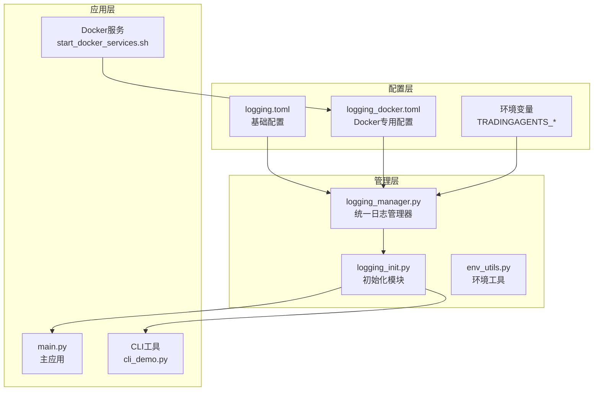

**图表来源**
- [config/logging.toml](file://config/logging.toml#L1-L111)
- [config/logging_docker.toml](file://config/logging_docker.toml#L1-L100)
- [tradingagents/utils/logging_manager.py](file://tradingagents/utils/logging_manager.py#L1-L411)

## 核心日志配置架构

### 配置层次结构

系统采用三层配置架构，确保灵活性和可维护性：

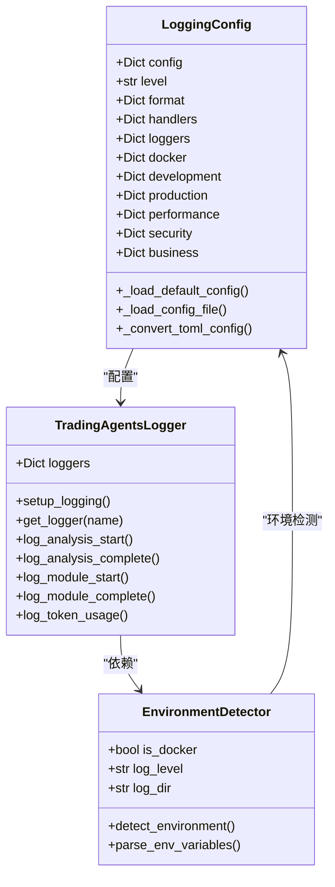

**图表来源**
- [tradingagents/utils/logging_manager.py](file://tradingagents/utils/logging_manager.py#L50-L150)
- [tradingagents/config/env_utils.py](file://tradingagents/config/env_utils.py#L10-L100)

**章节来源**
- [tradingagents/utils/logging_manager.py](file://tradingagents/utils/logging_manager.py#L50-L200)
- [tradingagents/config/env_utils.py](file://tradingagents/config/env_utils.py#L1-L245)

## 环境配置详解

### 开发环境配置 ([logging.development])

开发环境专注于调试和支持，提供丰富的日志信息：

| 配置项 | 值 | 说明 |
|--------|-----|------|
| enabled | false | 开发模式开关 |
| debug_modules | ["tradingagents.graph", "tradingagents.llm_adapters"] | 启用详细日志的模块列表 |
| save_debug_files | true | 是否保存调试文件 |

**特点：**
- **模块化调试**：仅对指定模块启用详细日志，避免日志过多影响性能
- **文件保存**：保留完整的调试信息，便于问题追踪
- **开发友好**：提供足够的上下文信息，支持快速问题定位

### 生产环境配置 ([logging.production])

生产环境强调结构化和监控能力：

| 配置项 | 值 | 说明 |
|--------|-----|------|
| enabled | false | 生产模式开关 |
| structured_only | true | 只使用结构化日志 |
| error_notification | true | 启用错误通知 |
| max_log_size | "100MB" | 最大日志文件大小 |

**特点：**
- **结构化日志**：便于自动化处理和分析
- **错误监控**：及时发现和响应错误
- **容量管理**：更大的日志文件限制，适应高负载场景

### Docker环境配置 ([logging.docker])

Docker环境针对容器化特性进行了优化：

| 配置项 | 值 | 说明 |
|--------|-----|------|
| enabled | false | Docker环境自动检测 |
| stdout_only | true | 只输出到标准输出 |
| disable_file_logging | true | 禁用文件日志 |

**特点：**
- **容器化集成**：与Docker日志收集系统无缝对接
- **资源优化**：避免文件I/O开销，提高容器性能
- **集中管理**：通过Docker日志驱动统一收集

**章节来源**
- [config/logging.toml](file://config/logging.toml#L71-L109)
- [config/logging_docker.toml](file://config/logging_docker.toml#L75-L99)

## 环境自动检测机制

### Docker环境检测

系统通过多种方式检测Docker环境：

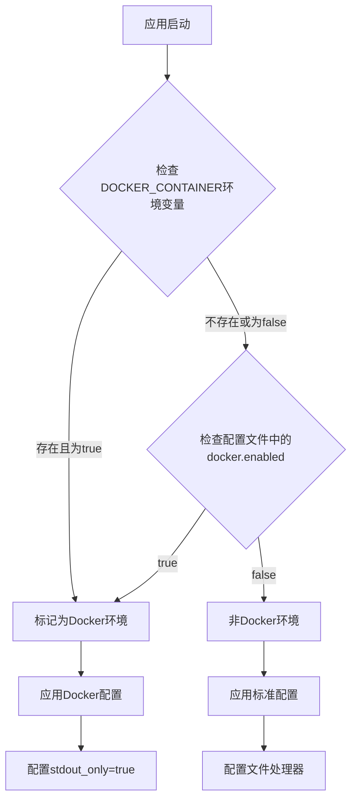

**图表来源**
- [tradingagents/utils/logging_manager.py](file://tradingagents/utils/logging_manager.py#L180-L200)

### 环境检测实现

环境检测逻辑在配置加载过程中自动执行：

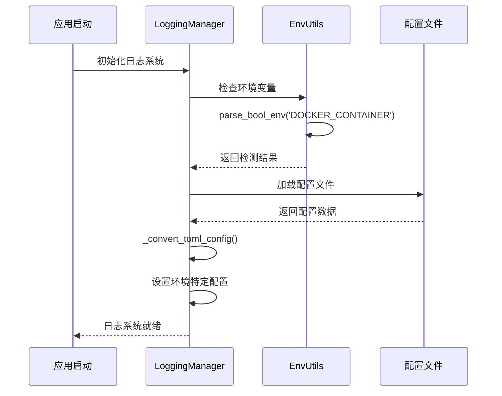

**图表来源**
- [tradingagents/utils/logging_manager.py](file://tradingagents/utils/logging_manager.py#L150-L220)

**章节来源**
- [tradingagents/utils/logging_manager.py](file://tradingagents/utils/logging_manager.py#L150-L250)
- [tradingagents/config/env_utils.py](file://tradingagents/config/env_utils.py#L10-L80)

## 性能监控与安全日志

### 性能监控配置

系统内置了完善的性能监控机制：

| 监控类别 | 配置项 | 默认值 | 说明 |
|----------|--------|--------|------|
| 慢操作检测 | log_slow_operations | true | 启用慢操作日志记录 |
| 性能阈值 | slow_threshold_seconds | 5.0 | 操作耗时超过此值视为慢操作 |
| 内存监控 | log_memory_usage | false | 记录内存使用情况 |

**性能监控特点：**
- **动态阈值**：可根据环境调整慢操作阈值
- **结构化记录**：便于后续分析和报警
- **成本控制**：可选择性启用内存监控

### 安全日志配置

安全日志涵盖多个关键方面：

| 安全日志类别 | 配置项 | 功能说明 |
|-------------|--------|----------|
| API调用记录 | log_api_calls | 记录所有API调用详情 |
| Token使用监控 | log_token_usage | 跟踪LLM服务Token消耗 |
| 敏感数据保护 | mask_sensitive_data | 自动屏蔽敏感信息 |

**安全特性：**
- **自动脱敏**：敏感数据自动掩码处理
- **成本追踪**：精确记录Token使用和费用
- **审计支持**：完整的API调用审计轨迹

### 业务日志配置

业务日志记录关键的业务活动：

| 业务日志类型 | 配置项 | 记录内容 |
|-------------|--------|----------|
| 分析事件 | log_analysis_events | 股票分析请求和结果 |
| 用户操作 | log_user_actions | 用户交互行为 |
| 导出事件 | log_export_events | 数据导出操作 |

**章节来源**
- [config/logging.toml](file://config/logging.toml#L85-L109)
- [config/logging_docker.toml](file://config/logging_docker.toml#L76-L98)

## 配置文件加载流程

### 配置加载优先级

系统按照以下优先级顺序加载配置：

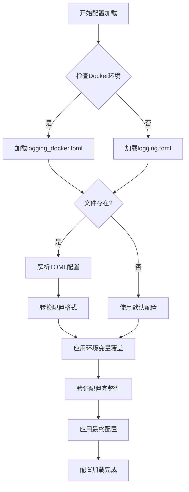

**图表来源**
- [tradingagents/utils/logging_manager.py](file://tradingagents/utils/logging_manager.py#L160-L200)

### 配置转换过程

配置文件需要经过格式转换才能被系统使用：

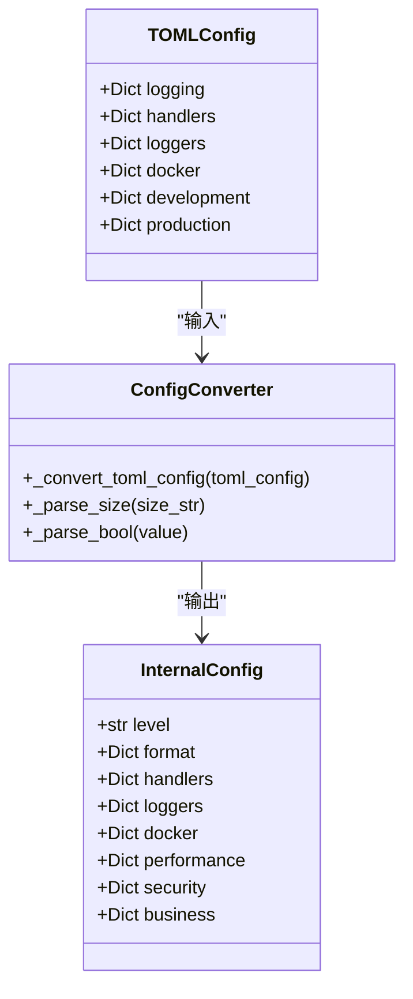

**图表来源**
- [tradingagents/utils/logging_manager.py](file://tradingagents/utils/logging_manager.py#L200-L250)

**章节来源**
- [tradingagents/utils/logging_manager.py](file://tradingagents/utils/logging_manager.py#L160-L300)

## 环境变量覆盖机制

### 支持的环境变量

系统支持通过环境变量覆盖大部分配置选项：

| 环境变量 | 默认值 | 说明 |
|----------|--------|------|
| TRADINGAGENTS_LOG_LEVEL | INFO | 全局日志级别 |
| TRADINGAGENTS_LOG_DIR | ./logs | 日志文件目录 |
| DOCKER_CONTAINER | false | Docker环境标识 |

### 环境变量解析工具

系统提供了强大的环境变量解析工具：

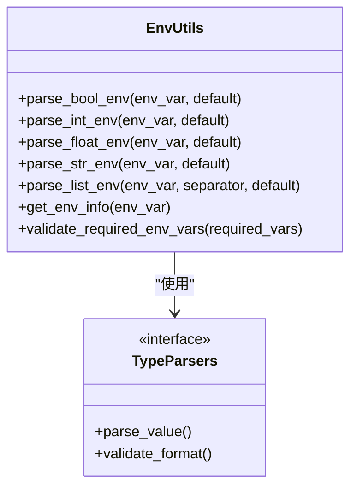

**图表来源**
- [tradingagents/config/env_utils.py](file://tradingagents/config/env_utils.py#L10-L150)

### 覆盖机制示例

环境变量可以覆盖配置文件中的任何设置：

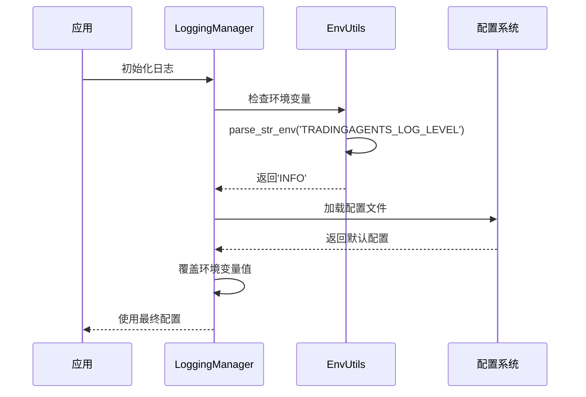

**图表来源**
- [tradingagents/utils/logging_manager.py](file://tradingagents/utils/logging_manager.py#L80-L120)

**章节来源**
- [tradingagents/config/env_utils.py](file://tradingagents/config/env_utils.py#L1-L245)
- [tradingagents/utils/logging_manager.py](file://tradingagents/utils/logging_manager.py#L80-L150)

## 实际部署示例

### Docker环境部署

Docker环境的典型部署配置：

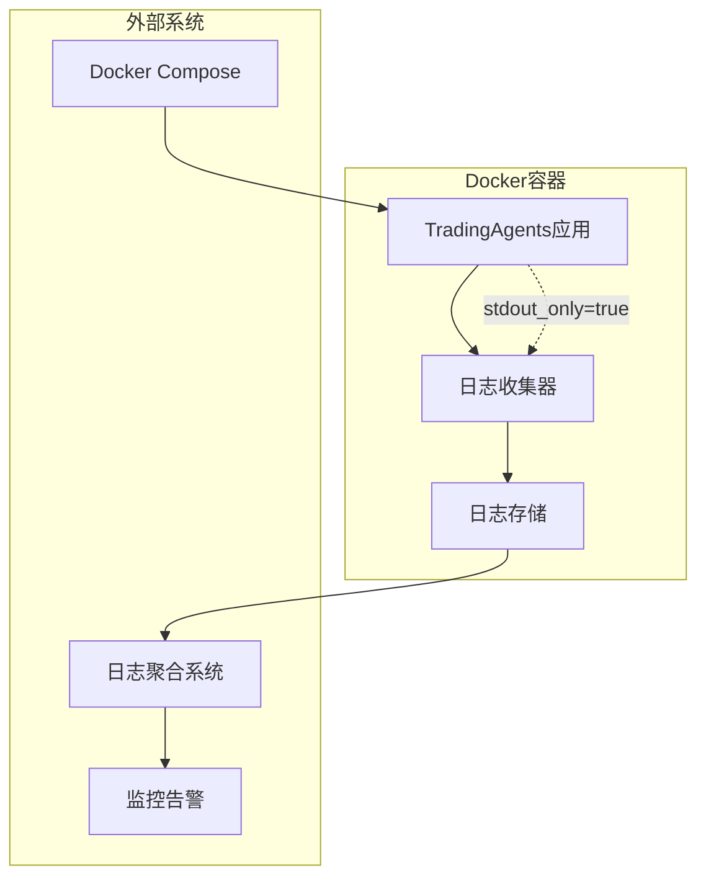

**图表来源**
- [scripts/docker/start_docker_services.sh](file://scripts/docker/start_docker_services.sh#L1-L101)
- [config/logging_docker.toml](file://config/logging_docker.toml#L75-L85)

### 开发环境配置

开发环境推荐的配置组合：

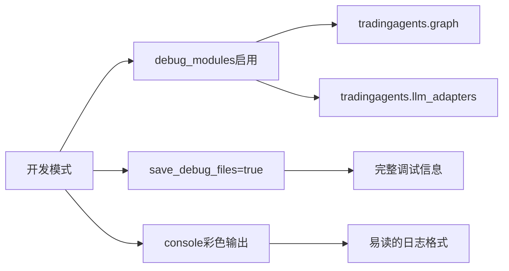

### 生产环境最佳实践

生产环境的配置建议：

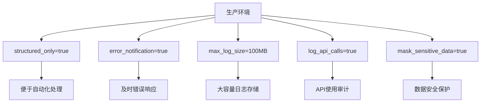

**章节来源**
- [scripts/docker/start_docker_services.sh](file://scripts/docker/start_docker_services.sh#L1-L101)
- [scripts/test_docker_logging.py](file://scripts/test_docker_logging.py#L1-L58)

## 故障排除指南

### 常见问题诊断

#### Docker日志配置问题

**问题症状：**
- 日志文件未生成
- KeyError: 'file'错误
- Docker容器内日志异常

**解决方案：**
1. 检查环境变量设置
2. 验证配置文件完整性
3. 确认日志目录权限

#### 性能监控阈值问题

**问题症状：**
- 慢操作日志缺失
- 性能指标不准确

**解决方案：**
1. 调整slow_threshold_seconds值
2. 检查log_slow_operations配置
3. 验证性能监控模块状态

#### 安全日志配置问题

**问题症状：**
- 敏感数据泄露
- API调用记录不完整

**解决方案：**
1. 启用mask_sensitive_data
2. 验证log_api_calls设置
3. 检查安全日志格式

### 调试工具和方法

系统提供了多种调试工具：

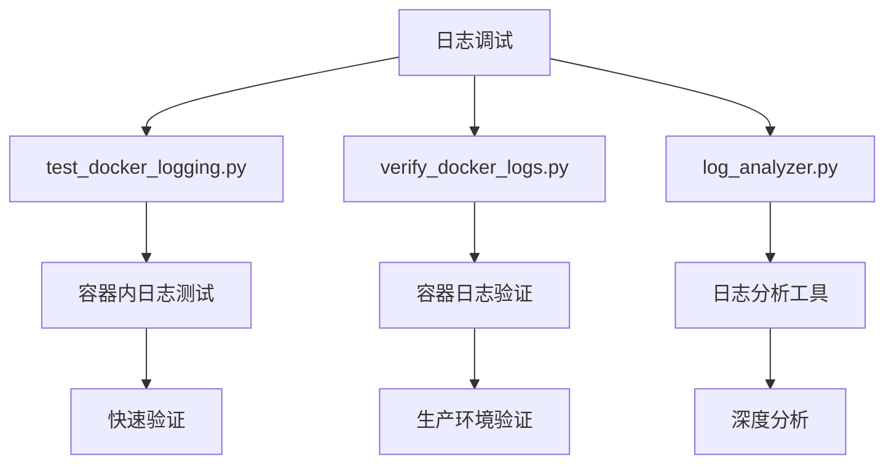

**图表来源**
- [scripts/test_docker_logging.py](file://scripts/test_docker_logging.py#L1-L58)
- [scripts/verify_docker_logs.py](file://scripts/verify_docker_logs.py#L1-L49)

**章节来源**
- [scripts/test_docker_logging.py](file://scripts/test_docker_logging.py#L1-L58)
- [scripts/verify_docker_logs.py](file://scripts/verify_docker_logs.py#L1-L49)

## 总结

TradingAgents-CN的日志配置系统通过精心设计的多环境支持，为不同部署场景提供了最优的解决方案：

### 核心优势

1. **智能环境检测**：自动识别Docker环境并应用相应配置
2. **灵活配置覆盖**：支持环境变量动态覆盖配置文件设置
3. **完善的监控体系**：涵盖性能、安全和业务三个维度
4. **容器化友好**：专门优化的Docker环境配置
5. **易于维护**：清晰的配置层次和标准化的格式

### 最佳实践建议

- **开发阶段**：启用详细调试信息，使用彩色输出提高可读性
- **生产部署**：采用结构化日志，启用错误通知和性能监控
- **容器化环境**：利用Docker配置的stdout_only特性
- **安全考虑**：始终启用敏感数据屏蔽和API调用记录

这套日志配置系统不仅满足了当前的需求，还为未来的扩展和优化提供了坚实的基础，是现代应用程序日志管理的最佳实践体现。