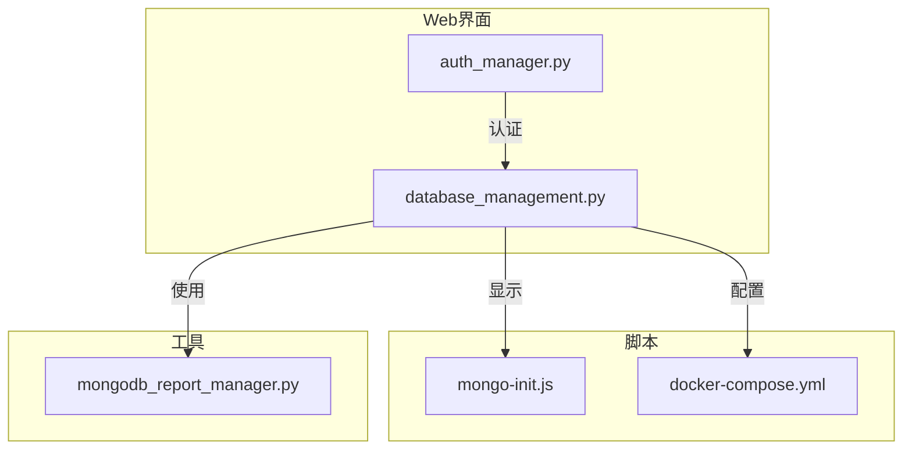
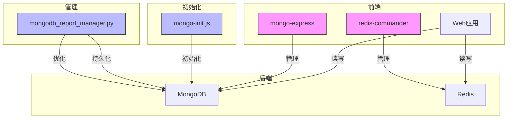
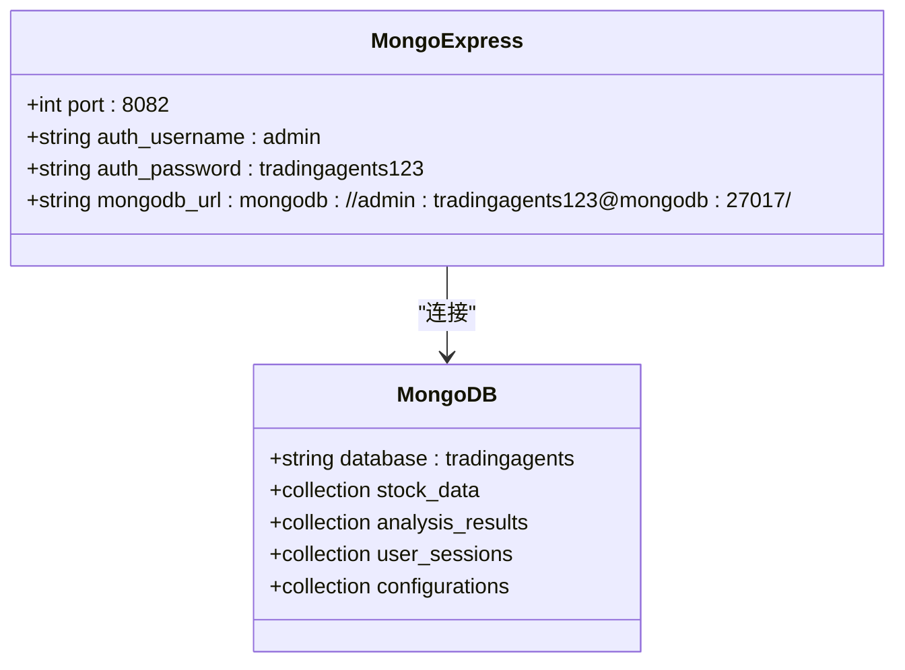
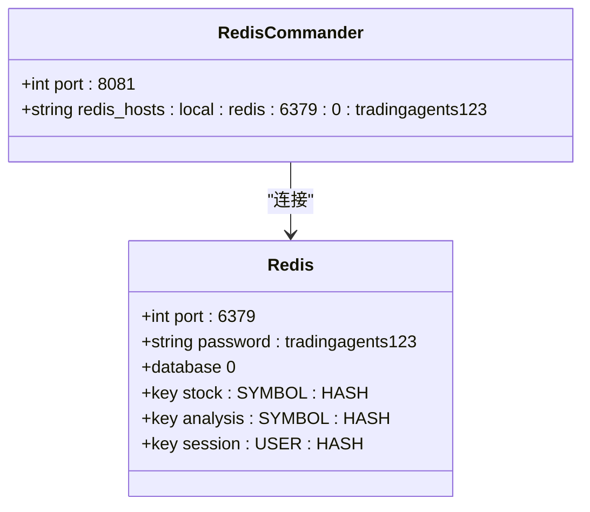
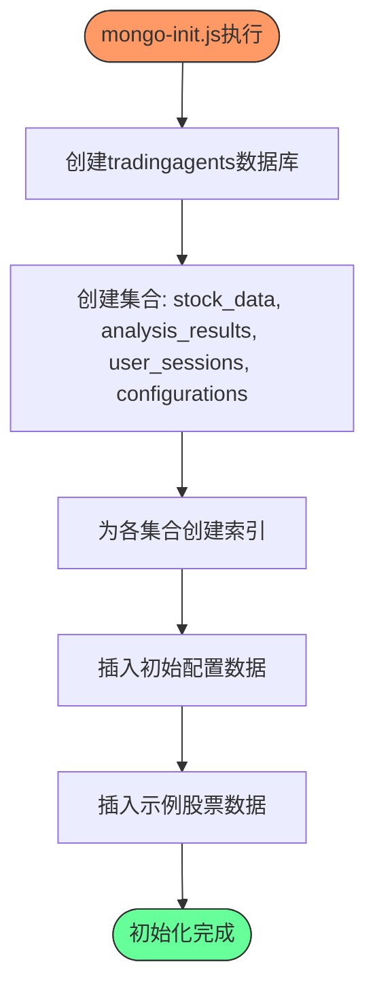
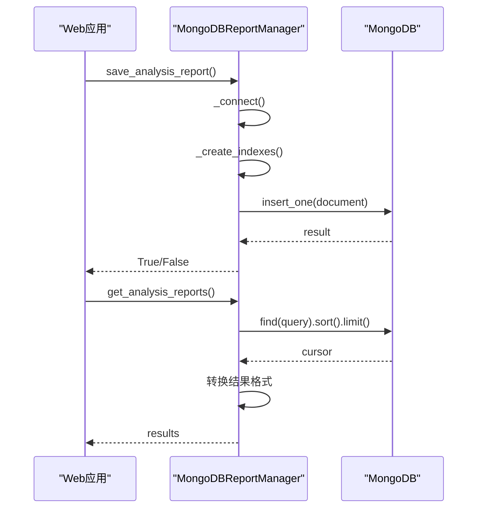
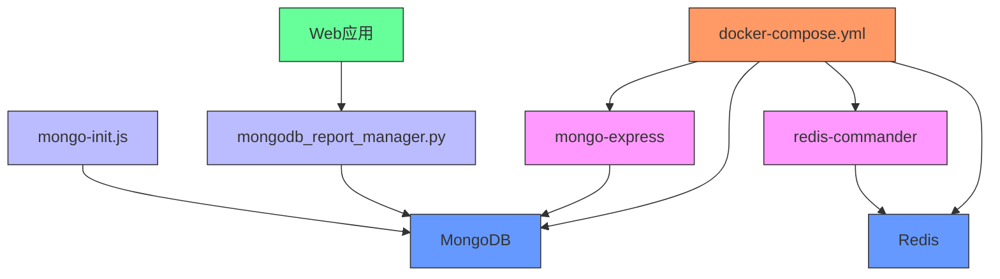

# 管理界面监控

<cite>
**本文档引用的文件**
- [mongo-init.js](file://scripts/docker/mongo-init.js)
- [mongodb_report_manager.py](file://web/utils/mongodb_report_manager.py)
- [docker-compose.yml](file://docker-compose.yml)
- [database_management.py](file://web/modules/database_management.py)
- [auth_manager.py](file://web/utils/auth_manager.py)
- [USER_MANAGEMENT.md](file://web/config/USER_MANAGEMENT.md)
</cite>

## 目录
1. [简介](#简介)
2. [项目结构](#项目结构)
3. [核心组件](#核心组件)
4. [架构概述](#架构概述)
5. [详细组件分析](#详细组件分析)
6. [依赖分析](#依赖分析)
7. [性能考虑](#性能考虑)
8. [故障排除指南](#故障排除指南)
9. [结论](#结论)
10. [附录](#附录)（如有必要）

## 简介
本文档旨在为管理员提供全面的管理界面监控指导，重点介绍MongoDB和Redis管理界面的访问方法和监控功能。文档详细说明了如何通过mongo-express和redis-commander可视化界面监控系统状态，阐述了mongo-init.js初始化脚本在创建管理用户和配置访问权限方面的作用，以及通过mongodb_report_manager.py实现的分析报告持久化机制。同时，文档提供了管理界面的URL访问方式和认证配置指南，帮助管理员有效监控和管理系统。

## 项目结构
本项目采用模块化设计，主要包含web、tradingagents、scripts、config等目录。web目录包含Web应用的前端组件和模块，tradingagents目录包含核心业务逻辑，scripts目录包含各种脚本工具，config目录包含配置文件。管理界面相关的文件主要分布在web/modules和scripts/docker目录中。

**图示来源**
- [database_management.py](file://web/modules/database_management.py)
- [auth_manager.py](file://web/utils/auth_manager.py)
- [mongo-init.js](file://scripts/docker/mongo-init.js)
- [docker-compose.yml](file://docker-compose.yml)
- [mongodb_report_manager.py](file://web/utils/mongodb_report_manager.py)

**章节来源**
- [database_management.py](file://web/modules/database_management.py)
- [docker-compose.yml](file://docker-compose.yml)

## 核心组件
本系统的核心组件包括MongoDB和Redis数据库、mongo-express和redis-commander管理界面、mongo-init.js初始化脚本以及mongodb_report_manager.py报告管理器。这些组件共同构成了系统的数据存储、管理和监控体系。

**章节来源**
- [database_management.py](file://web/modules/database_management.py)
- [mongodb_report_manager.py](file://web/utils/mongodb_report_manager.py)

## 架构概述
系统采用三层缓存架构，结合MongoDB持久化存储和Redis内存缓存，通过mongo-express和redis-commander提供可视化管理界面。mongo-init.js脚本在容器启动时自动执行，初始化数据库结构和用户权限。mongodb_report_manager.py负责分析报告的持久化存储和查询优化。

**图示来源**
- [docker-compose.yml](file://docker-compose.yml)
- [mongo-init.js](file://scripts/docker/mongo-init.js)
- [mongodb_report_manager.py](file://web/utils/mongodb_report_manager.py)

## 详细组件分析

### MongoDB管理界面分析
mongo-express是一个基于Web的MongoDB管理界面，允许管理员通过可视化方式查看和管理MongoDB数据库。通过docker-compose.yml配置，mongo-express运行在8082端口，使用基本认证保护访问。

**图示来源**
- [docker-compose.yml](file://docker-compose.yml)
- [mongo-init.js](file://scripts/docker/mongo-init.js)

### Redis管理界面分析
redis-commander是一个基于Web的Redis管理界面，允许管理员监控Redis键值存储和内存使用情况。通过docker-compose.yml配置，redis-commander运行在8081端口，连接到Redis服务。

**图示来源**
- [docker-compose.yml](file://docker-compose.yml)
- [database_management.py](file://web/modules/database_management.py)

### 初始化脚本分析
mongo-init.js是MongoDB的初始化脚本，在容器首次启动时执行，负责创建数据库、集合、索引和初始数据。

**图示来源**
- [mongo-init.js](file://scripts/docker/mongo-init.js)

### 报告管理器分析
mongodb_report_manager.py实现了分析报告的持久化机制，包括索引创建、报告存储和查询优化。

**图示来源**
- [mongodb_report_manager.py](file://web/utils/mongodb_report_manager.py)

**章节来源**
- [mongodb_report_manager.py](file://web/utils/mongodb_report_manager.py)

## 依赖分析
系统各组件之间存在明确的依赖关系。docker-compose.yml定义了服务间的依赖，mongo-express和redis-commander依赖于mongodb和redis服务。web应用依赖于mongodb_report_manager.py进行报告持久化，而mongodb_report_manager.py又依赖于MongoDB服务。

**图示来源**
- [docker-compose.yml](file://docker-compose.yml)
- [mongo-init.js](file://scripts/docker/mongo-init.js)
- [mongodb_report_manager.py](file://web/utils/mongodb_report_manager.py)

## 性能考虑
系统通过三层缓存架构优化性能：Redis作为L1缓存提供毫秒级访问，MongoDB作为L2缓存提供秒级访问，API作为L3数据源。这种架构显著提高了数据访问速度，减少了对外部API的依赖。

**章节来源**
- [database_management.py](file://web/modules/database_management.py)

## 故障排除指南
当管理界面无法访问时，应首先检查Docker服务是否正常运行，然后检查相关服务的健康状态。可以通过docker-compose logs命令查看服务日志，确认mongo-init.js是否成功执行，以及mongo-express和redis-commander是否正常启动。

**章节来源**
- [docker-compose.yml](file://docker-compose.yml)
- [setup_docker.py](file://scripts/setup-docker.py)

## 结论
本文档详细介绍了TradingAgents系统的管理界面监控方案。通过mongo-express和redis-commander，管理员可以方便地监控MongoDB和Redis的状态。mongo-init.js脚本确保了数据库的正确初始化，而mongodb_report_manager.py提供了可靠的报告持久化机制。这些组件共同构成了一个强大、易用的系统监控和管理平台。

## 附录

### 管理界面访问指南
| 管理界面 | URL | 用户名 | 密码 |
|---------|-----|-------|------|
| mongo-express | http://localhost:8082 | admin | tradingagents123 |
| redis-commander | http://localhost:8081 | - | - |

### 认证配置
系统使用基于文件的用户认证，用户信息存储在`web/config/users.json`中。默认用户包括：
- admin: admin123 (管理员权限)
- user: user123 (普通用户权限)

**章节来源**
- [docker-compose.yml](file://docker-compose.yml)
- [USER_MANAGEMENT.md](file://web/config/USER_MANAGEMENT.md)
- [auth_manager.py](file://web/utils/auth_manager.py)