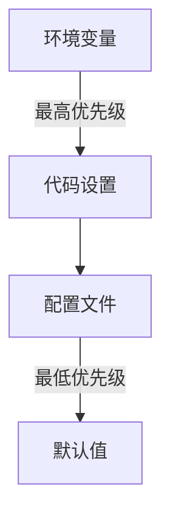
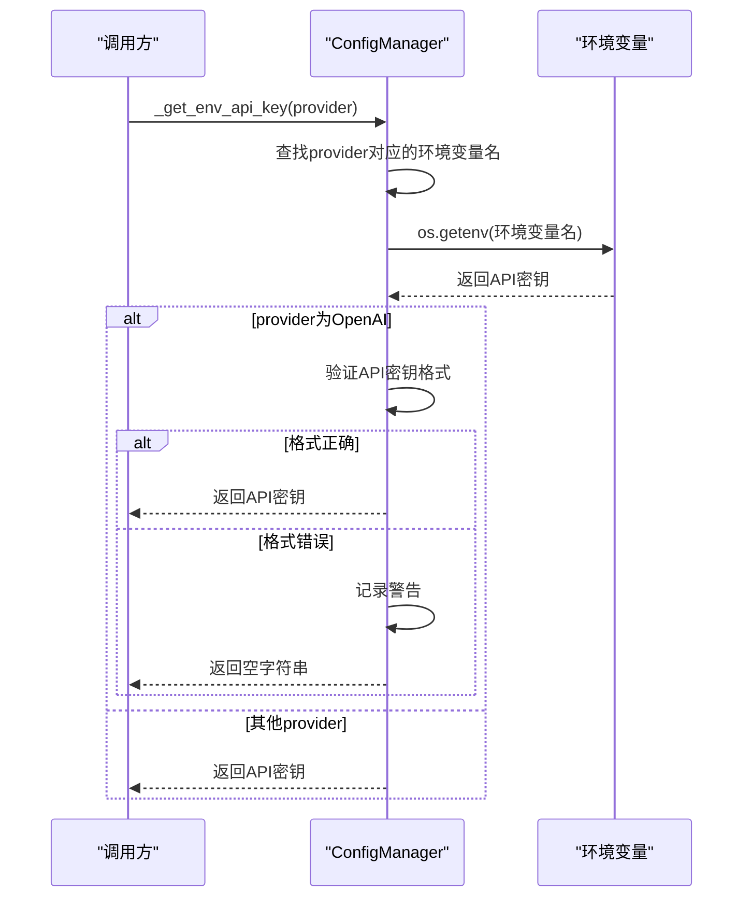
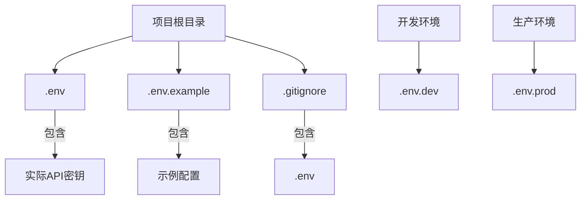

# 环境变量管理

<cite>
**本文档引用的文件**
- [config_manager.py](file://tradingagents/config/config_manager.py)
- [env_utils.py](file://tradingagents/config/env_utils.py)
- [config_management_demo.py](file://examples/config_management_demo.py)
- [data_dir_config_demo.py](file://examples/data_dir_config_demo.py)
- [test_env_compatibility.py](file://tests/test_env_compatibility.py)
- [web/modules/config_management.py](file://web/modules/config_management.py)
- [web/utils/api_checker.py](file://web/utils/api_checker.py)
- [cli/main.py](file://cli/main.py)
- [default_config.py](file://tradingagents/default_config.py)
- [logging_manager.py](file://tradingagents/utils/logging_manager.py)
</cite>

## 目录
1. [环境变量使用方法](#环境变量使用方法)
2. [优先级规则](#优先级规则)
3. [安全考虑](#安全考虑)
4. [配置管理器方法解析](#配置管理器方法解析)
5. [支持的环境变量列表](#支持的环境变量列表)
6. [最佳实践](#最佳实践)
7. [环境变量与配置文件交互](#环境变量与配置文件交互)

## 环境变量使用方法

环境变量是TradingAgents-CN系统中配置敏感信息和运行时参数的主要方式。系统通过`.env`文件和操作系统环境变量来读取配置，确保敏感信息不会硬编码在源代码中。

系统使用`python-dotenv`库来加载项目根目录下的`.env`文件，该文件包含了所有必要的API密钥和其他配置。用户需要将`.env.example`文件复制为`.env`并填入自己的API密钥。

环境变量的使用贯穿整个系统，从LLM模型配置到数据源访问，再到日志级别控制。系统在启动时会自动加载这些环境变量，并根据需要进行类型转换和验证。

**Section sources**
- [config_manager.py](file://tradingagents/config/config_manager.py#L52-L103)
- [env_utils.py](file://tradingagents/config/env_utils.py#L0-L244)
- [default_config.py](file://tradingagents/default_config.py#L0-L26)

## 优先级规则

环境变量在配置系统中具有最高优先级。系统的配置优先级顺序如下：

1. **环境变量**（最高优先级）
2. **代码中的设置**
3. **配置文件中的设置**
4. **默认值**（最低优先级）

当多个配置源存在时，环境变量会覆盖其他所有配置。例如，如果在`.env`文件中设置了`TRADINGAGENTS_DATA_DIR`，它将覆盖`settings.json`文件中的`data_dir`设置。

这种优先级设计允许用户在不同环境中灵活配置系统，而无需修改代码或配置文件。例如，在开发环境中可以通过环境变量临时更改数据目录，而在生产环境中使用固定的配置文件。

**Diagram sources**
- [config_manager.py](file://tradingagents/config/config_manager.py#L452-L478)
- [data_dir_config_demo.py](file://examples/data_dir_config_demo.py#L180-L210)

## 安全考虑

系统在环境变量管理方面实施了多项安全措施，以保护敏感信息：

1. **API密钥验证**：对OpenAI API密钥进行格式验证，确保密钥以`sk-`开头且长度为51个字符
2. **敏感信息屏蔽**：在日志和界面显示中，只显示API密钥的前几位和后几位，其余部分用`*`代替
3. **配置文件隔离**：敏感的API密钥存储在`.env`文件中，该文件被包含在`.gitignore`中，防止意外提交到版本控制系统
4. **运行时验证**：在使用API密钥前进行存在性和有效性检查

系统还提供了配置状态检查功能，可以在Web界面和CLI中查看API密钥的配置状态，帮助用户及时发现配置问题。

**Section sources**
- [config_manager.py](file://tradingagents/config/config_manager.py#L103-L130)
- [web/modules/config_management.py](file://web/modules/config_management.py#L483-L573)
- [web/utils/api_checker.py](file://web/utils/api_checker.py#L0-L51)

## 配置管理器方法解析

### _get_env_api_key 方法

`_get_env_api_key`方法负责从环境变量中获取指定提供商的API密钥。该方法使用映射表将提供商名称转换为对应的环境变量名，并进行特殊处理：

- 对于OpenAI密钥，会进行格式验证，确保以`sk-`开头且长度正确
- 如果验证失败，会记录警告并返回空字符串，防止使用无效密钥
- 支持多个LLM提供商，包括阿里百炼、OpenAI、Google、Anthropic和DeepSeek

**Diagram sources**
- [config_manager.py](file://tradingagents/config/config_manager.py#L52-L103)

### load_settings 方法

`load_settings`方法负责加载系统设置，它会合并多个配置源：

1. 首先尝试从`settings.json`文件加载设置
2. 然后从环境变量中读取配置，包括API密钥、目录路径和日志级别
3. 只有当环境变量存在且不为空时才会覆盖文件中的设置
4. 特殊处理布尔值配置，如`OPENAI_ENABLED`

该方法确保了环境变量的高优先级，同时保持了配置的灵活性和向后兼容性。

**Section sources**
- [config_manager.py](file://tradingagents/config/config_manager.py#L452-L478)

## 支持的环境变量列表

系统支持以下环境变量：

### LLM API密钥
- **DASHSCOPE_API_KEY**: 阿里百炼API密钥，用于通义千问模型
- **OPENAI_API_KEY**: OpenAI API密钥，用于GPT系列模型
- **GOOGLE_API_KEY**: Google AI API密钥，用于Gemini模型
- **ANTHROPIC_API_KEY**: Anthropic API密钥，用于Claude模型
- **DEEPSEEK_API_KEY**: DeepSeek API密钥，用于DeepSeek模型

### 数据源API密钥
- **FINNHUB_API_KEY**: FinnHub金融数据API密钥，用于获取美股数据
- **TUSHARE_TOKEN**: Tushare A股数据API密钥，用于获取A股数据
- **REDDIT_CLIENT_ID**: Reddit API客户端ID，用于获取社交媒体数据
- **REDDIT_CLIENT_SECRET**: Reddit API客户端密钥，用于获取社交媒体数据

### 系统配置
- **TRADINGAGENTS_DATA_DIR**: 数据目录路径，用于存储分析数据
- **TRADINGAGENTS_CACHE_DIR**: 缓存目录路径，用于存储缓存数据
- **TRADINGAGENTS_RESULTS_DIR**: 结果目录路径，用于存储分析报告
- **TRADINGAGENTS_LOG_LEVEL**: 日志级别，控制日志输出详细程度
- **OPENAI_ENABLED**: 布尔值，控制是否启用OpenAI模型
- **USE_MONGODB_STORAGE**: 布尔值，控制是否使用MongoDB存储

### 数据库配置
- **MONGODB_CONNECTION_STRING**: MongoDB连接字符串
- **MONGODB_DATABASE_NAME**: MongoDB数据库名称
- **REDIS_URL**: Redis连接URL

**Section sources**
- [config_manager.py](file://tradingagents/config/config_manager.py#L478-L496)
- [env_utils.py](file://tradingagents/config/env_utils.py#L0-L244)
- [default_config.py](file://tradingagents/default_config.py#L0-L26)

## 最佳实践

### 敏感信息保护

1. **使用.env文件**：将所有敏感信息存储在`.env`文件中，不要硬编码在代码中
2. **.gitignore保护**：确保`.env`文件被包含在`.gitignore`中，防止意外提交
3. **最小权限原则**：为API密钥设置最小必要的权限
4. **定期轮换**：定期更换API密钥，降低泄露风险

### 多环境管理

1. **环境隔离**：为开发、测试和生产环境使用不同的`.env`文件
2. **模板文件**：使用`.env.example`作为模板，指导用户配置
3. **环境变量前缀**：使用`TRADINGAGENTS_`前缀避免与其他应用冲突
4. **配置验证**：在启动时验证必需的环境变量是否已设置

**Diagram sources**
- [QUICKSTART.md](file://QUICKSTART.md#L17)
- [config_manager.py](file://tradingagents/config/config_manager.py#L52-L103)

## 环境变量与配置文件交互

环境变量与配置文件之间存在明确的交互关系和覆盖优先级。系统采用分层配置策略，确保灵活性和可维护性。

### 交互关系

1. **初始化**：系统启动时首先加载`.env`文件，然后读取`settings.json`
2. **合并**：将环境变量的值合并到配置文件的设置中
3. **覆盖**：环境变量的值优先于配置文件的值
4. **持久化**：通过`save_settings`方法将配置保存到`settings.json`

### 覆盖优先级

环境变量具有最高优先级，可以覆盖配置文件中的任何设置。这种设计允许用户在不修改配置文件的情况下临时更改系统行为。

例如，用户可以通过设置`TRADINGAGENTS_LOG_LEVEL=DEBUG`环境变量来临时启用调试日志，而无需修改`settings.json`文件。

系统还提供了`get_env_config_status`方法，用于检查环境变量的配置状态，帮助用户了解哪些配置已生效。

**Section sources**
- [config_manager.py](file://tradingagents/config/config_manager.py#L452-L478)
- [config_management_demo.py](file://examples/config_management_demo.py#L0-L257)
- [test_env_compatibility.py](file://tests/test_env_compatibility.py#L0-L36)