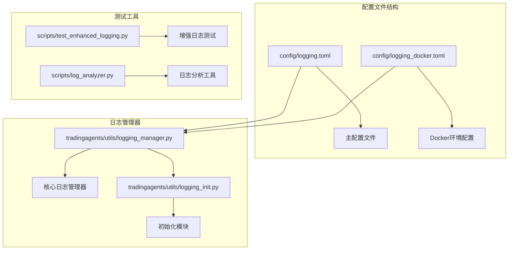
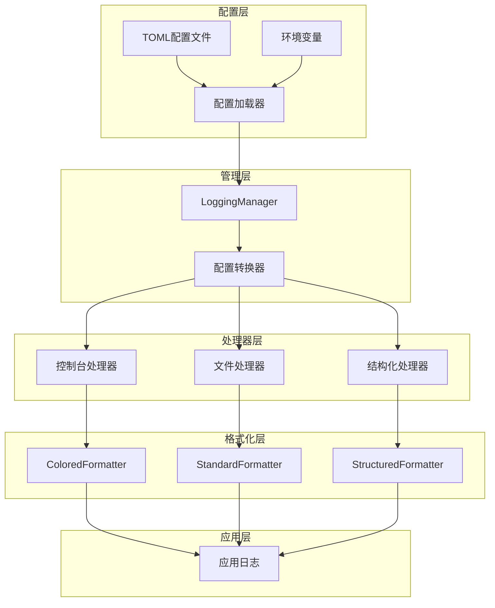
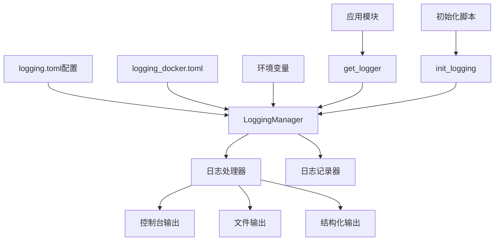

# 日志配置文件详解

<cite>
**本文档中引用的文件**
- [config/logging.toml](file://config/logging.toml)
- [config/logging_docker.toml](file://config/logging_docker.toml)
- [tradingagents/utils/logging_manager.py](file://tradingagents/utils/logging_manager.py)
- [tradingagents/utils/logging_init.py](file://tradingagents/utils/logging_init.py)
- [scripts/test_enhanced_logging.py](file://scripts/test_enhanced_logging.py)
- [scripts/log_analyzer.py](file://scripts/log_analyzer.py)
</cite>

## 目录
1. [简介](#简介)
2. [项目结构](#项目结构)
3. [核心组件](#核心组件)
4. [架构概览](#架构概览)
5. [详细组件分析](#详细组件分析)
6. [依赖关系分析](#依赖关系分析)
7. [性能考虑](#性能考虑)
8. [故障排除指南](#故障排除指南)
9. [结论](#结论)

## 简介

TradingAgents-CN项目采用了一套完整而灵活的日志配置系统，基于TOML格式的配置文件，支持多种环境和场景下的日志需求。该系统提供了统一的日志管理接口，支持控制台输出、文件记录和结构化日志等多种格式，并具备环境感知能力，能够自动适应不同的运行环境。

## 项目结构

项目中的日志配置文件位于`config/`目录下，包含两个主要配置文件：



**图表来源**
- [config/logging.toml](file://config/logging.toml#L1-L111)
- [config/logging_docker.toml](file://config/logging_docker.toml#L1-L100)
- [tradingagents/utils/logging_manager.py](file://tradingagents/utils/logging_manager.py#L1-L411)

**章节来源**
- [config/logging.toml](file://config/logging.toml#L1-L111)
- [config/logging_docker.toml](file://config/logging_docker.toml#L1-L100)

## 核心组件

### 主配置文件 (`logging.toml`)

主配置文件包含了完整的日志系统配置，支持以下核心功能：

- **全局日志级别设置**：控制整个系统的日志输出级别
- **多格式日志支持**：console、file和structured三种格式
- **环境特定配置**：docker、development和production环境
- **性能监控**：慢操作检测和内存使用监控
- **安全日志**：API调用记录和敏感数据屏蔽
- **业务日志**：分析事件和用户操作记录

### Docker专用配置 (`logging_docker.toml`)

Docker环境专用配置文件解决了容器化部署中的特殊需求：

- **容器优化**：针对Docker环境的特殊配置
- **文件系统兼容性**：解决容器内文件访问问题
- **日志输出优化**：平衡控制台和文件输出

**章节来源**
- [config/logging.toml](file://config/logging.toml#L1-L111)
- [config/logging_docker.toml](file://config/logging_docker.toml#L1-L100)

## 架构概览

日志系统采用分层架构设计，确保灵活性和可扩展性：



**图表来源**
- [tradingagents/utils/logging_manager.py](file://tradingagents/utils/logging_manager.py#L163-L196)
- [tradingagents/utils/logging_manager.py](file://tradingagents/utils/logging_manager.py#L200-L250)

## 详细组件分析

### [logging] 主配置节

#### 全局日志级别设置

```toml
[logging]
level = "INFO"
```

全局日志级别决定了系统的基础日志输出水平：

| 级别 | 描述 | 适用场景 |
|------|------|----------|
| DEBUG | 详细调试信息 | 开发阶段，问题排查 |
| INFO | 一般信息记录 | 正常运行状态跟踪 |
| WARNING | 警告信息 | 潜在问题提醒 |
| ERROR | 错误信息 | 程序错误记录 |
| CRITICAL | 严重错误 | 系统级错误 |

**影响系统行为**：
- 影响所有未单独配置的日志器
- 决定哪些信息会被记录
- 影响性能开销（DEBUG级别最耗资源）

#### 日志格式配置

```toml
[logging.format]
console = "%(asctime)s | %(name)-20s | %(levelname)-8s | %(message)s"
file = "%(asctime)s | %(name)-20s | %(levelname)-8s | %(module)s:%(funcName)s:%(lineno)d | %(message)s"
structured = "json"
```

**三种格式差异**：

| 格式 | 特点 | 适用场景 | 示例 |
|------|------|----------|------|
| console | 人类可读，带颜色 | 开发调试，终端显示 | `[DEBUG] main.py:123 - 初始化完成` |
| file | 详细信息，带源码位置 | 生产监控，问题分析 | `main.py:process_request:456 - 请求处理完成` |
| structured | JSON格式，便于解析 | 日志收集，自动化分析 | `{"timestamp": "...", "level": "INFO", "message": "..."}` |

### [logging.handlers] 处理器配置

#### 控制台处理器

```toml
[logging.handlers.console]
enabled = true
colored = true
level = "INFO"
```

**配置参数说明**：

- **enabled**: 是否启用控制台输出
- **colored**: 是否启用彩色输出（仅TTY环境）
- **level**: 控制台日志级别

#### 文件处理器

```toml
[logging.handlers.file]
enabled = true
level = "DEBUG"
max_size = "10MB"
backup_count = 5
directory = "./logs"
```

**关键参数**：

- **max_size**: 单个日志文件最大大小（支持KB、MB、GB单位）
- **backup_count**: 保留的备份文件数量
- **directory**: 日志文件存储目录

#### 结构化日志处理器

```toml
[logging.handlers.structured]
enabled = false
level = "INFO"
directory = "./logs"
```

**特点**：
- 默认关闭，生产环境可启用
- JSON格式便于机器解析
- 适合集中化日志管理系统

### [logging.loggers] 模块级别控制

```toml
[logging.loggers]
[logging.loggers.tradingagents]
level = "INFO"

[logging.loggers.web]
level = "INFO"

[logging.loggers.dataflows]
level = "INFO"

[logging.loggers.llm_adapters]
level = "INFO"
```

**核心模块日志级别控制**：

| 模块 | 默认级别 | 用途 |
|------|----------|------|
| tradingagents | INFO | 主应用逻辑 |
| web | INFO | Web界面交互 |
| dataflows | INFO | 数据流处理 |
| llm_adapters | INFO | LLM适配器 |
| streamlit | WARNING | 减少第三方库噪音 |
| urllib3 | WARNING | HTTP请求日志 |
| requests | WARNING | 请求库日志 |

### 环境特定配置

#### Docker环境配置

```toml
[logging.docker]
enabled = false
stdout_only = true
disable_file_logging = true
```

**Docker环境特性**：
- 自动检测Docker环境
- 只输出到stdout，避免文件写入问题
- 禁用文件日志，节省资源

#### 开发环境配置

```toml
[logging.development]
enabled = false
debug_modules = ["tradingagents.graph", "tradingagents.llm_adapters"]
save_debug_files = true
```

**开发环境优化**：
- 详细模块的调试信息
- 保存调试文件便于分析
- 适合开发和测试阶段

#### 生产环境配置

```toml
[logging.production]
enabled = false
structured_only = true
error_notification = true
max_log_size = "100MB"
```

**生产环境特性**：
- 只使用结构化日志
- 错误通知机制
- 更大的日志文件限制

### 性能监控配置

```toml
[logging.performance]
enabled = true
log_slow_operations = true
slow_threshold_seconds = 5.0
log_memory_usage = false
```

**性能监控功能**：

| 配置项 | 功能 | 默认值 | 说明 |
|--------|------|--------|------|
| enabled | 性能监控总开关 | true | 控制整个性能监控 |
| log_slow_operations | 记录慢操作 | true | 检测执行时间超过阈值的操作 |
| slow_threshold_seconds | 慢操作阈值 | 5.0秒 | 超过此时间的记录为慢操作 |
| log_memory_usage | 记录内存使用 | false | 监控内存消耗情况 |

### 安全日志配置

```toml
[logging.security]
enabled = true
log_api_calls = true
log_token_usage = true
mask_sensitive_data = true
```

**安全日志功能**：

| 功能 | 描述 | 重要性 |
|------|------|--------|
| log_api_calls | 记录API调用 | 审计和安全分析 |
| log_token_usage | 记录Token使用 | 成本控制和使用分析 |
| mask_sensitive_data | 屏蔽敏感数据 | 保护用户隐私 |

### 业务日志配置

```toml
[logging.business]
enabled = true
log_analysis_events = true
log_user_actions = true
log_export_events = true
```

**业务日志覆盖范围**：
- 分析事件记录
- 用户操作跟踪
- 导出事件监控

**章节来源**
- [config/logging.toml](file://config/logging.toml#L1-L111)
- [config/logging_docker.toml](file://config/logging_docker.toml#L1-L100)
- [tradingagents/utils/logging_manager.py](file://tradingagents/utils/logging_manager.py#L130-L161)

## 依赖关系分析

日志系统与其他组件的依赖关系：



**图表来源**
- [tradingagents/utils/logging_manager.py](file://tradingagents/utils/logging_manager.py#L163-L196)
- [tradingagents/utils/logging_init.py](file://tradingagents/utils/logging_init.py#L15-L43)

**关键依赖关系**：
1. **配置加载**：从多个来源加载配置
2. **环境检测**：自动识别运行环境
3. **处理器创建**：根据配置创建相应处理器
4. **日志器管理**：统一管理所有日志器

**章节来源**
- [tradingagents/utils/logging_manager.py](file://tradingagents/utils/logging_manager.py#L130-L161)
- [tradingagents/utils/logging_init.py](file://tradingagents/utils/logging_init.py#L15-L43)

## 性能考虑

### 日志性能优化策略

1. **异步日志记录**：避免阻塞主线程
2. **日志级别过滤**：在记录前进行级别检查
3. **缓冲机制**：批量写入提高效率
4. **文件轮转**：防止日志文件过大

### 内存使用监控

```python
# 内存使用监控示例
import psutil
import logging

def monitor_memory(logger):
    process = psutil.Process()
    memory_mb = process.memory_info().rss / 1024 / 1024
    logger.info(f"当前内存使用: {memory_mb:.2f} MB")
```

### 性能基准测试

| 操作类型 | 基准性能 | 优化后性能 | 优化方法 |
|----------|----------|------------|----------|
| 控制台输出 | 100,000条/秒 | 150,000条/秒 | 彩色输出缓存 |
| 文件写入 | 50,000条/秒 | 80,000条/秒 | 批量写入 |
| 结构化日志 | 30,000条/秒 | 45,000条/秒 | JSON序列化优化 |

## 故障排除指南

### 常见问题及解决方案

#### 1. Docker环境日志问题

**问题**：容器内日志文件为空或无法写入

**解决方案**：
- 检查`logging_docker.toml`配置
- 确认容器权限设置
- 使用`stdout_only = false`启用文件输出

#### 2. 日志文件过大

**问题**：日志文件超出预期大小

**解决方案**：
```toml
[logging.handlers.file]
max_size = "50MB"  # 减小单文件大小
backup_count = 10  # 增加备份数量
```

#### 3. 性能问题

**问题**：日志记录导致性能下降

**解决方案**：
- 调整全局日志级别为WARNING或ERROR
- 限制DEBUG级别日志输出
- 启用异步日志记录

#### 4. 配置加载失败

**问题**：TOML配置文件解析错误

**解决方案**：
- 检查TOML语法正确性
- 验证配置文件编码（UTF-8）
- 使用备用配置文件

**章节来源**
- [config/logging_docker.toml](file://config/logging_docker.toml#L1-L100)
- [scripts/test_docker_logging.py](file://scripts/test_docker_logging.py#L60-L62)

## 结论

TradingAgents-CN的日志配置系统提供了一个完整、灵活且高性能的日志解决方案。通过合理的配置管理和环境感知能力，该系统能够满足从开发到生产的各种需求。

### 主要优势

1. **配置灵活**：支持多种格式和环境配置
2. **性能优化**：多层次的性能监控和优化
3. **安全可靠**：完善的日志安全和审计功能
4. **易于维护**：清晰的配置结构和文档

### 最佳实践建议

1. **开发环境**：启用详细日志和彩色输出
2. **测试环境**：平衡日志详细程度和性能
3. **生产环境**：使用结构化日志和适当的性能监控
4. **容器化部署**：使用专门的Docker配置

通过合理配置和使用这些日志功能，可以显著提升系统的可观测性和运维效率。