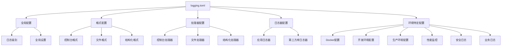
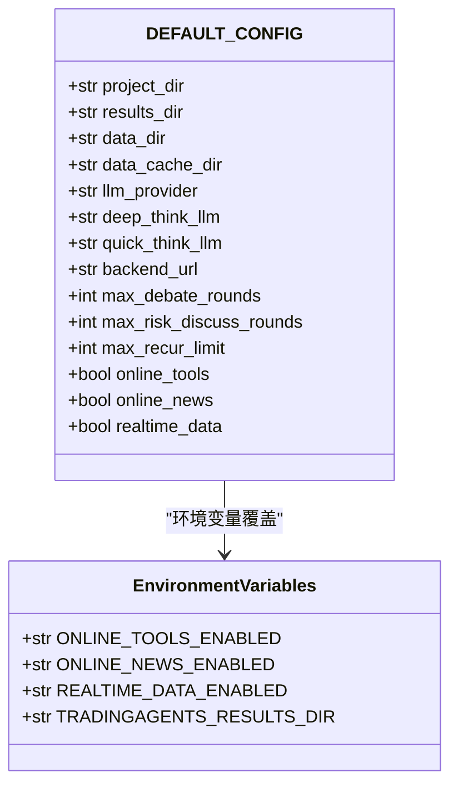
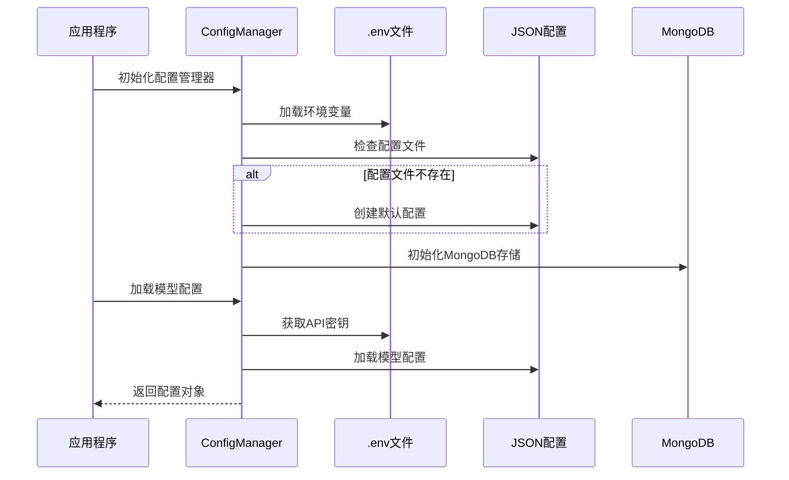
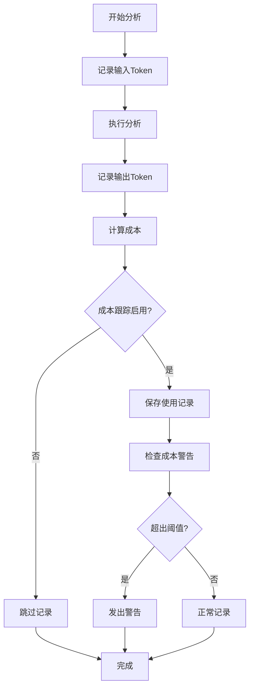
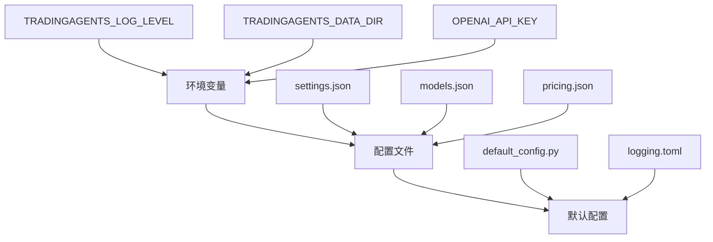

# 配置文件详解

<cite>
**本文档中引用的文件**
- [config/logging.toml](file://config/logging.toml)
- [config/logging_docker.toml](file://config/logging_docker.toml)
- [tradingagents/default_config.py](file://tradingagents/default_config.py)
- [tradingagents/config/config_manager.py](file://tradingagents/config/config_manager.py)
- [examples/config_management_demo.py](file://examples/config_management_demo.py)
- [examples/data_dir_config_demo.py](file://examples/data_dir_config_demo.py)
- [scripts/setup/migrate_env_to_config.py](file://scripts/setup/migrate_env_to_config.py)
- [tradingagents/utils/logging_init.py](file://tradingagents/utils/logging_init.py)
- [tradingagents/utils/logging_manager.py](file://tradingagents/utils/logging_manager.py)
</cite>

## 目录
1. [简介](#简介)
2. [日志配置文件](#日志配置文件)
3. [默认配置参数](#默认配置参数)
4. [配置管理器](#配置管理器)
5. [配置文件优先级和环境变量](#配置文件优先级和环境变量)
6. [配置文件示例](#配置文件示例)
7. [最佳实践](#最佳实践)
8. [故障排除](#故障排除)
9. [总结](#总结)

## 简介

TradingAgents-CN系统采用多层次的配置管理架构，支持多种配置文件格式和环境变量配置。系统主要包含两个核心配置文件：日志配置文件（TOML格式）和默认配置文件（Python字典）。配置管理系统负责加载、验证和管理这些配置，确保系统的灵活性和可维护性。

## 日志配置文件

### logging.toml 结构详解

系统提供了两个主要的日志配置文件：`logging.toml`和`logging_docker.toml`，分别针对普通环境和Docker环境进行了优化。

#### 基础配置结构



**图表来源**
- [config/logging.toml](file://config/logging.toml#L1-L111)
- [config/logging_docker.toml](file://config/logging_docker.toml#L1-L100)

#### 日志级别配置

| 级别 | 描述 | 使用场景 |
|------|------|----------|
| DEBUG | 详细的调试信息 | 开发阶段，问题排查 |
| INFO | 一般信息记录 | 正常运行状态记录 |
| WARNING | 警告信息，程序仍可运行 | 潜在问题提醒 |
| ERROR | 错误信息，影响部分功能 | 功能异常，但不影响整体 |
| CRITICAL | 严重错误，可能导致程序崩溃 | 重大故障，需要立即处理 |

#### 格式配置详解

**控制台格式**：
```
%(asctime)s | %(name)-20s | %(levelname)-8s | %(message)s
```

**文件格式**：
```
%(asctime)s | %(name)-20s | %(levelname)-8s | %(module)s:%(funcName)s:%(lineno)d | %(message)s
```

**结构化格式（JSON）**：
```json
{
    "timestamp": "2024-01-01T12:00:00.000Z",
    "level": "INFO",
    "logger": "tradingagents.core",
    "message": "系统初始化完成",
    "module": "core",
    "function": "initialize",
    "line": 42
}
```

#### 处理器配置

**控制台处理器**：
- `enabled`: 是否启用控制台输出
- `colored`: 是否启用彩色输出（仅控制台）
- `level`: 处理器级别的日志过滤

**文件处理器**：
- `enabled`: 是否启用文件日志
- `level`: 文件日志级别
- `max_size`: 单个日志文件最大大小
- `backup_count`: 保留的备份文件数量
- `directory`: 日志文件存储目录

**结构化处理器**：
- `enabled`: 是否启用JSON格式日志
- `level`: 结构化日志级别
- `directory`: 结构化日志存储目录

#### 环境特定配置

**Docker环境配置**：
```toml
[logging.docker]
enabled = true
stdout_only = false
disable_file_logging = false
```

**开发环境配置**：
```toml
[logging.development]
enabled = true
debug_modules = ["tradingagents.graph", "tradingagents.llm_adapters"]
save_debug_files = true
```

**生产环境配置**：
```toml
[logging.production]
enabled = true
structured_only = true
error_notification = true
max_log_size = "100MB"
```

**节源配置**：
- `enabled`: 是否启用该环境配置
- `debug_modules`: 开发时详细日志的模块列表
- `save_debug_files`: 是否保存调试文件
- `structured_only`: 是否只使用结构化日志
- `error_notification`: 是否启用错误通知

**性能监控配置**：
- `log_slow_operations`: 是否记录慢操作
- `slow_threshold_seconds`: 慢操作阈值（秒）
- `log_memory_usage`: 是否记录内存使用情况

**安全日志配置**：
- `log_api_calls`: 是否记录API调用
- `log_token_usage`: 是否记录Token使用
- `mask_sensitive_data`: 是否屏蔽敏感数据

**业务日志配置**：
- `log_analysis_events`: 是否记录分析事件
- `log_user_actions`: 是否记录用户操作
- `log_export_events`: 是否记录导出事件

**段落来源**
- [config/logging.toml](file://config/logging.toml#L1-L111)
- [config/logging_docker.toml](file://config/logging_docker.toml#L1-L100)

### Docker环境优化配置

Docker环境专用的`logging_docker.toml`文件针对容器化部署进行了优化：

#### 关键差异

1. **目录路径**：使用`/app/logs`而非相对路径
2. **文件大小**：最大100MB，适应容器存储限制
3. **输出配置**：同时支持文件和stdout输出
4. **格式简化**：控制台格式更简洁，便于容器日志收集

#### Docker配置示例

```toml
[logging.handlers.file]
enabled = true
level = "DEBUG"
max_size = "100MB"
backup_count = 5
directory = "/app/logs"

[logging.docker]
enabled = true
stdout_only = false
disable_file_logging = false
```

**段落来源**
- [config/logging_docker.toml](file://config/logging_docker.toml#L1-L100)

## 默认配置参数

### default_config.py 结构

`default_config.py`文件定义了系统的默认配置参数，采用Python字典结构：



**图表来源**
- [tradingagents/default_config.py](file://tradingagents/default_config.py#L1-L28)

### 核心配置参数详解

| 参数名 | 类型 | 默认值 | 描述 |
|--------|------|--------|------|
| `project_dir` | str | 项目根目录 | 项目主目录路径 |
| `results_dir` | str | `./results` | 分析结果存储目录 |
| `data_dir` | str | 用户文档目录 | 数据文件存储目录 |
| `data_cache_dir` | str | `./dataflows/data_cache` | 数据缓存目录 |
| `llm_provider` | str | `"openai"` | 默认LLM提供商 |
| `deep_think_llm` | str | `"o4-mini"` | 深度思考模型 |
| `quick_think_llm` | str | `"gpt-4o-mini"` | 快速思考模型 |
| `backend_url` | str | `"https://api.openai.com/v1"` | LLM API基础URL |
| `max_debate_rounds` | int | `1` | 最大辩论轮次 |
| `max_risk_discuss_rounds` | int | `1` | 最大风险讨论轮次 |
| `max_recur_limit` | int | `100` | 最大递归限制 |
| `online_tools` | bool | `false` | 是否启用在线工具 |
| `online_news` | bool | `true` | 是否启用新闻获取 |
| `realtime_data` | bool | `false` | 是否启用实时数据 |

### 环境变量覆盖机制

系统支持通过环境变量覆盖默认配置：

```python
# 环境变量读取示例
"online_tools": os.getenv("ONLINE_TOOLS_ENABLED", "false").lower() == "true",
"online_news": os.getenv("ONLINE_NEWS_ENABLED", "true").lower() == "true",
"realtime_data": os.getenv("REALTIME_DATA_ENABLED", "false").lower() == "true",
```

**段落来源**
- [tradingagents/default_config.py](file://tradingagents/default_config.py#L1-L28)

## 配置管理器

### config_manager.py 架构

配置管理器是系统的核心组件，负责管理API密钥、模型配置、定价设置等：

```mermaid
classDiagram
class ConfigManager {
+Path config_dir
+Path models_file
+Path pricing_file
+Path usage_file
+Path settings_file
+MongoDBStorage mongodb_storage
+__init__(config_dir)
+load_models() ModelConfig[]
+save_models(models)
+load_pricing() PricingConfig[]
+save_pricing(pricing)
+load_settings() Dict
+save_settings(settings)
+add_usage_record(...)
+calculate_cost(...) float
+get_usage_statistics(...) Dict
+ensure_directories_exist()
}
class ModelConfig {
+str provider
+str model_name
+str api_key
+str base_url
+int max_tokens
+float temperature
+bool enabled
}
class PricingConfig {
+str provider
+str model_name
+float input_price_per_1k
+float output_price_per_1k
+str currency
}
class UsageRecord {
+str timestamp
+str provider
+str model_name
+int input_tokens
+int output_tokens
+float cost
+str session_id
+str analysis_type
}
ConfigManager --> ModelConfig : "管理"
ConfigManager --> PricingConfig : "管理"
ConfigManager --> UsageRecord : "跟踪"
```



**图表来源**
- [tradingagents/config/config_manager.py](file://tradingagents/config/config_manager.py#L1-L727)

### 配置文件管理流程



**图表来源**
- [tradingagents/config/config_manager.py](file://tradingagents/config/config_manager.py#L50-L100)

### API密钥管理

配置管理器提供了强大的API密钥管理功能：

#### 密钥获取优先级

1. **环境变量**（最高优先级）
2. **MongoDB存储**（如果可用）
3. **本地JSON文件**（最低优先级）

#### OpenAI密钥验证

```python
def validate_openai_api_key_format(self, api_key: str) -> bool:
    """验证OpenAI API密钥格式"""
    if not api_key.startswith('sk-'):
        return False
    if len(api_key) != 51:
        return False
    pattern = r'^sk-[A-Za-z0-9]{48}$'
    return bool(re.match(pattern, api_key))
```

### 成本跟踪系统

#### Token使用跟踪



**图表来源**
- [tradingagents/config/config_manager.py](file://tradingagents/config/config_manager.py#L500-L600)

#### 成本计算公式

```python
def calculate_cost(self, provider: str, model_name: str, input_tokens: int, output_tokens: int) -> float:
    """计算使用成本"""
    input_cost = (input_tokens / 1000) * pricing.input_price_per_1k
    output_cost = (output_tokens / 1000) * pricing.output_price_per_1k
    return round(input_cost + output_cost, 6)
```

**段落来源**
- [tradingagents/config/config_manager.py](file://tradingagents/config/config_manager.py#L1-L727)

## 配置文件优先级和环境变量

### 配置加载优先级

系统采用多层配置加载机制，具有明确的优先级顺序：



### 支持的环境变量

| 环境变量 | 描述 | 示例值 |
|----------|------|--------|
| `TRADINGAGENTS_LOG_LEVEL` | 日志级别 | `INFO`, `DEBUG`, `WARNING` |
| `TRADINGAGENTS_DATA_DIR` | 数据目录 | `/path/to/data` |
| `TRADINGAGENTS_CACHE_DIR` | 缓存目录 | `/path/to/cache` |
| `TRADINGAGENTS_RESULTS_DIR` | 结果目录 | `/path/to/results` |
| `DASHSCOPE_API_KEY` | 阿里百炼API密钥 | `sk-xxx...` |
| `OPENAI_API_KEY` | OpenAI API密钥 | `sk-xxx...` |
| `GOOGLE_API_KEY` | Google API密钥 | `xxx...` |
| `FINNHUB_API_KEY` | FinnHub API密钥 | `xxx...` |
| `REDDIT_CLIENT_ID` | Reddit客户端ID | `xxx...` |
| `REDDIT_CLIENT_SECRET` | Reddit客户端密钥 | `xxx...` |
| `REDDIT_USER_AGENT` | Reddit用户代理 | `MyBot/1.0` |

### 配置覆盖机制

```python
def load_settings(self) -> Dict[str, Any]:
    """加载设置，合并.env中的配置"""
    # 1. 从配置文件加载
    settings = self.load_settings_from_file()
    
    # 2. 从环境变量覆盖
    env_settings = {
        "log_level": os.getenv("TRADINGAGENTS_LOG_LEVEL", ""),
        "data_dir": os.getenv("TRADINGAGENTS_DATA_DIR", ""),
        "openai_enabled": os.getenv("OPENAI_ENABLED", "").lower() == "true"
    }
    
    # 3. 只有当环境变量存在且不为空时才覆盖
    for key, value in env_settings.items():
        if value != "" and value is not None:
            settings[key] = value
    
    return settings
```

**段落来源**
- [tradingagents/config/config_manager.py](file://tradingagents/config/config_manager.py#L550-L600)

## 配置文件示例

### 完整的日志配置示例

```toml
# TradingAgents-CN 日志配置文件
# 支持不同环境的日志配置

[logging]
# 全局日志级别：DEBUG, INFO, WARNING, ERROR, CRITICAL
level = "INFO"

# 日志格式配置
[logging.format]
console = "%(asctime)s | %(name)-20s | %(levelname)-8s | %(message)s"
file = "%(asctime)s | %(name)-20s | %(levelname)-8s | %(module)s:%(funcName)s:%(lineno)d | %(message)s"
structured = "json"

# 处理器配置
[logging.handlers]

# 控制台处理器
[logging.handlers.console]
enabled = true
colored = true
level = "INFO"

# 文件处理器
[logging.handlers.file]
enabled = true
level = "DEBUG"
max_size = "10MB"
backup_count = 5
directory = "./logs"

# 结构化日志处理器（JSON格式）
[logging.handlers.structured]
enabled = false
level = "INFO"
directory = "./logs"

# 特定日志器配置
[logging.loggers]
[logging.loggers.tradingagents]
level = "INFO"

[logging.loggers.web]
level = "INFO"

[logging.loggers.dataflows]
level = "INFO"

[logging.loggers.llm_adapters]
level = "INFO"

[logging.loggers.streamlit]
level = "WARNING"

[logging.loggers.urllib3]
level = "WARNING"

[logging.loggers.requests]
level = "WARNING"

[logging.loggers.matplotlib]
level = "WARNING"

[logging.loggers.pandas]
level = "WARNING"

# Docker环境配置
[logging.docker]
enabled = false
stdout_only = true
disable_file_logging = true

# 开发环境配置
[logging.development]
enabled = false
debug_modules = ["tradingagents.graph", "tradingagents.llm_adapters"]
save_debug_files = true

# 生产环境配置
[logging.production]
enabled = false
structured_only = true
error_notification = true
max_log_size = "100MB"

# 性能监控日志
[logging.performance]
enabled = true
log_slow_operations = true
slow_threshold_seconds = 5.0
log_memory_usage = false

# 安全日志
[logging.security]
enabled = true
log_api_calls = true
log_token_usage = true
mask_sensitive_data = true

# 业务日志
[logging.business]
enabled = true
log_analysis_events = true
log_user_actions = true
log_export_events = true
```

### 完整的配置管理示例

```python
# 配置管理器使用示例
from tradingagents.config.config_manager import config_manager, token_tracker

# 1. 模型管理
models = config_manager.get_enabled_models()
for model in models:
    print(f"Provider: {model.provider}, Model: {model.model_name}")

# 2. 成本计算
cost = config_manager.calculate_cost("dashscope", "qwen-turbo", 1000, 500)
print(f"Cost: ¥{cost:.4f}")

# 3. 使用跟踪
record = token_tracker.track_usage(
    provider="dashscope",
    model_name="qwen-turbo",
    input_tokens=1000,
    output_tokens=500,
    session_id="session_123"
)

# 4. 使用统计
stats = config_manager.get_usage_statistics(30)
print(f"Total Cost: ¥{stats['total_cost']:.4f}")
print(f"Total Requests: {stats['total_requests']}")

# 5. 设置管理
settings = config_manager.load_settings()
settings["cost_alert_threshold"] = 200.0
config_manager.save_settings(settings)
```

### 环境变量配置示例

```bash
# 设置日志级别
export TRADINGAGENTS_LOG_LEVEL=DEBUG

# 设置数据目录
export TRADINGAGENTS_DATA_DIR=/home/user/trading-data

# 设置API密钥
export DASHSCOPE_API_KEY=sk-xxxxxxxxxxxxxxxxxxxxxxxxxxxxxxxx
export OPENAI_API_KEY=sk-xxxxxxxxxxxxxxxxxxxxxxxxxxxxxxxx

# 配置Reddit访问
export REDDIT_CLIENT_ID=your_client_id
export REDDIT_CLIENT_SECRET=your_client_secret
export REDDIT_USER_AGENT="TradingAgents/1.0"

# 启用功能
export ONLINE_TOOLS_ENABLED=true
export ONLINE_NEWS_ENABLED=true
export REALTIME_DATA_ENABLED=false
```

**段落来源**
- [examples/config_management_demo.py](file://examples/config_management_demo.py#L1-L258)
- [examples/data_dir_config_demo.py](file://examples/data_dir_config_demo.py#L1-L246)

## 最佳实践

### 日志配置最佳实践

#### 1. 环境分离配置

```toml
# 开发环境配置
[logging.development]
enabled = true
debug_modules = ["tradingagents.graph", "tradingagents.llm_adapters"]
save_debug_files = true

# 生产环境配置
[logging.production]
enabled = true
structured_only = true
error_notification = true
max_log_size = "100MB"
```

#### 2. 敏感信息保护

```toml
[logging.security]
enabled = true
log_api_calls = true
log_token_usage = true
mask_sensitive_data = true
```

#### 3. 性能优化

```toml
[logging.performance]
enabled = true
log_slow_operations = true
slow_threshold_seconds = 5.0
log_memory_usage = false
```

### 配置管理最佳实践

#### 1. 分层配置设计

```python
# 1. 默认配置（不可变）
DEFAULT_CONFIG = {
    "max_debate_rounds": 1,
    "max_risk_discuss_rounds": 1,
    "max_recur_limit": 100,
}

# 2. 环境变量覆盖
env_config = {
    "max_debate_rounds": int(os.getenv("MAX_DEBATE_ROUNDS", 1)),
}

# 3. 用户配置（最高优先级）
user_config = config_manager.load_settings()
```

#### 2. API密钥安全

```python
# 安全的API密钥管理
def get_api_key(provider: str) -> str:
    """安全获取API密钥"""
    env_key = f"{provider.upper()}_API_KEY"
    api_key = os.getenv(env_key, "")
    
    if provider.lower() == "openai" and api_key:
        if not validate_openai_api_key_format(api_key):
            logger.warning(f"⚠️ OpenAI API密钥格式不正确: {api_key[:10]}...")
            return ""
    
    return api_key
```

#### 3. 成本控制

```python
# 成本警告配置
settings = {
    "enable_cost_tracking": True,
    "cost_alert_threshold": 100.0,
    "currency_preference": "CNY",
}

# 实时成本监控
def check_cost_alert(current_cost: float):
    threshold = settings.get("cost_alert_threshold", 100.0)
    if current_cost >= threshold:
        logger.warning(f"⚠️ 成本警告: ¥{current_cost:.4f} 超过阈值 ¥{threshold}")
```

### 部署最佳实践

#### 1. Docker环境配置

```dockerfile
# Dockerfile示例
FROM python:3.11-slim

# 设置环境变量
ENV TRADINGAGENTS_LOG_LEVEL=INFO
ENV TRADINGAGENTS_DATA_DIR=/app/data
ENV TRADINGAGENTS_CACHE_DIR=/app/cache

# 复制配置文件
COPY config/logging_docker.toml /app/config/logging.toml
COPY .env /app/

# 安装依赖
RUN pip install -r requirements.txt

# 启动应用
CMD ["python", "-m", "cli.main"]
```

#### 2. 监控和告警

```python
# 监控配置示例
monitoring_config = {
    "performance": {
        "slow_operation_threshold": 10.0,
        "memory_threshold_mb": 1024,
    },
    "security": {
        "api_call_logging": True,
        "sensitive_data_masking": True,
    },
    "business": {
        "analysis_event_logging": True,
        "user_action_logging": True,
    }
}
```

## 故障排除

### 常见配置问题

#### 1. 日志配置加载失败

**问题症状**：
- 日志系统无法正常工作
- 配置文件路径错误

**解决方案**：
```python
# 检查配置文件是否存在
import os
from pathlib import Path

config_path = Path("config/logging.toml")
if not config_path.exists():
    print(f"配置文件不存在: {config_path}")
    # 创建默认配置
    import shutil
    shutil.copy("config/logging_docker.toml", "config/logging.toml")
```

#### 2. API密钥验证失败

**问题症状**：
- OpenAI模型无法使用
- API密钥格式错误

**解决方案**：
```python
# 手动验证密钥格式
def debug_api_key_validation():
    api_key = os.getenv("OPENAI_API_KEY", "")
    if api_key:
        from tradingagents.config.config_manager import ConfigManager
        validator = ConfigManager()
        is_valid = validator.validate_openai_api_key_format(api_key)
        print(f"密钥格式验证: {'有效' if is_valid else '无效'}")
```

#### 3. 目录权限问题

**问题症状**：
- 日志文件无法写入
- 数据目录创建失败

**解决方案**：
```python
# 检查目录权限
def check_directory_permissions():
    import os
    settings = config_manager.load_settings()
    
    for dir_name, dir_path in settings.items():
        if dir_name.endswith("_dir") and dir_path:
            if not os.path.exists(dir_path):
                try:
                    os.makedirs(dir_path, exist_ok=True)
                    print(f"创建目录: {dir_path}")
                except PermissionError:
                    print(f"权限错误: 无法创建目录 {dir_path}")
```

### 调试配置问题

#### 1. 配置加载调试

```python
# 配置调试工具
def debug_config_loading():
    print("🔍 配置加载调试信息")
    
    # 检查环境变量
    print("\n📋 环境变量:")
    env_vars = ["TRADINGAGENTS_LOG_LEVEL", "TRADINGAGENTS_DATA_DIR", 
                "DASHSCOPE_API_KEY", "OPENAI_API_KEY"]
    for var in env_vars:
        value = os.getenv(var, "未设置")
        print(f"  {var}: {value}")
    
    # 检查配置文件
    print("\n📁 配置文件:")
    config_files = ["config/models.json", "config/pricing.json", 
                   "config/settings.json", "config/logging.toml"]
    for file in config_files:
        exists = os.path.exists(file)
        print(f"  {file}: {'存在' if exists else '不存在'}")
    
    # 检查配置内容
    print("\n📊 配置内容:")
    settings = config_manager.load_settings()
    for key, value in settings.items():
        if "dir" in key.lower() or "key" in key.lower():
            print(f"  {key}: {value}")
```

#### 2. 日志系统调试

```python
# 日志系统调试
def debug_logging_system():
    from tradingagents.utils.logging_manager import get_logger
    
    logger = get_logger('config.debug')
    logger.info("🔧 配置系统调试启动")
    
    # 测试不同级别的日志
    logger.debug("调试信息")
    logger.info("一般信息")
    logger.warning("警告信息")
    logger.error("错误信息")
    logger.critical("严重错误")
    
    # 测试结构化日志
    structured_logger = get_logger('config.test')
    structured_logger.info("结构化测试", extra={
        'session_id': 'test_123',
        'analysis_type': 'debug',
        'cost': 0.0,
        'tokens': 100
    })
```

**段落来源**
- [scripts/setup/migrate_env_to_config.py](file://scripts/setup/migrate_env_to_config.py#L1-L178)

## 总结

TradingAgents-CN的配置系统提供了灵活、可扩展的配置管理方案。通过多层次的配置架构，系统能够适应不同的部署环境和使用需求：

### 核心特性

1. **多格式支持**：支持TOML、JSON、环境变量等多种配置格式
2. **环境分离**：针对开发、测试、生产环境提供专门的配置
3. **优先级机制**：明确的配置加载优先级，确保灵活性
4. **安全性**：内置API密钥验证和敏感信息保护
5. **成本控制**：完善的Token使用跟踪和成本监控
6. **可扩展性**：模块化的配置管理器，易于扩展新功能

### 使用建议

1. **开发阶段**：使用详细的日志配置，启用调试模块
2. **生产环境**：使用结构化日志，启用性能监控和安全日志
3. **容器部署**：使用Docker专用配置，注意目录权限和存储限制
4. **成本控制**：定期检查使用统计，设置合理的成本警告阈值
5. **安全考虑**：避免在代码中硬编码API密钥，使用环境变量

通过合理配置和使用这些功能，可以构建一个稳定、高效、可监控的TradingAgents-CN系统。