# Token跟踪与成本预警

<cite>
**本文档引用的文件**
- [config_manager.py](file://tradingagents/config/config_manager.py)
- [mongodb_storage.py](file://tradingagents/config/mongodb_storage.py)
- [token_tracking_demo.py](file://examples/token_tracking_demo.py)
- [test_dashscope_token_tracking.py](file://tests/test_dashscope_token_tracking.py)
- [test_deepseek_token_tracking.py](file://tests/test_deepseek_token_tracking.py)
- [dashscope_adapter.py](file://tradingagents/llm_adapters/dashscope_adapter.py)
- [deepseek_adapter.py](file://tradingagents/llm_adapters/deepseek_adapter.py)
</cite>

## 目录
1. [简介](#简介)
2. [系统架构概览](#系统架构概览)
3. [TokenTracker核心类详解](#tokentracker核心类详解)
4. [ConfigManager集成机制](#configmanager集成机制)
5. [成本计算与跟踪流程](#成本计算与跟踪流程)
6. [会话管理与统计](#会话管理与统计)
7. [MongoDB存储支持](#mongodb存储支持)
8. [最佳实践与集成指南](#最佳实践与集成指南)
9. [故障排除指南](#故障排除指南)
10. [总结](#总结)

## 简介

TokenTracker是TradingAgents系统中的核心组件，负责监控和管理LLM（大型语言模型）调用的Token使用情况，提供实时的成本计算、使用统计和成本预警功能。该系统通过与ConfigManager的紧密协作，实现了全面的Token使用跟踪和成本控制机制。

TokenTracker的主要功能包括：
- **实时Token使用跟踪**：自动记录每次LLM调用的输入/输出Token数量
- **成本计算与预警**：基于预设定价模型计算使用成本，并在达到阈值时发出警告
- **会话级成本管理**：为每个分析会话提供独立的成本统计
- **多供应商支持**：支持DashScope、DeepSeek、OpenAI等多种LLM提供商
- **灵活的数据存储**：支持JSON文件和MongoDB两种存储方式

## 系统架构概览

TokenTracker系统采用分层架构设计，通过ConfigManager作为核心协调器，实现与各个LLM适配器的无缝集成。

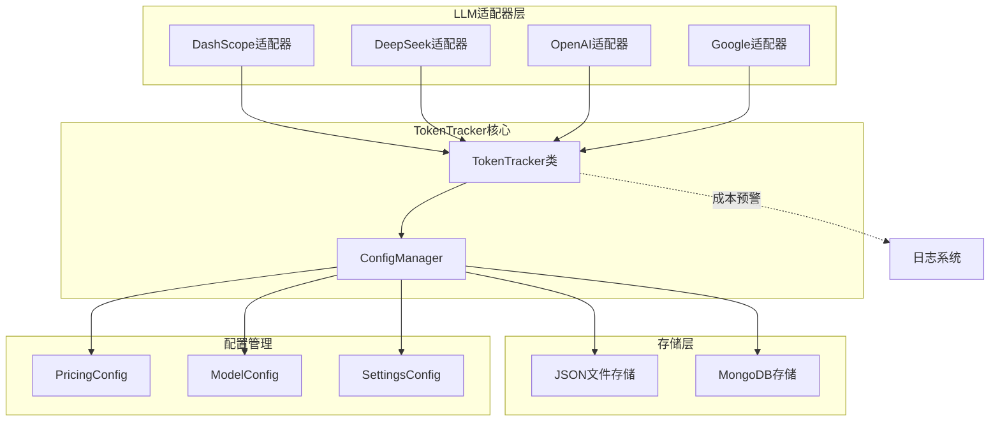

**图表来源**
- [config_manager.py](file://tradingagents/config/config_manager.py#L652-L726)
- [dashscope_adapter.py](file://tradingagents/llm_adapters/dashscope_adapter.py#L1-L50)
- [deepseek_adapter.py](file://tradingagents/llm_adapters/deepseek_adapter.py#L1-L50)

## TokenTracker核心类详解

### 类结构与初始化

TokenTracker类是一个轻量级的跟踪器，专门负责LLM调用的Token使用监控。它通过依赖注入的方式获取ConfigManager实例，实现松耦合的设计。

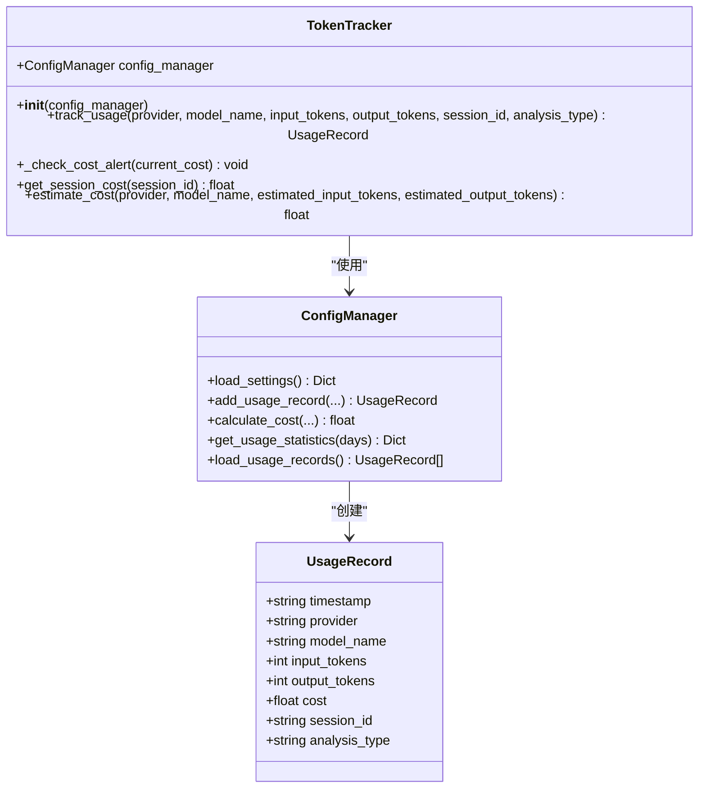

**图表来源**
- [config_manager.py](file://tradingagents/config/config_manager.py#L652-L726)

### track_usage方法详解

track_usage方法是TokenTracker的核心入口，负责处理所有LLM调用的Token使用记录。该方法实现了完整的跟踪流程：

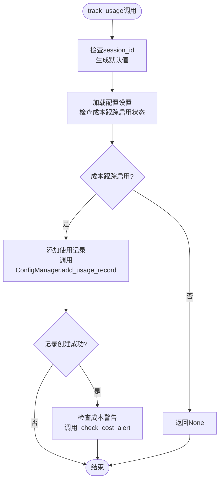

**图表来源**
- [config_manager.py](file://tradingagents/config/config_manager.py#L658-L680)

**章节来源**
- [config_manager.py](file://tradingagents/config/config_manager.py#L658-L680)

### _check_cost_alert方法实现

_check_cost_alert方法实现了智能的成本预警机制，通过比较当日累计成本与预设阈值来触发警告：

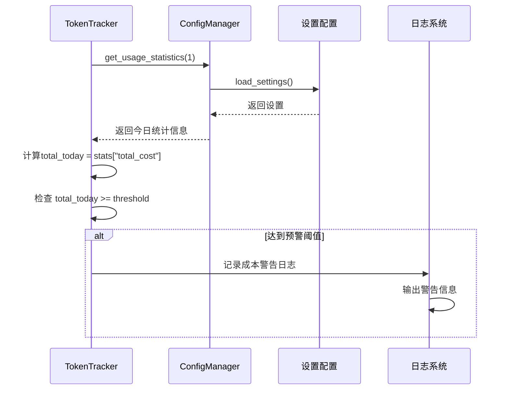

**图表来源**
- [config_manager.py](file://tradingagents/config/config_manager.py#L682-L695)

**章节来源**
- [config_manager.py](file://tradingagents/config/config_manager.py#L682-L695)

## ConfigManager集成机制

### 配置管理器的作用

ConfigManager作为TokenTracker的核心依赖，提供了完整的配置管理和数据存储功能。它负责：

1. **定价配置管理**：维护各LLM提供商的定价信息
2. **使用记录存储**：持久化LLM调用的使用数据
3. **设置管理**：提供成本跟踪相关的配置选项
4. **统计计算**：生成各种维度的使用统计

### add_usage_record方法

add_usage_record方法是ConfigManager中最重要的方法之一，它实现了完整的使用记录创建流程：

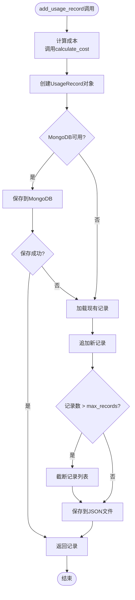

**图表来源**
- [config_manager.py](file://tradingagents/config/config_manager.py#L470-L500)

**章节来源**
- [config_manager.py](file://tradingagents/config/config_manager.py#L470-L500)

### calculate_cost方法

calculate_cost方法实现了基于配置的精确成本计算：

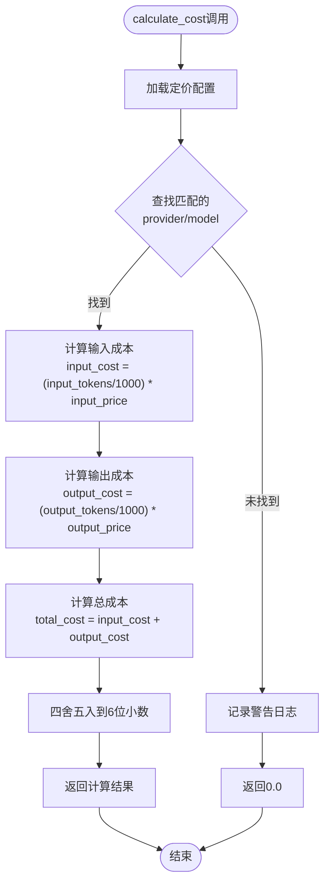

**图表来源**
- [config_manager.py](file://tradingagents/config/config_manager.py#L450-L470)

**章节来源**
- [config_manager.py](file://tradingagents/config/config_manager.py#L450-L470)

## 成本计算与跟踪流程

### 完整的跟踪流程

TokenTracker与LLM适配器的集成形成了完整的成本跟踪闭环：

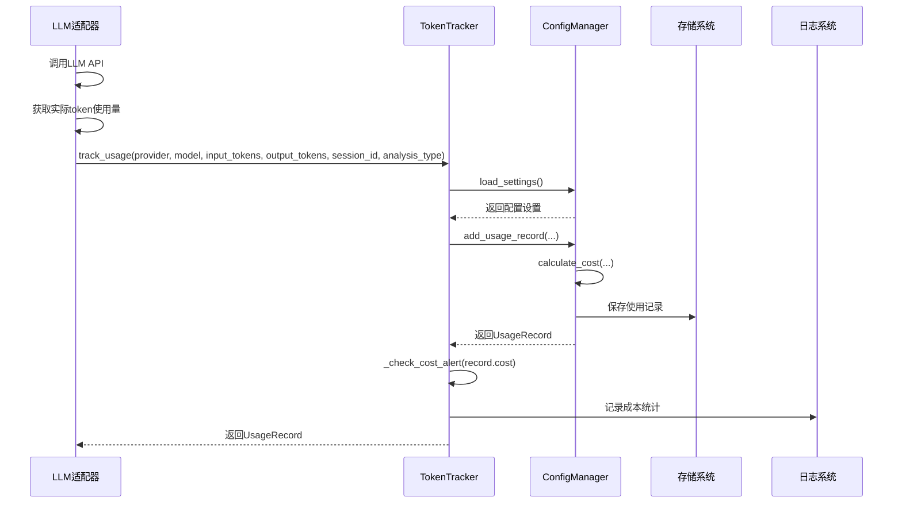

**图表来源**
- [dashscope_adapter.py](file://tradingagents/llm_adapters/dashscope_adapter.py#L130-L170)
- [deepseek_adapter.py](file://tradingagents/llm_adapters/deepseek_adapter.py#L80-L150)

### 成本预警机制

成本预警系统通过多层次的检查机制确保及时发现成本异常：

| 检查层级 | 检查内容 | 触发条件 | 处理方式 |
|---------|---------|---------|---------|
| 配置检查 | 成本跟踪启用状态 | `enable_cost_tracking = false` | 直接返回，不记录 |
| 单次检查 | 当次调用成本 | 无阈值限制 | 记录使用情况 |
| 会话检查 | 会话总成本 | 无阈值限制 | 记录会话统计 |
| 日度检查 | 当日累计成本 | `total_today >= threshold` | 发出成本警告 |

**章节来源**
- [config_manager.py](file://tradingagents/config/config_manager.py#L682-L695)

## 会话管理与统计

### 会话成本计算

get_session_cost方法提供了精确的会话级成本统计功能：

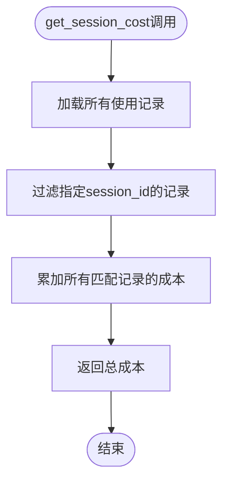

**图表来源**
- [config_manager.py](file://tradingagents/config/config_manager.py#L697-L702)

**章节来源**
- [config_manager.py](file://tradingagents/config/config_manager.py#L697-L702)

### 成本估算功能

estimate_cost方法允许用户在调用前进行成本预估：

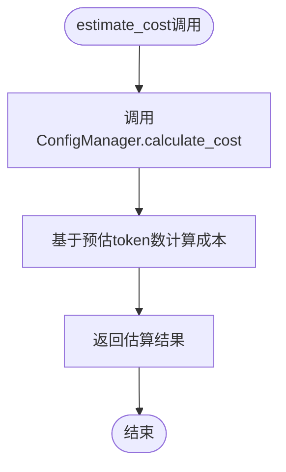

**图表来源**
- [config_manager.py](file://tradingagents/config/config_manager.py#L704-L710)

**章节来源**
- [config_manager.py](file://tradingagents/config/config_manager.py#L704-L710)

## MongoDB存储支持

### MongoDB存储架构

当MongoDB可用时，TokenTracker优先使用MongoDB存储，提供更好的性能和可扩展性：

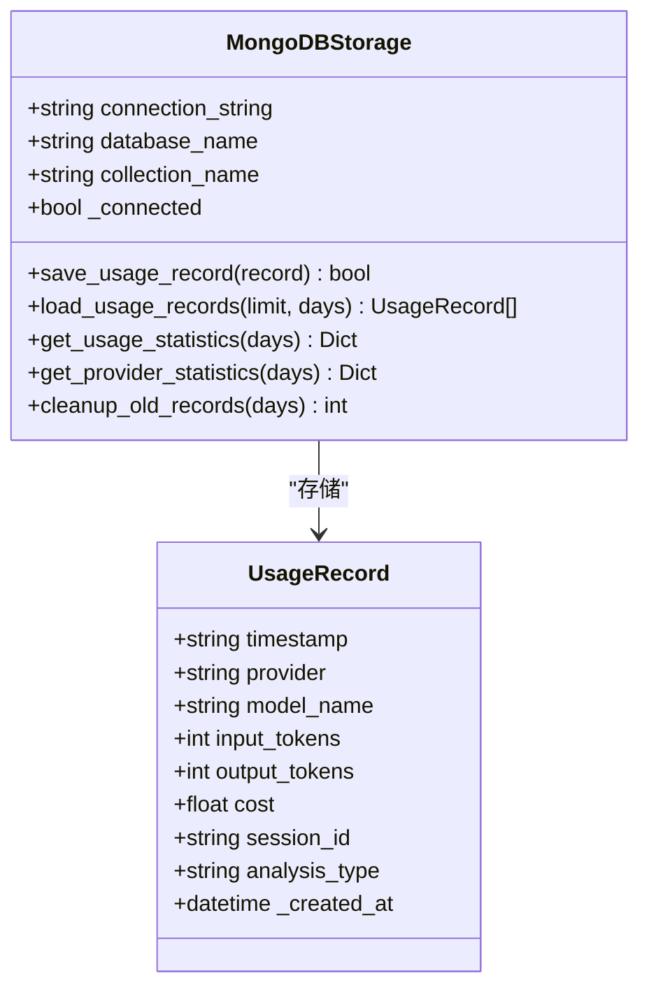

**图表来源**
- [mongodb_storage.py](file://tradingagents/config/mongodb_storage.py#L25-L60)

### MongoDB聚合查询

MongoDB存储支持复杂的聚合查询，提供高效的统计分析：

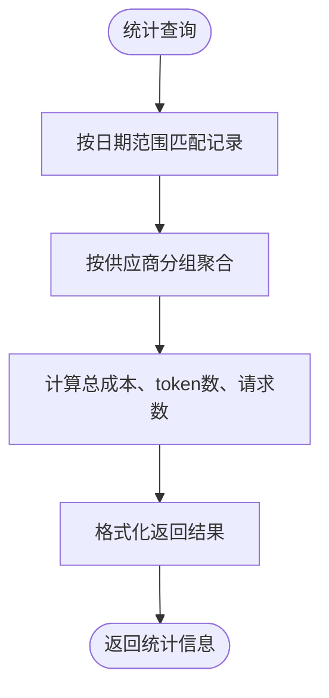

**图表来源**
- [mongodb_storage.py](file://tradingagents/config/mongodb_storage.py#L187-L228)

**章节来源**
- [mongodb_storage.py](file://tradingagents/config/mongodb_storage.py#L187-L228)

## 最佳实践与集成指南

### LLM适配器集成模式

推荐的LLM适配器集成模式如下：

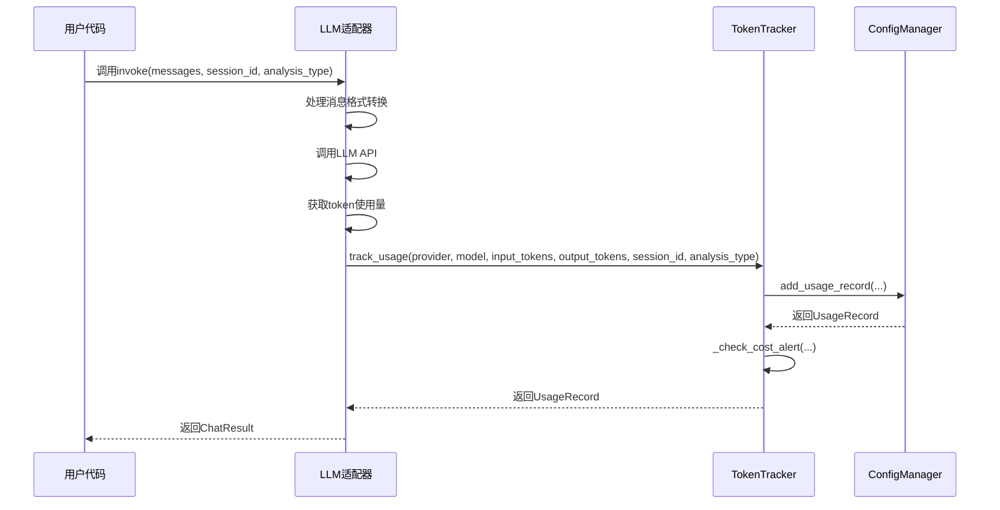

**图表来源**
- [dashscope_adapter.py](file://tradingagents/llm_adapters/dashscope_adapter.py#L130-L170)
- [deepseek_adapter.py](file://tradingagents/llm_adapters/deepseek_adapter.py#L80-L150)

### 配置最佳实践

1. **成本跟踪配置**：
   ```python
   # 在settings.json中配置
   {
     "enable_cost_tracking": true,
     "cost_alert_threshold": 100.0,
     "currency_preference": "CNY"
   }
   ```

2. **定价配置**：
   ```python
   # 在pricing.json中配置
   [
     {
       "provider": "deepseek",
       "model_name": "deepseek-chat",
       "input_price_per_1k": 0.0014,
       "output_price_per_1k": 0.0028,
       "currency": "CNY"
     }
   ]
   ```

3. **MongoDB配置**：
   ```python
   # 在.env文件中配置
   USE_MONGODB_STORAGE=true
   MONGODB_CONNECTION_STRING=mongodb://localhost:27017/
   MONGODB_DATABASE_NAME=tradingagents
   ```

**章节来源**
- [config_manager.py](file://tradingagents/config/config_manager.py#L200-L250)

### 错误处理策略

TokenTracker实现了健壮的错误处理机制：

| 场景 | 处理策略 | 影响范围 |
|------|---------|---------|
| MongoDB连接失败 | 自动回退到JSON存储 | 数据持久化 |
| API密钥缺失 | 忽略该调用，继续执行 | 功能可用性 |
| 成本计算失败 | 记录警告，返回0成本 | 统计准确性 |
| 文件权限错误 | 记录错误，继续执行 | 功能可用性 |

## 故障排除指南

### 常见问题诊断

1. **Token跟踪未生效**：
   - 检查`enable_cost_tracking`设置
   - 验证API密钥配置
   - 确认MongoDB连接状态

2. **成本计算为0**：
   - 检查定价配置是否存在
   - 验证provider/model名称匹配
   - 查看日志中的警告信息

3. **MongoDB存储失败**：
   - 检查MongoDB连接字符串
   - 验证网络连接
   - 确认数据库权限

### 调试工具

系统提供了丰富的调试功能：

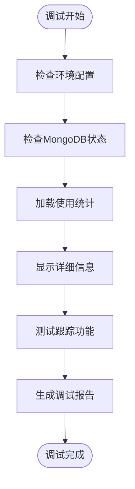

**章节来源**
- [token_tracking_demo.py](file://examples/token_tracking_demo.py#L40-L80)

## 总结

TokenTracker系统通过精心设计的架构和完善的集成机制，为TradingAgents提供了全面的Token使用跟踪和成本控制能力。其主要优势包括：

1. **自动化程度高**：LLM适配器无需手动调用跟踪方法，系统自动处理
2. **灵活性强**：支持多种存储后端和配置选项
3. **可扩展性好**：易于添加新的LLM提供商和统计维度
4. **可靠性高**：完善的错误处理和回退机制
5. **性能优异**：MongoDB支持提供高效的查询和统计功能

通过合理配置和使用TokenTracker，用户可以有效监控LLM使用成本，优化资源分配，并建立可持续的AI应用运营模式。该系统不仅满足了当前的需求，还为未来的功能扩展奠定了坚实的基础。