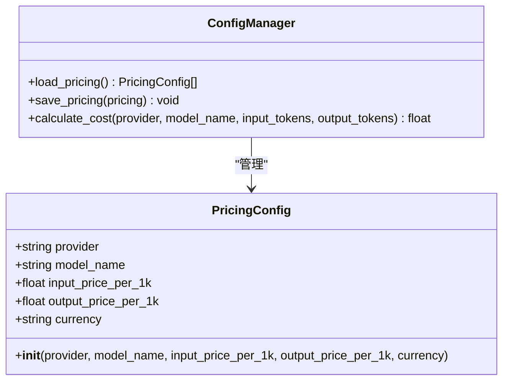
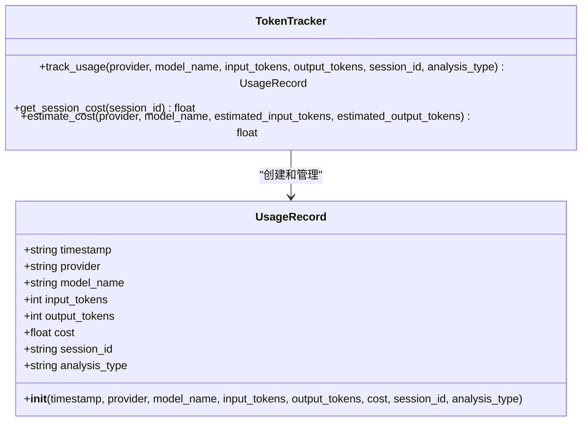
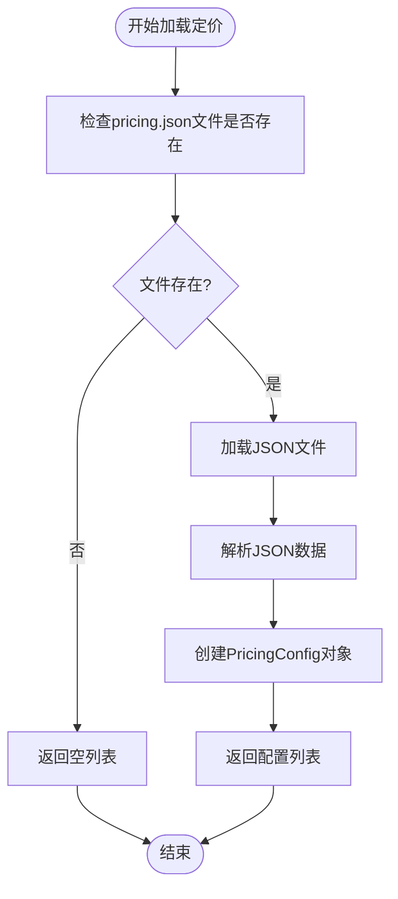
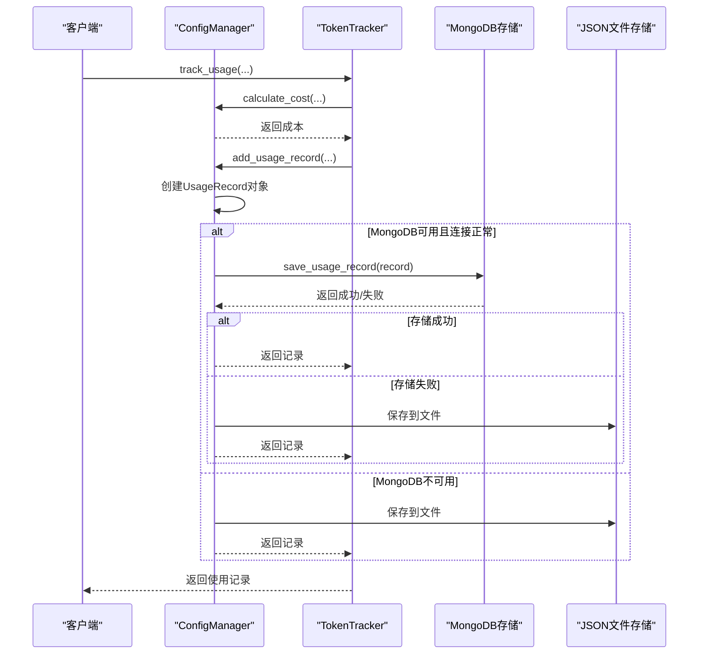
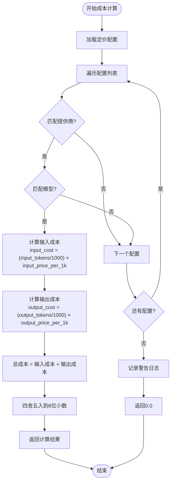
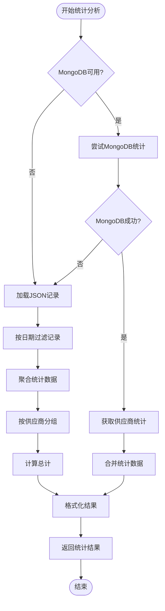
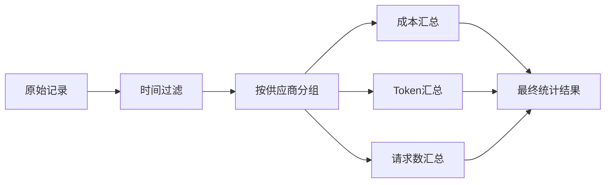
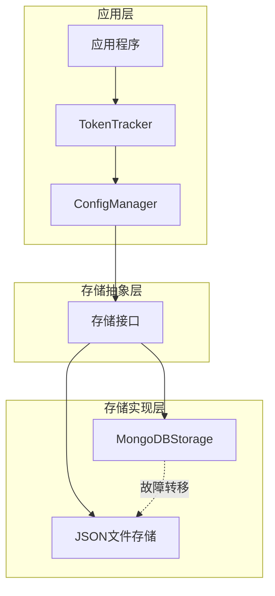
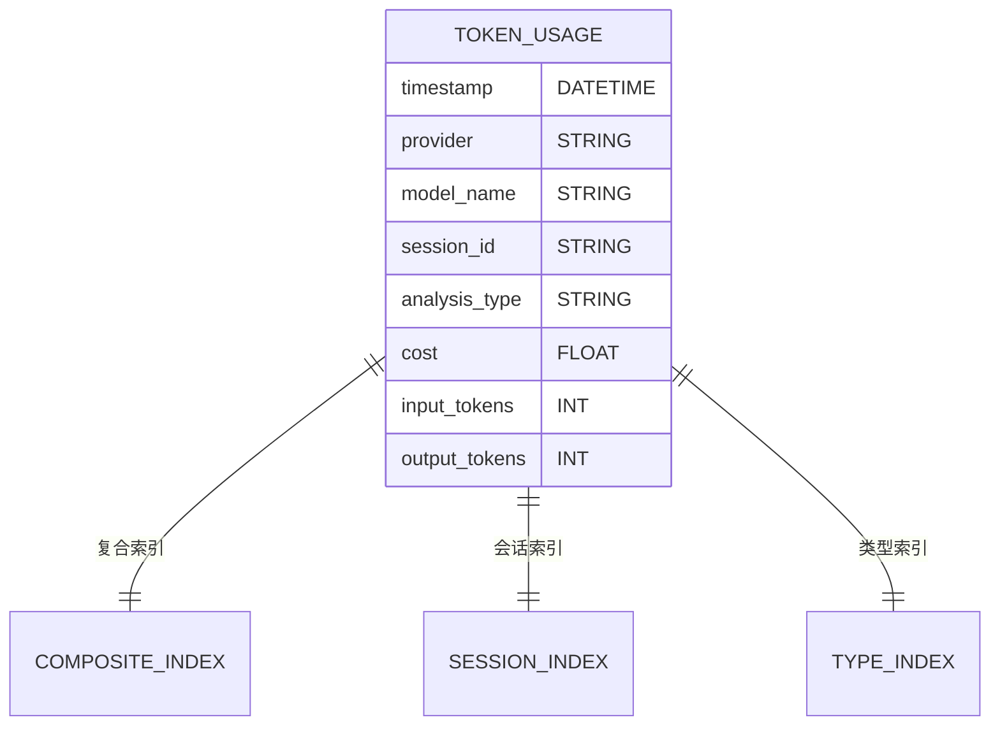
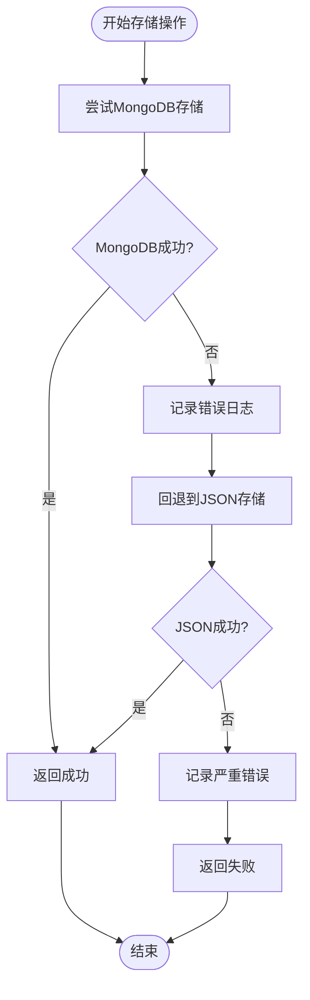

# 定价与使用记录管理

<cite>
**本文档引用的文件**
- [config_manager.py](file://tradingagents/config/config_manager.py)
- [mongodb_storage.py](file://tradingagents/config/mongodb_storage.py)
- [test_config_management.py](file://tests/test_config_management.py)
- [token_tracking_demo.py](file://examples/token_tracking_demo.py)
- [token_statistics.py](file://web/modules/token_statistics.py)
- [config_management.py](file://web/modules/config_management.py)
</cite>

## 目录
1. [简介](#简介)
2. [核心数据结构](#核心数据结构)
3. [定价配置管理](#定价配置管理)
4. [使用记录管理](#使用记录管理)
5. [成本计算机制](#成本计算机制)
6. [统计分析功能](#统计分析功能)
7. [存储架构设计](#存储架构设计)
8. [故障转移机制](#故障转移机制)
9. [最佳实践指南](#最佳实践指南)
10. [总结](#总结)

## 简介

TradingAgents的ConfigManager提供了完整的定价和使用记录管理功能，支持多种LLM提供商的定价策略管理、自动成本计算、详细的使用统计分析，以及灵活的存储后端选择。该系统采用双存储架构，优先使用MongoDB进行大规模数据存储，同时提供JSON文件作为回退方案。

## 核心数据结构

### PricingConfig数据类

PricingConfig是定价配置的核心数据结构，负责管理不同LLM提供商的定价策略。



**图表来源**
- [config_manager.py](file://tradingagents/config/config_manager.py#L47-L52)

#### 字段说明

| 字段名 | 类型 | 描述 | 示例值 |
|--------|------|------|--------|
| provider | string | LLM提供商名称 | "dashscope", "openai", "google" |
| model_name | string | 模型名称 | "qwen-turbo", "gpt-4", "gemini-pro" |
| input_price_per_1k | float | 每1000个输入token的价格 | 0.002, 0.03, 0.00025 |
| output_price_per_1k | float | 每1000个输出token的价格 | 0.006, 0.06, 0.0005 |
| currency | string | 货币单位 | "CNY", "USD", "EUR" |

**节来源**
- [config_manager.py](file://tradingagents/config/config_manager.py#L47-L52)

### UsageRecord数据类

UsageRecord记录每次LLM调用的详细使用信息，用于成本跟踪和统计分析。



**图表来源**
- [config_manager.py](file://tradingagents/config/config_manager.py#L52-L61)

#### 字段说明

| 字段名 | 类型 | 描述 | 示例值 |
|--------|------|------|--------|
| timestamp | string | ISO格式的时间戳 | "2024-01-15T10:30:45.123456" |
| provider | string | LLM提供商 | "dashscope" |
| model_name | string | 模型名称 | "qwen-turbo" |
| input_tokens | int | 输入token数量 | 1500 |
| output_tokens | int | 输出token数量 | 800 |
| cost | float | 计算的成本金额 | 0.0045 |
| session_id | string | 唯一会话标识符 | "session_20240115_103045" |
| analysis_type | string | 分析类型分类 | "stock_analysis", "news_analysis" |

**节来源**
- [config_manager.py](file://tradingagents/config/config_manager.py#L52-L61)

## 定价配置管理

### load_pricing方法

load_pricing方法负责从JSON文件加载所有定价配置，返回PricingConfig对象列表。



**图表来源**
- [config_manager.py](file://tradingagents/config/config_manager.py#L324-L331)

#### 实现特点

1. **文件容错处理**：如果文件不存在或损坏，返回空列表而不是抛出异常
2. **数据验证**：通过dataclass自动验证字段类型和格式
3. **默认配置**：系统启动时自动生成默认定价配置

**节来源**
- [config_manager.py](file://tradingagents/config/config_manager.py#L324-L331)

### save_pricing方法

save_pricing方法将定价配置列表保存到JSON文件，支持批量更新。

#### 关键特性

1. **原子性操作**：使用JSON序列化确保数据完整性
2. **格式化输出**：使用UTF-8编码和缩进格式提高可读性
3. **错误处理**：捕获并记录保存过程中的异常

**节来源**
- [config_manager.py](file://tradingagents/config/config_manager.py#L333-L341)

### 默认定价配置

系统预设了多个主流LLM提供商的定价配置：

| 提供商 | 模型名称 | 输入价格(CNY) | 输出价格(CNY) | 输入价格(USD) | 输出价格(USD) |
|--------|----------|---------------|---------------|---------------|---------------|
| dashscope | qwen-turbo | 0.002 | 0.006 | - | - |
| dashscope | qwen-plus-latest | 0.004 | 0.012 | - | - |
| dashscope | qwen-max | 0.02 | 0.06 | - | - |
| deepseek | deepseek-chat | 0.0014 | 0.0028 | - | - |
| openai | gpt-3.5-turbo | - | - | 0.0015 | 0.002 |
| openai | gpt-4 | - | - | 0.03 | 0.06 |
| google | gemini系列 | - | - | 0.00025 | 0.0005 |

**节来源**
- [config_manager.py](file://tradingagents/config/config_manager.py#L249-L274)

## 使用记录管理

### add_usage_record方法

add_usage_record是使用记录管理的核心方法，实现了智能存储策略和成本计算。



**图表来源**
- [config_manager.py](file://tradingagents/config/config_manager.py#L377-L408)

#### 方法流程

1. **成本计算**：调用calculate_cost方法计算本次调用的成本
2. **记录创建**：构建UsageRecord对象，包含时间戳和详细信息
3. **存储优先级**：
   - 优先尝试MongoDB存储
   - MongoDB失败时回退到JSON文件存储
   - 记录存储状态用于后续分析

**节来源**
- [config_manager.py](file://tradingagents/config/config_manager.py#L377-L408)

### load_usage_records方法

load_usage_records方法从JSON文件加载所有使用记录，支持分页和过滤。

#### 实现细节

1. **文件检查**：如果文件不存在，返回空列表
2. **数据解析**：使用dataclass自动转换为UsageRecord对象
3. **错误处理**：捕获解析异常，记录错误但继续处理有效记录

**节来源**
- [config_manager.py](file://tradingagents/config/config_manager.py#L343-L352)

### save_usage_records方法

save_usage_records方法将使用记录列表保存到JSON文件，支持记录数量限制。

#### 关键特性

1. **数量限制**：通过settings中的max_usage_records控制存储上限
2. **数据截断**：超出限制时保留最新的记录
3. **性能优化**：只保存必要的字段，减少文件大小

**节来源**
- [config_manager.py](file://tradingagents/config/config_manager.py#L354-L362)

## 成本计算机制

### calculate_cost方法

calculate_cost方法实现了精确的成本计算逻辑，支持多种LLM提供商的定价策略。



**图表来源**
- [config_manager.py](file://tradingagents/config/config_manager.py#L409-L421)

#### 计算公式

成本计算遵循以下数学公式：

```
输入成本 = (输入token数 ÷ 1000) × 输入价格(每1K token)
输出成本 = (输出token数 ÷ 1000) × 输出价格(每1K token)
总成本 = 输入成本 + 输出成本
```

#### 错误处理

1. **配置缺失**：当找不到匹配的定价配置时，记录警告并返回0.0
2. **调试信息**：提供详细的可用配置列表用于问题诊断
3. **精度控制**：结果四舍五入到6位小数，避免浮点数精度问题

**节来源**
- [config_manager.py](file://tradingagents/config/config_manager.py#L409-L421)

## 统计分析功能

### get_usage_statistics方法

get_usage_statistics方法提供全面的使用统计分析，支持多种时间范围和聚合维度。



**图表来源**
- [config_manager.py](file://tradingagents/config/config_manager.py#L620-L670)

#### 统计指标

系统提供以下关键统计指标：

| 指标类别 | 具体指标 | 描述 | 计算方式 |
|----------|----------|------|----------|
| 成本统计 | 总成本 | 指定时间范围内的总使用成本 | sum(cost) |
| 成本统计 | 平均成本 | 单次调用的平均成本 | total_cost / total_requests |
| Token统计 | 输入Token总数 | 指定时间范围内的输入token总量 | sum(input_tokens) |
| Token统计 | 输出Token总数 | 指定时间范围内的输出token总量 | sum(output_tokens) |
| 调用统计 | 总请求数 | 指定时间范围内的调用次数 | count(records) |
| 调用统计 | 平均Token数 | 单次调用的平均token数 | (input_tokens + output_tokens) / requests |

**节来源**
- [config_manager.py](file://tradingagents/config/config_manager.py#L542-L575)

### MongoDB统计优化

当MongoDB可用时，系统使用聚合管道进行高效统计计算：



**图表来源**
- [mongodb_storage.py](file://tradingagents/config/mongodb_storage.py#L146-L186)

#### MongoDB优势

1. **高性能**：使用MongoDB的聚合管道，避免内存中处理大量数据
2. **实时性**：支持实时统计更新，无需等待文件I/O
3. **扩展性**：支持大规模数据存储和查询
4. **索引优化**：预建复合索引提高查询性能

**节来源**
- [mongodb_storage.py](file://tradingagents/config/mongodb_storage.py#L146-L186)

## 存储架构设计

### 双存储架构

TradingAgents采用双存储架构，提供灵活的数据持久化方案：



**图表来源**
- [config_manager.py](file://tradingagents/config/config_manager.py#L104-L120)
- [mongodb_storage.py](file://tradingagents/config/mongodb_storage.py#L20-L50)

#### 存储特性对比

| 特性 | MongoDB存储 | JSON文件存储 |
|------|-------------|--------------|
| 性能 | 高（聚合查询） | 中等（全量加载） |
| 可扩展性 | 优秀（水平扩展） | 有限（文件大小限制） |
| 实时性 | 实时 | 批量写入 |
| 数据完整性 | ACID事务 | 文件锁机制 |
| 部署复杂度 | 中等（需要MongoDB） | 低（纯Python） |
| 成本 | 中等（云服务费用） | 低（免费） |

**节来源**
- [config_manager.py](file://tradingagents/config/config_manager.py#L104-L120)

### MongoDB存储实现

MongoDBStorage类提供了完整的MongoDB集成功能：

#### 连接管理

1. **自动重连**：连接失败时自动尝试重新连接
2. **健康检查**：定期检查数据库连接状态
3. **超时控制**：设置合理的连接和查询超时时间

#### 索引优化

系统创建了多个复合索引以优化查询性能：



**图表来源**
- [mongodb_storage.py](file://tradingagents/config/mongodb_storage.py#L75-L85)

**节来源**
- [mongodb_storage.py](file://tradingagents/config/mongodb_storage.py#L75-L85)

## 故障转移机制

### 自动故障检测

系统实现了智能的故障检测和自动故障转移机制：



**图表来源**
- [config_manager.py](file://tradingagents/config/config_manager.py#L377-L408)

#### 故障转移策略

1. **优先级顺序**：MongoDB → JSON文件
2. **状态监控**：持续监控MongoDB连接状态
3. **优雅降级**：MongoDB失败时不影响核心功能
4. **日志记录**：详细记录故障转移过程

**节来源**
- [config_manager.py](file://tradingagents/config/config_manager.py#L377-L408)

### 数据一致性保证

系统采用多种机制确保数据一致性：

1. **原子操作**：MongoDB的单条插入操作具有原子性
2. **文件锁定**：JSON文件操作使用文件锁防止并发冲突
3. **备份机制**：定期备份重要配置文件
4. **恢复策略**：支持从备份恢复配置数据

## 最佳实践指南

### 定价配置管理

#### 1. 定期更新定价

```python
# 定期检查和更新定价配置
def update_pricing_if_needed(config_manager):
    """检查并更新过期的定价配置"""
    pricing_configs = config_manager.load_pricing()
    
    # 检查是否有需要更新的配置
    for pricing in pricing_configs:
        if is_pricing_outdated(pricing):
            updated_pricing = get_updated_pricing(pricing.provider, pricing.model_name)
            pricing.input_price_per_1k = updated_pricing.input_price_per_1k
            pricing.output_price_per_1k = updated_pricing.output_price_per_1k
    
    config_manager.save_pricing(pricing_configs)
```

#### 2. 多货币支持

```python
# 支持多货币定价
def get_localized_cost(config_manager, provider, model, input_tokens, output_tokens, currency):
    """获取本地化的成本计算"""
    cost = config_manager.calculate_cost(provider, model, input_tokens, output_tokens)
    
    # 根据用户偏好转换货币
    settings = config_manager.load_settings()
    preferred_currency = settings.get("currency_preference", "CNY")
    
    if preferred_currency != "CNY":
        # 进行货币转换（需要实现汇率转换逻辑）
        cost = convert_currency(cost, "CNY", preferred_currency)
    
    return cost
```

### 使用记录优化

#### 1. 批量处理

```python
# 批量处理使用记录以提高性能
def batch_add_usage_records(config_manager, records):
    """批量添加使用记录"""
    if config_manager.mongodb_storage and config_manager.mongodb_storage.is_connected():
        # 使用MongoDB批量插入
        success_count = 0
        for record in records:
            if config_manager.mongodb_storage.save_usage_record(record):
                success_count += 1
        
        logger.info(f"批量插入完成：{success_count}/{len(records)} 成功")
    else:
        # 回退到JSON文件批量处理
        existing_records = config_manager.load_usage_records()
        updated_records = existing_records + records
        
        # 应用记录数量限制
        settings = config_manager.load_settings()
        max_records = settings.get("max_usage_records", 10000)
        if len(updated_records) > max_records:
            updated_records = updated_records[-max_records:]
        
        config_manager.save_usage_records(updated_records)
```

#### 2. 内存优化

```python
# 内存友好的统计分析
def memory_efficient_statistics(config_manager, days):
    """内存高效的统计分析"""
    if config_manager.mongodb_storage and config_manager.mongodb_storage.is_connected():
        # 使用MongoDB聚合管道
        return config_manager.mongodb_storage.get_usage_statistics(days)
    else:
        # 分批处理JSON文件
        records = config_manager.load_usage_records()
        cutoff_date = datetime.now() - timedelta(days=days)
        
        # 使用生成器减少内存占用
        recent_records = (
            record for record in records 
            if datetime.fromisoformat(record.timestamp) >= cutoff_date
        )
        
        # 分批聚合数据
        batch_size = 1000
        batch_stats = []
        
        for i in range(0, len(records), batch_size):
            batch = records[i:i+batch_size]
            batch_stat = calculate_batch_statistics(batch)
            batch_stats.append(batch_stat)
        
        return merge_batch_statistics(batch_stats)
```

### 成本控制策略

#### 1. 成本预警

```python
# 实现成本预警系统
class CostAlertSystem:
    def __init__(self, config_manager):
        self.config_manager = config_manager
        self.alert_threshold = 100.0  # 默认100元
    
    def check_daily_budget(self):
        """检查日预算使用情况"""
        today_stats = self.config_manager.get_usage_statistics(1)
        total_cost = today_stats.get("total_cost", 0)
        
        if total_cost >= self.alert_threshold:
            self.send_alert(total_cost)
    
    def send_alert(self, current_cost):
        """发送成本警报"""
        alert_message = f"成本警报：今日成本已达¥{current_cost:.2f}，超过阈值¥{self.alert_threshold:.2f}"
        
        # 发送到多种渠道
        self.send_email_alert(alert_message)
        self.send_slack_notification(alert_message)
        self.log_alert_to_file(alert_message)
```

#### 2. 成本优化建议

```python
# 成本优化分析
def get_cost_optimization_recommendations(config_manager):
    """获取成本优化建议"""
    stats = config_manager.get_usage_statistics(30)
    provider_stats = stats.get("provider_stats", {})
    
    recommendations = []
    
    # 分析供应商成本分布
    total_cost = stats.get("total_cost", 0)
    for provider, provider_data in provider_stats.items():
        provider_cost = provider_data.get("cost", 0)
        provider_percentage = (provider_cost / total_cost) * 100
        
        if provider_percentage > 50:  # 如果某个供应商占比过高
            recommendations.append(f"考虑减少对{provider}的依赖，其成本占比{provider_percentage:.1f}%")
    
    # 分析模型使用效率
    for provider, provider_data in provider_stats.items():
        avg_cost_per_request = provider_data.get("cost", 0) / provider_data.get("requests", 1)
        if avg_cost_per_request > 0.1:  # 如果平均成本过高
            recommendations.append(f"{provider}的平均成本较高，建议评估替代方案")
    
    return recommendations
```

## 总结

TradingAgents的ConfigManager提供了完整的定价和使用记录管理解决方案，具有以下核心优势：

### 技术优势

1. **灵活的存储架构**：双存储设计确保数据可靠性和性能平衡
2. **精确的成本计算**：支持多种LLM提供商的定价策略，计算精度高
3. **全面的统计分析**：提供多层次的使用统计和成本分析
4. **智能故障转移**：自动检测和处理存储故障，保证系统稳定性

### 功能特性

1. **定价管理**：支持动态定价配置，适应市场变化
2. **使用跟踪**：自动记录每次LLM调用的详细信息
3. **成本计算**：实时计算使用成本，支持多种货币
4. **统计分析**：提供丰富的使用统计和成本分析功能
5. **成本控制**：内置成本预警和优化建议功能

### 应用价值

1. **成本透明化**：清晰了解每个LLM调用的成本构成
2. **预算控制**：通过统计分析实现有效的成本控制
3. **性能优化**：识别高成本使用模式，优化资源分配
4. **合规管理**：提供详细的使用记录，支持审计需求

该系统为TradingAgents平台的LLM使用管理提供了坚实的技术基础，支持大规模部署和企业级应用需求。通过持续的功能完善和性能优化，能够满足不断增长的业务需求。