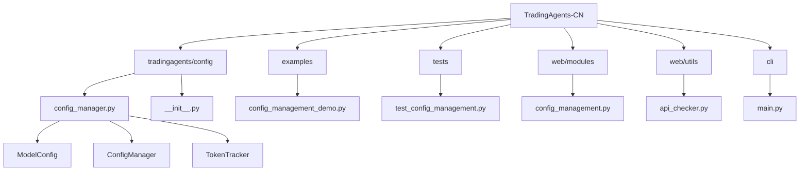
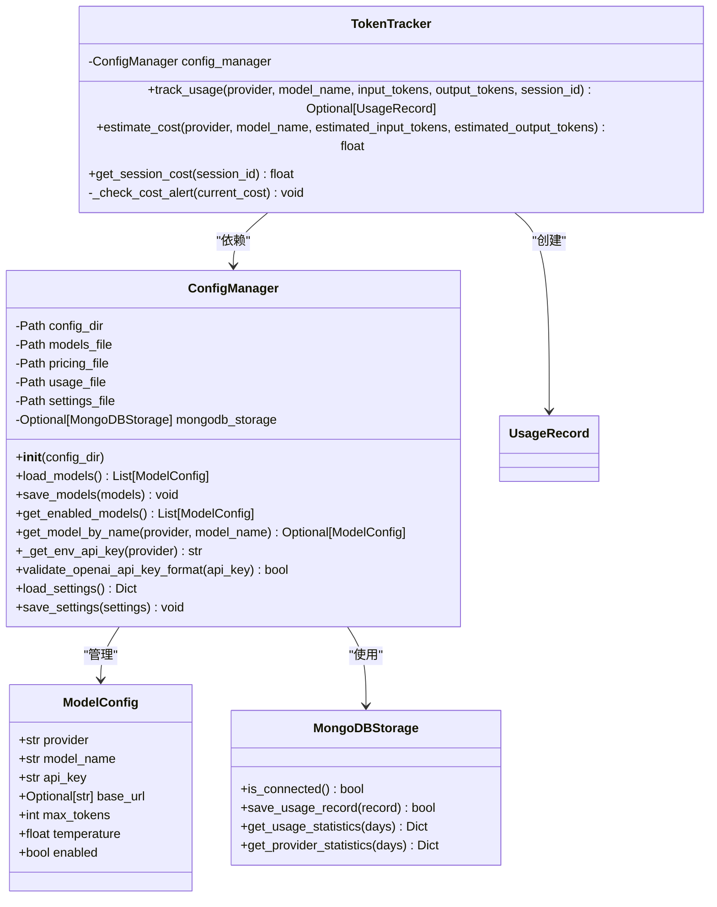
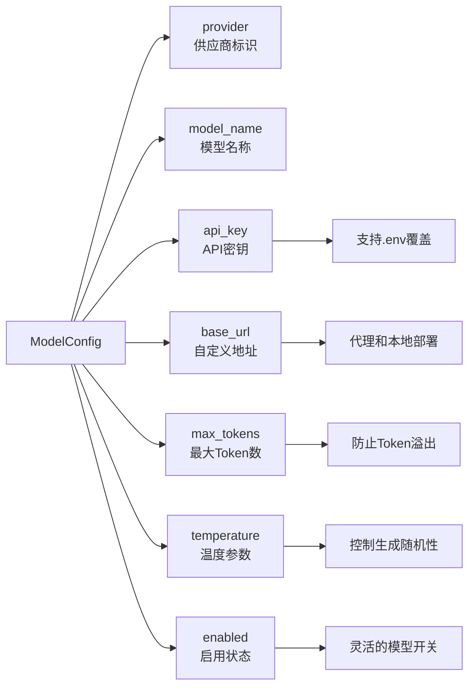
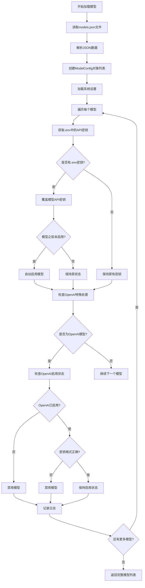
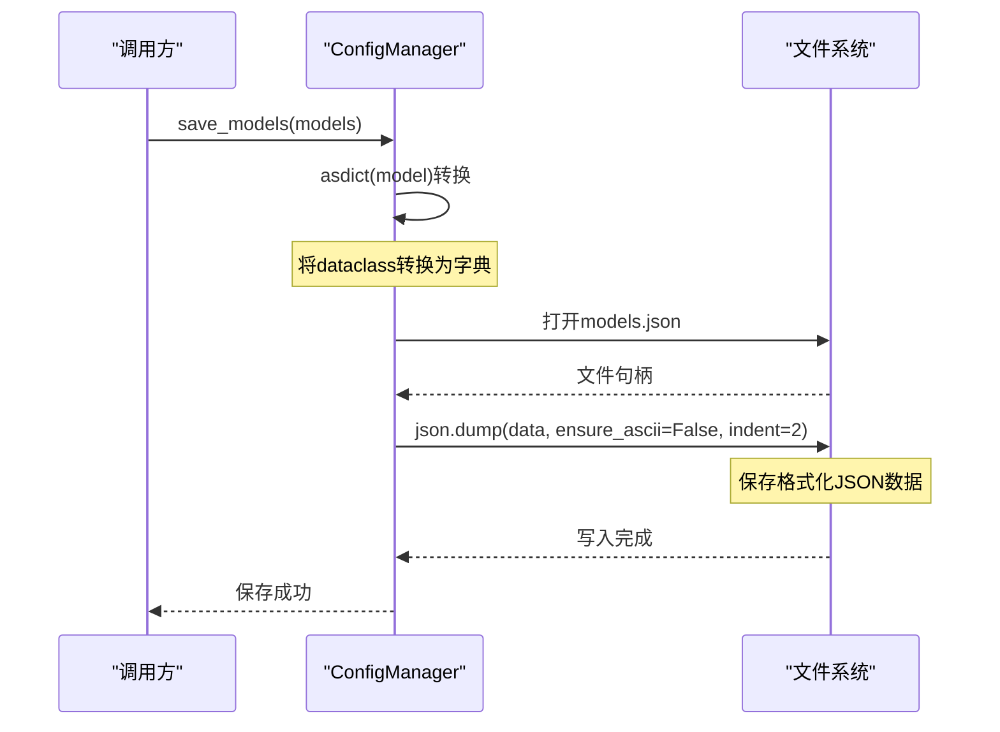
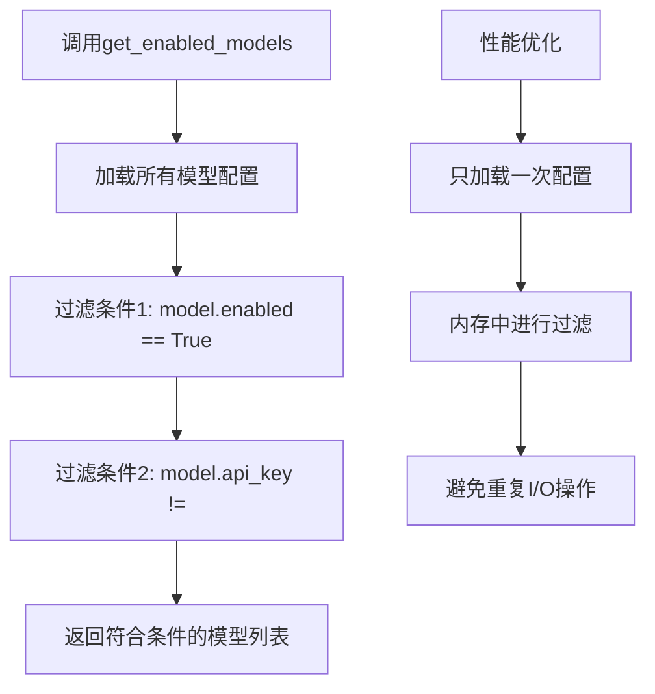
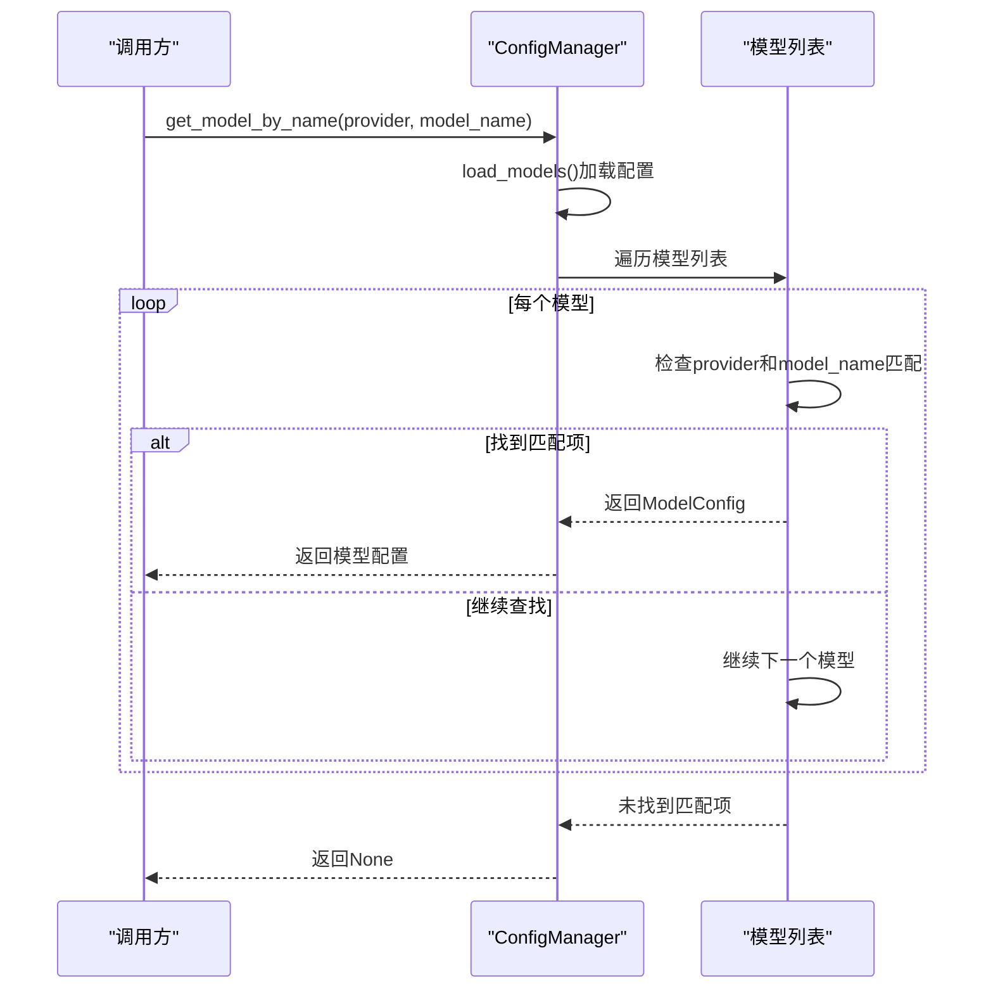
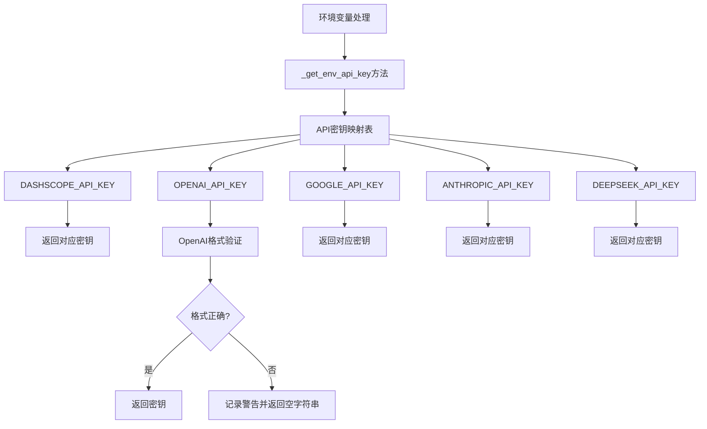
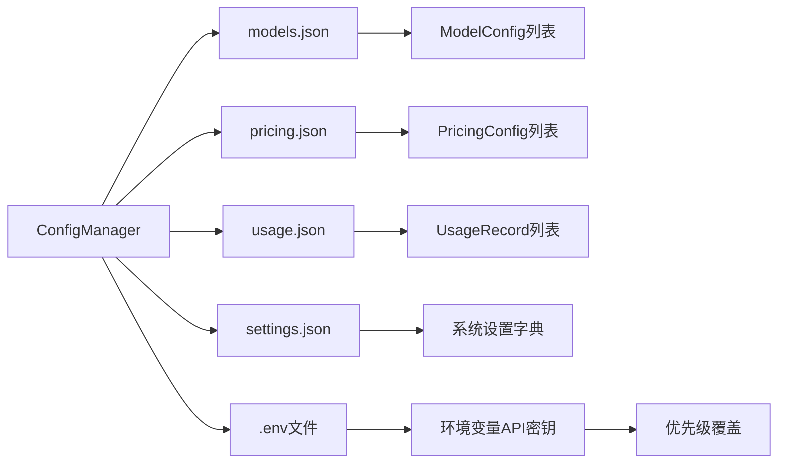

# 模型配置管理

<cite>
**本文档中引用的文件**
- [config_manager.py](file://tradingagents/config/config_manager.py)
- [config_management_demo.py](file://examples/config_management_demo.py)
- [test_config_management.py](file://tests/test_config_management.py)
- [config_management.py](file://web/modules/config_management.py)
- [api_checker.py](file://web/utils/api_checker.py)
- [sidebar.py](file://web/components/sidebar.py)
- [main.py](file://cli/main.py)
</cite>

## 目录
1. [简介](#简介)
2. [项目结构](#项目结构)
3. [核心组件](#核心组件)
4. [架构概览](#架构概览)
5. [详细组件分析](#详细组件分析)
6. [依赖关系分析](#依赖关系分析)
7. [性能考虑](#性能考虑)
8. [故障排除指南](#故障排除指南)
9. [结论](#结论)

## 简介

ConfigManager是TradingAgents-CN系统中的核心配置管理组件，专门负责管理多LLM提供商的模型配置。该系统支持多种AI服务提供商（包括阿里百炼、OpenAI、Google、Anthropic、DeepSeek等），提供了完整的模型配置生命周期管理功能，包括配置加载、保存、验证和查询。

系统采用JSON文件存储配置数据，同时支持.env环境变量覆盖机制，确保配置的安全性和灵活性。通过统一的数据结构和标准化的接口，ConfigManager为整个系统提供了可靠的模型配置管理基础设施。

## 项目结构

**图表来源**
- [config_manager.py](file://tradingagents/config/config_manager.py#L1-L727)
- [config_management_demo.py](file://examples/config_management_demo.py#L1-L258)

**章节来源**
- [config_manager.py](file://tradingagents/config/config_manager.py#L1-L50)
- [config_management_demo.py](file://examples/config_management_demo.py#L1-L30)

## 核心组件

### ModelConfig数据类

ModelConfig是模型配置的核心数据结构，定义了每个模型的所有必要属性：

| 字段名 | 类型 | 默认值 | 描述 |
|--------|------|--------|------|
| provider | str | 必需 | 供应商名称：dashscope, openai, google, anthropic, deepseek等 |
| model_name | str | 必需 | 模型的具体名称 |
| api_key | str | "" | API密钥，支持.env文件覆盖 |
| base_url | Optional[str] | None | 自定义API地址，用于代理或本地部署 |
| max_tokens | int | 4000 | 最大token数量限制 |
| temperature | float | 0.7 | 生成随机性参数，范围0.0-2.0 |
| enabled | bool | True | 是否启用该模型 |

### ConfigManager类

ConfigManager是配置管理的核心控制器，提供以下主要功能：

- **配置文件管理**：models.json、pricing.json、usage.json、settings.json
- **环境变量集成**：支持.env文件中的API密钥覆盖
- **模型生命周期管理**：加载、保存、验证、查询模型配置
- **成本跟踪**：记录和计算Token使用成本
- **使用统计**：提供详细的使用情况统计

**章节来源**
- [config_manager.py](file://tradingagents/config/config_manager.py#L31-L39)
- [config_manager.py](file://tradingagents/config/config_manager.py#L65-L84)

## 架构概览

**图表来源**
- [config_manager.py](file://tradingagents/config/config_manager.py#L31-L39)
- [config_manager.py](file://tradingagents/config/config_manager.py#L65-L649)
- [config_manager.py](file://tradingagents/config/config_manager.py#L657-L727)

## 详细组件分析

### ModelConfig数据结构分析

ModelConfig采用了Python dataclass设计，提供了类型安全和默认值支持：

**图表来源**
- [config_manager.py](file://tradingagents/config/config_manager.py#L31-L39)

#### 字段详解

1. **provider字段**：标识模型的供应商，支持的值包括dashscope、openai、google、anthropic、deepseek等
2. **model_name字段**：具体的模型名称，如"gpt-4"、"qwen-plus-latest"、"gemini-pro"等
3. **api_key字段**：API密钥，支持.env文件中的环境变量覆盖
4. **base_url字段**：可选的自定义API地址，用于代理或本地部署场景
5. **max_tokens字段**：最大token数量限制，防止意外的高成本使用
6. **temperature字段**：控制生成随机性的参数，范围0.0-2.0
7. **enabled字段**：模型的启用状态，影响模型的选择和使用

**章节来源**
- [config_manager.py](file://tradingagents/config/config_manager.py#L31-L39)

### load_models方法实现分析

load_models方法是模型配置加载的核心逻辑，实现了复杂的优先级处理机制：

**图表来源**
- [config_manager.py](file://tradingagents/config/config_manager.py#L283-L317)

#### 关键处理逻辑

1. **优先级覆盖机制**：.env文件中的API密钥优先于JSON文件中的密钥
2. **自动启用逻辑**：当.env中存在API密钥时，自动启用对应的模型
3. **OpenAI特殊处理**：
   - 检查全局OpenAI启用状态
   - 验证API密钥格式（必须以"sk-"开头，长度51字符）
   - 格式错误时自动禁用模型

**章节来源**
- [config_manager.py](file://tradingagents/config/config_manager.py#L283-L317)

### save_models方法实现分析

save_models方法负责将内存中的模型配置持久化到JSON文件：

**图表来源**
- [config_manager.py](file://tradingagents/config/config_manager.py#L319-L326)

#### 实现特点

1. **数据转换**：使用`asdict()`将dataclass实例转换为字典
2. **编码支持**：确保非ASCII字符正确保存
3. **格式化输出**：使用indent=2提供可读的JSON格式
4. **异常处理**：捕获并记录保存过程中的错误

**章节来源**
- [config_manager.py](file://tradingagents/config/config_manager.py#L319-L326)

### get_enabled_models方法分析

get_enabled_models方法实现了智能的模型筛选逻辑：

**图表来源**
- [config_manager.py](file://tradingagents/config/config_manager.py#L506-L509)

#### 筛选逻辑

1. **启用状态检查**：只返回`enabled=True`的模型
2. **API密钥验证**：确保模型配置了有效的API密钥
3. **性能优化**：避免重复加载配置文件

**章节来源**
- [config_manager.py](file://tradingagents/config/config_manager.py#L506-L509)

### get_model_by_name方法分析

get_model_by_name方法提供了精确的模型查询功能：

**图表来源**
- [config_manager.py](file://tradingagents/config/config_manager.py#L511-L517)

#### 查询特点

1. **精确匹配**：基于provider和model_name的双重匹配
2. **早期退出**：找到第一个匹配项即返回
3. **空值处理**：未找到时返回None而非抛出异常

**章节来源**
- [config_manager.py](file://tradingagents/config/config_manager.py#L511-L517)

### 环境变量处理机制

ConfigManager实现了强大的环境变量处理机制：

**图表来源**
- [config_manager.py](file://tradingagents/config/config_manager.py#L95-L114)

#### OpenAI密钥验证

OpenAI API密钥具有严格的格式要求：

| 验证规则 | 描述 | 示例 |
|----------|------|------|
| 前缀检查 | 必须以"sk-"开头 | sk-abc123... |
| 长度验证 | 总长度必须为51字符 | sk- + 48位字符 |
| 格式匹配 | 只允许字母数字字符 | ^sk-[A-Za-z0-9]{48}$ |
| 异常处理 | 格式错误自动禁用 | 记录警告日志 |

**章节来源**
- [config_manager.py](file://tradingagents/config/config_manager.py#L116-L147)

## 依赖关系分析

### 配置文件依赖关系

**图表来源**
- [config_manager.py](file://tradingagents/config/config_manager.py#L69-L75)

### 外部依赖

1. **Python标准库**：json、os、re、datetime、typing、dataclasses
2. **第三方库**：python-dotenv（.env文件处理）
3. **可选依赖**：pymongo（MongoDB存储）

**章节来源**
- [config_manager.py](file://tradingagents/config/config_manager.py#L1-L25)

## 性能考虑

### 配置加载优化

1. **延迟加载**：只在需要时加载配置文件
2. **内存缓存**：避免重复的文件I/O操作
3. **批量处理**：一次性加载所有相关配置

### 成本计算优化

1. **索引策略**：基于provider和model_name的快速查找
2. **缓存机制**：避免重复的成本计算
3. **精度控制**：使用round()函数控制计算精度

### 并发安全性

1. **文件锁**：确保配置文件的原子性写入
2. **异常隔离**：单个配置错误不影响整体系统
3. **资源清理**：及时释放不再使用的资源

## 故障排除指南

### 常见问题及解决方案

#### API密钥配置问题

**问题**：模型无法使用，提示API密钥无效
**解决方案**：
1. 检查.env文件中的API密钥配置
2. 验证OpenAI密钥格式（必须以"sk-"开头）
3. 确认模型的enabled状态为True

#### 配置文件损坏

**问题**：加载配置时出现JSON解析错误
**解决方案**：
1. 备份当前配置文件
2. 删除损坏的JSON文件
3. 系统会自动生成默认配置

#### MongoDB存储问题

**问题**：使用MongoDB存储时连接失败
**解决方案**：
1. 检查MONGODB_CONNECTION_STRING环境变量
2. 验证MongoDB服务是否正常运行
3. 确认网络连接和防火墙设置

**章节来源**
- [config_manager.py](file://tradingagents/config/config_manager.py#L116-L147)
- [config_manager.py](file://tradingagents/config/config_manager.py#L149-L176)

## 结论

ConfigManager作为TradingAgents-CN系统的核心配置管理组件，提供了完整而灵活的模型配置管理功能。通过精心设计的数据结构、智能的优先级处理机制和完善的错误处理，该系统能够有效地管理多LLM提供商的复杂配置需求。

### 主要优势

1. **统一接口**：为所有LLM提供商提供一致的配置管理体验
2. **灵活配置**：支持JSON文件和环境变量的混合配置方式
3. **智能验证**：自动检测和处理配置错误
4. **性能优化**：采用多种优化策略提升系统性能
5. **扩展性强**：易于添加新的LLM提供商和配置选项

### 应用建议

1. **定期备份**：定期备份配置文件以防数据丢失
2. **监控成本**：利用成本跟踪功能监控Token使用情况
3. **安全配置**：妥善保管API密钥，避免泄露
4. **版本管理**：对配置文件进行版本控制管理

通过合理使用ConfigManager的各项功能，开发者可以构建稳定、高效的多LLM应用系统，为用户提供优质的AI服务体验。