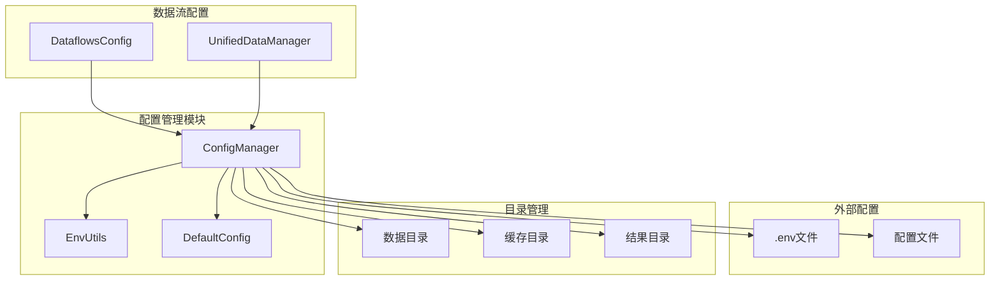
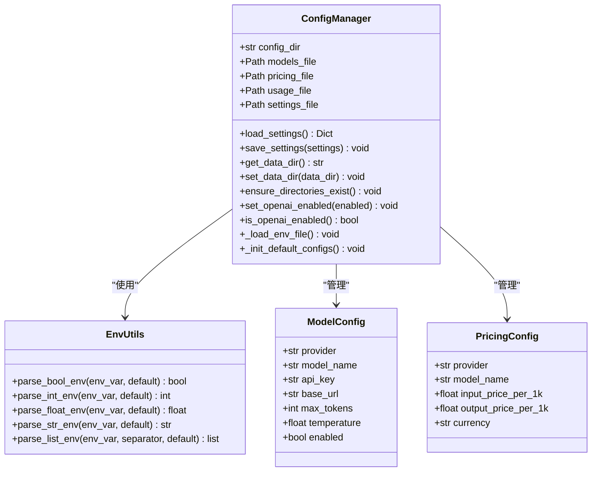
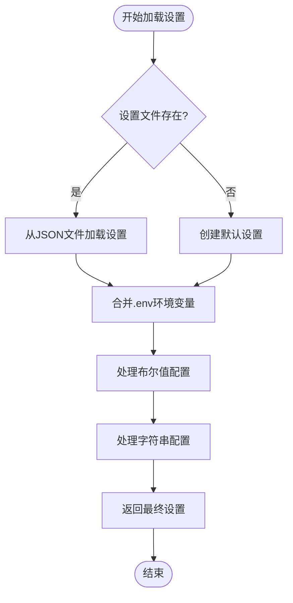
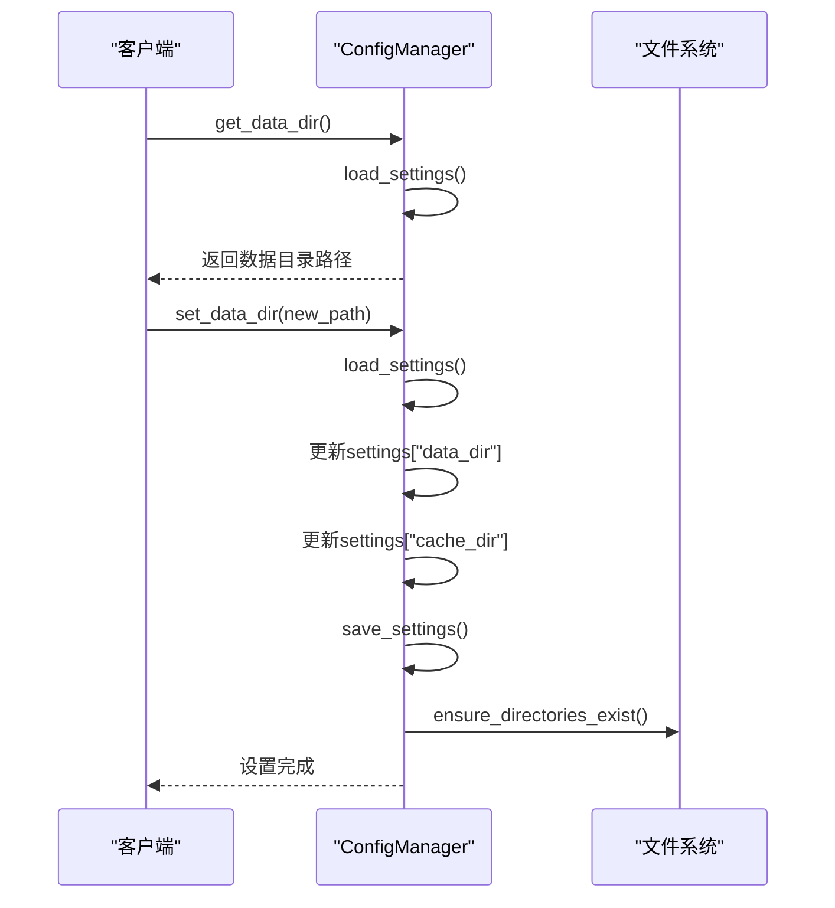
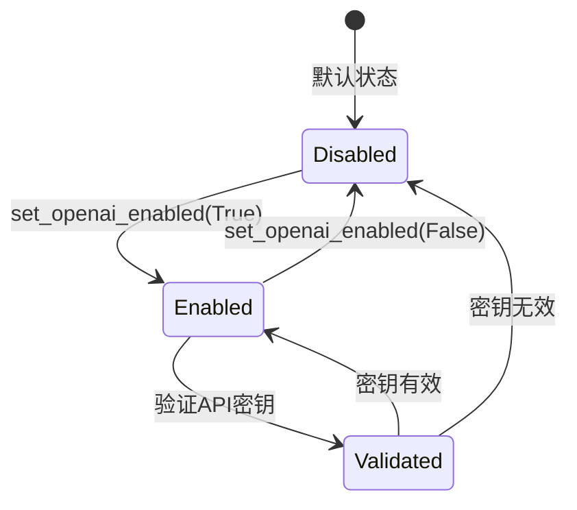
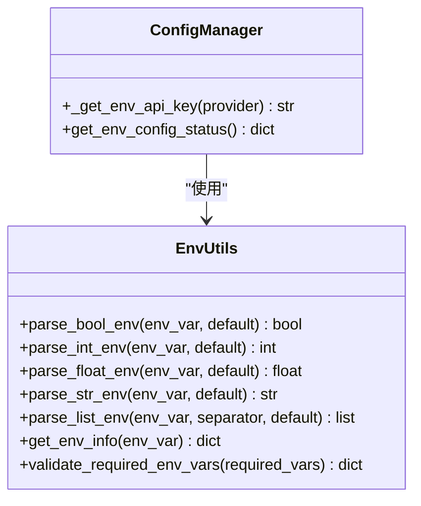
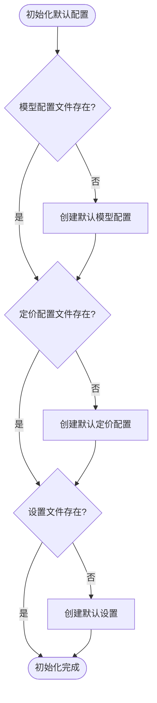
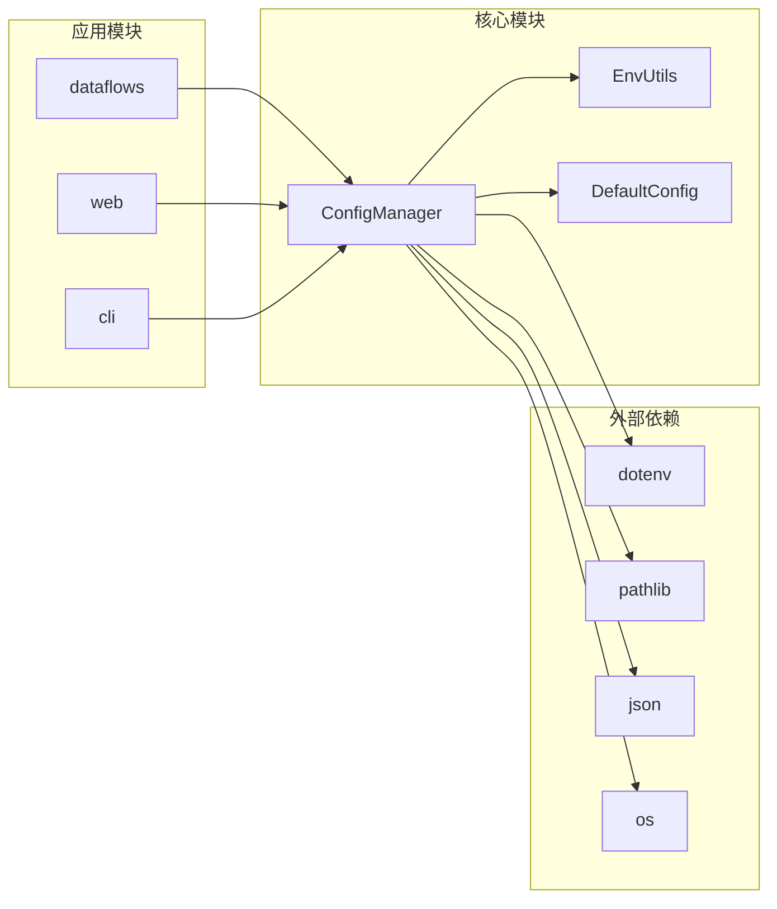

# 系统设置与目录管理

<cite>
**本文档中引用的文件**
- [config_manager.py](file://tradingagents/config/config_manager.py)
- [env_utils.py](file://tradingagents/config/env_utils.py)
- [default_config.py](file://tradingagents/default_config.py)
- [data_dir_config_demo.py](file://examples/data_dir_config_demo.py)
- [unified_data_manager.py](file://scripts/unified_data_manager.py)
- [data_config.py](file://utils/data_config.py)
- [config.py](file://tradingagents/dataflows/config.py)
- [test_config_management.py](file://tests/test_config_management.py)
</cite>

## 目录
1. [简介](#简介)
2. [项目结构概览](#项目结构概览)
3. [核心组件分析](#核心组件分析)
4. [架构概览](#架构概览)
5. [详细组件分析](#详细组件分析)
6. [依赖关系分析](#依赖关系分析)
7. [性能考虑](#性能考虑)
8. [故障排除指南](#故障排除指南)
9. [结论](#结论)

## 简介

TradingAgents-CN项目中的ConfigManager是一个全面的配置管理系统，负责管理API密钥、模型配置、费率设置以及系统目录结构。该系统提供了灵活的配置加载机制，支持.env文件中的环境变量配置，并实现了智能的配置覆盖策略。

ConfigManager的核心功能包括：
- 系统设置的加载和保存
- 数据目录的动态管理
- OpenAI模型的启用状态控制
- 环境变量的智能解析和应用
- 目录结构的自动创建和维护

## 项目结构概览

**图表来源**
- [config_manager.py](file://tradingagents/config/config_manager.py#L1-L50)
- [env_utils.py](file://tradingagents/config/env_utils.py#L1-L30)
- [default_config.py](file://tradingagents/default_config.py#L1-L28)

**章节来源**
- [config_manager.py](file://tradingagents/config/config_manager.py#L1-L100)
- [default_config.py](file://tradingagents/default_config.py#L1-L28)

## 核心组件分析

ConfigManager类是整个配置系统的核心，它继承了以下关键职责：

### 主要属性和方法

| 属性/方法 | 类型 | 描述 |
|-----------|------|------|
| `_config_dir` | str | 配置文件存储目录 |
| `models_file` | Path | 模型配置文件路径 |
| `pricing_file` | Path | 定价配置文件路径 |
| `usage_file` | Path | 使用记录文件路径 |
| `settings_file` | Path | 系统设置文件路径 |

### 配置加载优先级

系统采用多层配置加载策略，具有明确的优先级顺序：

1. **环境变量** (最高优先级)
2. **代码设置**
3. **配置文件**
4. **默认值** (最低优先级)

**章节来源**
- [config_manager.py](file://tradingagents/config/config_manager.py#L40-L80)
- [config_manager.py](file://tradingagents/config/config_manager.py#L450-L520)

## 架构概览

**图表来源**
- [config_manager.py](file://tradingagents/config/config_manager.py#L25-L80)
- [env_utils.py](file://tradingagents/config/env_utils.py#L10-L50)

## 详细组件分析

### load_settings 和 save_settings 方法

这两个核心方法实现了配置的持久化存储和加载功能。

#### load_settings 方法详解

**图表来源**
- [config_manager.py](file://tradingagents/config/config_manager.py#L450-L520)

#### 配置合并机制

系统通过智能合并策略实现配置覆盖：

1. **环境变量优先**：`.env`文件中的配置具有最高优先级
2. **条件覆盖**：仅当环境变量存在且非空时才覆盖
3. **类型安全**：保持配置类型的完整性

**章节来源**
- [config_manager.py](file://tradingagents/config/config_manager.py#L450-L520)

### 数据目录管理

#### get_data_dir 和 set_data_dir 方法

这两个方法提供了灵活的数据目录管理功能：

**图表来源**
- [config_manager.py](file://tradingagents/config/config_manager.py#L650-L680)

#### 目录结构保证

`ensure_directories_exist`方法确保所有必要的目录结构都得到正确创建：

| 目录类型 | 路径模式 | 用途 |
|----------|----------|------|
| 数据目录 | `{data_dir}` | 存储主要数据文件 |
| 缓存目录 | `{data_dir}/cache` | 存储临时缓存文件 |
| 结果目录 | `{results_dir}` | 存储分析结果 |
| 新闻数据 | `{data_dir}/finnhub_data/news_data` | 存储新闻数据 |
| 内幕交易 | `{data_dir}/finnhub_data/insider_transactions` | 存储内幕交易数据 |

**章节来源**
- [config_manager.py](file://tradingagents/config/config_manager.py#L680-L700)

### OpenAI 模型控制

#### 启用状态管理

**图表来源**
- [config_manager.py](file://tradingagents/config/config_manager.py#L630-L650)

#### API密钥验证

系统实现了严格的OpenAI API密钥格式验证：

- **格式要求**：必须以'sk-'开头
- **长度验证**：标准密钥长度为51字符
- **内容验证**：只允许字母数字字符

**章节来源**
- [config_manager.py](file://tradingagents/config/config_manager.py#L80-L120)
- [config_manager.py](file://tradingagents/config/config_manager.py#L630-L650)

### 环境变量处理

#### EnvUtils 工具类

EnvUtils提供了强大的环境变量解析功能：

**图表来源**
- [env_utils.py](file://tradingagents/config/env_utils.py#L10-L100)
- [config_manager.py](file://tradingagents/config/config_manager.py#L120-L150)

#### 支持的环境变量类型

| 函数 | 支持格式 | 默认值 | 示例 |
|------|----------|--------|------|
| `parse_bool_env` | true/false, 1/0, yes/no | false | `OPENAI_ENABLED=true` |
| `parse_int_env` | 整数字符串 | 0 | `MAX_USAGE_RECORDS=10000` |
| `parse_float_env` | 浮点数字符串 | 0.0 | `COST_ALERT_THRESHOLD=100.0` |
| `parse_str_env` | 字符串 | "" | `LOG_LEVEL=DEBUG` |
| `parse_list_env` | 逗号分隔 | [] | `ENABLED_PROVIDERS=openai,dashscope` |

**章节来源**
- [env_utils.py](file://tradingagents/config/env_utils.py#L10-L150)

### 默认配置初始化

#### _init_default_configs 方法

该方法负责创建缺失的默认配置文件：

**图表来源**
- [config_manager.py](file://tradingagents/config/config_manager.py#L180-L250)

#### 默认配置内容

系统预设了多个默认配置：

| 配置项 | 默认值 | 描述 |
|--------|--------|------|
| `default_provider` | "dashscope" | 默认AI提供商 |
| `default_model` | "qwen-turbo" | 默认模型名称 |
| `enable_cost_tracking` | true | 是否启用成本跟踪 |
| `openai_enabled` | false | OpenAI模型启用状态 |
| `auto_create_dirs` | true | 自动创建目录 |

**章节来源**
- [config_manager.py](file://tradingagents/config/config_manager.py#L180-L250)

## 依赖关系分析

**图表来源**
- [config_manager.py](file://tradingagents/config/config_manager.py#L1-L20)
- [env_utils.py](file://tradingagents/config/env_utils.py#L1-L10)

**章节来源**
- [config_manager.py](file://tradingagents/config/config_manager.py#L1-L30)
- [env_utils.py](file://tradingagents/config/env_utils.py#L1-L20)

## 性能考虑

### 配置加载优化

1. **延迟加载**：配置文件仅在需要时才加载
2. **缓存机制**：频繁访问的配置信息会被缓存
3. **最小化I/O**：减少不必要的文件读写操作

### 目录操作优化

1. **批量创建**：一次性创建所有必要的目录层级
2. **存在性检查**：避免重复创建已存在的目录
3. **异常处理**：优雅处理目录创建失败的情况

## 故障排除指南

### 常见问题及解决方案

#### 配置文件损坏

**症状**：`load_settings()`方法抛出JSON解析异常
**解决方案**：
1. 检查`settings.json`文件格式
2. 从备份恢复配置文件
3. 重新初始化默认配置

#### 目录权限问题

**症状**：`ensure_directories_exist()`方法失败
**解决方案**：
1. 检查目标目录的写入权限
2. 使用管理员权限运行程序
3. 更改配置的目录路径

#### 环境变量未生效

**症状**：设置的环境变量没有被系统识别
**解决方案**：
1. 确认环境变量名称正确
2. 重启应用程序使环境变量生效
3. 检查环境变量的作用域

**章节来源**
- [config_manager.py](file://tradingagents/config/config_manager.py#L450-L520)
- [config_manager.py](file://tradingagents/config/config_manager.py#L680-L700)

## 结论

TradingAgents-CN的ConfigManager提供了一个全面而灵活的配置管理系统。通过多层次的配置加载机制、智能的环境变量处理和完善的目录管理功能，该系统能够满足不同部署场景的需求。

### 主要优势

1. **灵活性**：支持多种配置方式和优先级设置
2. **可靠性**：完善的错误处理和恢复机制
3. **可扩展性**：模块化设计便于功能扩展
4. **易用性**：直观的API和详细的文档

### 最佳实践建议

1. **配置分离**：将敏感配置（如API密钥）放在`.env`文件中
2. **定期备份**：定期备份配置文件以防数据丢失
3. **监控变更**：监控配置文件的修改历史
4. **文档维护**：及时更新配置相关的文档

通过合理使用ConfigManager的各项功能，开发者可以构建更加稳定和可维护的应用程序。