# 配置管理器详解

<cite>
**本文档引用的文件**
- [config_manager.py](file://tradingagents/config/config_manager.py)
- [__init__.py](file://tradingagents/config/__init__.py)
- [database_config.py](file://tradingagents/config/database_config.py)
- [env_utils.py](file://tradingagents/config/env_utils.py)
- [mongodb_storage.py](file://tradingagents/config/mongodb_storage.py)
- [config_management_demo.py](file://examples/config_management_demo.py)
- [token_tracking_demo.py](file://examples/token_tracking_demo.py)
- [test_config_management.py](file://tests/test_config_management.py)
</cite>

## 目录
1. [简介](#简介)
2. [项目结构概览](#项目结构概览)
3. [核心数据类设计](#核心数据类设计)
4. [ConfigManager架构分析](#configmanager架构分析)
5. [初始化流程详解](#初始化流程详解)
6. [环境变量处理机制](#环境变量处理机制)
7. [配置管理功能](#配置管理功能)
8. [成本跟踪系统](#成本跟踪系统)
9. [TokenTracker集成](#tokentracker集成)
10. [数据库存储支持](#数据库存储支持)
11. [最佳实践指南](#最佳实践指南)
12. [总结](#总结)

## 简介

ConfigManager是TradingAgents-CN系统的核心配置管理组件，负责统一管理API密钥、模型配置、定价策略和使用统计等功能。该系统采用模块化设计，支持JSON文件存储和MongoDB分布式存储两种模式，提供了完整的成本跟踪和使用统计功能。

## 项目结构概览

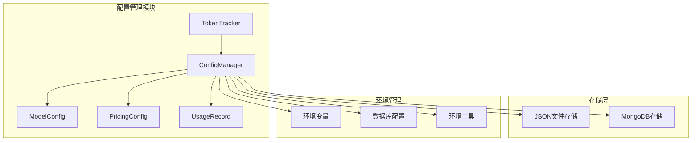
```mermaid
graph TB
subgraph "配置管理模块"
CM[ConfigManager]
MT[TokenTracker]
MC[ModelConfig]
PC[PricingConfig]
UR[UsageRecord]
end
subgraph "存储层"
JSON[JSON文件存储]
MDB[MongoDB存储]
end
subgraph "环境管理"
ENV[环境变量]
DBC[数据库配置]
EU[环境工具]
end
CM --> JSON
CM --> MDB
MT --> CM
CM --> MC
CM --> PC
CM --> UR
CM --> ENV
CM --> DBC
CM --> EU
```

**图表来源**
- [config_manager.py](file://tradingagents/config/config_manager.py#L52-L103)
- [mongodb_storage.py](file://tradingagents/config/mongodb_storage.py#L25-L61)

**章节来源**
- [config_manager.py](file://tradingagents/config/config_manager.py#L1-L50)
- [__init__.py](file://tradingagents/config/__init__.py#L1-L14)

## 核心数据类设计

### ModelConfig数据类

ModelConfig类定义了LLM模型的基本配置信息，支持多种AI服务提供商的统一管理。

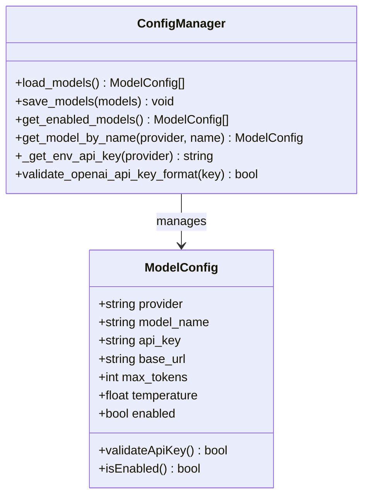
```mermaid
classDiagram
class ModelConfig {
+string provider
+string model_name
+string api_key
+string base_url
+int max_tokens
+float temperature
+bool enabled
+validateApiKey() bool
+isEnabled() bool
}
class ConfigManager {
+load_models() ModelConfig[]
+save_models(models) void
+get_enabled_models() ModelConfig[]
+get_model_by_name(provider, name) ModelConfig
+_get_env_api_key(provider) string
+validate_openai_api_key_format(key) bool
}
ConfigManager --> ModelConfig : manages
```

**图表来源**
- [config_manager.py](file://tradingagents/config/config_manager.py#L25-L35)

#### 关键特性

| 属性 | 类型 | 描述 | 默认值 |
|------|------|------|--------|
| provider | string | AI服务提供商（dashscope、openai、google等） | 必填 |
| model_name | string | 模型名称 | 必填 |
| api_key | string | API密钥（可选） | "" |
| base_url | string | 自定义API地址 | None |
| max_tokens | int | 最大token数 | 4000 |
| temperature | float | 生成温度参数 | 0.7 |
| enabled | bool | 是否启用模型 | True |

### PricingConfig数据类

PricingConfig类管理不同LLM提供商的定价策略，支持多货币计价。

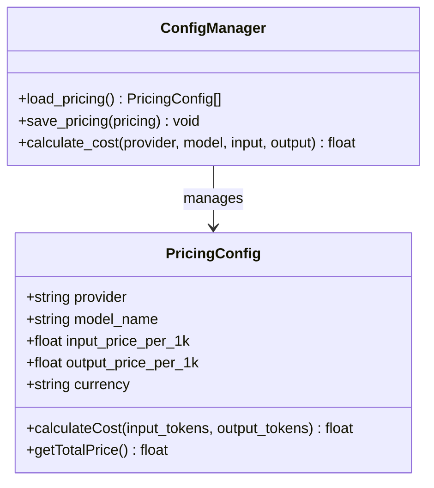
```mermaid
classDiagram
class PricingConfig {
+string provider
+string model_name
+float input_price_per_1k
+float output_price_per_1k
+string currency
+calculateCost(input_tokens, output_tokens) float
+getTotalPrice() float
}
class ConfigManager {
+load_pricing() PricingConfig[]
+save_pricing(pricing) void
+calculate_cost(provider, model, input, output) float
}
ConfigManager --> PricingConfig : manages
```

**图表来源**
- [config_manager.py](file://tradingagents/config/config_manager.py#L37-L44)

#### 定价计算机制

| 计算公式 | 说明 | 示例 |
|----------|------|------|
| 输入成本 | (input_tokens / 1000) × input_price_per_1k | 1000 tokens × 0.002 = 0.002 |
| 输出成本 | (output_tokens / 1000) × output_price_per_1k | 500 tokens × 0.006 = 0.003 |
| 总成本 | 输入成本 + 输出成本 | 0.002 + 0.003 = 0.005 |

### UsageRecord数据类

UsageRecord类记录每次LLM调用的详细使用信息，支持成本追踪和统计分析。

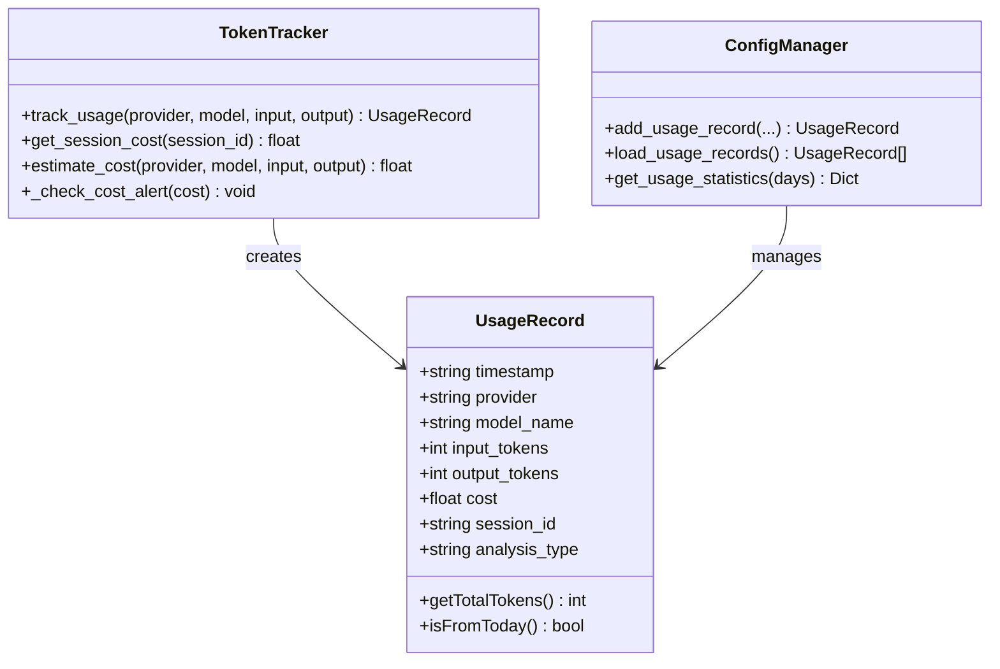
```mermaid
classDiagram
class UsageRecord {
+string timestamp
+string provider
+string model_name
+int input_tokens
+int output_tokens
+float cost
+string session_id
+string analysis_type
+getTotalTokens() int
+isFromToday() bool
}
class TokenTracker {
+track_usage(provider, model, input, output) UsageRecord
+get_session_cost(session_id) float
+estimate_cost(provider, model, input, output) float
+_check_cost_alert(cost) void
}
class ConfigManager {
+add_usage_record(...) UsageRecord
+load_usage_records() UsageRecord[]
+get_usage_statistics(days) Dict
}
TokenTracker --> UsageRecord : creates
ConfigManager --> UsageRecord : manages
```

**图表来源**
- [config_manager.py](file://tradingagents/config/config_manager.py#L52-L60)

**章节来源**
- [config_manager.py](file://tradingagents/config/config_manager.py#L25-L60)

## ConfigManager架构分析

### 类层次结构

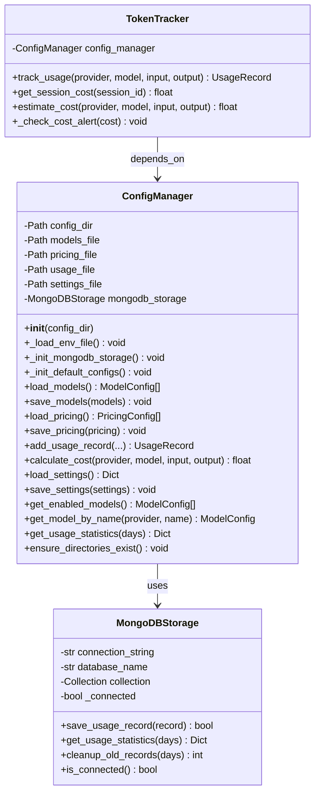
```mermaid
classDiagram
class ConfigManager {
-Path config_dir
-Path models_file
-Path pricing_file
-Path usage_file
-Path settings_file
-MongoDBStorage mongodb_storage
+__init__(config_dir)
+_load_env_file() void
+_init_mongodb_storage() void
+_init_default_configs() void
+load_models() ModelConfig[]
+save_models(models) void
+load_pricing() PricingConfig[]
+save_pricing(pricing) void
+add_usage_record(...) UsageRecord
+calculate_cost(provider, model, input, output) float
+load_settings() Dict
+save_settings(settings) void
+get_enabled_models() ModelConfig[]
+get_model_by_name(provider, name) ModelConfig
+get_usage_statistics(days) Dict
+ensure_directories_exist() void
}
class TokenTracker {
-ConfigManager config_manager
+track_usage(provider, model, input, output) UsageRecord
+get_session_cost(session_id) float
+estimate_cost(provider, model, input, output) float
+_check_cost_alert(cost) void
}
class MongoDBStorage {
-str connection_string
-str database_name
-Collection collection
-bool _connected
+save_usage_record(record) bool
+get_usage_statistics(days) Dict
+cleanup_old_records(days) int
+is_connected() bool
}
ConfigManager --> MongoDBStorage : uses
TokenTracker --> ConfigManager : depends_on
```

**图表来源**
- [config_manager.py](file://tradingagents/config/config_manager.py#L55-L726)
- [mongodb_storage.py](file://tradingagents/config/mongodb_storage.py#L25-L101)

### 核心功能模块

ConfigManager采用职责分离原则，将功能划分为以下模块：

1. **配置加载模块**：处理JSON文件读写和环境变量合并
2. **模型管理模块**：管理LLM模型配置和API密钥
3. **定价管理模块**：维护不同提供商的定价策略
4. **使用统计模块**：记录和分析Token使用情况
5. **存储抽象模块**：支持多种存储后端

**章节来源**
- [config_manager.py](file://tradingagents/config/config_manager.py#L55-L103)

## 初始化流程详解

### 初始化序列图

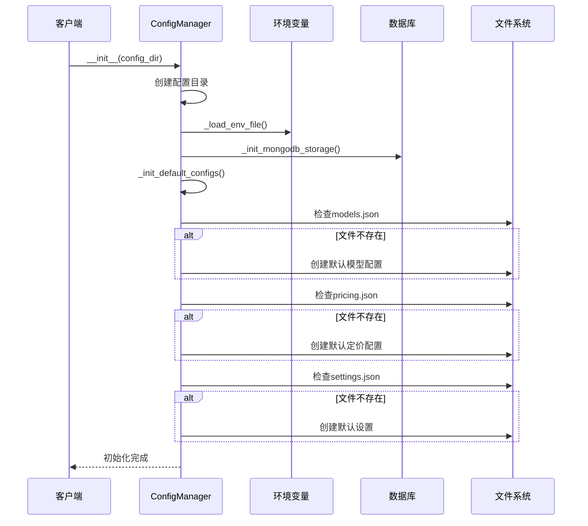
```mermaid
sequenceDiagram
participant Client as 客户端
participant CM as ConfigManager
participant Env as 环境变量
participant DB as 数据库
participant FS as 文件系统
Client->>CM : __init__(config_dir)
CM->>CM : 创建配置目录
CM->>Env : _load_env_file()
CM->>DB : _init_mongodb_storage()
CM->>CM : _init_default_configs()
CM->>FS : 检查models.json
alt 文件不存在
CM->>FS : 创建默认模型配置
end
CM->>FS : 检查pricing.json
alt 文件不存在
CM->>FS : 创建默认定价配置
end
CM->>FS : 检查settings.json
alt 文件不存在
CM->>FS : 创建默认设置
end
CM-->>Client : 初始化完成
```

**图表来源**
- [config_manager.py](file://tradingagents/config/config_manager.py#L65-L103)

### 目录结构初始化

ConfigManager在初始化时会创建以下目录结构：

| 目录类型 | 路径模板 | 用途 |
|----------|----------|------|
| 配置目录 | `{config_dir}` | 存储所有配置文件 |
| 数据目录 | `{data_dir}` | 存储分析数据和缓存 |
| 缓存目录 | `{data_dir}/cache` | 存储临时缓存文件 |
| 结果目录 | `{results_dir}` | 存储分析结果文件 |
| Finnhub数据 | `{data_dir}/finnhub_data` | 存储金融数据 |

### 默认配置创建

系统在首次运行时会自动创建以下默认配置：

#### 默认模型配置

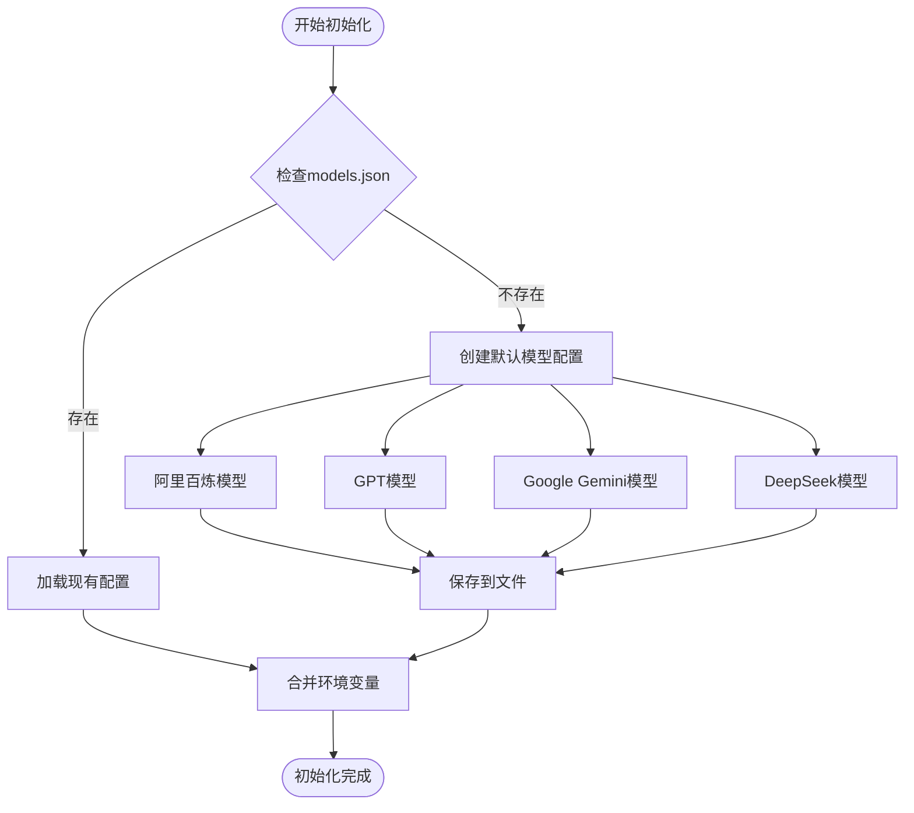
```mermaid
flowchart TD
Start([开始初始化]) --> CheckModels{检查models.json}
CheckModels --> |不存在| CreateModels[创建默认模型配置]
CheckModels --> |存在| LoadExisting[加载现有配置]
CreateModels --> DashScope[阿里百炼模型]
CreateModels --> OpenAI[GPT模型]
CreateModels --> Google[Google Gemini模型]
CreateModels --> DeepSeek[DeepSeek模型]
DashScope --> SaveModels[保存到文件]
OpenAI --> SaveModels
Google --> SaveModels
DeepSeek --> SaveModels
LoadExisting --> MergeEnv[合并环境变量]
SaveModels --> MergeEnv
MergeEnv --> Complete([初始化完成])
```

**图表来源**
- [config_manager.py](file://tradingagents/config/config_manager.py#L125-L200)

**章节来源**
- [config_manager.py](file://tradingagents/config/config_manager.py#L65-L103)
- [config_manager.py](file://tradingagents/config/config_manager.py#L125-L200)

## 环境变量处理机制

### 向后兼容的.env文件加载

ConfigManager实现了智能的环境变量加载机制，确保向后兼容性：

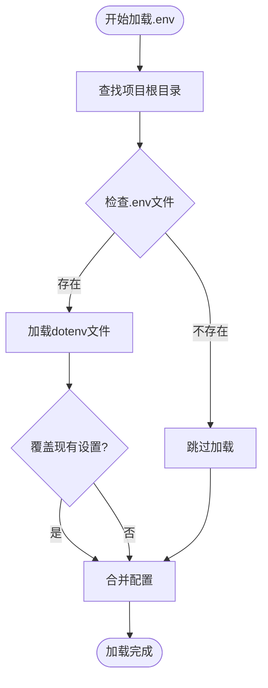
```mermaid
flowchart TD
Start([开始加载.env]) --> FindRoot[查找项目根目录]
FindRoot --> CheckFile{检查.env文件}
CheckFile --> |存在| LoadDotenv[加载dotenv文件]
CheckFile --> |不存在| Skip[跳过加载]
LoadDotenv --> Override{覆盖现有设置?}
Override --> |是| MergeSettings[合并配置]
Override --> |否| MergeSettings
Skip --> MergeSettings
MergeSettings --> Complete([加载完成])
```

**图表来源**
- [config_manager.py](file://tradingagents/config/config_manager.py#L95-L103)

### API密钥获取机制

系统支持多种AI服务提供商的API密钥获取：

| 提供商 | 环境变量 | 格式要求 | 验证规则 |
|--------|----------|----------|----------|
| DashScope | DASHSCOPE_API_KEY | 字符串 | 无格式要求 |
| OpenAI | OPENAI_API_KEY | sk-开头 | 必须符合sk-{48位字符}格式 |
| Google | GOOGLE_API_KEY | 字符串 | 无格式要求 |
| Anthropic | ANTHROPIC_API_KEY | 字符串 | 无格式要求 |
| DeepSeek | DEEPSEEK_API_KEY | 字符串 | 无格式要求 |

### OpenAI密钥格式验证

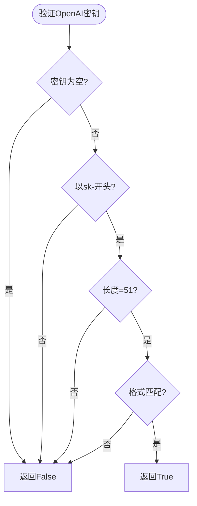
```mermaid
flowchart TD
Start([验证OpenAI密钥]) --> CheckEmpty{密钥为空?}
CheckEmpty --> |是| ReturnFalse[返回False]
CheckEmpty --> |否| CheckSkPrefix{以sk-开头?}
CheckSkPrefix --> |否| ReturnFalse
CheckSkPrefix --> |是| CheckLength{长度=51?}
CheckLength --> |否| ReturnFalse
CheckLength --> |是| CheckPattern{格式匹配?}
CheckPattern --> |否| ReturnFalse
CheckPattern --> |是| ReturnTrue[返回True]
```

**图表来源**
- [config_manager.py](file://tradingagents/config/config_manager.py#L105-L124)

**章节来源**
- [config_manager.py](file://tradingagents/config/config_manager.py#L95-L124)

## 配置管理功能

### 模型配置管理

#### load_models方法实现

load_models方法实现了智能的模型配置加载机制：

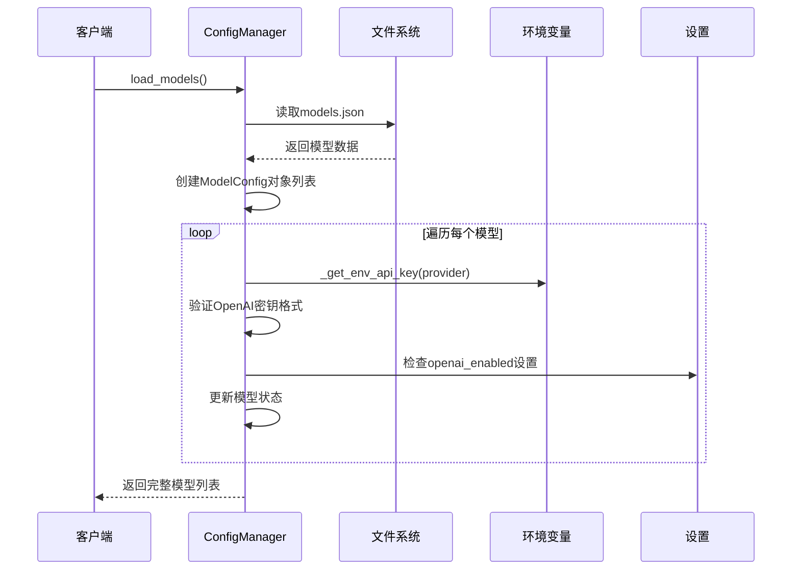
```mermaid
sequenceDiagram
participant Client as 客户端
participant CM as ConfigManager
participant FS as 文件系统
participant Env as 环境变量
participant Settings as 设置
Client->>CM : load_models()
CM->>FS : 读取models.json
FS-->>CM : 返回模型数据
CM->>CM : 创建ModelConfig对象列表
loop 遍历每个模型
CM->>Env : _get_env_api_key(provider)
CM->>CM : 验证OpenAI密钥格式
CM->>Settings : 检查openai_enabled设置
CM->>CM : 更新模型状态
end
CM-->>Client : 返回完整模型列表
```

**图表来源**
- [config_manager.py](file://tradingagents/config/config_manager.py#L201-L250)

#### save_models方法实现

save_models方法负责将模型配置持久化到JSON文件：

| 功能特性 | 实现细节 | 错误处理 |
|----------|----------|----------|
| 数据序列化 | 使用asdict转换dataclass对象 | 异常捕获 |
| 文件写入 | UTF-8编码，缩进2空格 | 写入失败重试 |
| 原子操作 | 先写入临时文件，再重命名 | 文件损坏恢复 |
| 编码支持 | 支持中文和其他Unicode字符 | 确保显示正确 |

### 定价配置管理

#### load_pricing方法实现

load_pricing方法提供稳定的定价配置加载功能：

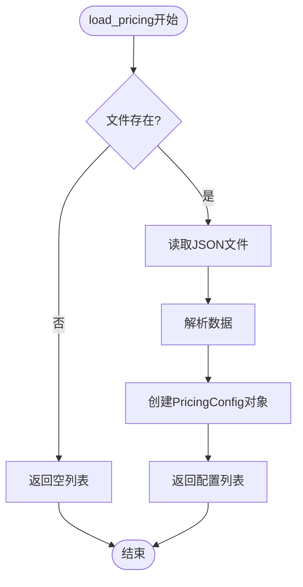
```mermaid
flowchart TD
Start([load_pricing开始]) --> CheckFile{文件存在?}
CheckFile --> |否| ReturnEmpty[返回空列表]
CheckFile --> |是| ReadFile[读取JSON文件]
ReadFile --> ParseData[解析数据]
ParseData --> CreateObjects[创建PricingConfig对象]
CreateObjects --> ReturnList[返回配置列表]
ReturnEmpty --> End([结束])
ReturnList --> End
```

**图表来源**
- [config_manager.py](file://tradingagents/config/config_manager.py#L330-L349)

#### save_pricing方法实现

save_pricing方法确保定价配置的安全持久化：

| 验证步骤 | 检查内容 | 错误处理 |
|----------|----------|----------|
| 数据完整性 | 确保所有必需字段存在 | 跳过无效配置 |
| 数值有效性 | 检查价格为正数 | 使用默认值 |
| 货币标准化 | 统一货币格式 | 自动转换 |
| 文件原子性 | 防止部分写入 | 临时文件机制 |

### 设置管理

#### load_settings方法实现

load_settings方法实现了环境变量与配置文件的智能合并：

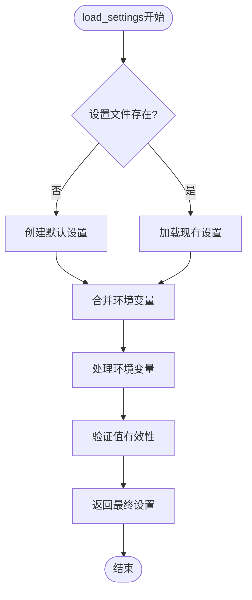
```mermaid
flowchart TD
Start([load_settings开始]) --> CheckSettings{设置文件存在?}
CheckSettings --> |否| CreateDefault[创建默认设置]
CheckSettings --> |是| LoadFile[加载现有设置]
CreateDefault --> MergeEnv[合并环境变量]
LoadFile --> MergeEnv
MergeEnv --> ProcessEnvVars[处理环境变量]
ProcessEnvVars --> ValidateValues[验证值有效性]
ValidateValues --> ReturnSettings[返回最终设置]
ReturnSettings --> End([结束])
```

**图表来源**
- [config_manager.py](file://tradingagents/config/config_manager.py#L390-L450)

**章节来源**
- [config_manager.py](file://tradingagents/config/config_manager.py#L201-L349)
- [config_manager.py](file://tradingagents/config/config_manager.py#L390-L450)

## 成本跟踪系统

### 使用记录管理

#### add_usage_record方法实现

add_usage_record方法是成本跟踪的核心入口：

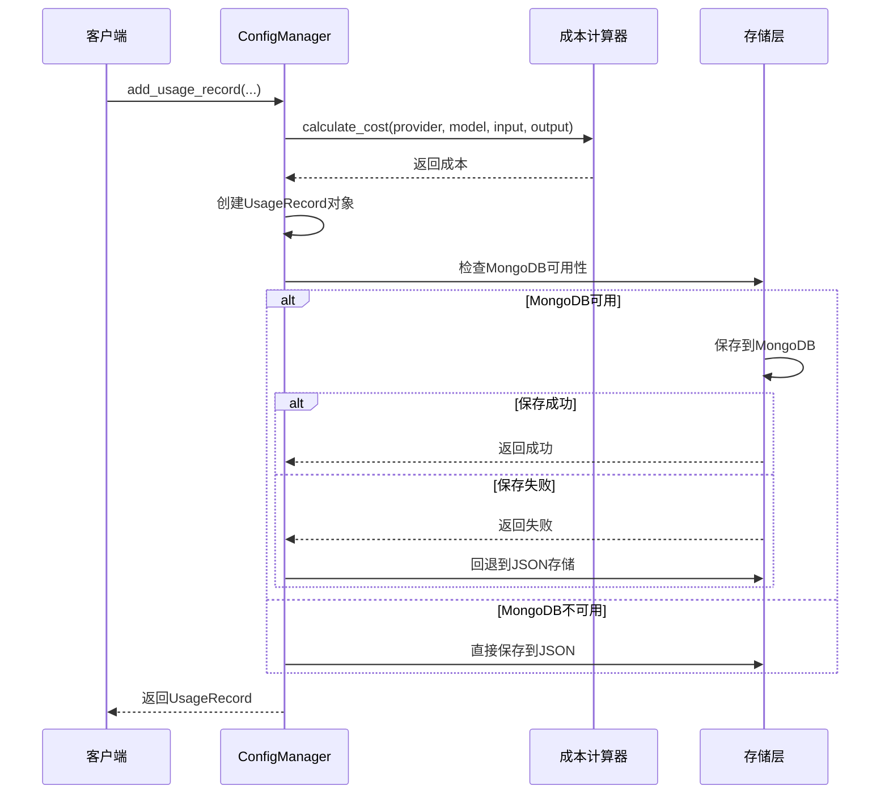
```mermaid
sequenceDiagram
participant Client as 客户端
participant CM as ConfigManager
participant Calculator as 成本计算器
participant Storage as 存储层
Client->>CM : add_usage_record(...)
CM->>Calculator : calculate_cost(provider, model, input, output)
Calculator-->>CM : 返回成本
CM->>CM : 创建UsageRecord对象
CM->>Storage : 检查MongoDB可用性
alt MongoDB可用
Storage->>Storage : 保存到MongoDB
alt 保存成功
Storage-->>CM : 返回成功
else 保存失败
Storage-->>CM : 返回失败
CM->>Storage : 回退到JSON存储
end
else MongoDB不可用
CM->>Storage : 直接保存到JSON
end
CM-->>Client : 返回UsageRecord
```

**图表来源**
- [config_manager.py](file://tradingagents/config/config_manager.py#L351-L408)

#### calculate_cost方法实现

calculate_cost方法实现了精确的成本计算算法：

```mermaid
flowchart TD
Start([calculate_cost开始]) --> LoadPricing[加载定价配置]
LoadPricing --> IterateConfigs[遍历定价配置]
IterateConfigs --> MatchProvider{匹配提供商?}
MatchProvider --> |否| NextConfig[下一个配置]
MatchProvider --> |是| MatchModel{匹配模型?}
MatchModel --> |否| NextConfig
MatchModel --> |是| CalculateCost[计算成本]
CalculateCost --> InputCost[输入成本 = (input_tokens/1000) × input_price]
InputCost --> OutputCost[输出成本 = (output_tokens/1000) × output_price]
OutputCost --> TotalCost[总成本 = 输入成本 + 输出成本]
TotalCost --> RoundCost[四舍五入到6位小数]
RoundCost --> ReturnCost[返回成本]
NextConfig --> MoreConfigs{还有配置?}
MoreConfigs --> |是| IterateConfigs
MoreConfigs --> |否| LogWarning[记录警告]
LogWarning --> ReturnZero[返回0.0]
ReturnCost --> End([结束])
ReturnZero --> End
```

**图表来源**
- [config_manager.py](file://tradingagents/config/config_manager.py#L380-L408)

### 使用统计分析

#### get_usage_statistics方法实现

get_usage_statistics方法提供全面的使用统计功能：

| 统计维度 | 计算方法 | 数据来源 |
|----------|----------|----------|
| 总成本 | 所有记录成本求和 | UsageRecord.cost |
| 总请求数 | 记录数量统计 | List长度 |
| 总输入Token | 所有记录input_tokens求和 | UsageRecord.input_tokens |
| 总输出Token | 所有记录output_tokens求和 | UsageRecord.output_tokens |
| 供应商统计 | 按provider分组统计 | provider_stats字典 |

#### 统计数据结构

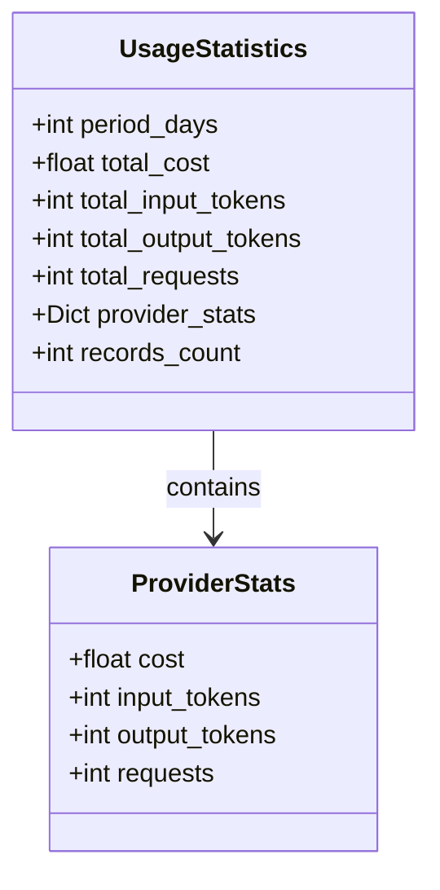
```mermaid
classDiagram
class UsageStatistics {
+int period_days
+float total_cost
+int total_input_tokens
+int total_output_tokens
+int total_requests
+Dict provider_stats
+int records_count
}
class ProviderStats {
+float cost
+int input_tokens
+int output_tokens
+int requests
}
UsageStatistics --> ProviderStats : contains
```

**图表来源**
- [config_manager.py](file://tradingagents/config/config_manager.py#L500-L550)

**章节来源**
- [config_manager.py](file://tradingagents/config/config_manager.py#L351-L408)
- [config_manager.py](file://tradingagents/config/config_manager.py#L380-L408)
- [config_manager.py](file://tradingagents/config/config_manager.py#L500-L550)

## TokenTracker集成

### TokenTracker类设计

TokenTracker作为ConfigManager的包装器，提供了更高级的Token使用跟踪功能：

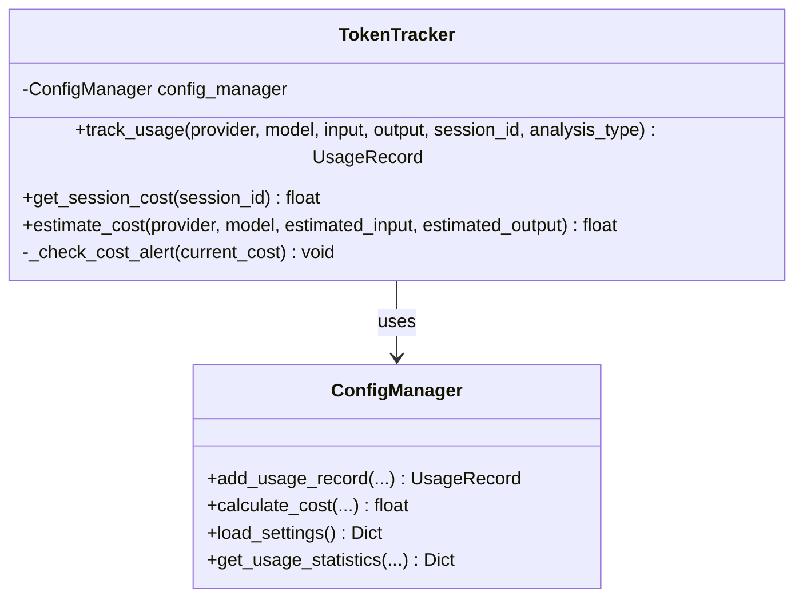
```mermaid
classDiagram
class TokenTracker {
-ConfigManager config_manager
+track_usage(provider, model, input, output, session_id, analysis_type) UsageRecord
+get_session_cost(session_id) float
+estimate_cost(provider, model, estimated_input, estimated_output) float
-_check_cost_alert(current_cost) void
}
class ConfigManager {
+add_usage_record(...) UsageRecord
+calculate_cost(...) float
+load_settings() Dict
+get_usage_statistics(...) Dict
}
TokenTracker --> ConfigManager : uses
```

**图表来源**
- [config_manager.py](file://tradingagents/config/config_manager.py#L652-L726)

### 成本预警机制

#### _check_cost_alert方法实现

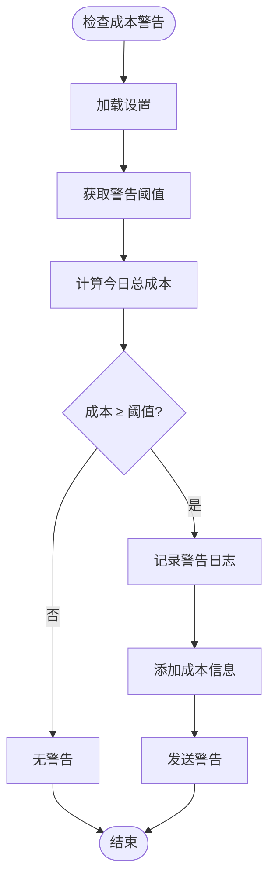
```mermaid
flowchart TD
Start([检查成本警告]) --> LoadSettings[加载设置]
LoadSettings --> GetThreshold[获取警告阈值]
GetThreshold --> CalcTodayCost[计算今日总成本]
CalcTodayCost --> CompareThreshold{成本 ≥ 阈值?}
CompareThreshold --> |否| NoAlert[无警告]
CompareThreshold --> |是| LogWarning[记录警告日志]
LogWarning --> AddExtraInfo[添加成本信息]
AddExtraInfo --> AlertSent[发送警告]
NoAlert --> End([结束])
AlertSent --> End
```

**图表来源**
- [config_manager.py](file://tradingagents/config/config_manager.py#L691-L705)

### 估算功能

TokenTracker提供了灵活的成本估算功能：

| 估算场景 | 方法 | 应用场景 |
|----------|------|----------|
| 实时跟踪 | track_usage() | 每次LLM调用后 |
| 会话汇总 | get_session_cost() | 会话结束时 |
| 预算规划 | estimate_cost() | 预估批量任务成本 |
| 性能监控 | get_usage_statistics() | 定期统计分析 |

**章节来源**
- [config_manager.py](file://tradingagents/config/config_manager.py#L652-L726)

## 数据库存储支持

### MongoDB存储架构

ConfigManager支持MongoDB分布式存储，提供更好的性能和扩展性：

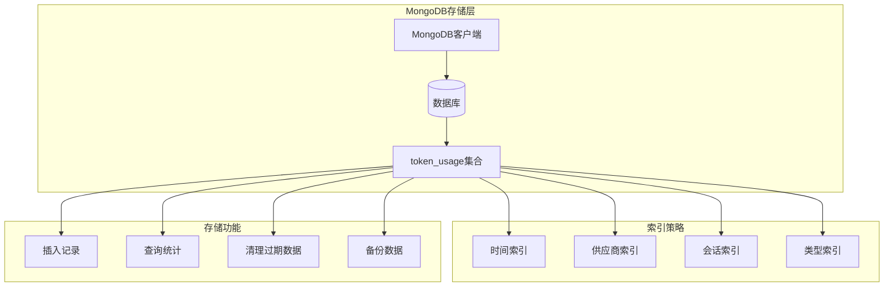
```mermaid
graph TB
subgraph "MongoDB存储层"
Client[MongoDB客户端]
DB[(数据库)]
Collection[token_usage集合]
end
subgraph "索引策略"
TimeIndex[时间索引]
ProviderIndex[供应商索引]
SessionIndex[会话索引]
TypeIndex[类型索引]
end
subgraph "存储功能"
Insert[插入记录]
Query[查询统计]
Cleanup[清理过期数据]
Backup[备份数据]
end
Client --> DB
DB --> Collection
Collection --> TimeIndex
Collection --> ProviderIndex
Collection --> SessionIndex
Collection --> TypeIndex
Collection --> Insert
Collection --> Query
Collection --> Cleanup
Collection --> Backup
```

**图表来源**
- [mongodb_storage.py](file://tradingagents/config/mongodb_storage.py#L25-L101)

### 存储切换机制

ConfigManager实现了智能的存储切换机制：

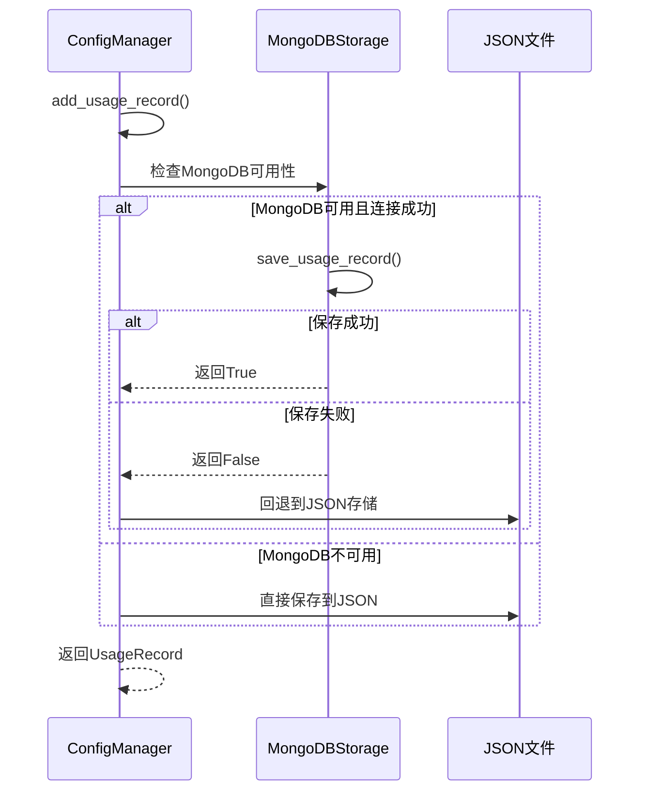
```mermaid
sequenceDiagram
participant CM as ConfigManager
participant Mongo as MongoDBStorage
participant JSON as JSON文件
CM->>CM : add_usage_record()
CM->>Mongo : 检查MongoDB可用性
alt MongoDB可用且连接成功
Mongo->>Mongo : save_usage_record()
alt 保存成功
Mongo-->>CM : 返回True
else 保存失败
Mongo-->>CM : 返回False
CM->>JSON : 回退到JSON存储
end
else MongoDB不可用
CM->>JSON : 直接保存到JSON
end
CM-->>CM : 返回UsageRecord
```

**图表来源**
- [config_manager.py](file://tradingagents/config/config_manager.py#L370-L380)

### 数据库配置管理

DatabaseConfig类提供了统一的数据库配置管理：

| 配置项 | 环境变量 | 默认值 | 说明 |
|--------|----------|--------|------|
| MongoDB连接字符串 | MONGODB_CONNECTION_STRING | 必填 | MongoDB连接URL |
| 数据库名称 | MONGODB_DATABASE_NAME | tradingagents | 目标数据库 |
| Redis主机 | REDIS_HOST | localhost | Redis服务器地址 |
| Redis端口 | REDIS_PORT | 6379 | Redis服务器端口 |

**章节来源**
- [mongodb_storage.py](file://tradingagents/config/mongodb_storage.py#L25-L101)
- [database_config.py](file://tradingagents/config/database_config.py#L10-L118)

## 最佳实践指南

### 配置文件组织

推荐的配置文件组织结构：

```
config/
├── models.json          # 模型配置
├── pricing.json         # 定价配置
├── usage.json           # 使用记录（可选，仅JSON模式）
├── settings.json        # 系统设置
└── .env                 # 环境变量配置
```

### 环境变量配置

推荐的.env文件配置：

```bash
# API密钥配置
DASHSCOPE_API_KEY=your_dashscope_key_here
OPENAI_API_KEY=sk_your_openai_key_here
GOOGLE_API_KEY=your_google_key_here

# 数据库配置
USE_MONGODB_STORAGE=false
MONGODB_CONNECTION_STRING=mongodb://localhost:27017/
MONGODB_DATABASE_NAME=tradingagents

# 系统配置
TRADINGAGENTS_DATA_DIR=./data
TRADINGAGENTS_CACHE_DIR=./cache
TRADINGAGENTS_LOG_LEVEL=INFO

# 成本控制
ENABLE_COST_TRACKING=true
COST_ALERT_THRESHOLD=100.0
MAX_USAGE_RECORDS=10000
```

### 性能优化建议

1. **存储选择**：
   - 小规模使用：JSON文件存储足够
   - 大规模部署：启用MongoDB存储
   - 混合模式：关键数据使用MongoDB，历史数据归档到JSON

2. **内存管理**：
   - 限制使用记录数量（默认10000条）
   - 定期清理过期数据
   - 使用流式处理大数据集

3. **并发处理**：
   - 使用异步API调用
   - 实现连接池管理
   - 避免阻塞式文件I/O

### 安全考虑

1. **API密钥保护**：
   - 使用环境变量存储敏感信息
   - 定期轮换API密钥
   - 实施访问权限控制

2. **数据隐私**：
   - 敏感数据加密存储
   - 实施数据脱敏处理
   - 定期审计访问日志

3. **网络安全**：
   - 使用HTTPS连接
   - 实施防火墙规则
   - 监控异常访问行为

**章节来源**
- [config_management_demo.py](file://examples/config_management_demo.py#L1-L257)
- [token_tracking_demo.py](file://examples/token_tracking_demo.py#L1-L283)

## 总结

ConfigManager作为TradingAgents-CN系统的核心配置管理组件，展现了优秀的软件架构设计：

### 主要优势

1. **模块化设计**：清晰的功能分离，便于维护和扩展
2. **多存储支持**：JSON文件和MongoDB双重存储方案
3. **智能配置管理**：环境变量与配置文件的智能合并
4. **成本透明化**：完整的Token使用跟踪和成本计算
5. **向后兼容**：平滑的升级路径和兼容性保证

### 技术特色

- **数据类驱动**：使用Python dataclass简化配置管理
- **类型安全**：完整的类型注解和验证机制
- **错误处理**：健壮的异常处理和恢复机制
- **性能优化**：智能缓存和批量操作支持
- **扩展性**：插件化的存储后端和配置格式

### 应用价值

ConfigManager不仅是一个配置管理工具，更是整个TradingAgents系统成本控制和资源管理的基础平台。通过其完善的成本跟踪、使用统计和配置管理功能，为量化交易和AI分析提供了可靠的技术支撑。

该系统的设计理念体现了现代软件工程的最佳实践，为类似项目的开发提供了宝贵的参考价值。