# 默认配置文件详解

<cite>
**本文档引用的文件**
- [default_config.py](file://tradingagents/default_config.py)
- [config_manager.py](file://tradingagents/config/config_manager.py)
- [env_utils.py](file://tradingagents/config/env_utils.py)
- [database_config.py](file://tradingagents/config/database_config.py)
- [database_manager.py](file://tradingagents/config/database_manager.py)
- [config.py](file://tradingagents/dataflows/config.py)
- [simple_analysis_demo.py](file://examples/simple_analysis_demo.py)
- [config_management_demo.py](file://examples/config_management_demo.py)
- [data_dir_config_demo.py](file://examples/data_dir_config_demo.py)
</cite>

## 目录
1. [简介](#简介)
2. [项目结构概览](#项目结构概览)
3. [核心配置参数详解](#核心配置参数详解)
4. [路径配置系统](#路径配置系统)
5. [LLM配置架构](#llm配置架构)
6. [智能体协作参数](#智能体协作参数)
7. [在线功能配置](#在线功能配置)
8. [数据库和缓存配置](#数据库和缓存配置)
9. [配置加载机制](#配置加载机制)
10. [环境变量优先级](#环境变量优先级)
11. [实际应用示例](#实际应用示例)
12. [故障排除指南](#故障排除指南)
13. [总结](#总结)

## 简介

TradingAgents-CN是一个基于人工智能的投资分析系统，其默认配置文件`default_config.py`定义了系统的核心参数和行为设置。本文档将深入解析这些配置参数的作用机制、生成逻辑以及在系统初始化过程中的加载顺序。

## 项目结构概览

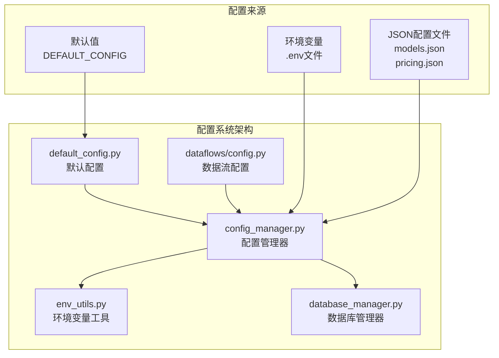

**图表来源**
- [default_config.py](file://tradingagents/default_config.py#L1-L28)
- [config_manager.py](file://tradingagents/config/config_manager.py#L1-L50)

## 核心配置参数详解

### DEFAULT_CONFIG结构分析

`default_config.py`中的`DEFAULT_CONFIG`字典包含了系统运行所需的基础配置参数：

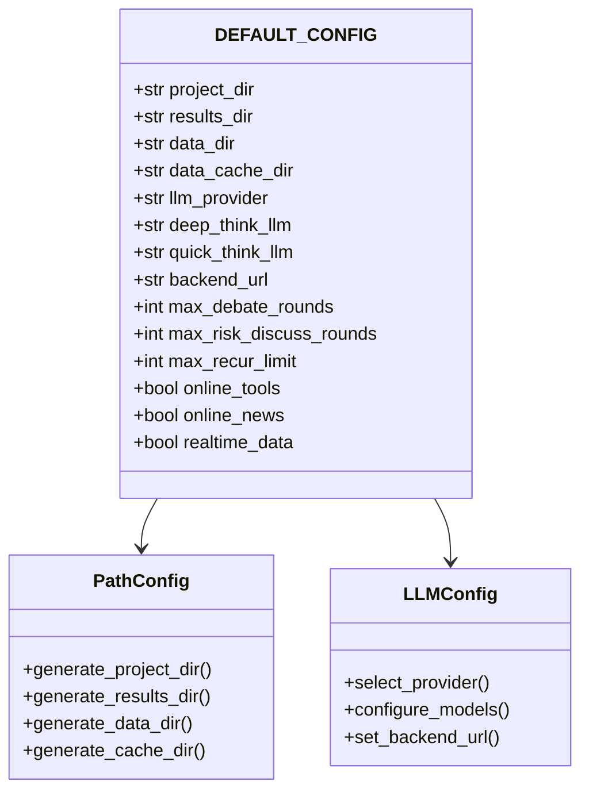

**图表来源**
- [default_config.py](file://tradingagents/default_config.py#L4-L27)

**章节来源**
- [default_config.py](file://tradingagents/default_config.py#L1-L28)

## 路径配置系统

### 项目目录结构

系统采用分层的路径配置策略，确保各组件之间的协调工作：

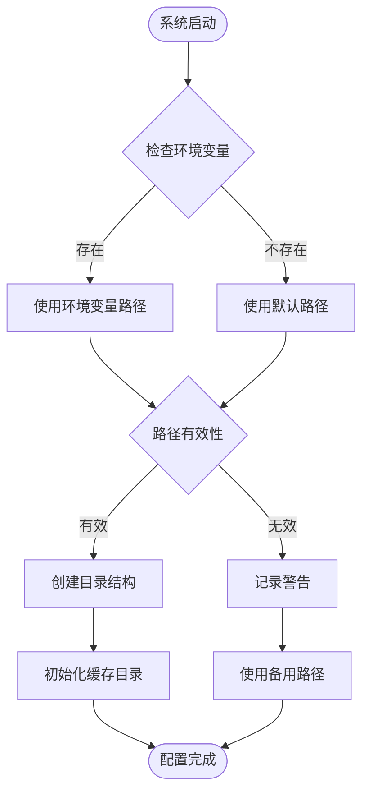

**图表来源**
- [config.py](file://tradingagents/dataflows/config.py#L15-L45)

### 路径生成逻辑

#### project_dir配置
- **生成逻辑**: 基于当前文件所在目录的绝对路径
- **用途**: 作为项目根目录，用于相对路径解析
- **默认值**: `os.path.abspath(os.path.join(os.path.dirname(__file__), "."))`

#### results_dir配置
- **生成逻辑**: 优先读取环境变量`TRADINGAGENTS_RESULTS_DIR`，否则使用`./results`
- **用途**: 存储分析结果和报告文件
- **默认值**: `./results`

#### data_dir配置
- **生成逻辑**: 基于用户主目录下的`Documents/TradingAgents/data`
- **用途**: 存储原始数据和中间结果
- **默认值**: `os.path.join(os.path.expanduser("~"), "Documents", "TradingAgents", "data")`

#### data_cache_dir配置
- **生成逻辑**: 基于项目目录下的`dataflows/data_cache`子目录
- **用途**: 存储缓存数据，提高数据访问效率
- **默认值**: `os.path.join(os.path.abspath(os.path.join(os.path.dirname(__file__), ".")), "dataflows/data_cache")`

**章节来源**
- [default_config.py](file://tradingagents/default_config.py#L4-L13)
- [config.py](file://tradingagents/dataflows/config.py#L15-L45)

## LLM配置架构

### LLM提供商配置

系统支持多种LLM提供商，通过`llm_provider`参数进行统一管理：

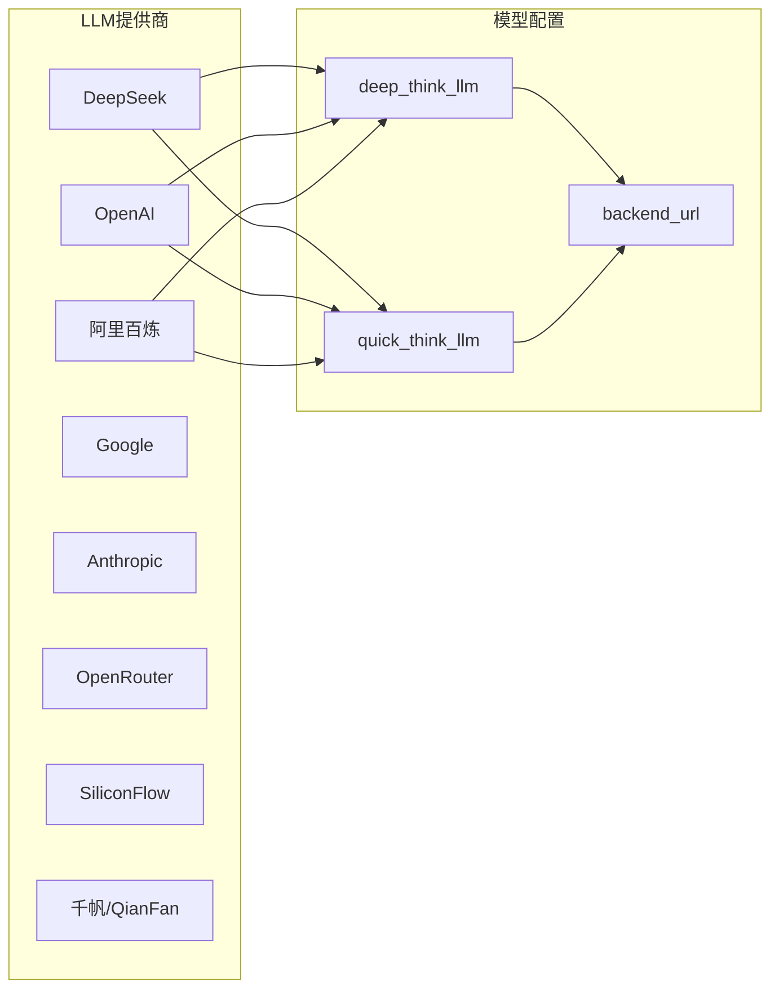

**图表来源**
- [config_manager.py](file://tradingagents/config/config_manager.py#L150-L200)

### LLM配置参数详解

#### llm_provider
- **默认值**: `"openai"`
- **作用**: 指定主要的语言模型提供商
- **支持的值**: `"openai"`, `"dashscope"`, `"deepseek"`, `"google"`, `"anthropic"`, `"openrouter"`, `"siliconflow"`

#### deep_think_llm
- **默认值**: `"o4-mini"` (OpenAI)
- **作用**: 用于深度分析和复杂推理的模型
- **特点**: 更高精度，更强的推理能力

#### quick_think_llm
- **默认值**: `"gpt-4o-mini"` (OpenAI)
- **作用**: 用于快速响应和初步分析的模型
- **特点**: 更快的响应速度，较低的延迟

#### backend_url
- **默认值**: `"https://api.openai.com/v1"`
- **作用**: 指定API服务的端点URL
- **动态配置**: 根据`llm_provider`自动设置相应的API端点

**章节来源**
- [default_config.py](file://tradingagents/default_config.py#L15-L18)
- [config_manager.py](file://tradingagents/config/config_manager.py#L150-L250)

## 智能体协作参数

### 协作机制设计

系统通过智能体协作参数控制多智能体分析流程的深度和广度：

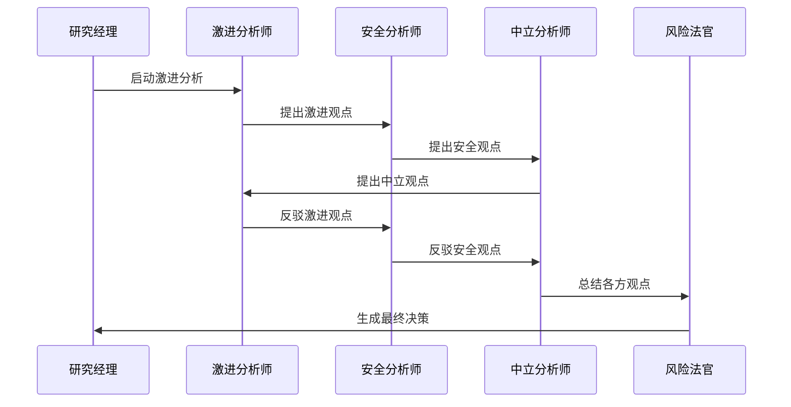

**图表来源**
- [conditional_logic.py](file://tradingagents/graph/conditional_logic.py#L68-L78)

### 参数配置详解

#### max_debate_rounds
- **默认值**: `1`
- **作用**: 控制普通讨论的最大轮次
- **影响**: 影响分析的深度和全面性
- **典型值**: 
  - 快速分析: `1`
  - 标准分析: `2`
  - 深度分析: `3`

#### max_risk_discuss_rounds
- **默认值**: `1`
- **作用**: 控制风险讨论的最大轮次
- **特点**: 风险讨论通常比普通讨论更深入
- **计算公式**: 实际讨论轮次 = 3 × `max_risk_discuss_rounds`

#### max_recur_limit
- **默认值**: `100`
- **作用**: 设置递归调用的最大限制
- **安全机制**: 防止无限递归导致的系统崩溃
- **应用场景**: 智能体对话、数据分析等递归操作

**章节来源**
- [default_config.py](file://tradingagents/default_config.py#L19-L21)
- [conditional_logic.py](file://tradingagents/graph/conditional_logic.py#L68-L78)

## 在线功能配置

### 功能开关机制

系统通过三个布尔配置项控制在线功能的启用状态：

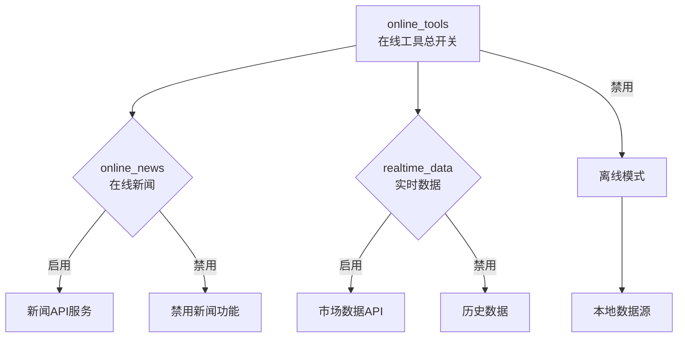

**图表来源**
- [default_config.py](file://tradingagents/default_config.py#L22-L25)

### 配置参数详解

#### online_tools
- **默认值**: `os.getenv("ONLINE_TOOLS_ENABLED", "false").lower() == "true"`
- **作用**: 在线工具总开关
- **环境变量**: `ONLINE_TOOLS_ENABLED`
- **优先级**: 环境变量 > 默认值
- **影响**: 控制所有在线功能的启用状态

#### online_news
- **默认值**: `os.getenv("ONLINE_NEWS_ENABLED", "true").lower() == "true"`
- **作用**: 在线新闻获取功能
- **环境变量**: `ONLINE_NEWS_ENABLED`
- **默认启用**: `true`
- **依赖**: 需要有效的新闻API密钥

#### realtime_data
- **默认值**: `os.getenv("REALTIME_DATA_ENABLED", "false").lower() == "true"`
- **作用**: 实时市场数据获取功能
- **环境变量**: `REALTIME_DATA_ENABLED`
- **成本考虑**: 实时数据API通常收费较高

### 环境变量读取机制

系统使用强健的环境变量解析机制，支持多种格式：

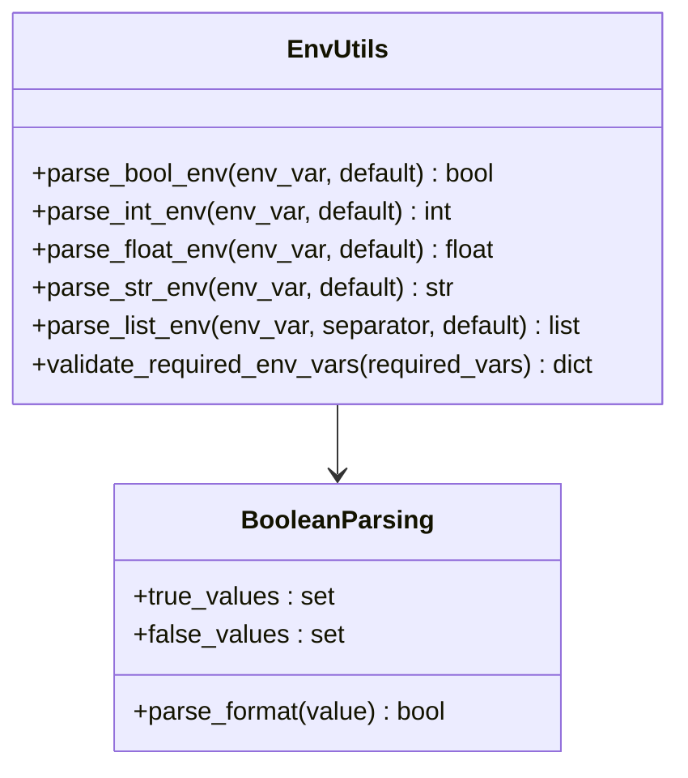

**图表来源**
- [env_utils.py](file://tradingagents/config/env_utils.py#L10-L50)

**章节来源**
- [default_config.py](file://tradingagents/default_config.py#L22-L25)
- [env_utils.py](file://tradingagents/config/env_utils.py#L10-L100)

## 数据库和缓存配置

### 配置分离策略

系统将数据库和缓存配置从默认配置中移除，避免配置冲突：

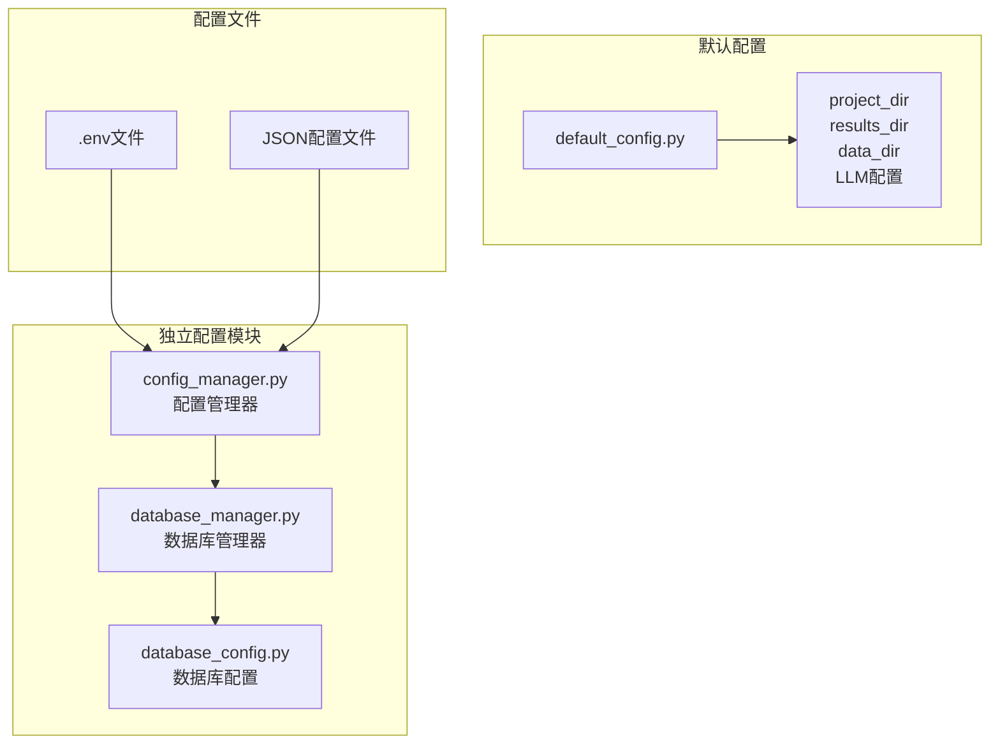

**图表来源**
- [database_manager.py](file://tradingagents/config/database_manager.py#L1-L50)
- [database_config.py](file://tradingagents/config/database_config.py#L1-L50)

### 数据库配置管理

#### MongoDB配置
- **连接字符串**: `MONGODB_CONNECTION_STRING`
- **数据库名称**: `MONGODB_DATABASE_NAME` (默认: `tradingagents`)
- **认证源**: `MONGODB_AUTH_SOURCE` (默认: `admin`)

#### Redis配置
- **连接字符串**: `REDIS_CONNECTION_STRING` (优先级高于分离配置)
- **主机**: `REDIS_HOST` (默认: `localhost`)
- **端口**: `REDIS_PORT` (默认: `6379`)
- **数据库**: `REDIS_DATABASE` (默认: `0`)

### 缓存后端选择

系统支持多种缓存后端，具有智能降级机制：

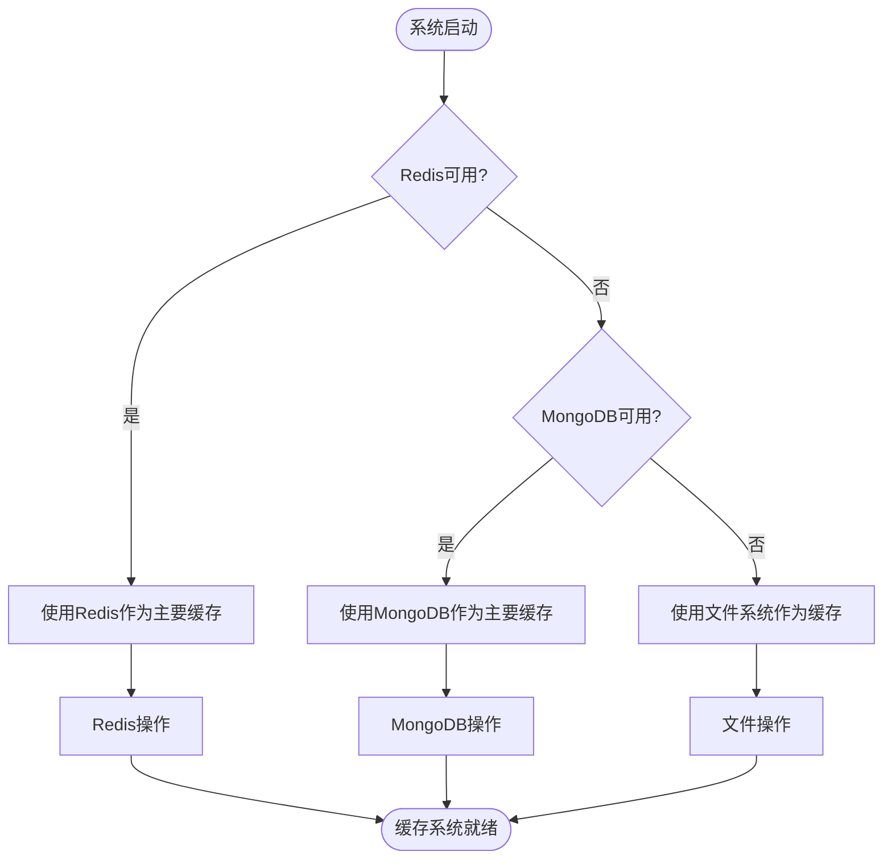

**图表来源**
- [database_manager.py](file://tradingagents/config/database_manager.py#L150-L200)

**章节来源**
- [default_config.py](file://tradingagents/default_config.py#L26-L27)
- [database_manager.py](file://tradingagents/config/database_manager.py#L1-L100)
- [database_config.py](file://tradingagents/config/database_config.py#L1-L119)

## 配置加载机制

### 初始化流程

系统采用分层的配置加载机制，确保配置的一致性和灵活性：

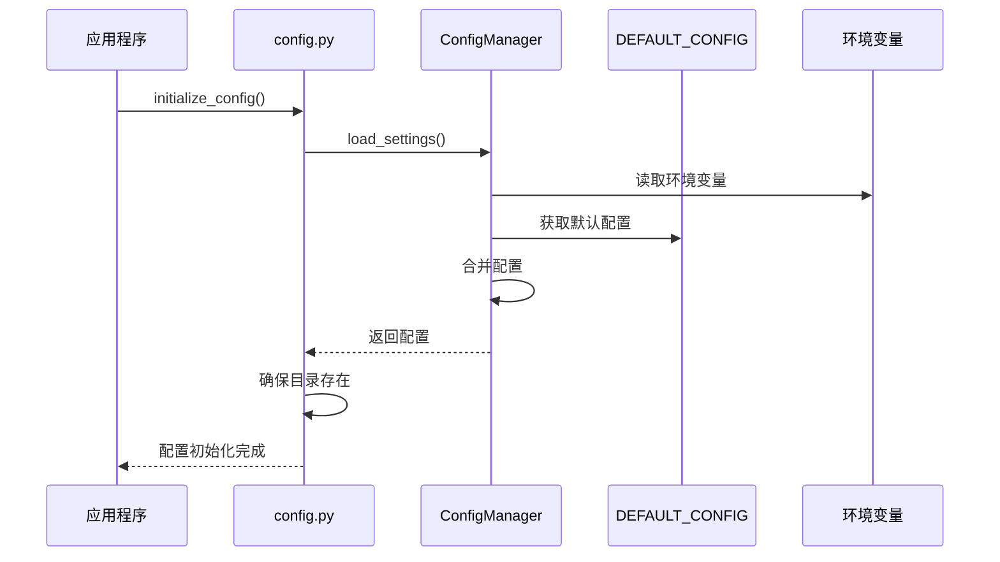

**图表来源**
- [config.py](file://tradingagents/dataflows/config.py#L15-L45)

### 配置加载优先级

配置加载遵循严格的优先级顺序：

1. **环境变量** (最高优先级)
2. **配置管理器设置** (来自JSON文件)
3. **默认配置** (来自`DEFAULT_CONFIG`)
4. **系统默认值** (最低优先级)

### 动态配置更新

系统支持运行时动态更新配置：


**图表来源**
- [config_manager.py](file://tradingagents/config/config_manager.py#L600-L650)

**章节来源**
- [config.py](file://tradingagents/dataflows/config.py#L15-L77)
- [config_manager.py](file://tradingagents/config/config_manager.py#L100-L200)

## 环境变量优先级

### 优先级机制

系统实现了强大的环境变量优先级机制，确保用户能够灵活控制配置：

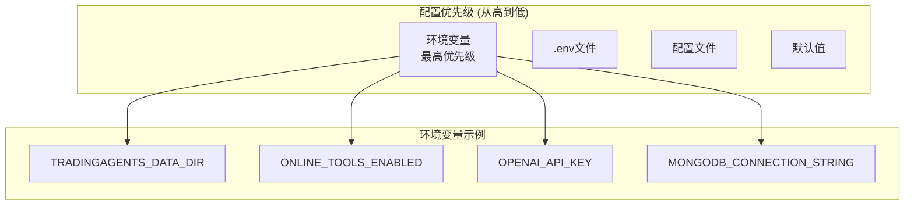

**图表来源**
- [config_manager.py](file://tradingagents/config/config_manager.py#L500-L550)

### 强健的环境变量解析

系统提供了强健的环境变量解析工具，支持多种数据类型：

#### 布尔值解析
- **支持格式**: `true`, `false`, `1`, `0`, `yes`, `no`, `on`, `off`
- **容错机制**: 无法解析时返回默认值并记录警告

#### 数值解析
- **整数解析**: 支持十进制整数
- **浮点数解析**: 支持十进制浮点数
- **错误处理**: 解析失败时使用默认值

#### 列表解析
- **分隔符**: 可配置，默认为逗号
- **空值过滤**: 自动过滤空字符串项
- **类型转换**: 将字符串列表转换为Python列表

**章节来源**
- [env_utils.py](file://tradingagents/config/env_utils.py#L10-L245)
- [config_manager.py](file://tradingagents/config/config_manager.py#L500-L600)

## 实际应用示例

### 基础配置演示

以下展示了如何使用默认配置进行基本的股票分析：

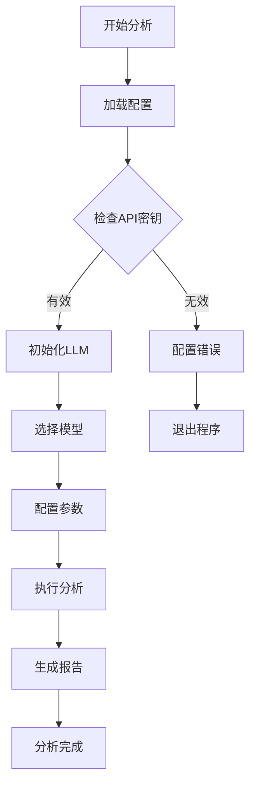

**图表来源**
- [simple_analysis_demo.py](file://examples/simple_analysis_demo.py#L1-L50)

### 配置管理最佳实践

#### 环境变量配置示例
```bash
# 基础配置
export TRADINGAGENTS_DATA_DIR="/path/to/custom/data"
export TRADINGAGENTS_RESULTS_DIR="./custom_results"

# LLM配置
export DASHSCOPE_API_KEY="your_api_key_here"
export OPENAI_API_KEY="your_openai_key_here"

# 功能开关
export ONLINE_TOOLS_ENABLED=true
export ONLINE_NEWS_ENABLED=true
export REALTIME_DATA_ENABLED=false

# 数据库配置
export MONGODB_CONNECTION_STRING="mongodb://localhost:27017/"
export REDIS_HOST="localhost"
export REDIS_PORT=6379
```

#### 配置验证流程
系统提供了完整的配置验证机制：

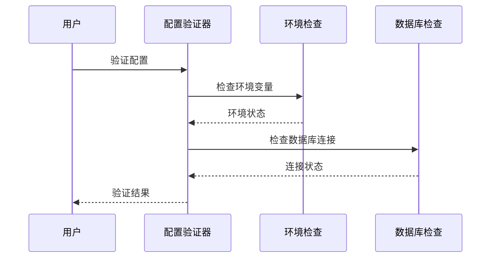

**图表来源**
- [config_management_demo.py](file://examples/config_management_demo.py#L1-L100)

**章节来源**
- [simple_analysis_demo.py](file://examples/simple_analysis_demo.py#L1-L214)
- [config_management_demo.py](file://examples/config_management_demo.py#L1-L258)

## 故障排除指南

### 常见配置问题

#### API密钥问题
- **症状**: LLM调用失败，提示认证错误
- **解决方案**: 检查环境变量设置，验证API密钥格式
- **验证命令**: `echo $DASHSCOPE_API_KEY`

#### 路径权限问题
- **症状**: 目录创建失败，权限拒绝
- **解决方案**: 检查用户权限，确保有写入权限
- **修复命令**: `chmod -R 755 ~/Documents/TradingAgents`

#### 数据库连接问题
- **症状**: 缓存功能失效，MongoDB/Redis连接超时
- **解决方案**: 检查数据库服务状态，验证连接字符串
- **诊断命令**: `mongo --version` 或 `redis-cli ping`

### 配置调试技巧

#### 配置状态检查
```python
# 检查配置状态
from tradingagents.config.config_manager import config_manager
status = config_manager.get_env_config_status()
print(status)
```

#### 日志分析
- **日志级别**: 设置`TRADINGAGENTS_LOG_LEVEL=DEBUG`获取详细信息
- **关键日志**: 关注数据库连接、API调用、路径创建等关键操作

#### 性能监控
- **使用统计**: 通过`config_manager.get_usage_statistics()`监控使用情况
- **成本跟踪**: 启用`enable_cost_tracking`监控API使用成本

**章节来源**
- [config_manager.py](file://tradingagents/config/config_manager.py#L650-L727)

## 总结

TradingAgents-CN的默认配置系统体现了现代软件架构的最佳实践：

### 核心优势

1. **模块化设计**: 将不同类型的配置分离到专门的模块中
2. **环境变量优先**: 支持灵活的环境配置，便于部署和维护
3. **强健的解析机制**: 提供容错的环境变量解析工具
4. **智能降级**: 数据库和缓存配置的自动降级机制
5. **动态配置**: 支持运行时配置更新和热重载

### 设计理念

- **约定优于配置**: 提供合理的默认值，减少用户配置负担
- **最小化冲突**: 将敏感配置移出默认配置文件
- **渐进增强**: 支持从简单配置到复杂定制的平滑过渡
- **可扩展性**: 易于添加新的配置项和配置类型

### 最佳实践建议

1. **生产环境**: 使用环境变量而非硬编码配置
2. **开发环境**: 利用`.env`文件简化配置管理
3. **容器化部署**: 通过环境变量传递配置，实现无状态部署
4. **监控告警**: 启用成本跟踪和使用统计，及时发现异常

通过深入理解这些配置机制，开发者可以更好地定制和优化TradingAgents-CN系统，满足不同场景的业务需求。