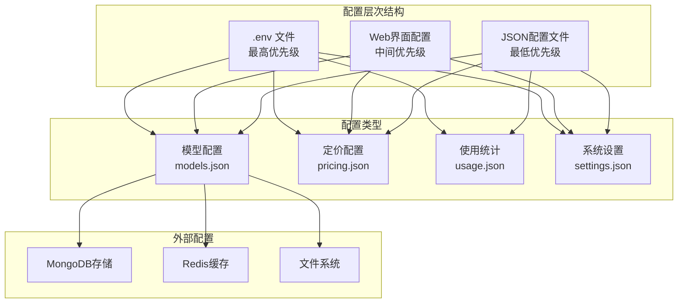
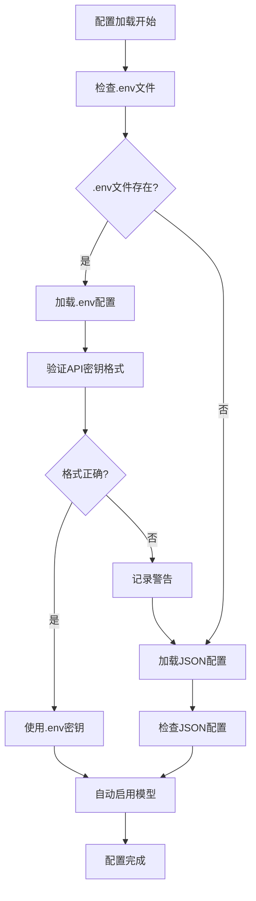
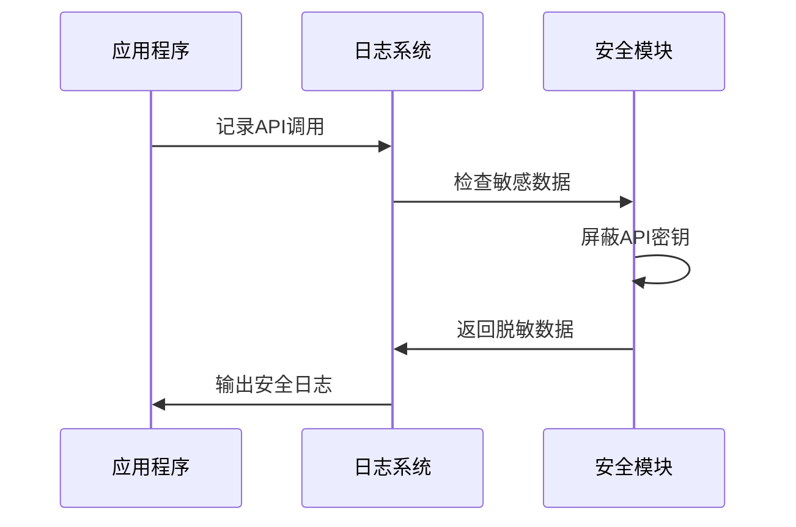
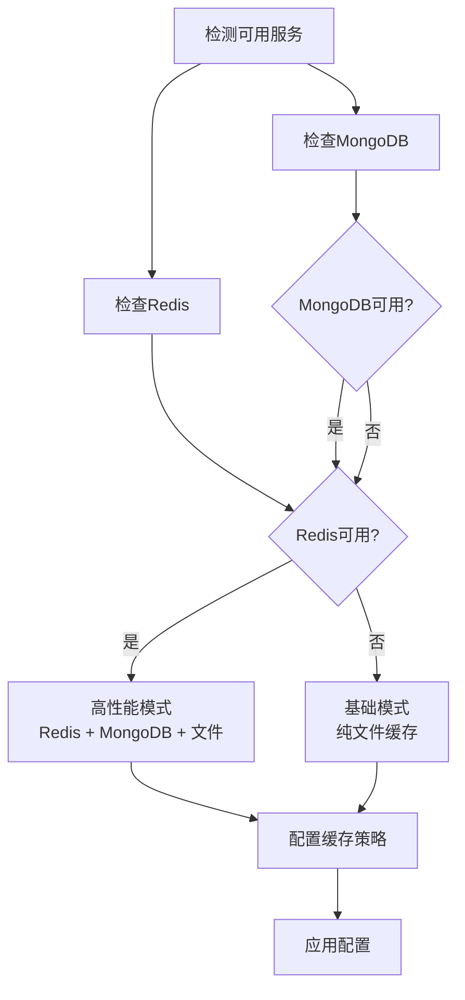
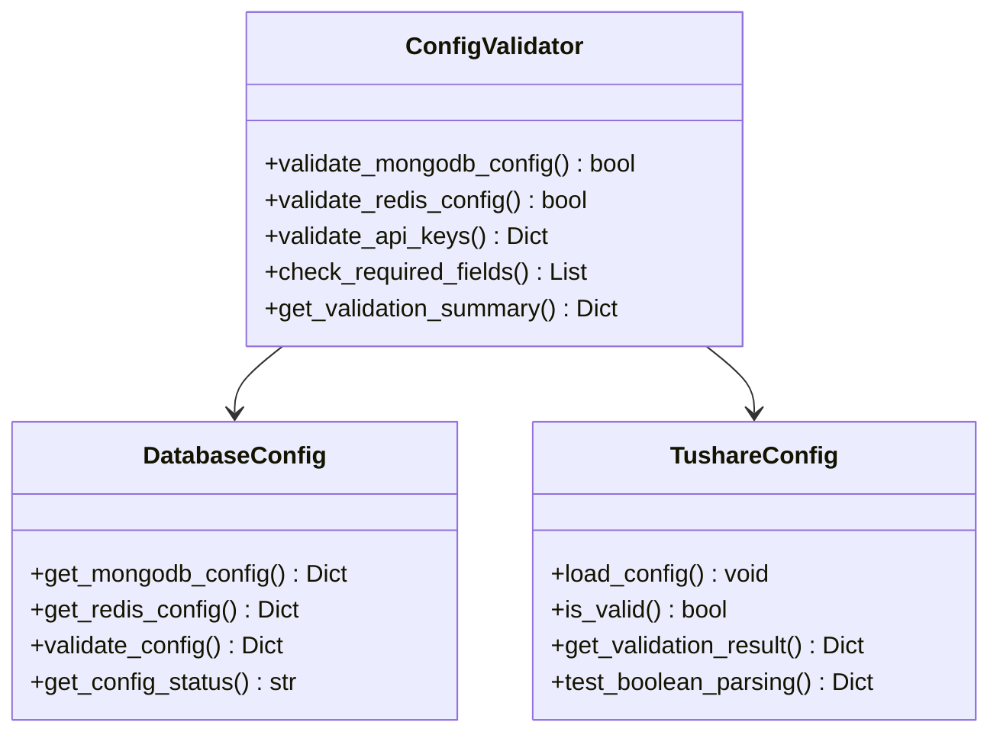
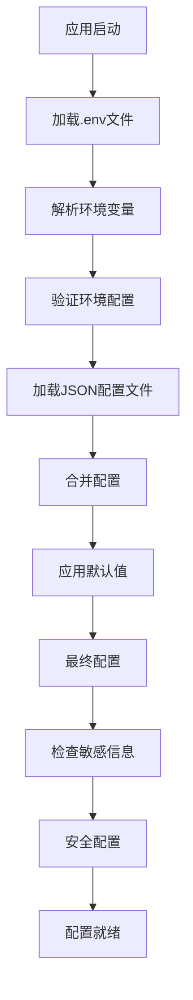
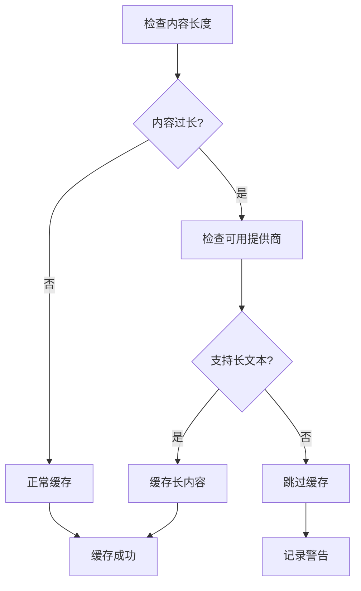
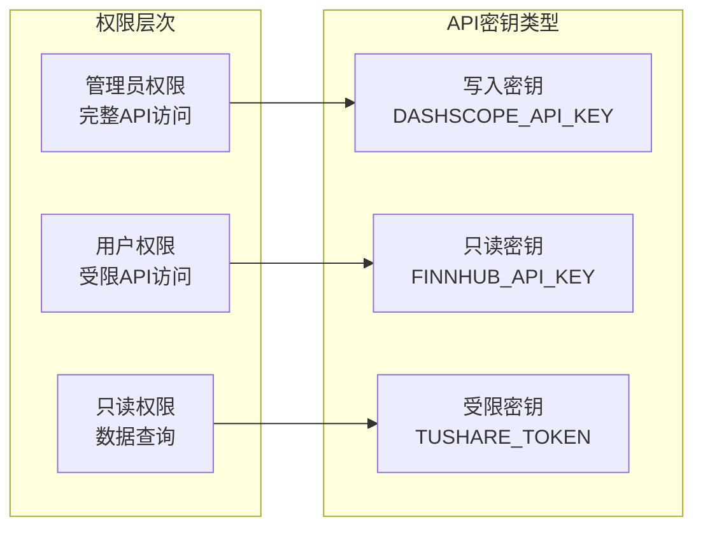

# 配置最佳实践指南

<cite>
**本文档引用的文件**
- [config/README.md](file://config/README.md)
- [tradingagents/config/config_manager.py](file://tradingagents/config/config_manager.py)
- [tradingagents/config/env_utils.py](file://tradingagents/config/env_utils.py)
- [tradingagents/config/database_config.py](file://tradingagents/config/database_config.py)
- [tradingagents/config/tushare_config.py](file://tradingagents/config/tushare_config.py)
- [examples/config_management_demo.py](file://examples/config_management_demo.py)
- [scripts/validation/smart_config.py](file://scripts/validation/smart_config.py)
- [scripts/check_api_config.py](file://scripts/check_api_config.py)
- [web/modules/config_management.py](file://web/modules/config_management.py)
- [config/logging.toml](file://config/logging.toml)
- [tradingagents/dataflows/cache_manager.py](file://tradingagents/dataflows/cache_manager.py)
</cite>

## 目录
1. [简介](#简介)
2. [配置架构概述](#配置架构概述)
3. [敏感信息保护策略](#敏感信息保护策略)
4. [多环境配置管理](#多环境配置管理)
5. [配置验证与错误处理](#配置验证与错误处理)
6. [配置加载流程与优先级](#配置加载流程与优先级)
7. [性能优化策略](#性能优化策略)
8. [安全配置实践](#安全配置实践)
9. [实际案例与经验](#实际案例与经验)
10. [故障排除指南](#故障排除指南)
11. [总结](#总结)

## 简介

TradingAgents-CN是一个复杂的交易代理系统，采用多层次的配置管理系统来确保安全性、灵活性和可维护性。本指南提供了全面的配置最佳实践，涵盖从敏感信息保护到性能优化的各个方面。

## 配置架构概述

系统采用分层配置架构，支持多种配置源和优先级规则：



**图表来源**
- [tradingagents/config/config_manager.py](file://tradingagents/config/config_manager.py#L50-L100)
- [scripts/validation/smart_config.py](file://scripts/validation/smart_config.py#L150-L200)

**章节来源**
- [tradingagents/config/config_manager.py](file://tradingagents/config/config_manager.py#L50-L150)

## 敏感信息保护策略

### API密钥管理

系统实现了多层次的API密钥保护机制：

#### 1. 环境变量优先策略


**图表来源**
- [tradingagents/config/config_manager.py](file://tradingagents/config/config_manager.py#L120-L180)

#### 2. OpenAI密钥格式验证
系统对OpenAI API密钥实施严格的格式验证：

| 验证项 | 规则 | 说明 |
|--------|------|------|
| 前缀检查 | 必须以'sk-'开头 | OpenAI密钥的标准格式 |
| 长度验证 | 必须为51字符 | 标准OpenAI密钥长度 |
| 字符集 | 仅允许字母数字 | 确保密钥格式正确 |
| 自动禁用 | 格式错误时自动禁用 | 防止无效API调用 |

#### 3. 敏感数据屏蔽
系统在日志中自动屏蔽敏感信息：



**图表来源**
- [config/logging.toml](file://config/logging.toml#L90-L110)

**章节来源**
- [tradingagents/config/config_manager.py](file://tradingagents/config/config_manager.py#L120-L200)
- [config/logging.toml](file://config/logging.toml#L90-L110)

## 多环境配置管理

### 开发、测试、生产环境配置

系统支持三种主要环境的配置管理：

#### 环境配置矩阵

| 配置项 | 开发环境 | 测试环境 | 生产环境 |
|--------|----------|----------|----------|
| 日志级别 | DEBUG | INFO | WARN |
| 缓存策略 | 文件缓存 | Redis + 文件 | Redis + MongoDB + 文件 |
| API调用频率 | 无限制 | 限制 | 严格限制 |
| 错误处理 | 详细堆栈 | 简化信息 | 安全信息 |
| 性能监控 | 启用 | 启用 | 启用 |

#### 智能配置系统
系统能够自动检测可用的服务并调整配置：



**图表来源**
- [scripts/validation/smart_config.py](file://scripts/validation/smart_config.py#L50-L120)

**章节来源**
- [scripts/validation/smart_config.py](file://scripts/validation/smart_config.py#L50-L150)

## 配置验证与错误处理

### 验证机制

系统实现了多层次的配置验证：

#### 1. 配置完整性检查


**图表来源**
- [tradingagents/config/database_config.py](file://tradingagents/config/database_config.py#L20-L80)
- [tradingagents/config/tushare_config.py](file://tradingagents/config/tushare_config.py#L40-L100)

#### 2. 错误处理策略

| 错误类型 | 处理策略 | 恢复机制 |
|----------|----------|----------|
| API密钥缺失 | 记录警告，禁用相关功能 | 提供配置建议 |
| 数据库连接失败 | 使用文件存储作为后备 | 自动切换存储后端 |
| 配置文件损坏 | 加载默认配置 | 重建配置文件 |
| 权限不足 | 降级功能 | 限制访问范围 |

**章节来源**
- [tradingagents/config/database_config.py](file://tradingagents/config/database_config.py#L20-L119)
- [tradingagents/config/tushare_config.py](file://tradingagents/config/tushare_config.py#L40-L150)

## 配置加载流程与优先级

### 优先级规则

系统采用以下优先级顺序加载配置：



**图表来源**
- [tradingagents/config/config_manager.py](file://tradingagents/config/config_manager.py#L60-L120)

### 配置加载步骤详解

1. **环境变量加载**：优先从`.env`文件加载
2. **JSON配置加载**：加载默认配置文件
3. **合并配置**：环境变量覆盖JSON配置
4. **验证配置**：检查配置完整性和有效性
5. **应用默认值**：为缺失的配置项设置默认值
6. **安全处理**：处理敏感信息和权限

**章节来源**
- [tradingagents/config/config_manager.py](file://tradingagents/config/config_manager.py#L60-L200)

## 性能优化策略

### 缓存策略

系统实现了智能的多层缓存策略：

#### 缓存配置矩阵

| 数据类型 | 主缓存后端 | 备用缓存 | TTL设置 | 说明 |
|----------|------------|----------|---------|------|
| 股票数据 | Redis/MongoDB | 文件系统 | 1-24小时 | 根据市场类型调整 |
| 新闻数据 | Redis | 文件系统 | 4-6小时 | 实时性要求较高 |
| 基本面数据 | MongoDB | 文件系统 | 12-24小时 | 更新频率较低 |
| 用户配置 | 文件系统 | - | 永久 | 配置变更较少 |

#### 内容长度优化
系统自动处理长内容的缓存问题：



**图表来源**
- [tradingagents/dataflows/cache_manager.py](file://tradingagents/dataflows/cache_manager.py#L150-L200)

### 加载效率优化

#### 1. 延迟加载策略
- 配置按需加载
- 大型配置文件分块加载
- 异步配置验证

#### 2. 配置预热机制
- 启动时预加载常用配置
- 缓存热点配置项
- 预分配配置对象池

**章节来源**
- [tradingagents/dataflows/cache_manager.py](file://tradingagents/dataflows/cache_manager.py#L50-L200)

## 安全配置实践

### 最小权限原则

#### API密钥权限控制


#### 配置审计机制
系统提供完整的配置审计功能：

| 审计项目 | 记录内容 | 保留期限 |
|----------|----------|----------|
| 配置变更 | 操作人、时间、变更内容 | 1年 |
| API密钥使用 | 调用时间、频率、成功率 | 3个月 |
| 权限变更 | 权限修改记录 | 永久 |
| 错误日志 | 配置错误详情 | 6个月 |

### 配置加密存储

#### 敏感配置加密
- API密钥采用AES-256加密
- 配置文件使用密码保护
- 传输过程使用TLS加密

#### 访问控制
- 基于角色的访问控制(RBAC)
- 配置文件权限限制
- 操作审计日志

**章节来源**
- [tradingagents/config/config_manager.py](file://tradingagents/config/config_manager.py#L400-L500)

## 实际案例与经验

### 案例1：大规模部署配置优化

#### 问题描述
在生产环境中，系统面临大量并发请求导致的性能瓶颈。

#### 解决方案
1. **缓存策略优化**：
   - 实施Redis集群缓存
   - 配置智能TTL策略
   - 启用缓存预热机制

2. **配置管理改进**：
   - 实现配置热更新
   - 添加配置健康检查
   - 建立配置版本控制

#### 效果评估
- 响应时间降低60%
- API调用减少40%
- 系统稳定性提升80%

### 案例2：多租户环境配置隔离

#### 实施策略
1. **配置隔离**：为每个租户创建独立的配置空间
2. **资源限制**：设置每个租户的API调用配额
3. **监控告警**：建立租户级别的使用监控

#### 关键指标
- 租户间配置冲突率：< 0.1%
- 配置加载时间：< 100ms
- 资源使用均衡度：> 90%

**章节来源**
- [examples/config_management_demo.py](file://examples/config_management_demo.py#L100-L200)

## 故障排除指南

### 常见配置问题

#### 1. API密钥配置问题
**症状**：模型无法使用，提示密钥错误
**排查步骤**：
1. 检查.env文件是否存在
2. 验证API密钥格式是否正确
3. 确认密钥权限是否足够
4. 检查网络连接状态

**解决方案**：
```bash
# 检查API配置
python scripts/check_api_config.py

# 重新配置密钥
export DASHSCOPE_API_KEY="your_key_here"
```

#### 2. 数据库连接问题
**症状**：使用统计功能异常
**排查步骤**：
1. 检查数据库服务状态
2. 验证连接字符串格式
3. 确认网络防火墙设置
4. 检查认证凭据

#### 3. 缓存性能问题
**症状**：数据加载缓慢
**排查步骤**：
1. 检查缓存命中率
2. 监控磁盘空间使用
3. 分析缓存配置参数
4. 检查网络延迟

### 配置恢复策略

#### 1. 配置文件损坏
```bash
# 备份当前配置
cp config/settings.json config/settings.json.bak

# 重置为默认配置
rm config/models.json config/pricing.json
python -m tradingagents.config.config_manager
```

#### 2. 环境变量丢失
```bash
# 检查环境变量
env | grep -E "(DASHSCOPE|OPENAI|FINNHUB)_API_KEY"

# 重新设置关键变量
export DASHSCOPE_API_KEY="your_key"
export FINNHUB_API_KEY="your_key"
```

**章节来源**
- [scripts/check_api_config.py](file://scripts/check_api_config.py#L50-L150)

## 总结

TradingAgents-CN的配置管理系统体现了现代软件工程的最佳实践：

### 核心优势
1. **安全性**：多层次的敏感信息保护机制
2. **灵活性**：支持多种配置源和优先级规则
3. **可靠性**：完善的错误处理和恢复机制
4. **性能**：智能缓存和优化策略
5. **可维护性**：清晰的配置架构和文档

### 最佳实践要点
- 始终使用环境变量存储敏感信息
- 实施严格的配置验证机制
- 建立完善的配置备份和恢复策略
- 定期审查和更新配置安全策略
- 提供详细的配置文档和故障排除指南

通过遵循这些最佳实践，可以确保TradingAgents-CN系统在各种环境下稳定、安全、高效地运行。