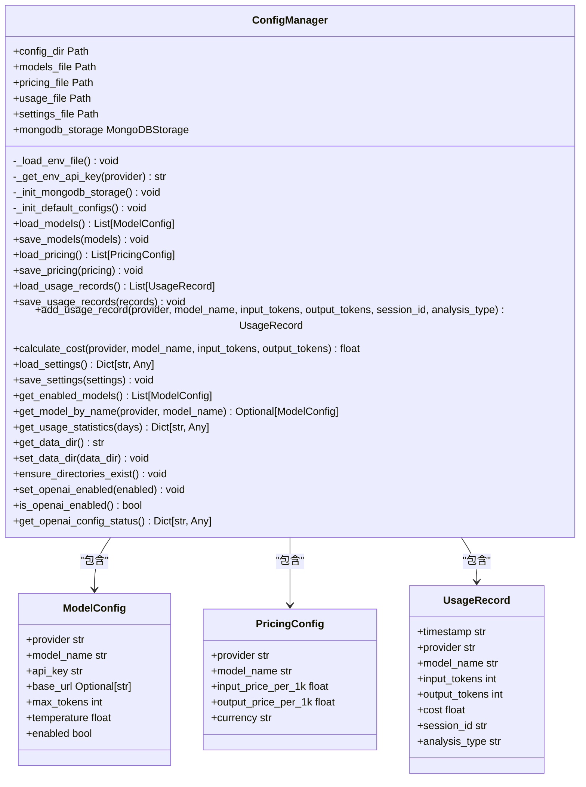
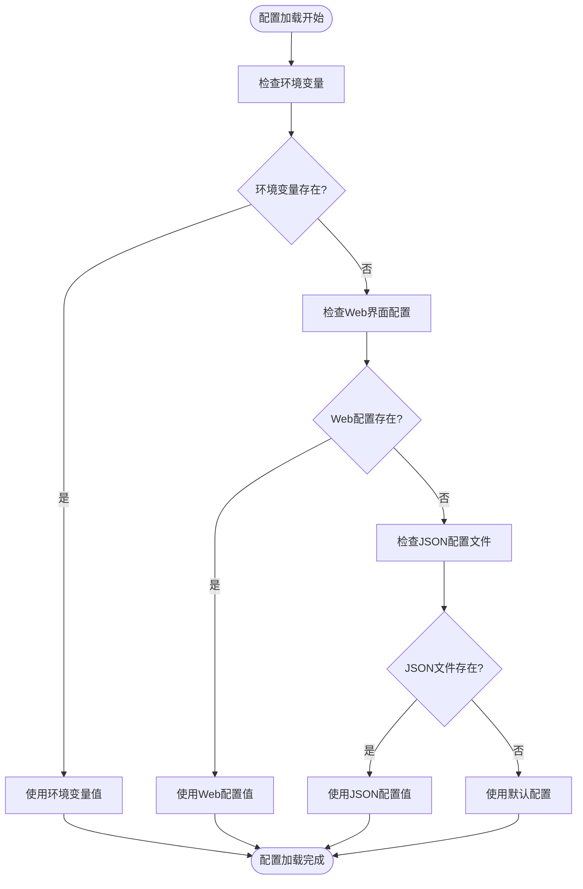
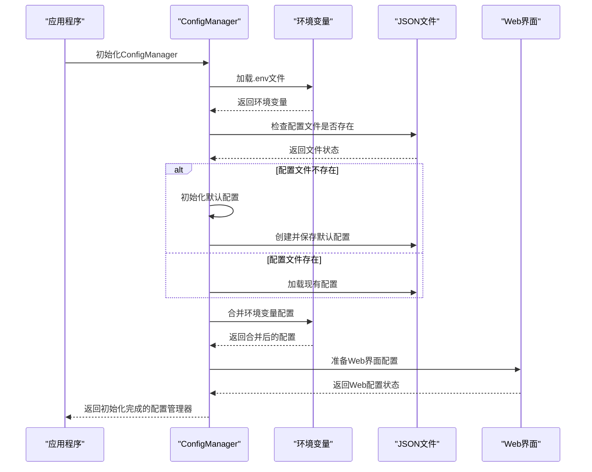
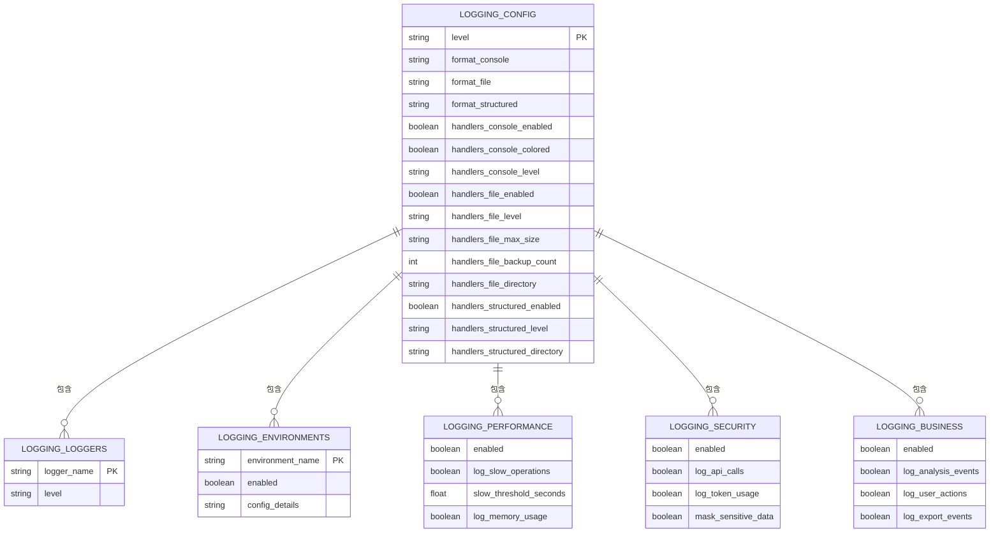
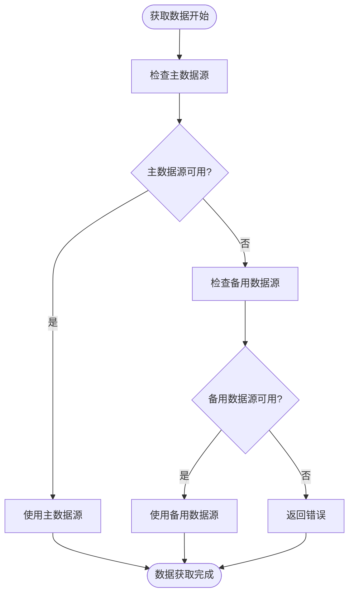

# 配置管理

<cite>
**本文档引用的文件**
- [logging.toml](file://config/logging.toml)
- [logging_docker.toml](file://config/logging_docker.toml)
- [default_config.py](file://tradingagents/default_config.py)
- [config_manager.py](file://tradingagents/config/config_manager.py)
- [env_utils.py](file://tradingagents/config/env_utils.py)
- [database_config.py](file://tradingagents/config/database_config.py)
- [tushare_config.py](file://tradingagents/config/tushare_config.py)
- [config.py](file://tradingagents/dataflows/config.py)
- [config_management.py](file://web/modules/config_management.py)
- [token_statistics.py](file://web/modules/token_statistics.py)
</cite>

## 目录
1. [配置体系概述](#配置体系概述)
2. [核心配置文件](#核心配置文件)
3. [环境变量使用](#环境变量使用)
4. [配置加载流程](#配置加载流程)
5. [日志配置管理](#日志配置管理)
6. [LLM与成本配置](#llm与成本配置)
7. [数据源与缓存配置](#数据源与缓存配置)
8. [数据库配置](#数据库配置)
9. [Web界面配置管理](#web界面配置管理)
10. [配置验证与最佳实践](#配置验证与最佳实践)

## 配置体系概述

交易代理系统的配置管理体系采用多层架构设计，通过多种配置源和优先级规则确保系统的灵活性和可维护性。系统配置主要由以下几个核心组件构成：

1. **默认配置**：在 `default_config.py` 中定义的默认配置，为系统提供基础设置
2. **JSON配置文件**：存储在 `config/` 目录下的 JSON 文件，用于持久化存储模型、定价和使用记录
3. **环境变量**：通过 `.env` 文件或系统环境变量提供敏感信息和运行时配置
4. **Web界面配置**：通过 Streamlit Web 界面提供的可视化配置管理
5. **运行时配置**：在程序运行时动态生成和调整的配置

配置体系遵循"环境变量 > Web界面 > JSON配置文件 > 默认配置"的优先级规则，确保关键配置可以被灵活覆盖。

**Section sources**
- [default_config.py](file://tradingagents/default_config.py)
- [config_manager.py](file://tradingagents/config/config_manager.py)

## 核心配置文件

### default_config.py

`default_config.py` 文件定义了系统的默认配置，包含项目目录、数据目录、结果目录等基础路径设置，以及LLM相关配置。

```python
DEFAULT_CONFIG = {
    "project_dir": os.path.abspath(os.path.join(os.path.dirname(__file__), ".")),
    "results_dir": os.getenv("TRADINGAGENTS_RESULTS_DIR", "./results"),
    "data_dir": os.path.join(os.path.expanduser("~"), "Documents", "TradingAgents", "data"),
    "data_cache_dir": os.path.join(
        os.path.abspath(os.path.join(os.path.dirname(__file__), ".")),
        "dataflows/data_cache",
    ),
    # LLM settings
    "llm_provider": "openai",
    "deep_think_llm": "o4-mini",
    "quick_think_llm": "gpt-4o-mini",
    "backend_url": "https://api.openai.com/v1",
    # Debate and discussion settings
    "max_debate_rounds": 1,
    "max_risk_discuss_rounds": 1,
    "max_recur_limit": 100,
    # Tool settings - 从环境变量读取，提供默认值
    "online_tools": os.getenv("ONLINE_TOOLS_ENABLED", "false").lower() == "true",
    "online_news": os.getenv("ONLINE_NEWS_ENABLED", "true").lower() == "true", 
    "realtime_data": os.getenv("REALTIME_DATA_ENABLED", "false").lower() == "true",
}
```

该配置文件中的路径设置会优先从环境变量获取，如果环境变量未设置则使用默认值。

**Section sources**
- [default_config.py](file://tradingagents/default_config.py)

### config_manager.py

`config_manager.py` 是配置管理的核心模块，负责管理API密钥、模型配置、费率设置等。它通过 `ConfigManager` 类提供统一的配置管理接口。



**Diagram sources**
- [config_manager.py](file://tradingagents/config/config_manager.py)

**Section sources**
- [config_manager.py](file://tradingagents/config/config_manager.py)

## 环境变量使用

### 环境变量解析工具

`env_utils.py` 模块提供了强大的环境变量解析功能，支持多种数据类型的解析，确保配置的灵活性和兼容性。

```python
def parse_bool_env(env_var: str, default: bool = False) -> bool:
    """
    解析布尔类型环境变量，兼容多种格式
    
    支持的格式：
    - true/True/TRUE
    - false/False/FALSE  
    - 1/0
    - yes/Yes/YES
    - no/No/NO
    - on/On/ON
    - off/Off/OFF
    """
    pass

def parse_int_env(env_var: str, default: int = 0) -> int:
    """解析整数类型环境变量"""
    pass

def parse_float_env(env_var: str, default: float = 0.0) -> float:
    """解析浮点数类型环境变量"""
    pass

def parse_str_env(env_var: str, default: str = "") -> str:
    """解析字符串类型环境变量"""
    pass

def parse_list_env(env_var: str, separator: str = ",", default: Optional[list] = None) -> list:
    """解析列表类型环境变量"""
    pass
```

这些工具函数确保了环境变量的解析具有高度的容错性和兼容性，支持Python 3.13+版本。

**Section sources**
- [env_utils.py](file://tradingagents/config/env_utils.py)

### 环境变量优先级规则

系统遵循严格的环境变量优先级规则，确保关键配置可以被正确覆盖：

1. **最高优先级**：环境变量（包括 `.env` 文件和系统环境变量）
2. **中等优先级**：Web界面配置
3. **较低优先级**：JSON配置文件
4. **最低优先级**：默认配置

这种优先级设计允许用户通过环境变量快速覆盖配置，同时保留持久化的配置文件作为备份。



**Diagram sources**
- [env_utils.py](file://tradingagents/config/env_utils.py)
- [config_manager.py](file://tradingagents/config/config_manager.py)

## 配置加载流程

### 配置初始化流程

系统的配置加载流程遵循特定的顺序，确保所有配置项都能被正确初始化。



**Diagram sources**
- [config_manager.py](file://tradingagents/config/config_manager.py)

### 配置加载顺序

配置加载的具体顺序如下：

1. **加载环境变量**：首先从 `.env` 文件和系统环境变量中加载配置
2. **检查配置文件**：检查 `config/` 目录下的 JSON 配置文件是否存在
3. **初始化默认配置**：如果配置文件不存在，创建默认配置
4. **加载现有配置**：如果配置文件存在，加载其中的配置
5. **合并环境变量**：将环境变量中的配置与文件配置合并
6. **返回配置实例**：返回初始化完成的配置管理器实例

这种加载顺序确保了即使在没有配置文件的情况下，系统也能正常运行。

**Section sources**
- [config_manager.py](file://tradingagents/config/config_manager.py)

## 日志配置管理

### logging.toml 配置文件

`logging.toml` 文件定义了系统的日志配置，支持不同环境的日志设置。

```toml
[logging]
# 全局日志级别：DEBUG, INFO, WARNING, ERROR, CRITICAL
level = "INFO"

# 日志格式配置
[logging.format]
console = "%(asctime)s | %(name)-20s | %(levelname)-8s | %(message)s"
file = "%(asctime)s | %(name)-20s | %(levelname)-8s | %(module)s:%(funcName)s:%(lineno)d | %(message)s"
structured = "json"

# 处理器配置
[logging.handlers]

# 控制台处理器
[logging.handlers.console]
enabled = true
colored = true  # 是否启用彩色输出
level = "INFO"

# 文件处理器
[logging.handlers.file]
enabled = true
level = "DEBUG"
max_size = "10MB"
backup_count = 5
directory = "./logs"

# 结构化日志处理器（JSON格式）
[logging.handlers.structured]
enabled = false  # 默认关闭，生产环境可启用
level = "INFO"
directory = "./logs"
```

**Section sources**
- [logging.toml](file://config/logging.toml)

### logging_docker.toml 配置文件

`logging_docker.toml` 是专门为Docker环境设计的日志配置文件，解决了在容器化环境中日志输出的问题。

```toml
[logging]
level = "INFO"

[logging.format]
# 必须包含所有格式配置
console = "%(asctime)s | %(levelname)-8s | %(name)s | %(message)s"
file = "%(asctime)s | %(name)-20s | %(levelname)-8s | %(module)s:%(funcName)s:%(lineno)d | %(message)s"
structured = "json"

[logging.handlers]

# 控制台输出
[logging.handlers.console]
enabled = true
colored = false
level = "INFO"

# 文件输出 - 完整配置
[logging.handlers.file]
enabled = true
level = "DEBUG"
max_size = "100MB"
backup_count = 5
directory = "/app/logs"

# 结构化日志
[logging.handlers.structured]
enabled = true
level = "INFO"
directory = "/app/logs"
```

**Section sources**
- [logging_docker.toml](file://config/logging_docker.toml)

### 日志配置结构



**Diagram sources**
- [logging.toml](file://config/logging.toml)
- [logging_docker.toml](file://config/logging_docker.toml)

## LLM与成本配置

### 模型配置

系统支持多种LLM提供商，包括阿里百炼、OpenAI、Google等。模型配置存储在 `config/models.json` 文件中。

```python
@dataclass
class ModelConfig:
    """模型配置"""
    provider: str  # 供应商：dashscope, openai, google, etc.
    model_name: str  # 模型名称
    api_key: str  # API密钥
    base_url: Optional[str] = None  # 自定义API地址
    max_tokens: int = 4000  # 最大token数
    temperature: float = 0.7  # 温度参数
    enabled: bool = True  # 是否启用
```

系统会优先从环境变量中获取API密钥，确保敏感信息的安全性。

**Section sources**
- [config_manager.py](file://tradingagents/config/config_manager.py)

### 定价配置

定价配置用于计算LLM调用的成本，支持多种货币单位。

```python
@dataclass
class PricingConfig:
    """定价配置"""
    provider: str  # 供应商
    model_name: str  # 模型名称
    input_price_per_1k: float  # 输入token价格（每1000个token）
    output_price_per_1k: float  # 输出token价格（每1000个token）
    currency: str = "CNY"  # 货币单位
```

系统内置了主流LLM提供商的默认定价，用户可以根据实际价格进行调整。

**Section sources**
- [config_manager.py](file://tradingagents/config/config_manager.py)

### 成本跟踪

系统提供了完整的成本跟踪功能，可以记录每次LLM调用的token使用情况和成本。

```python
@dataclass
class UsageRecord:
    """使用记录"""
    timestamp: str  # 时间戳
    provider: str  # 供应商
    model_name: str  # 模型名称
    input_tokens: int  # 输入token数
    output_tokens: int  # 输出token数
    cost: float  # 成本
    session_id: str  # 会话ID
    analysis_type: str  # 分析类型
```

成本跟踪数据可以存储在MongoDB或JSON文件中，支持详细的统计分析。

**Section sources**
- [config_manager.py](file://tradingagents/config/config_manager.py)

## 数据源与缓存配置

### 数据源配置

`dataflows/config.py` 文件管理数据流相关的配置，包括数据目录、缓存目录等。

```python
def initialize_config():
    """Initialize the configuration with default values."""
    global _config, DATA_DIR
    if _config is None:
        # 优先使用配置管理器的设置
        settings = config_manager.load_settings()
        _config = default_config.DEFAULT_CONFIG.copy()
        
        # 如果配置管理器中有数据目录设置，使用它
        if settings.get("data_dir"):
            _config["data_dir"] = settings["data_dir"]
        
        DATA_DIR = _config["data_dir"]
        
        # 确保目录存在
        config_manager.ensure_directories_exist()

def get_config() -> Dict:
    """Get the current configuration."""
    if _config is None:
        initialize_config()

    # 动态获取最新的数据目录配置
    current_data_dir = config_manager.get_data_dir()
    if _config["data_dir"] != current_data_dir:
        _config["data_dir"] = current_data_dir
        global DATA_DIR
        DATA_DIR = current_data_dir

    config_copy = _config.copy()
    return config_copy
```

**Section sources**
- [config.py](file://tradingagents/dataflows/config.py)

### 数据源优先级

系统实现了智能的数据源优先级管理，确保在主要数据源不可用时能够自动切换到备用数据源。



**Diagram sources**
- [config.py](file://tradingagents/dataflows/config.py)

## 数据库配置

### database_config.py

`database_config.py` 模块统一管理MongoDB和Redis的连接配置。

```python
class DatabaseConfig:
    """数据库配置管理类"""
    
    @staticmethod
    def get_mongodb_config() -> Dict[str, Any]:
        """
        获取MongoDB配置
        
        Returns:
            Dict[str, Any]: MongoDB配置字典
            
        Raises:
            ValueError: 当必要的配置未设置时
        """
        connection_string = os.getenv('MONGODB_CONNECTION_STRING')
        if not connection_string:
            raise ValueError(
                "MongoDB连接字符串未配置。请设置环境变量 MONGODB_CONNECTION_STRING\n"
                "例如: MONGODB_CONNECTION_STRING=mongodb://localhost:27017/"
            )
        
        return {
            'connection_string': connection_string,
            'database': os.getenv('MONGODB_DATABASE', 'tradingagents'),
            'auth_source': os.getenv('MONGODB_AUTH_SOURCE', 'admin')
        }
    
    @staticmethod
    def get_redis_config() -> Dict[str, Any]:
        """
        获取Redis配置
        
        Returns:
            Dict[str, Any]: Redis配置字典
            
        Raises:
            ValueError: 当必要的配置未设置时
        """
        # 优先使用连接字符串
        connection_string = os.getenv('REDIS_CONNECTION_STRING')
        if connection_string:
            return {
                'connection_string': connection_string,
                'database': int(os.getenv('REDIS_DATABASE', 0))
            }
        
        # 使用分离的配置参数
        host = os.getenv('REDIS_HOST')
        port = os.getenv('REDIS_PORT')
        
        if not host or not port:
            raise ValueError(
                "Redis连接配置未完整设置。请设置以下环境变量之一：\n"
                "1. REDIS_CONNECTION_STRING=redis://localhost:6379/0\n"
                "2. REDIS_HOST + REDIS_PORT (例如: REDIS_HOST=localhost, REDIS_PORT=6379)"
            )
        
        return {
            'host': host,
            'port': int(port),
            'password': os.getenv('REDIS_PASSWORD'),
            'database': int(os.getenv('REDIS_DATABASE', 0))
        }
```

**Section sources**
- [database_config.py](file://tradingagents/config/database_config.py)

### tushare_config.py

`tushare_config.py` 模块专门处理Tushare相关的环境变量配置。

```python
class TushareConfig:
    """Tushare配置管理器"""
    
    def __init__(self):
        """初始化Tushare配置"""
        self.load_config()
    
    def load_config(self):
        """加载Tushare配置"""
        # 尝试加载python-dotenv
        try:
            from dotenv import load_dotenv
            load_dotenv()
        except ImportError:
            pass
        
        # 解析配置
        self.token = parse_str_env("TUSHARE_TOKEN", "")
        self.enabled = parse_bool_env("TUSHARE_ENABLED", False)
        self.default_source = parse_str_env("DEFAULT_CHINA_DATA_SOURCE", "akshare")
        
        # 缓存配置
        self.cache_enabled = parse_bool_env("ENABLE_DATA_CACHE", True)
        self.cache_ttl_hours = parse_str_env("TUSHARE_CACHE_TTL_HOURS", "24")
```

**Section sources**
- [tushare_config.py](file://tradingagents/config/tushare_config.py)

## Web界面配置管理

### config_management.py

`config_management.py` 模块提供了Web界面的配置管理功能，用户可以通过Streamlit界面直观地管理各种配置。

```python
def render_config_management():
    """渲染配置管理页面"""
    st.title("⚙️ 配置管理")

    # 显示.env配置状态
    render_env_status()

    # 侧边栏选择功能
    st.sidebar.title("配置选项")
    page = st.sidebar.selectbox(
        "选择功能",
        ["模型配置", "定价设置", "使用统计", "系统设置"]
    )
    
    if page == "模型配置":
        render_model_config()
    elif page == "定价设置":
        render_pricing_config()
    elif page == "使用统计":
        render_usage_statistics()
    elif page == "系统设置":
        render_system_settings()
```

**Section sources**
- [config_management.py](file://web/modules/config_management.py)

### token_statistics.py

`token_statistics.py` 模块提供了Token使用统计和成本分析功能。

```python
def render_token_statistics():
    """渲染Token统计页面"""
    st.markdown("**💰 Token使用统计与成本分析**")
    
    # 侧边栏控制
    with st.sidebar:
        st.subheader("📊 统计设置")
        
        # 时间范围选择
        time_range = st.selectbox(
            "统计时间范围",
            ["今天", "最近7天", "最近30天", "最近90天", "全部"],
            index=2
        )
        
        # 转换为天数
        days_map = {
            "今天": 1,
            "最近7天": 7,
            "最近30天": 30,
            "最近90天": 90,
            "全部": 365  # 使用一年作为"全部"
        }
        days = days_map[time_range]
        
        # 刷新按钮
        if st.button("🔄 刷新数据", use_container_width=True):
            st.rerun()
        
        # 导出数据按钮
        if st.button("📥 导出统计数据", use_container_width=True):
            export_statistics_data(days)
```

**Section sources**
- [token_statistics.py](file://web/modules/token_statistics.py)

## 配置验证与最佳实践

### 配置验证

系统提供了多种配置验证机制，确保配置的正确性和完整性。

```python
def validate_required_env_vars(required_vars: list) -> dict:
    """
    验证必需的环境变量是否已设置
    
    Args:
        required_vars: 必需的环境变量列表
        
    Returns:
        dict: 验证结果
    """
    results = {
        'all_set': True,
        'missing': [],
        'empty': [],
        'valid': []
    }
    
    for var in required_vars:
        info = get_env_info(var)
        
        if not info['exists']:
            results['missing'].append(var)
            results['all_set'] = False
        elif info['empty']:
            results['empty'].append(var)
            results['all_set'] = False
        else:
            results['valid'].append(var)
    
    return results
```

**Section sources**
- [env_utils.py](file://tradingagents/config/env_utils.py)

### 配置最佳实践

#### 敏感信息保护

1. **使用环境变量**：将API密钥等敏感信息存储在环境变量中，而不是硬编码在代码中
2. **.env文件**：使用`.env`文件管理环境变量，将其添加到`.gitignore`中避免泄露
3. **权限控制**：限制对包含敏感信息的文件的访问权限

#### 多环境配置管理

1. **开发环境**：使用宽松的配置，启用详细日志记录
2. **测试环境**：使用与生产环境相似的配置，但使用测试数据
3. **生产环境**：使用严格的配置，启用安全和性能优化设置

#### 配置加载错误处理

系统实现了完善的配置加载错误处理机制，确保在配置错误时能够提供清晰的错误信息和修复建议。

```python
def get_mongodb_config() -> Dict[str, Any]:
    """
    获取MongoDB配置
    
    Returns:
        Dict[str, Any]: MongoDB配置字典
        
    Raises:
        ValueError: 当必要的配置未设置时
    """
    connection_string = os.getenv('MONGODB_CONNECTION_STRING')
    if not connection_string:
        raise ValueError(
            "MongoDB连接字符串未配置。请设置环境变量 MONGODB_CONNECTION_STRING\n"
            "例如: MONGODB_CONNECTION_STRING=mongodb://localhost:27017/"
        )
```

**Section sources**
- [database_config.py](file://tradingagents/config/database_config.py)
- [tushare_config.py](file://tradingagents/config/tushare_config.py)