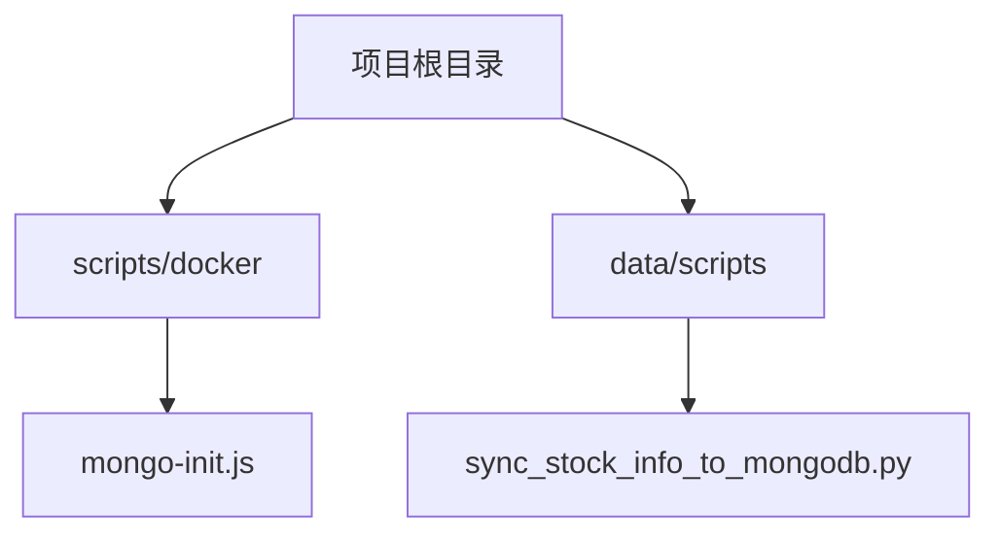
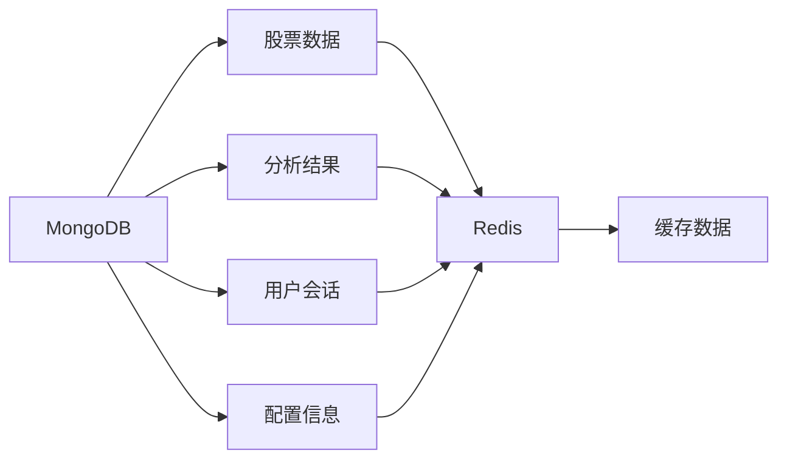
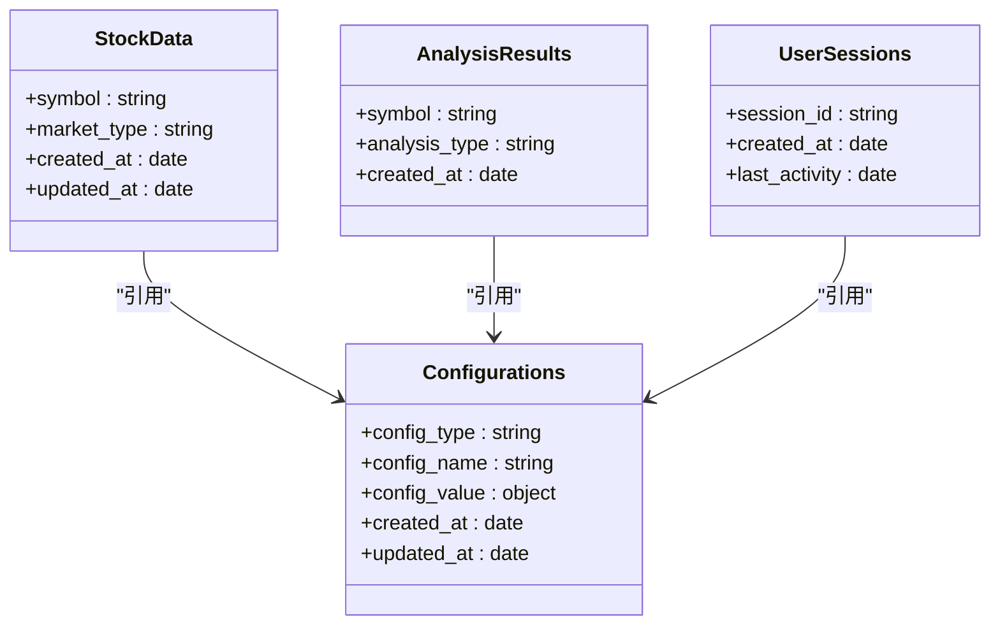
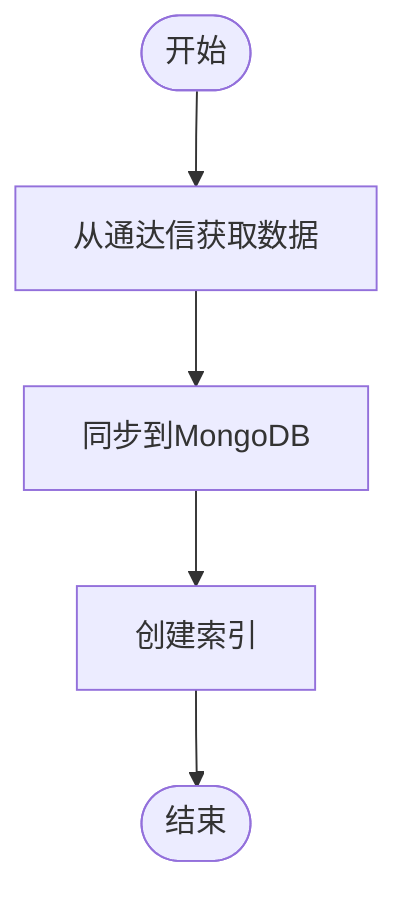
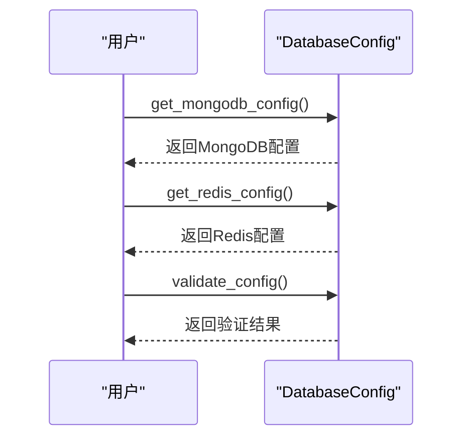
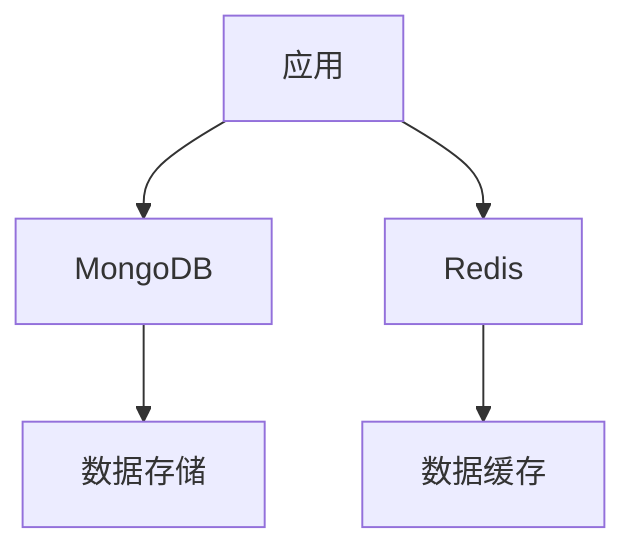

# 数据库模式设计

<cite>
**本文档引用的文件**
- [mongo-init.js](file://scripts/docker/mongo-init.js)
- [sync_stock_info_to_mongodb.py](file://data/scripts/sync_stock_info_to_mongodb.py)
- [database_config.py](file://tradingagents/config/database_config.py)
</cite>

## 目录
1. [项目结构](#项目结构)
2. [核心组件](#核心组件)
3. [架构概述](#架构概述)
4. [详细组件分析](#详细组件分析)
5. [依赖分析](#依赖分析)
6. [性能考虑](#性能考虑)
7. [故障排除指南](#故障排除指南)
8. [结论](#结论)

## 项目结构

项目结构中包含多个关键目录，其中与数据库相关的文件主要位于 `scripts/docker/` 和 `data/scripts/` 目录下。`mongo-init.js` 负责初始化 MongoDB 数据库和集合，`sync_stock_info_to_mongodb.py` 用于同步股票信息到 MongoDB。

**图示来源**
- [mongo-init.js](file://scripts/docker/mongo-init.js)
- [sync_stock_info_to_mongodb.py](file://data/scripts/sync_stock_info_to_mongodb.py)

**本节来源**
- [scripts/docker/mongo-init.js](file://scripts/docker/mongo-init.js)
- [data/scripts/sync_stock_info_to_mongodb.py](file://data/scripts/sync_stock_info_to_mongodb.py)

## 核心组件

核心组件包括 MongoDB 初始化脚本、股票信息同步脚本和数据库配置管理模块。这些组件共同确保了数据库的正确初始化、数据的同步以及配置的管理。

**本节来源**
- [mongo-init.js](file://scripts/docker/mongo-init.js)
- [sync_stock_info_to_mongodb.py](file://data/scripts/sync_stock_info_to_mongodb.py)
- [database_config.py](file://tradingagents/config/database_config.py)

## 架构概述

系统架构包括 MongoDB 作为持久化层，Redis 作为缓存层。MongoDB 用于存储股票数据、分析结果、用户会话和配置信息。Redis 用于缓存频繁访问的数据，以提高性能。

**图示来源**
- [mongo-init.js](file://scripts/docker/mongo-init.js)
- [sync_stock_info_to_mongodb.py](file://data/scripts/sync_stock_info_to_mongodb.py)

## 详细组件分析

### MongoDB 初始化脚本分析

`mongo-init.js` 脚本负责创建 `tradingagents` 数据库和初始集合，包括 `stock_data`、`analysis_results`、`user_sessions` 和 `configurations`。每个集合都创建了相应的索引以优化查询性能。

**图示来源**
- [mongo-init.js](file://scripts/docker/mongo-init.js)

**本节来源**
- [mongo-init.js](file://scripts/docker/mongo-init.js)

### 股票信息同步脚本分析

`sync_stock_info_to_mongodb.py` 脚本从通达信获取股票基础信息并同步到 MongoDB。该脚本创建了 `stock_basic_info` 集合，并为 `code`、`sse`、`sec`、`updated_at` 和 `name` 字段创建了索引。

**图示来源**
- [sync_stock_info_to_mongodb.py](file://data/scripts/sync_stock_info_to_mongodb.py)

**本节来源**
- [sync_stock_info_to_mongodb.py](file://data/scripts/sync_stock_info_to_mongodb.py)

### 数据库配置管理模块分析

`database_config.py` 模块负责管理 MongoDB 和 Redis 的连接配置。它提供了获取配置、验证配置和获取配置状态的方法。

**图示来源**
- [database_config.py](file://tradingagents/config/database_config.py)

**本节来源**
- [database_config.py](file://tradingagents/config/database_config.py)

## 依赖分析

系统依赖于 MongoDB 和 Redis 服务。MongoDB 用于持久化存储，Redis 用于缓存。`mongo-init.js` 和 `sync_stock_info_to_mongodb.py` 依赖于 MongoDB 服务，`database_config.py` 依赖于环境变量来获取连接配置。

**图示来源**
- [mongo-init.js](file://scripts/docker/mongo-init.js)
- [sync_stock_info_to_mongodb.py](file://data/scripts/sync_stock_info_to_mongodb.py)
- [database_config.py](file://tradingagents/config/database_config.py)

**本节来源**
- [mongo-init.js](file://scripts/docker/mongo-init.js)
- [sync_stock_info_to_mongodb.py](file://data/scripts/sync_stock_info_to_mongodb.py)
- [database_config.py](file://tradingagents/config/database_config.py)

## 性能考虑

为了提高查询性能，所有集合都创建了适当的索引。Redis 缓存层减少了对 MongoDB 的直接访问，从而提高了系统的响应速度。此外，`sync_stock_info_to_mongodb.py` 使用批量操作来同步数据，减少了数据库的写入压力。

**本节来源**
- [mongo-init.js](file://scripts/docker/mongo-init.js)
- [sync_stock_info_to_mongodb.py](file://data/scripts/sync_stock_info_to_mongodb.py)

## 故障排除指南

如果遇到数据库连接问题，请检查环境变量 `MONGODB_CONNECTION_STRING` 和 `REDIS_CONNECTION_STRING` 是否正确设置。如果数据同步失败，请检查通达信接口是否可用，并确保 `sync_stock_info_to_mongodb.py` 脚本具有足够的权限。

**本节来源**
- [database_config.py](file://tradingagents/config/database_config.py)
- [sync_stock_info_to_mongodb.py](file://data/scripts/sync_stock_info_to_mongodb.py)

## 结论

本文档详细介绍了 MongoDB 的集合结构、字段定义和数据关系。通过 `mongo-init.js` 初始化脚本和 `sync_stock_info_to_mongodb.py` 数据同步逻辑，确保了数据的正确存储和更新。Redis 缓存层与 MongoDB 持久化层的数据一致性策略提高了系统的性能和可靠性。