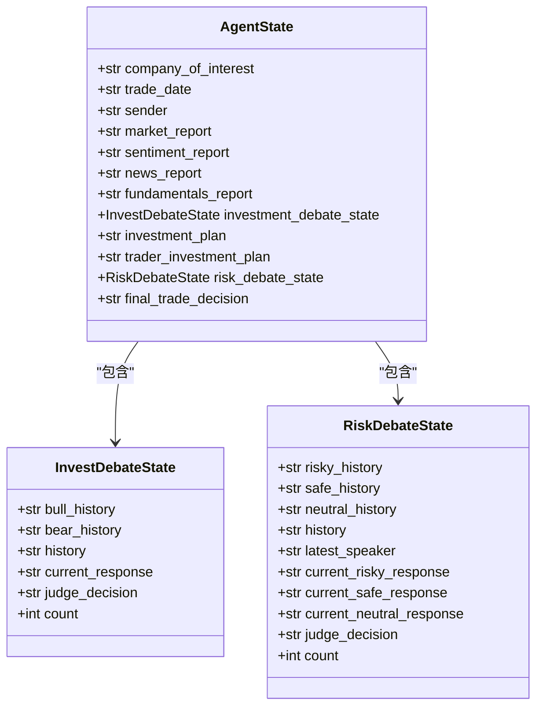
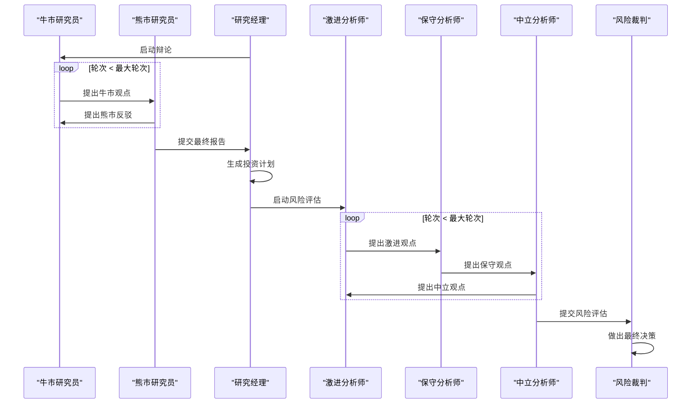
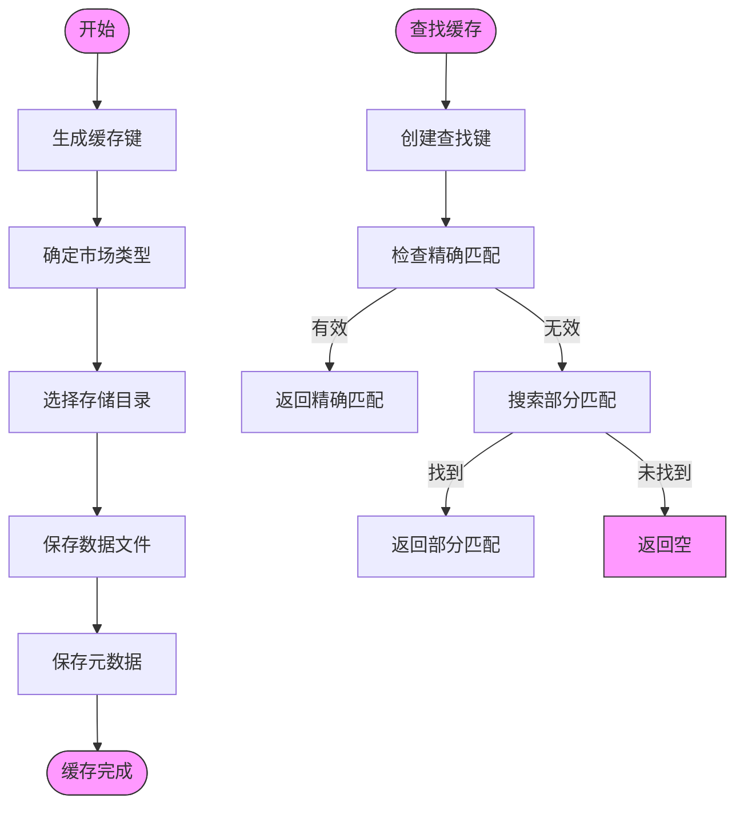

# 术语表

<cite>
**本文档引用的文件**   
- [agent_states.py](file://tradingagents/agents/utils/agent_states.py)
- [conditional_logic.py](file://tradingagents/graph/conditional_logic.py)
- [cache_manager.py](file://tradingagents/dataflows/cache_manager.py)
</cite>

## 目录
1. [核心术语定义](#核心术语定义)
2. [智能体状态机](#智能体状态机)
3. [条件分支决策机制](#条件分支决策机制)
4. [多级缓存策略](#多级缓存策略)

## 核心术语定义

### 智能体（Agent）
在本系统中，智能体指代执行特定分析任务的独立模块，如市场分析师、基本面研究员、风险管理者等。每个智能体负责处理特定类型的数据或决策任务，并通过状态机与其他智能体协作完成整体分析流程。

### 交易图（TradingGraph）
交易图是系统的核心工作流引擎，基于状态机模型组织多个智能体的协作流程。它定义了从市场分析、基本面研究到投资决策和风险管理的完整分析路径，通过条件分支控制不同分析阶段的流转。

### 缓存穿透（Cache Penetration）
缓存穿透指请求的数据既不在缓存中也不存在于后端存储的情况，导致每次请求都必须访问原始数据源。本系统通过智能缓存键生成和市场类型识别机制来减少缓存穿透的发生概率。

### 数据源适配器（Data Source Adapter）
数据源适配器是连接不同数据提供商的接口层，负责将来自TDX、YFinance、Finnhub等不同来源的数据格式统一化，为上层分析模块提供一致的数据访问接口。

**本节来源**
- [agent_states.py](file://tradingagents/agents/utils/agent_states.py#L49-L75)
- [cache_manager.py](file://tradingagents/dataflows/cache_manager.py#L16-L491)

## 智能体状态机

### 投资辩论状态（InvestDebateState）
投资辩论状态记录了多智能体在投资决策过程中的讨论状态，包含以下字段：
- **bull_history**: 牛市观点的历史对话记录
- **bear_history**: 熊市观点的历史对话记录
- **history**: 综合对话历史
- **current_response**: 当前最新响应
- **judge_decision**: 最终裁判决策
- **count**: 当前对话长度计数器

该状态用于管理牛市研究员与熊市研究员之间的辩论流程，通过计数器控制辩论轮次。

### 风险评估状态（RiskDebateState）
风险评估状态跟踪风险分析团队的讨论进展，包含以下字段：
- **risky_history**: 激进分析师的对话历史
- **safe_history**: 保守分析师的对话历史
- **neutral_history**: 中立分析师的对话历史
- **history**: 综合对话历史
- **latest_speaker**: 上一位发言的分析师
- **current_risky_response**: 激进分析师的最新响应
- **current_safe_response**: 保守分析师的最新响应
- **current_neutral_response**: 中立分析师的最新响应
- **judge_decision**: 风险裁判决策
- **count**: 当前对话长度计数器

该状态支持三重辩论机制，确保风险评估的全面性。



**图示来源**
- [agent_states.py](file://tradingagents/agents/utils/agent_states.py#L10-L20)
- [agent_states.py](file://tradingagents/agents/utils/agent_states.py#L24-L46)
- [agent_states.py](file://tradingagents/agents/utils/agent_states.py#L49-L75)

**本节来源**
- [agent_states.py](file://tradingagents/agents/utils/agent_states.py#L10-L75)

## 条件分支决策机制

### 辩论流程控制
`ConditionalLogic` 类负责管理分析流程中的条件分支决策，其核心方法 `should_continue_debate` 实现了投资辩论的流转逻辑：

```python
def should_continue_debate(self, state: AgentState) -> str:
    if state["investment_debate_state"]["count"] >= 2 * self.max_debate_rounds:
        return "Research Manager"
    if state["investment_debate_state"]["current_response"].startswith("Bull"):
        return "Bear Researcher"
    return "Bull Researcher"
```

该逻辑实现：
1. 当辩论轮次达到预设最大值时，将控制权交还给研究经理
2. 根据当前响应内容决定下一位发言者，形成"牛-熊"交替辩论模式

### 风险分析流程控制
风险分析的流转逻辑由 `should_continue_risk_analysis` 方法实现：

```python
def should_continue_risk_analysis(self, state: AgentState) -> str:
    if state["risk_debate_state"]["count"] >= 3 * self.max_risk_discuss_rounds:
        return "Risk Judge"
    if state["risk_debate_state"]["latest_speaker"].startswith("Risky"):
        return "Safe Analyst"
    if state["risk_debate_state"]["latest_speaker"].startswith("Safe"):
        return "Neutral Analyst"
    return "Risky Analyst"
```

该逻辑实现三重辩论机制：
1. 当讨论轮次达到上限时，将决策权交给风险裁判
2. 按照"激进→保守→中立→激进"的循环顺序进行观点交换



**图示来源**
- [conditional_logic.py](file://tradingagents/graph/conditional_logic.py#L45-L54)
- [conditional_logic.py](file://tradingagents/graph/conditional_logic.py#L56-L66)

**本节来源**
- [conditional_logic.py](file://tradingagents/graph/conditional_logic.py#L5-L66)

## 多级缓存策略

### 缓存架构设计
`StockDataCache` 类实现了多级缓存策略，支持对美股和A股数据的分类存储与管理。系统根据股票代码特征自动识别市场类型（6位数字为A股，其他为美股），并相应地应用不同的缓存策略。

### 缓存配置参数
系统为不同类型的数据设置了差异化的TTL（Time To Live）策略：

| 数据类型 | 美股TTL（小时） | A股TTL（小时） | 描述 |
|---------|---------------|---------------|------|
| 股票数据 | 2 | 1 | 考虑到API限制和实时性要求 |
| 新闻数据 | 6 | 4 | 新闻时效性管理 |
| 基本面数据 | 24 | 12 | 基本面更新频率 |

### 缓存操作流程
缓存系统的主要操作流程包括：

1. **缓存键生成**: 基于数据类型、股票代码和参数生成唯一缓存键
2. **路径确定**: 根据市场类型和数据类型选择相应的存储目录
3. **元数据管理**: 为每个缓存项维护元数据，包含创建时间、数据源等信息
4. **有效性验证**: 检查缓存项是否在有效期内
5. **智能查找**: 支持精确匹配和部分匹配的缓存查找



**图示来源**
- [cache_manager.py](file://tradingagents/dataflows/cache_manager.py#L16-L491)

**本节来源**
- [cache_manager.py](file://tradingagents/dataflows/cache_manager.py#L16-L491)