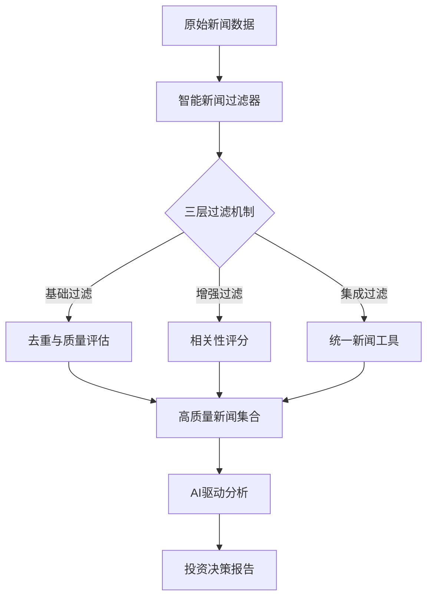
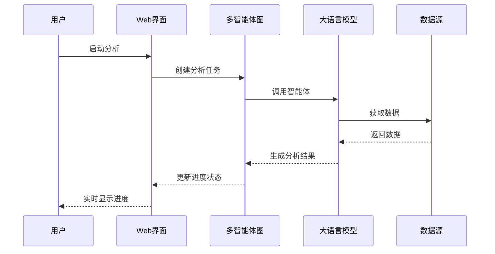
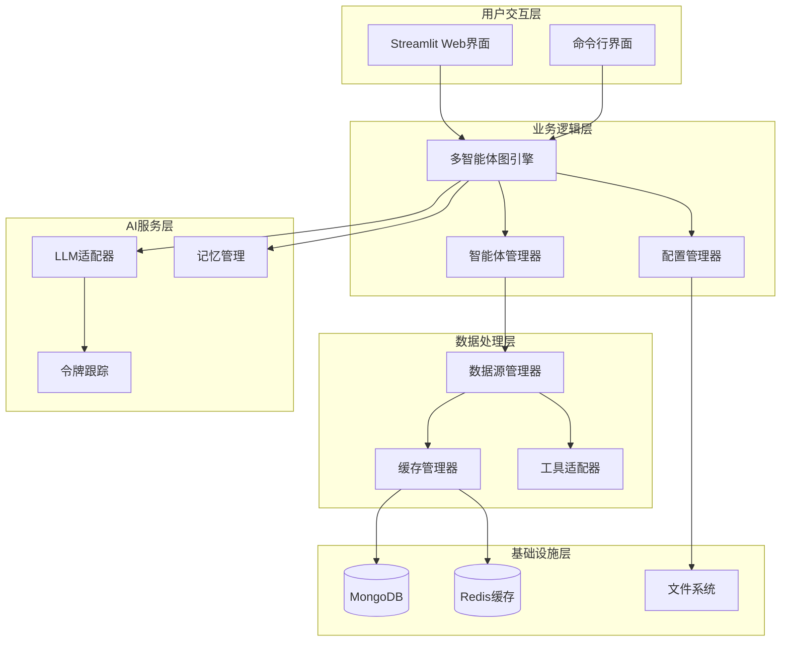
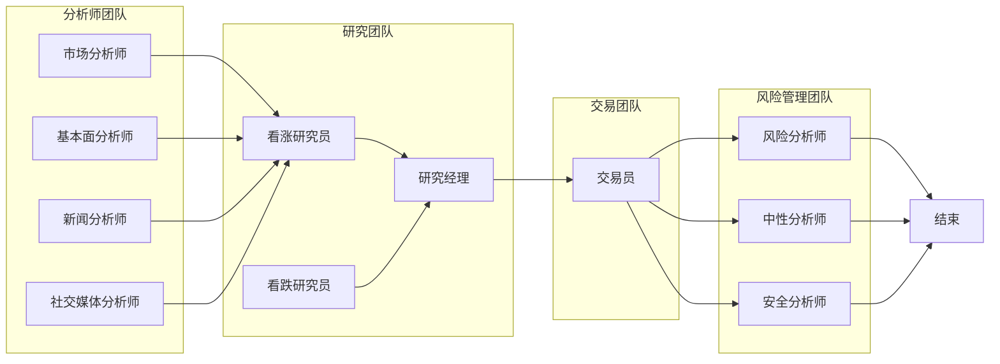
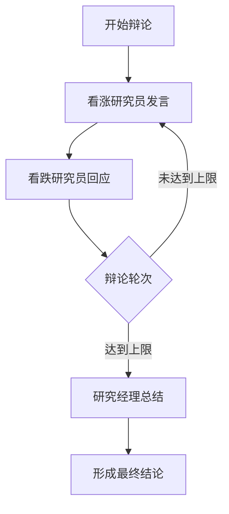
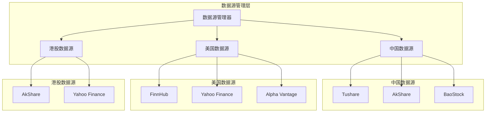
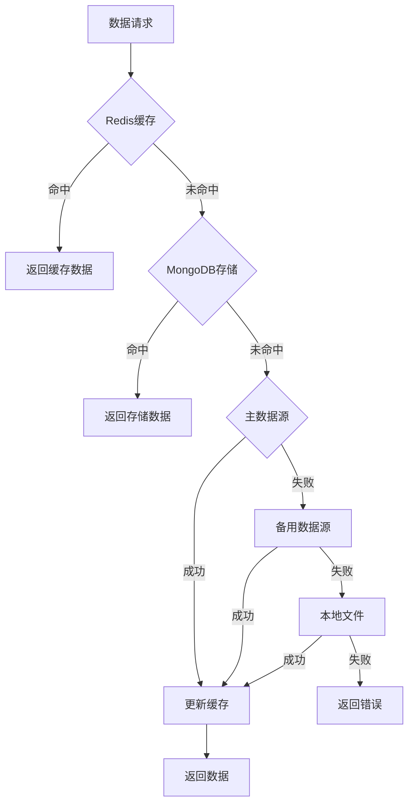
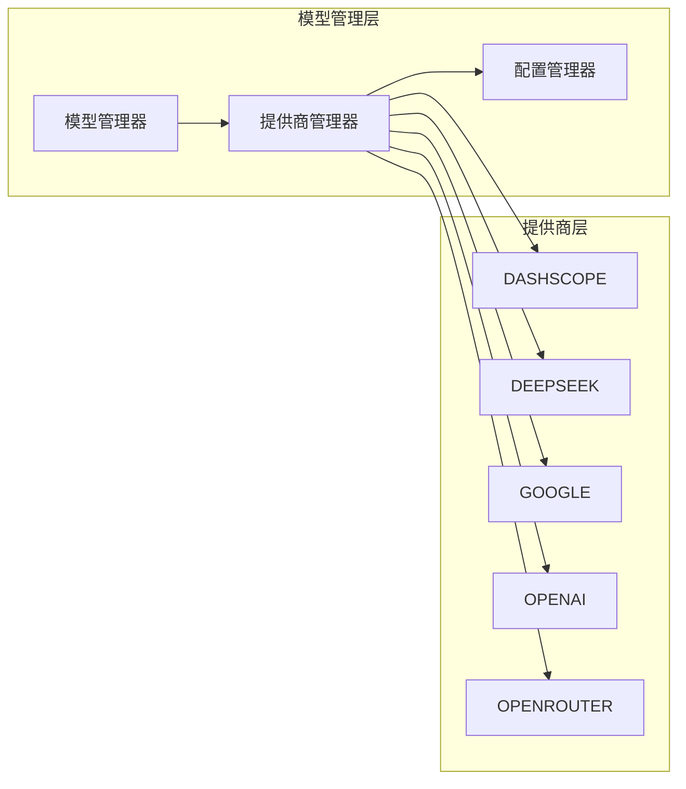
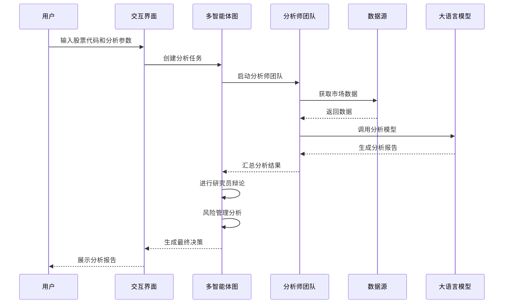

# TradingAgents-CN 项目概述

<cite>
**本文档引用的文件**
- [README.md](file://README.md)
- [main.py](file://main.py)
- [pyproject.toml](file://pyproject.toml)
- [QUICKSTART.md](file://QUICKSTART.md)
- [tradingagents/__init__.py](file://tradingagents/__init__.py)
- [tradingagents/graph/trading_graph.py](file://tradingagents/graph/trading_graph.py)
- [web/app.py](file://web/app.py)
- [cli/main.py](file://cli/main.py)
- [tradingagents/default_config.py](file://tradingagents/default_config.py)
- [tradingagents/dataflows/data_source_manager.py](file://tradingagents/dataflows/data_source_manager.py)
- [tradingagents/llm_adapters/dashscope_adapter.py](file://tradingagents/llm_adapters/dashscope_adapter.py)
- [examples/simple_analysis_demo.py](file://examples/simple_analysis_demo.py)
- [tradingagents/graph/setup.py](file://tradingagents/graph/setup.py)
- [tradingagents/agents/analysts/fundamentals_analyst.py](file://tradingagents/agents/analysts/fundamentals_analyst.py)
- [requirements.txt](file://requirements.txt)
</cite>

## 目录
1. [项目简介](#项目简介)
2. [核心价值与技术特色](#核心价值与技术特色)
3. [系统架构设计](#系统架构设计)
4. [多智能体协作机制](#多智能体协作机制)
5. [双交互模式](#双交互模式)
6. [技术栈详解](#技术栈详解)
7. [金融数据源集成](#金融数据源集成)
8. [LLM提供商适配器](#llm提供商适配器)
9. [实际使用场景](#实际使用场景)
10. [学习路径指引](#学习路径指引)
11. [扩展点与定制化](#扩展点与定制化)
12. [总结](#总结)

## 项目简介

TradingAgents-CN 是一个基于多智能体大语言模型的股票投资决策框架，专为中文用户优化，提供完整的A股、港股、美股分析能力。该项目是基于 Tauric Research 团队的革命性多智能体交易框架 TradingAgents 的中文增强版本，致力于推动AI金融技术在中文社区的普及应用。

### 项目定位

TradingAgents-CN 定位为**中文金融交易决策框架**，专注于：
- **多市场支持**：原生支持A股、港股、美股的综合分析
- **智能决策**：基于多智能体协作的自动化投资决策系统
- **中文优化**：完整的中文本地化体验，支持国产大模型
- **企业级应用**：具备完整的用户权限管理、数据缓存、性能优化等功能

**章节来源**
- [README.md](file://README.md#L1-L50)
- [tradingagents/__init__.py](file://tradingagents/__init__.py#L1-L24)

## 核心价值与技术特色

### 智能新闻分析系统

TradingAgents-CN 在 v0.1.12 版本中新增了革命性的智能新闻分析功能：



**图表来源**
- [tradingagents/dataflows/data_source_manager.py](file://tradingagents/dataflows/data_source_manager.py#L1-L50)

### 多LLM提供商集成

系统支持四大LLM提供商，60+模型的统一管理：

| 提供商 | 支持模型 | 特色功能 | 成本效益 |
|--------|----------|----------|----------|
| 阿里百炼 | qwen-turbo/plus/max | 中文优化，成本效益高 | 💰 极低 |
| DeepSeek | deepseek-chat | 工具调用，性价比极高 | 💰 低 |
| Google AI | gemini-2.5-pro/flash | 推理能力强，多模态 | 💰💰 中等 |
| OpenAI | GPT-4o系列 | 通用能力强 | 💰💰💰 高 |

### 实时进度跟踪

采用异步进度跟踪机制，告别传统黑盒等待：



**图表来源**
- [tradingagents/graph/trading_graph.py](file://tradingagents/graph/trading_graph.py#L200-L300)
- [web/app.py](file://web/app.py#L100-L200)

**章节来源**
- [README.md](file://README.md#L100-L200)
- [tradingagents/default_config.py](file://tradingagents/default_config.py#L1-L28)

## 系统架构设计

### 整体架构概览

TradingAgents-CN 采用分层架构设计，确保系统的可扩展性和维护性：



**图表来源**
- [tradingagents/graph/trading_graph.py](file://tradingagents/graph/trading_graph.py#L1-L50)
- [tradingagents/graph/setup.py](file://tradingagents/graph/setup.py#L1-L50)

### LangGraph驱动的多智能体协作

系统基于 LangGraph 构建了强大的多智能体协作机制：



**图表来源**
- [tradingagents/graph/setup.py](file://tradingagents/graph/setup.py#L100-L200)

**章节来源**
- [tradingagents/graph/trading_graph.py](file://tradingagents/graph/trading_graph.py#L1-L100)
- [tradingagents/graph/setup.py](file://tradingagents/graph/setup.py#L1-L100)

## 多智能体协作机制

### 专业分工架构

TradingAgents-CN 实现了高度专业化的智能体分工：

#### 分析师团队
- **市场分析师**：技术指标分析、趋势预测、支撑阻力位识别
- **基本面分析师**：财务报表分析、盈利能力评估、估值模型构建
- **新闻分析师**：实时新闻监控、情感分析、事件影响评估
- **社交媒体分析师**：Reddit情绪分析、市场热度监测、投资者情绪追踪

#### 研究团队
- **看涨研究员**：积极乐观的市场观点，寻找上涨机会
- **看跌研究员**：谨慎悲观的市场观点，识别潜在风险
- **研究经理**：整合双方观点，形成综合研究结论

#### 交易团队
- **交易员**：基于所有输入做出最终投资决策，制定交易计划

#### 风险管理团队
- **风险分析师**：激进投资策略的风险评估
- **中性分析师**：平衡的投资观点
- **安全分析师**：保守投资策略的风险评估

### 智能辩论机制

系统实现了多轮智能体辩论，确保分析的全面性和客观性：



**图表来源**
- [tradingagents/graph/setup.py](file://tradingagents/graph/setup.py#L150-L200)

**章节来源**
- [tradingagents/graph/setup.py](file://tradingagents/graph/setup.py#L50-L150)
- [tradingagents/agents/analysts/fundamentals_analyst.py](file://tradingagents/agents/analysts/fundamentals_analyst.py#L1-L100)

## 双交互模式

### Streamlit Web界面

Web界面提供了现代化的响应式用户体验：

#### 主要功能特性
- **智能配置面板**：支持多市场股票分析，5级研究深度选择
- **实时进度跟踪**：可视化分析过程，智能时间预估
- **专业结果展示**：多维度分析结果，一键导出功能
- **用户权限管理**：完整的用户认证和权限控制系统

#### 界面设计原则
- **简洁直观**：去除冗余元素，专注于核心功能
- **响应式设计**：适配各种设备和屏幕尺寸
- **流畅交互**：实时反馈，避免长时间等待

### CLI命令行工具

CLI工具提供了专业的命令行交互体验：

#### 核心优势
- **界面清爽**：移除控制台输出，保持界面整洁
- **彩色输出**：Rich库支持的彩色进度指示
- **智能进度**：多阶段进度跟踪，防止重复提示
- **时间预估**：智能分析阶段显示预计耗时

#### 使用场景
- **批量处理**：适合自动化脚本和批量分析
- **开发调试**：便于开发者进行功能测试
- **服务器部署**：适合无图形界面的服务器环境

**章节来源**
- [web/app.py](file://web/app.py#L1-L100)
- [cli/main.py](file://cli/main.py#L1-L100)

## 技术栈详解

### 核心技术框架

TradingAgents-CN 基于以下核心技术构建：

#### Python 生态系统
- **Python 3.10+**：现代Python特性支持
- **LangChain**：大语言模型应用开发框架
- **LangGraph**：多智能体协作框架
- **Streamlit**：Web界面快速开发框架

#### 数据处理与分析
- **Pandas**：数据分析和处理
- **NumPy**：数值计算
- **Plotly**：交互式图表绘制
- **Backtrader**：回测和交易策略开发

#### 数据库与缓存
- **MongoDB**：文档型数据库，用于数据持久化
- **Redis**：高性能缓存，提升响应速度
- **ChromaDB**：向量数据库，支持语义搜索

### 开发工具链

#### 包管理
- **Poetry**：现代Python包管理和虚拟环境
- **Setuptools**：传统包构建工具
- **UV**：新一代包管理器（推荐）

#### 测试与质量
- **pytest**：单元测试框架
- **Coverage.py**：代码覆盖率测试
- **Black**：代码格式化工具
- **Ruff**：Python代码检查工具

#### 部署与运维
- **Docker**：容器化部署
- **Docker Compose**：多容器编排
- **GitHub Actions**：持续集成/持续部署
- **Prometheus + Grafana**：监控和可视化

**章节来源**
- [pyproject.toml](file://pyproject.toml#L1-L61)
- [requirements.txt](file://requirements.txt#L1-L42)

## 金融数据源集成

### 多市场数据支持

TradingAgents-CN 实现了统一的数据源管理机制，支持三大主要市场：

#### A股市场
- **Tushare**：专业A股数据API，提供实时行情、历史数据、财务指标
- **AkShare**：开源金融数据接口，支持多种数据源
- **BaoStock**：国内证券数据提供商

#### 港股市场
- **AkShare**：支持港股实时行情和历史数据
- **Yahoo Finance**：国际通用金融数据源

#### 美股市场
- **FinnHub**：高质量美股数据API
- **Yahoo Finance**：免费美股数据源
- **Alpha Vantage**：专业金融数据服务

### 数据源管理架构



**图表来源**
- [tradingagents/dataflows/data_source_manager.py](file://tradingagents/dataflows/data_source_manager.py#L20-L80)

### 智能降级机制

系统实现了多层数据源降级策略，确保高可用性：



**图表来源**
- [tradingagents/dataflows/data_source_manager.py](file://tradingagents/dataflows/data_source_manager.py#L300-L400)

**章节来源**
- [tradingagents/dataflows/data_source_manager.py](file://tradingagents/dataflows/data_source_manager.py#L1-L100)

## LLM提供商适配器

### 统一适配器架构

TradingAgents-CN 实现了统一的LLM适配器架构，支持多种大语言模型提供商：

#### 支持的LLM提供商

| 提供商 | 适配器类 | 特色功能 | 适用场景 |
|--------|----------|----------|----------|
| 阿里百炼 | ChatDashScopeOpenAI | 原生工具调用支持 | 中文优化，成本效益高 |
| DeepSeek | ChatDeepSeek | 令牌统计功能 | 工具调用，性价比高 |
| Google AI | ChatGoogleOpenAI | 工具调用格式优化 | 推理能力强，多模态 |
| OpenAI | ChatOpenAI | 标准OpenAI兼容 | 通用性强，生态丰富 |
| OpenRouter | ChatOpenAI | 模型聚合平台 | 60+模型一站式访问 |

### 模型选择与管理



**图表来源**
- [tradingagents/llm_adapters/dashscope_adapter.py](file://tradingagents/llm_adapters/dashscope_adapter.py#L1-L50)

### 工具调用优化

针对不同LLM提供商的工具调用特性进行了专门优化：

#### 阿里百炼适配器
- **原生工具调用支持**：直接使用DashScope的工具调用功能
- **令牌统计**：自动记录输入输出令牌使用量
- **格式优化**：针对中文场景的提示词优化

#### Google AI适配器
- **工具调用格式转换**：解决Google模型的工具调用格式差异
- **统一处理器**：使用GoogleToolCallHandler统一处理工具调用
- **内容格式化**：优化输出内容的格式和结构

#### DeepSeek适配器
- **令牌跟踪**：内置令牌使用量统计功能
- **成本控制**：支持精细化的成本管理
- **工具调用**：完整的工具调用支持

**章节来源**
- [tradingagents/llm_adapters/dashscope_adapter.py](file://tradingagents/llm_adapters/dashscope_adapter.py#L1-L100)

## 实际使用场景

### 从用户输入到最终决策的完整流程

TradingAgents-CN 的典型使用流程展示了其强大的自动化能力：



**图表来源**
- [main.py](file://main.py#L1-L27)
- [tradingagents/graph/trading_graph.py](file://tradingagents/graph/trading_graph.py#L300-L400)

### 典型应用场景

#### 1. 投资决策支持
- **短期交易**：技术面分析，趋势预测，买卖点识别
- **长期投资**：基本面分析，财务健康度评估，估值分析
- **组合管理**：资产配置，风险分散，收益优化

#### 2. 市场研究
- **行业分析**：同行业公司对比，竞争优势评估
- **宏观研究**：经济周期判断，政策影响分析
- **专题研究**：特定主题的投资机会挖掘

#### 3. 风险管理
- **压力测试**：极端市场情景下的投资组合表现
- **风险预警**：实时监控投资组合风险指标
- **合规检查**：确保投资决策符合监管要求

### 使用示例

#### 基本分析流程
1. **启动应用**：`python start_web.py` 或 Docker部署
2. **配置参数**：选择LLM提供商、分析深度、分析师类型
3. **输入股票**：输入股票代码（如 AAPL、000001、0700.HK）
4. **开始分析**：点击"🚀 开始分析"按钮
5. **查看结果**：实时跟踪进度，查看分析报告
6. **导出报告**：一键导出专业格式报告

#### 高级定制功能
- **自定义提示词**：修改分析提示词模板
- **参数调优**：调整分析深度、时间范围等参数
- **结果验证**：与其他分析工具的结果对比验证

**章节来源**
- [examples/simple_analysis_demo.py](file://examples/simple_analysis_demo.py#L1-L100)
- [QUICKSTART.md](file://QUICKSTART.md#L1-L100)

## 学习路径指引

### 初学者学习路径

#### 第一阶段：环境搭建与基础使用
1. **环境准备**
   - 安装Python 3.10+
   - 配置API密钥（阿里百炼、DeepSeek等）
   - 安装项目依赖

2. **快速入门**
   - 运行示例分析：`python examples/simple_analysis_demo.py`
   - 体验Web界面：访问 `http://localhost:8501`
   - 熟悉CLI工具：`python -m cli.main analyze`

3. **基础概念**
   - 了解多智能体协作原理
   - 理解不同分析师的职责分工
   - 掌握基本的分析参数配置

#### 第二阶段：深入理解与定制
1. **架构学习**
   - 阅读核心代码：`tradingagents/graph/trading_graph.py`
   - 理解数据流处理：`tradingagents/dataflows/`
   - 学习LLM适配器设计：`tradingagents/llm_adapters/`

2. **功能定制**
   - 修改分析提示词
   - 添加新的数据源
   - 扩展智能体功能

3. **性能优化**
   - 学习缓存机制
   - 了解数据库配置
   - 掌握Docker部署

#### 第三阶段：高级应用与贡献
1. **深度定制**
   - 开发新的分析师智能体
   - 实现自定义数据源
   - 优化LLM适配器

2. **社区贡献**
   - 参与代码审查
   - 贡献新的功能模块
   - 完善文档和示例

### 经验开发者指导

#### 核心扩展点
1. **智能体扩展**
   - 创建新的分析师类型
   - 实现特殊领域的分析能力
   - 优化现有智能体的性能

2. **数据源扩展**
   - 添加新的金融数据提供商
   - 实现自定义数据处理逻辑
   - 优化数据缓存策略

3. **LLM适配器扩展**
   - 支持新的大语言模型
   - 实现特殊的模型功能
   - 优化令牌使用效率

#### 最佳实践
1. **代码组织**
   - 遵循项目的模块化设计
   - 保持良好的命名规范
   - 编写清晰的文档注释

2. **测试策略**
   - 编写单元测试覆盖核心功能
   - 进行集成测试验证系统完整性
   - 实施性能测试确保响应速度

3. **部署考虑**
   - 考虑生产环境的稳定性
   - 实施监控和日志记录
   - 制定备份和恢复策略

**章节来源**
- [QUICKSTART.md](file://QUICKSTART.md#L1-L100)
- [examples/simple_analysis_demo.py](file://examples/simple_analysis_demo.py#L100-L200)

## 扩展点与定制化

### 智能体扩展机制

TradingAgents-CN 提供了灵活的智能体扩展机制：

#### 新增分析师智能体
```python
# 示例：创建新的分析师智能体
def create_custom_analyst(llm, toolkit):
    def custom_analyst_node(state):
        # 实现自定义分析逻辑
        # 调用工具获取数据
        # 使用LLM生成分析报告
        return {"custom_report": analysis_result}
    
    return custom_analyst_node
```

#### 自定义数据源
```python
# 示例：添加新的数据源适配器
class CustomDataSource:
    def __init__(self, config):
        self.config = config
    
    def get_stock_data(self, symbol, start_date, end_date):
        # 实现数据获取逻辑
        pass
    
    def get_fundamentals(self, symbol):
        # 实现基本面数据获取
        pass
```

### 配置系统定制

#### 环境变量配置
- **API密钥管理**：支持多种LLM提供商的密钥配置
- **功能开关**：控制在线工具、缓存等功能的启用状态
- **性能参数**：调整分析深度、超时时间等参数

#### 动态配置管理
- **运行时配置**：支持在运行时修改配置参数
- **用户偏好**：保存用户的个性化设置
- **A/B测试**：支持不同配置的对比测试

### 插件系统

#### 工具插件
- **数据源插件**：扩展新的金融数据源
- **分析算法插件**：添加新的分析方法
- **输出格式插件**：支持不同的报告格式

#### 模型插件
- **LLM适配器插件**：支持新的大语言模型
- **提示词模板插件**：自定义分析提示词
- **后处理插件**：对分析结果进行二次处理

### 监控与日志系统

#### 令牌使用监控
- **使用量统计**：自动记录每个模型的令牌使用量
- **成本分析**：提供详细的成本计算和分析
- **预算控制**：设置使用量上限和告警机制

#### 性能监控
- **响应时间监控**：跟踪各组件的响应时间
- **错误率统计**：监控系统的错误发生率
- **资源使用**：监控CPU、内存、网络等资源使用情况

**章节来源**
- [tradingagents/graph/setup.py](file://tradingagents/graph/setup.py#L200-L254)
- [tradingagents/default_config.py](file://tradingagents/default_config.py#L1-L28)

## 总结

TradingAgents-CN 作为一个基于多智能体大语言模型的股票投资决策系统，展现了AI技术在金融领域的强大应用潜力。其核心价值体现在以下几个方面：

### 技术创新性
- **多智能体协作**：实现了专业化分工的智能体团队，每个智能体都有独特的视角和专长
- **LangGraph驱动**：基于LangGraph的流式处理架构，支持复杂的多步骤分析流程
- **统一适配器**：标准化的LLM适配器设计，支持多种大语言模型提供商

### 功能完整性
- **多市场支持**：原生支持A股、港股、美股的综合分析
- **智能新闻分析**：革命性的AI驱动新闻过滤和质量评估系统
- **实时进度跟踪**：告别传统黑盒等待，提供透明的分析过程

### 用户体验
- **双交互模式**：Streamlit Web界面和CLI工具满足不同用户需求
- **中文本地化**：完整的中文优化，支持国产大模型
- **企业级功能**：用户权限管理、数据缓存、性能监控等企业级特性

### 可扩展性
- **模块化设计**：清晰的架构分层，便于功能扩展和定制
- **插件系统**：支持新的数据源、分析算法和输出格式
- **社区生态**：活跃的开源社区，持续的功能迭代和改进

TradingAgents-CN 不仅是一个技术产品，更是AI金融应用的一个标杆项目。它展示了如何将先进的AI技术与传统的金融分析相结合，为投资者提供更加智能、高效、可靠的决策支持。随着AI技术的不断发展，TradingAgents-CN 将继续演进，为中文金融市场的智能化发展贡献力量。

对于希望进入AI金融领域的开发者和研究人员，TradingAgents-CN 提供了一个优秀的学习平台和实践基础。通过深入理解和使用这个项目，可以掌握多智能体系统的设计思想、LLM应用的最佳实践、以及金融数据分析的核心技能。