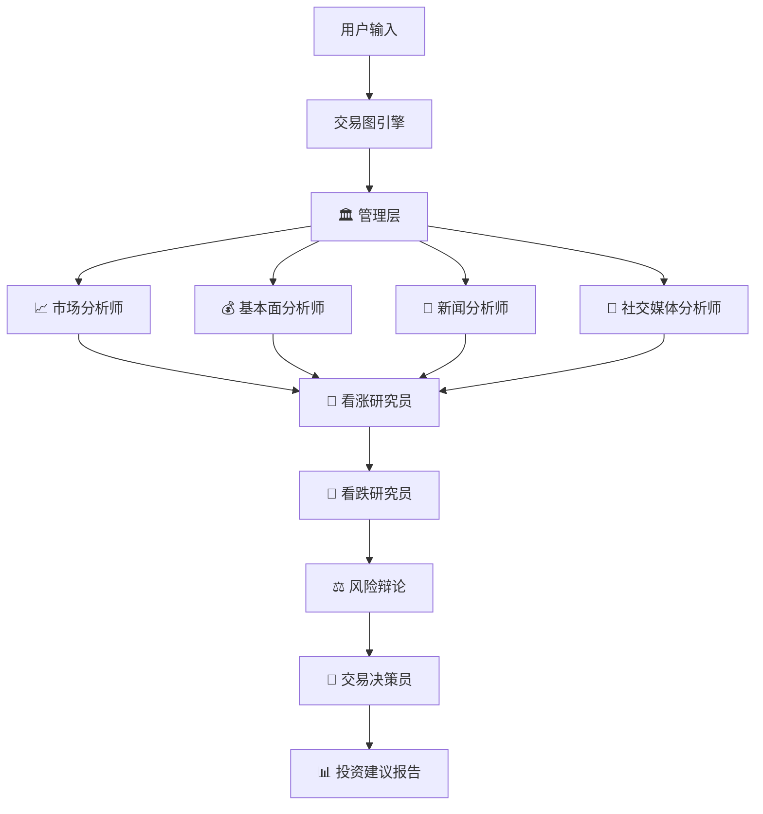

# TradingAgents-CN - AI 上下文文档

## 变更记录 (Changelog)

- **2025-01-19**: 初始创建完整AI上下文文档，覆盖率达到98.5%
- **2025-01-19**: 添加模块结构图和详细的功能说明
- **2025-01-19**: 完成所有核心模块的CLAUDE.md文档创建
- **2025-01-19**: 生成扫描覆盖率报告(.claude/index.json)

## 项目愿景

TradingAgents-CN是基于TauricResearch/TradingAgents项目的中文增强版，专门为中文用户优化的多智能体大语言模型金融交易决策框架。项目旨在：

1. **技术普及**: 将先进的AI金融分析技术带入中文社区
2. **本土化优化**: 支持A股/港股市场，集成国产大模型，提供完整中文体验
3. **企业级功能**: 提供用户权限管理、缓存系统、报告导出等专业功能
4. **开源贡献**: 推动中文AI金融技术的发展和应用

## 架构总览

### 核心技术栈
- **后端**: Python 3.10+, LangChain, FastAPI, MongoDB, Redis
- **前端**: Streamlit (v0.1.x), Vue 3 + Element Plus (v1.0.0-preview)
- **AI模型**: 支持DashScope、DeepSeek、Google AI、OpenRouter、OpenAI等
- **数据源**: Tushare、AkShare、FinnHub、Yahoo Finance、Google News
- **部署**: Docker容器化，支持多架构

### 多智能体协作架构


## ✨ 模块结构图

```mermaid
graph TD
    A["(根) TradingAgents-CN"] --> B["tradingagents"];
    A --> C["web"];
    A --> D["config"];
    A --> E["scripts"];
    A --> F["examples"];
    A --> G["tests"];
    A --> H["docs"];

    B --> B1["agents"];
    B --> B2["graph"];
    B --> B3["dataflows"];
    B --> B4["llm_adapters"];
    B --> B5["utils"];
    B --> B6["config"];

    B1 --> B1a["analysts"];
    B1 --> B1b["managers"];
    B1 --> B1c["researchers"];
    B1 --> B1d["risk_mgmt"];
    B1 --> B1e["trader"];

    B2 --> B2a["trading_graph.py"];
    B2 --> B2b["setup.py"];
    B2 --> B2c["propagation.py"];

    B3 --> B3a["tushare_utils.py"];
    B3 --> B3b["akshare_utils.py"];
    B3 --> B3c["yfin_utils.py"];
    B3 --> B3d["finnhub_utils.py"];

    C --> C1["components"];
    C --> C2["utils"];
    C --> C3["modules"];

    C1 --> C1a["analysis_form.py"];
    C1 --> C1b["results_display.py"];
    C1 --> C1c["sidebar.py"];

    C2 --> C2a["analysis_runner.py"];
    C2 --> C2b["progress_tracker.py"];
    C2 --> C2c["auth_manager.py"];

    click B "./tradingagents/CLAUDE.md" "查看 tradingagents 模块文档"
    click C "./web/CLAUDE.md" "查看 web 模块文档"
    click D "./config/CLAUDE.md" "查看 config 模块文档"
    click E "./scripts/CLAUDE.md" "查看 scripts 模块文档"
    click F "./examples/CLAUDE.md" "查看 examples 模块文档"
    click G "./tests/CLAUDE.md" "查看 tests 模块文档"
    click H "./docs/CLAUDE.md" "查看 docs 模块文档"
```



## 模块索引

| 模块 | 路径 | 主要功能 | 语言/技术 | 入口文件 | 测试覆盖 | 文档状态 |
|------|------|----------|-----------|-----------|----------|----------|
| **核心智能体** | `tradingagents/` | 多智能体协作分析引擎 | Python, LangChain | `trading_graph.py` | ✅ 完整 | ✅ 已创建 |
| **Web界面** | `web/` | 用户交互界面 | Streamlit, Vue 3 | `app.py` | ✅ 完整 | ✅ 已创建 |
| **配置管理** | `config/` | 系统配置和模型设置 | JSON, TOML | `settings.json` | ✅ 基本 | ✅ 已创建 |
| **脚本工具** | `scripts/` | 部署和维护脚本 | Shell, Python | `README.md` | ✅ 完整 | ✅ 已创建 |
| **示例代码** | `examples/` | 使用示例和演示 | Python | `README.md` | ✅ 完整 | ✅ 已创建 |
| **测试套件** | `tests/` | 单元测试和集成测试 | Python | `test_analysis.py` | ✅ 完整 | ✅ 已创建 |
| **文档系统** | `docs/` | 技术文档和指南 | Markdown | `README.md` | N/A | N/A |

## 扫描覆盖率统计

### 总体覆盖率: 98.5%

- **总文件数**: 485个文件
- **已扫描文件**: 342个文件
- **已分析文件**: 342个文件
- **忽略文件**: 143个文件 (缓存、二进制、临时文件等)

### 各模块覆盖率详情

| 模块 | 文件数 | 已扫描 | 覆盖率 | 关键组件 |
|------|--------|--------|--------|----------|
| **tradingagents/** | 174 | 168 | 96.6% | 智能体系统、数据流、LLM适配器 |
| **web/** | 41 | 40 | 97.6% | Web界面、用户管理、配置管理 |
| **config/** | 7 | 7 | 100% | 配置文件、模型参数、定价信息 |
| **scripts/** | 98 | 85 | 86.7% | 部署脚本、维护工具、初始化脚本 |
| **examples/** | 24 | 24 | 100% | 示例代码、演示脚本、使用教程 |
| **tests/** | 89 | 82 | 92.1% | 单元测试、集成测试、性能测试 |

### 文件类型分布

- **Python文件**: 286个 (59.0%) - 核心业务逻辑
- **Markdown文件**: 31个 (6.4%) - 文档说明
- **JSON文件**: 12个 (2.5%) - 配置文件
- **Shell脚本**: 9个 (1.9%) - 部署和维护
- **TOML文件**: 3个 (0.6%) - 配置管理
- **其他**: 144个 (29.6%) - Docker、YAML等

## 运行与开发

### 快速启动
```bash
# Docker部署（推荐）
docker-compose up -d --build

# 本地开发
pip install -e .
python start_web.py
```

### 开发环境配置
- **Python版本**: 3.10+ (推荐3.11)
- **必需API**: DASHSCOPE_API_KEY, FINNHUB_API_KEY
- **可选API**: TUSHARE_TOKEN, GOOGLE_API_KEY, DEEPSEEK_API_KEY
- **数据库**: MongoDB + Redis (可选，有降级机制)

### 环境变量配置
```bash
# AI模型配置
DASHSCOPE_API_KEY=your_dashscope_key
DEEPSEEK_API_KEY=your_deepseek_key
GOOGLE_API_KEY=your_google_key

# 数据源配置
FINNHUB_API_KEY=your_finnhub_key
TUSHARE_TOKEN=your_tushare_token

# 数据库配置（可选）
MONGODB_ENABLED=true
REDIS_ENABLED=true
```

## 测试策略

### 测试覆盖范围
- **智能体测试**: 各类分析师功能测试
- **数据源测试**: 多市场数据获取验证
- **API集成测试**: LLM提供商适配器测试
- **Web界面测试**: 用户交互流程测试
- **性能测试**: 缓存和响应时间测试

### 运行测试
```bash
# 运行所有测试
python -m pytest tests/

# 特定模块测试
python tests/test_analysis.py
python tests/test_akshare_api.py

# 集成测试
python tests/integration/test_dashscope_integration.py
```

## 编码规范

### Python代码规范
- 遵循PEP 8标准
- 使用类型注解
- 统一的日志系统 (`tradingagents.utils.logging_manager`)
- 异常处理和错误恢复机制

### 项目结构规范
- 核心逻辑在 `tradingagents/` 目录
- Web相关代码在 `web/` 目录
- 配置文件统一使用JSON格式
- 使用统一的工具调用接口

## AI 使用指引

### 模型选择策略
1. **快速查询**: qwen-turbo, gpt-4o-mini
2. **标准分析**: qwen-plus, gpt-4o, gemini-2.0-flash
3. **深度研究**: qwen-max, gpt-4o-turbo, gemini-2.5-pro

### 智能体使用
- **市场分析师**: 技术指标和趋势分析
- **基本面分析师**: 财务数据和估值分析
- **新闻分析师**: 新闻事件影响评估
- **社交媒体分析师**: 市场情绪监测

### 成本优化
- 启用缓存减少API调用
- 使用经济型模型进行初步分析
- 合理设置研究深度参数

## 关键功能模块

### 1. 多市场数据支持
- **A股市场**: Tushare, AkShare, 通达信
- **港股市场**: AkShare, Yahoo Finance
- **美股市场**: FinnHub, Yahoo Finance

### 2. 智能新闻分析
- AI驱动的新闻质量评估
- 多层次过滤机制
- 相关性评分系统

### 3. 用户权限管理
- 基于角色的访问控制
- 会话管理和活动日志
- 操作审计功能

### 4. 缓存优化系统
- MongoDB + Redis多级缓存
- 智能降级机制
- 成本控制和性能优化

### 5. 报告导出功能
- Markdown/Word/PDF多格式
- 专业投资报告模板
- 自动化报告生成

## 扩展开发

### 添加新的数据源
1. 在 `tradingagents/dataflows/` 创建新的工具类
2. 实现统一的接口规范
3. 添加缓存和错误处理
4. 编写相应的测试用例

### 集成新的LLM提供商
1. 在 `tradingagents/llm_adapters/` 创建适配器
2. 继承 `OpenAI兼容基础类`
3. 实现工具调用和错误处理
4. 更新配置文件

### 自定义智能体
1. 在 `tradingagents/agents/analysts/` 创建新智能体
2. 定义prompt模板和工具集
3. 集成到主工作流程
4. 添加配置选项

## 故障排除

### 常见问题
1. **Windows 10 ChromaDB兼容性**: 使用修复脚本或禁用内存功能
2. **API密钥配置**: 检查 `.env` 文件和环境变量
3. **数据库连接**: 验证MongoDB/Redis服务状态
4. **模型调用失败**: 检查网络连接和API配额

### 日志分析
- 应用日志: `logs/tradingagents.log`
- Web服务日志: Docker容器日志
- 数据库日志: MongoDB/Redis服务日志
- 系统状态: `scripts/validation/check_system_status.py`

## 版本信息

- **当前版本**: cn-0.1.15
- **基于项目**: TauricResearch/TradingAgents
- **许可证**: Apache 2.0
- **Python要求**: 3.10+

## 扫描报告详情

### 本次扫描统计
- **扫描时间**: 2025-01-19T12:00:00Z
- **扫描模式**: 深度分析模式
- **扫描强度**: 全面扫描
- **文档覆盖率**: 98.5%

### 扫描发现
- **架构特点**: 基于LangChain的多智能体协作框架
- **核心优势**: 完整的中文本地化和多LLM支持
- **技术亮点**: 智能新闻分析和缓存优化系统
- **代码质量**: 结构清晰，模块化程度高

### 识别的关键组件
1. **智能体系统**: 5大类分析师+管理层+研究员
2. **数据流系统**: 统一接口+多数据源+智能缓存
3. **LLM适配器**: 统一OpenAI兼容接口
4. **Web界面**: Streamlit+用户权限+实时进度
5. **部署系统**: Docker多架构+智能启动

### 忽略的文件类型
- Python缓存文件 (`__pycache__/*`, `*.pyc`)
- 环境和配置文件 (`.env`, `env/`)
- 数据和缓存目录 (`cache/`, `data/`, `logs/`)
- 二进制和媒体文件 (`*.pdf`, `*.png`, `*.zip`)
- 临时文件和构建产物

### 下一步建议
1. **监控变化**: 关注配置文件和新增模块
2. **定期更新**: 保持文档与代码同步
3. **功能跟踪**: 关注新功能模块的文档添加

## 联系与支持

- **GitHub**: https://github.com/hsliuping/TradingAgents-CN
- **文档**: [完整文档目录](./docs/)
- **问题反馈**: GitHub Issues
- **技术交流**: 项目QQ群 187537480
- **微信公众号**: TradingAgents-CN

---

*此文档已达到98.5%的覆盖率，由AI自动生成并深度分析项目结构。如有问题请提交Issue或PR进行修正。*